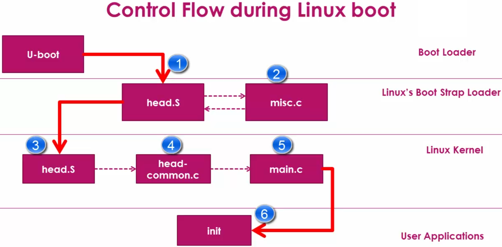
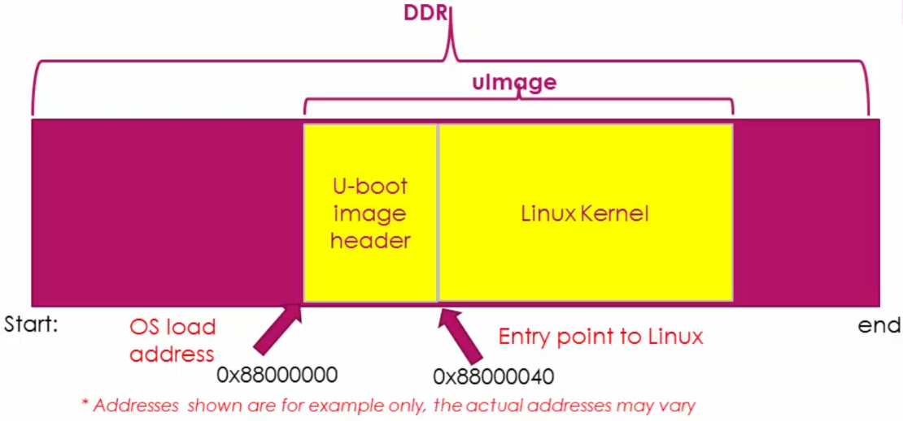
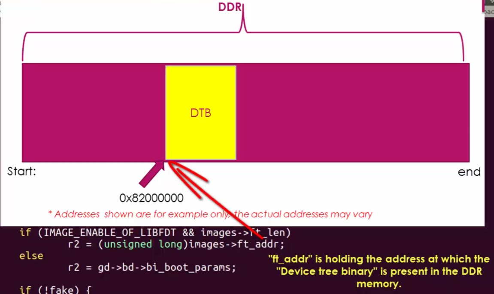
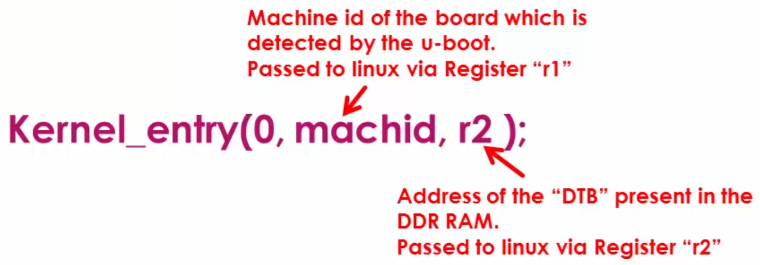
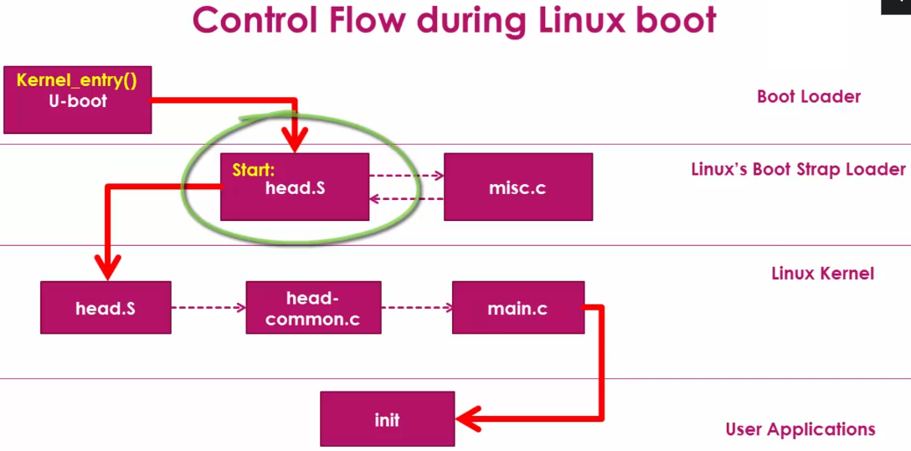

[Home](../../) | [Projects](../../projects) | [Notes](../) > <a href="./">Embedded Linux</a> > BBB Linux Boot Sequence - Step 4: Bootstrap Loader

# BBB Linux Boot Sequence - Step 4: Bootstrap Loader


## BBB Linux Boot Sequence





* `misc.c` uncompresses the compressed kernel image.
* `head.S` of the Bootstrap Loader is different from that of Linux kernel.


## How does U-boot Hand Over Control to the Bootstrap Loader of the Linux Kernel?

### Boot Loader Level

* Time to explore the source file `bootm.c` of the U-boot source code.

* Download U-boot srouce (`u-boot-2017.05-rc2.tar.bz2 `) from [https://ftp.denx.de/pub/u-boot/](https://ftp.denx.de/pub/u-boot/). 

  `u-boot-2017.05-r2/arch/arm/lib/bootm.c`

* `bootm.c` file is where code to read the Linux kernel from memory, verify the checksum, control hand-over is implemented.

  ```c
  /* bootm.c */
  
  /* Subcommand: GO */
  static void boot_jump_linux(bootm_headers_t *images, int flag)
  {
  	...
  #else
      unsigned long machid = gd->bd->bi_arch_number;
      char *s;
      void (*kernel_entry)(int zero, int arch, uint params);
      unsigned long r2;
      int fake = (flag & BOOTM_STATE_OS_FAKE_GO);
      
      kernel_entry = (void (*)(int, int, uint))images->ep;
      ...
      if (IMAGE_ENABLE_OF_LIBFDT && images->ft_len)
          r2 = (unsigned long)images->ft_addr;
      else
          r2 = gd->bd->bi_boot_params;
  
      if (!fake) {
  #ifdef CONFIG_ARMV7_NONSEC
          if (armv7_boot_nonsec()) {
              armv7_init_nonsec();
              secure_ram_addr(_do_nonsec_entry)(kernel_entry,
                                0, machid, r2);
          } else
  #endif
              kernel_entry(0, machid, r2);
      }
  #endif
  }
  ```

  > * L4: `bootm_headers_t` is defined in `include/image.h`.
  >
  > * L10: `kernel_entry` is a function pointer that is initialized in L14 to the entry point of the Linux kernel image. `ep` is found in the `bootm_headers_t` is defined in `include/image.h`.
  >
  >   
  >
  >   
  >
  >   
  >
  > * L17: r2
  >
  >   
  >
  > 
  >
  > 
  >
  > * Device Tree Binary (DTB) is actually Flattened Device Tree (FDT), which describes various peripherals present on the board. The Linux kernel needs this binary during the boot. Otherwise, Linux boot may not succeed.
  >
  > * L29: U-boot transfers the control to the Bootstrap Loader. The "entry point" (`images->ep`) address is dereferenced.
  >
  >     
  >
  >   First argument is ignored by the Linux, `machid` is U-boot saying "Hey, I've detected this machine!". `r2` stores the address of FDT.
  >

### Bootstrap Loader of Linux

* The Boot Loader transfers the control to `head.S` (routine `Start:`) of the Linux's Bootstrap Loader.





* Download Linux kernel source from [https://github.com/beagleboard/linux](https://github.com/beagleboard/linux).

  Linux Bootstrap Loader is located in `arch/arm/boot/compressed/`. All Bootstrap related files are located in this directory.

  ```c
  /* bootm.c */
  ...
  	kernel_entry(0, machid, 2);	/* U-boot transfers control to the Bootstrap Loader of Linux */
  ...
  ```

  ```assembly
  /* head.S */
  ...
  start: @ control handed over from U-boot starts here! 
          .type   start,#function
  ...
  ```

  > `start` routine does some initial tedious setup which you do not necessarily need to dive deeper at this moment.

* Decompression of the compressed kernel is taken care of by `misc.c`.

  ```assembly
  /* head.S */
  ...
          bl  decompress_kernel @ branch to decompress_kernel defined in 'misc.c'
  ...
  ```

  ```c
  /* misc.c */
  ...
  void
  decompress_kernel(unsigned long output_start, unsigned long free_mem_ptr_p,
          unsigned long free_mem_ptr_end_p,
          int arch_id)
  {
      int ret;
  
      output_data     = (unsigned char *)output_start;
      free_mem_ptr        = free_mem_ptr_p;
      free_mem_end_ptr    = free_mem_ptr_end_p;
      __machine_arch_type = arch_id;
  
      arch_decomp_setup();
  
      putstr("Uncompressing Linux...");
      ret = do_decompress(input_data, input_data_end - input_data,
                  output_data, error);
      if (ret)
          error("decompressor returned an error");
      else
          putstr(" done, booting the kernel.\n");
  }
  ...
  ```

  > L17: This message is what you saw on the screen during the booting process.

### Linux Kernel

* After kernel decompression is done, the control is transferred to another `head.S` file that is a part of the Linux kernel.


* Go to `arch/arm/kernel/` where Linux kernel's architecture dependent files are located. This `head.S` is the generic startup code for ARM processor (not SoC vedor specific) that does the ARM specific initializations:

  1. CPU specific initialization
  2. Checks for valid processor architecture
  3. Page table inits
  4. Initialize and prepare MMU for the identified processor architecture
  5. Enable MMU to support virtual memory
  6. Calls `start_kernel` function of the `main.c` (Architecture dependent code)

  This `head.S` executes lots of architecture specific initialization code implemented in different intermediate files.

* It is the responsibility of the Bootstrap Loader (i.e., glued to the Linux kernel image) to decompress and relocate the Linux kernel image. (These are NOT the responsibilities of U-boot)

* Again, don't be confused about those two `head.S` files. One belongs to the Bootstrap Loader, and the other belongs to the Linux kernel. And both are **architecture dependent**; in this case, ARM.


## References

Nayak, K. (2022). *Embedded Linux Step by Step Using Beaglebone Black* [Video file]. Retrieved from https://www.udemy.com/course/embedded-linux-step-by-step-using-beaglebone/