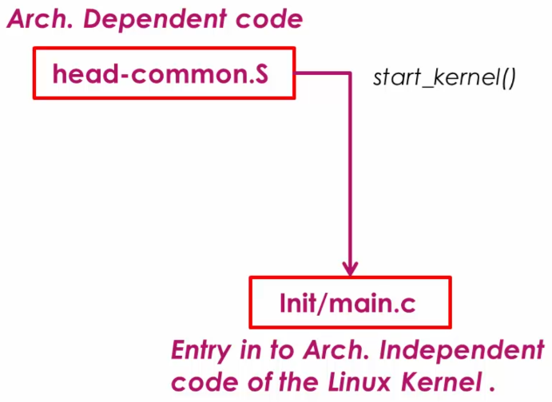

[Home](../../) | [Projects](../../projects) | [Notes](../) > <a href="./">Embedded Linux</a> > BBB Linux Boot Sequence - Step 4: Linux Kernel

# BBB Linux Boot Sequence - Step 4: Linux Kernel


## BBB Linux Boot Sequence


## Linux Kernel

* After kernel decompression is done, the control is transferred to another `head.S` file that is a part of the Linux kernel.


* Go to `linux/arch/arm/kernel/` where Linux kernel's architecture dependent files are located. This `head.S` is the generic startup code for ARM processor (not SoC vedor specific) that does the ARM specific initializations:

  1. CPU specific initialization
  2. Checks for valid processor architecture
  3. Page table inits
  4. Initialize and prepare MMU for the identified processor architecture
  5. Enable MMU to support virtual memory
  6. Calls `start_kernel` function of the `main.c` (Architecture dependent code)

  This `head.S` executes lots of architecture specific initialization code implemented in different intermediate files.

* It is the responsibility of the Bootstrap Loader (i.e., glued to the Linux kernel image) to decompress and relocate the Linux kernel image. (These are NOT the responsibilities of U-boot)

* Again, don't be confused about those two `head.S` files. One belongs to the Bootstrap Loader, and the other belongs to the Linux kernel. And both are **architecture dependent**; in this case, ARM.

### `head.S`

* Belongs to the Linux kernel architecture specific code.

* It does CPU (e.g., ARM Cortex-A8) specific initialization of the SoC.

  1. It first tries to identify CPU architecture information (e.g., ARM Cortex-A8)

  2. When the architecture type is identified, it creates initial page table entries and enables the MMU for the processor's virtual memory support.
  3. Then, transfers the control to the generic `main.c` of the Linux kernel.

* Kernel startup entry point:

  ```assembly
  /* linux/arch/arm/kernel/head.S */
  
  /*
   * Kernel startup entry point.
   * ---------------------------
   *
   * This is normally called from the decompressor code.  The requirements
   * are: MMU = off, D-cache = off, I-cache = dont care, r0 = 0,
   * r1 = machine nr, r2 = atags or dtb pointer.
   *
   * This code is mostly position independent, so if you link the kernel at
   * 0xc0008000, you call this at __pa(0xc0008000).
   *
   * See linux/arch/arm/tools/mach-types for the complete list of machine
   * numbers for r1.
   *
   * We're trying to keep crap to a minimum; DO NOT add any machine specific
   * crap here - that's what the boot loader (or in extreme, well justified
   * circumstances, zImage) is for.
   */
   
   ...
   
       /*  
       * The following calls CPU specific code in a position independent
       * manner.  See arch/arm/mm/proc-*.S for details.  r10 = base of
       * xxx_proc_info structure selected by __lookup_processor_type
       * above.
       *
       * The processor init function will be called with:
       *  r1 - machine type
       *  r2 - boot data (atags/dt) pointer
       *  r4 - translation table base (low word)
       *  r5 - translation table base (high word, if LPAE)
       *  r8 - translation table base 1 (pfn if LPAE)
       *  r9 - cpuid
       *  r13 - virtual address for __enable_mmu -> __turn_mmu_on
       *
       * On return, the CPU will be ready for the MMU to be turned on,
       * r0 will hold the CPU control register value, r1, r2, r4, and
       * r9 will be preserved.  r5 will also be preserved if LPAE.
       */
  ...
  ```

  > * L7: Here the decompressor code means the code of the Bootstrap Loader.
  >
  > * L8-L9: MMU and cache off since we are still in the initialization phase of hardware. This code uses machine id (r1) to carry out the machine specific initializations. r2 holds the address of Device Tree Binary which is located in RAM.
  > * L25: Processor architecture specific initialization code this comment is referring to is found in `arch/arm/mm/`.
  > * L26: r10 holds the based address of `xxx_proc_info` structure that is specific to the processor detected by the `__lookup_processor_type` call.
  > * L39: Tells that all the processor architecture specific initializations have to be completed before MMU can be turned on! Before transferring control to the Linux generic code, MMU must be turned on. This is one of the important duties of hardware architecture specific code.

* One important assembly subroutine is `__enable mmu:`

  It initializes page table pointers and turn on MMU so that kernel can start running with the virtual address support.

  ```assembly
  /* linux/arch/arm/kernel/head.S */
  
  ...
  
  /*
   * Setup common bits before finally enabling the MMU.  Essentially
   * this is just loading the page table pointer and domain access
   * registers.  All these registers need to be preserved by the
   * processor setup function (or set in the case of r0)
   *
   *  r0  = cp#15 control register
   *  r1  = machine ID
   *  r2  = atags or dtb pointer
   *  r4  = TTBR pointer (low word)
   *  r5  = TTBR pointer (high word if LPAE)
   *  r9  = processor ID
   *  r13 = *virtual* address to jump to upon completion
   */
  __enable_mmu:
  #if defined(CONFIG_ALIGNMENT_TRAP) && __LINUX_ARM_ARCH__ < 6
      orr r0, r0, #CR_A
  #else
      bic r0, r0, #CR_A
  #endif
  #ifdef CONFIG_CPU_DCACHE_DISABLE
      bic r0, r0, #CR_C
  #endif
  #ifdef CONFIG_CPU_BPREDICT_DISABLE
      bic r0, r0, #CR_Z
  #endif
  #ifdef CONFIG_CPU_ICACHE_DISABLE
      bic r0, r0, #CR_I
  #endif
  #ifdef CONFIG_ARM_LPAE
      mcrr    p15, 0, r4, r5, c2      @ load TTBR0
  #else
      mov r5, #DACR_INIT
      mcr p15, 0, r5, c3, c0, 0       @ load domain access register
      mcr p15, 0, r4, c2, c0, 0       @ load page table pointer
  #endif
      b   __turn_mmu_on
  ENDPROC(__enable_mmu)
  
  /*
   * Enable the MMU.  This completely changes the structure of the visible
   * memory space.  You will not be able to trace execution through this.
   * If you have an enquiry about this, *please* check the linux-arm-kernel
   * mailing list archives BEFORE sending another post to the list.
   *
   *  r0  = cp#15 control register
   *  r1  = machine ID
   *  r2  = atags or dtb pointer
   *  r9  = processor ID
   *  r13 = *virtual* address to jump to upon completion
   *
   * other registers depend on the function called upon completion
   */
      .align  5
      .pushsection    .idmap.text, "ax"
  ENTRY(__turn_mmu_on)
      mov r0, r0
      instr_sync
      mcr p15, 0, r0, c1, c0, 0       @ write control reg
      mrc p15, 0, r3, c0, c0, 0       @ read id reg
      instr_sync
      mov r3, r3
      mov r3, r13
      ret r3
  __turn_mmu_on_end:
  ENDPROC(__turn_mmu_on)
      .popsection
  
  ...
  ```

* From architecture dependent code to architecture independent code:

  `linux/arch/arm/kernel/head-common.S` $\to$ `linux/init/main.c`

  At this point, all the processor architecture dependent initializations are over, CPU is ready with MMU support and kernel is ready to perform **architecture independent** initializations.





### `main.c`

* Does all the startup work for the Linux kernel from initializing very first kernel thread all the way to mounting the Root File System (RFS) and executing the very first user-space Linux application program.

* `start_kernel()` function is a huge function which calls other various initialization functions to initialize subsystems before mounting the RFS. For example, `mm_init()` (memory management init), `sched_init()` (scheduler init), etc.

* `rest_init()` function creates two kernel threads; `kernel_init` (pid = 1), `kthreadd` (pid = 2). 

  * `kernel_init` spawns the very first user application called `init`. This `init` application is inheriting the pid of its kernel thread.
  * `kthreadd` spawns other kernel threads.

  ```c
  /* linux/init/main.c */
  
  noinline void __ref rest_init(void)
  {
      struct task_struct *tsk;
      int pid; 
  
      rcu_scheduler_starting();
      /*   
       * We need to spawn init first so that it obtains pid 1, however
       * the init task will end up wanting to create kthreads, which, if
       * we schedule it before we create kthreadd, will OOPS.
       */
      pid = kernel_thread(kernel_init, NULL, CLONE_FS);
      /*   
       * Pin init on the boot CPU. Task migration is not properly working
       * until sched_init_smp() has been run. It will set the allowed
       * CPUs for init to the non isolated CPUs.
       */
      rcu_read_lock();
      tsk = find_task_by_pid_ns(pid, &init_pid_ns);
      tsk->flags |= PF_NO_SETAFFINITY;
      set_cpus_allowed_ptr(tsk, cpumask_of(smp_processor_id()));
      rcu_read_unlock();
  
      numa_default_policy();
      pid = kernel_thread(kthreadd, NULL, CLONE_FS | CLONE_FILES);
      rcu_read_lock();
      kthreadd_task = find_task_by_pid_ns(pid, &init_pid_ns);
   
      rcu_read_unlock();
      ...
  }
  ```

* `kernel_init()`

  ```c
  static int __ref kernel_init(void *unused)
  {
      int ret; 
  
      /*   
       * Wait until kthreadd is all set-up.
       */
      wait_for_completion(&kthreadd_done);
  
      kernel_init_freeable();
      /* need to finish all async __init code before freeing the memory */
      async_synchronize_full();
  
      system_state = SYSTEM_FREEING_INITMEM;
      kprobe_free_init_mem();
      ftrace_free_init_mem();
      kgdb_free_init_mem();
      exit_boot_config();
      free_initmem();
      mark_readonly();
      
      ...
          
      /*
       * We try each of these until one succeeds.
       *
       * The Bourne shell can be used instead of init if we are
       * trying to recover a really broken machine.
       */
      if (execute_command) {
          ret = run_init_process(execute_command);
          if (!ret)
              return 0;
          panic("Requested init %s failed (error %d).",
                execute_command, ret);
      }
  
      if (CONFIG_DEFAULT_INIT[0] != '\0') {
          ret = run_init_process(CONFIG_DEFAULT_INIT);
          if (ret)
              pr_err("Default init %s failed (error %d)\n",
                     CONFIG_DEFAULT_INIT, ret);
          else
              return 0;
      }
  
      if (!try_to_run_init_process("/sbin/init") ||
          !try_to_run_init_process("/etc/init") ||
          !try_to_run_init_process("/bin/init") ||
          !try_to_run_init_process("/bin/sh"))
          return 0;
      
      panic("No working init found.  Try passing init= option to kernel. "
            "See Linux Documentation/admin-guide/init.rst for guidance.");
  }
  ```

  > * L19: `free_initmem();` The memory consumed by initialization functions so far are reclaimed here, because those functions were just for initialization and nobody will call them afterwards. Find the message (e.g., "Freeing init memory: xxxK") printed out to the screen during botting.
  >
  > * L47: Try to run the `init` program one by one from the different location until one succeeds. If no `init` application succeeds, it executes the shell application which is located in the RFS and just returns.
  >
  >   Note that you can also pass the path of the customized init program as a kernel commandline argument which will be stored in `execute_command`.
  >
  > * L53: If none of these program works, throws the message "No working init found..."

  This is finally how the Linux kernel first launches the first user program. This `init` program is responsible for launching other user programs or kernel services.


## References

Nayak, K. (2022). *Embedded Linux Step by Step Using Beaglebone Black* [Video file]. Retrieved from https://www.udemy.com/course/embedded-linux-step-by-step-using-beaglebone/