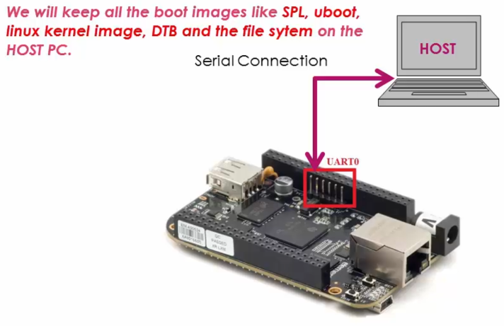
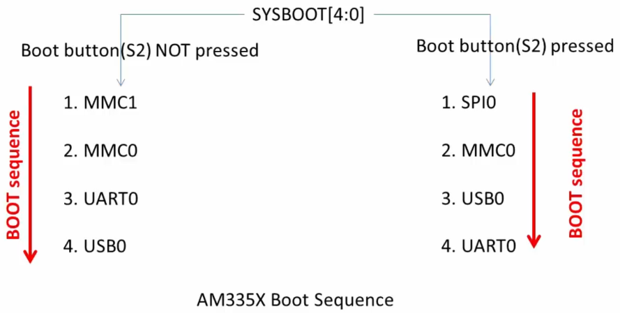

[Home](../../) | [Projects](../../projects) | [Notes](../) > <a href="./">Embedded Linux</a> > Booting BBB over Serial Port

# Booting BBB over Serial Port

[!] Note: The "Exercise" section leads to some errors. e.g., After loading U-boot image, cannot get into U-boot prompt.


## Serial Booting

* **Serial booting** means transferring the boot images from **host** to the **target** via the serial port (UART) in order to boot the target board.

  

  

  

  [!] Note: Host may be running on Windows, Linux or Mac because most of the serial monitoring programs support Xmodem, Ymodem, and Zmodem protocols.

* The **protocol** used to transfer a file/information over UART:

  * Xmodem, Ymodem, Zmodem, Kermit, etc.

  [!] Note: The protocol used to transfer a file/information over IP network:

  * TFTP, HTTP, FTP, SMTP, etc.


## Mechanism of Serial Booting

* First of all, make the BBB board to boot via UART peripheral.

  Boot the board exactly the same way you've booted using the micro SD card except that this time the micro SD card is NOT inserted to the board. (Press and hold S2 button $\to$ Press and release S3 button)

  1. Make sure the SD card slot is empty.

  2. Make sure the mini USB cable is NOT connected to the board. 

     This is so the board does not boot from the port P4; USB0. Even if the board cannot detect the boot source over the connected USB, it will wait about 4.5 mins to move on to the next boot source. So, try to power the board using power adapter not the mini USB cable. (Consult the figure "USB Initialization Procedure" of the *Technical Reference Manuel*.)

  3. Power up the board using the power adapter.

  Then, the board will boot over UART0.





* When you keep the board in the **UART boot mode**, the ROM Boot Loader (RBL) is waiting for the second stage boot loader that is SPL image over **Xmodem protocol only**!

  The ROM code will ping the host 10 times in 3s to start Xmodem transfer. If host does not respond, UART boot will timeout.

* Once the SPL executes it also tries to get the third stage boot loader that is U-boot image over Xmodem protocol, and you should send the U-boot image over Xmodem protocol from the host.

* When the U-boot executes, you can use U-boot commands such as `xmodem` or `ymodem` to load the rest of the images like the Linux kernel image, DTB, initramfs into the DDR memory of the board at the recommended addresses.

  Recommended addresses:

  | Binary                      | DDR RAM Load Address |
  | --------------------------- | -------------------- |
  | Linux kernel image (uImage) | 0x82000000           |
  | FDT or DTB                  | 0x88000000           |
  | RAMDISK or INITRAMFS        | 0x88080000           |

  https://stackoverflow.com/questions/45475611/zimage-loadaddr-in-uboot

### Summary

1. Make the board slip into the UART boot mode.
2. Once in the UART boot mode, the ROM Boot Loader will be waiting to receive the SPL over UART via Xmodem protocol, so send SPL form the host PC first.
3. Then, SPL executes on the board and it will be waiting to receive the U-boot image. Send the U-boot image.
4. When getting the control of U-boot on the board, use U-boot commands `xmodem` and `ymodem` protocol to download all the other boot images onto the DDR memory of the board, and then the booting will further proceed from there.

[!] Note: If you are facing issues with U-boot boot after downloading it through Xmodem, then refer to the following threads where TI Software team suggests to use Ymodem protocol to download the uboot image instead of Xmodem. 

https://e2e.ti.com/support/arm/sitara_arm/f/791/t/646278?AM3358-UART-boot-mode

https://e2e.ti.com/support/arm/sitara_arm/f/791/t/646278?AM3358-UART-boot-mode


## Exercise

1. Open minicom.

2. Put the board into UART boot mode - Press and hold the boot button (S2) and then press and release the power button (S3).

   $\to$ The characters "CCCC..." is emitted by ROM code of the SoC, indicating it's waiting to grab the SPL via the UART. If you don't see characters "CCCC...", then the board is not in the UART boot mode.

3. Transfer the first boot image; **SPL** using ==xmodem==.

   Transfer protocol options: xmodem, ymodem, zmodem, kermit

   $\to$ Ctrl + A, S to select the transfer protocol

   $\to$ Select xmodem

   $\to$ Locate the SPL image stored in the host PC (`u-boot-spl.bin`)

   $\to$ Space bar, Enter, then the file transfer will begin.

   You've just finished sending SPL to the internal RAM of the SoC.

   Now, UART is looking for the U-boot image.

4. Before the board times out, transfer **U-boot image** (`u-boot-img`) using ==ymodem==.

   You've just finished downloading the U-boot image to the DDR memory of the BBB board.

   [!] Note: Mine worked after ignoring a number of timeout messages. I don't know what happened during the process. But, if you end up not entering the U-boot prompt properly, redo from Step 3, using `MLO`, and `u-boot-img` in the following link: [https://github.com/emagii/training-materials/tree/master/lab-data/linux/bootloader/beaglebone-black](https://github.com/emagii/training-materials/tree/master/lab-data/linux/bootloader/beaglebone-black)

5. Load the Linux kernel image using U-boot command.

   ```plain
   => loadx 0x82000000
   ## Ready for binary (xmodem) download to 0x82000000 at 115200 bps...   
   ```

   > 0x82000000 comes from the "recommended address" table above in the notes.

   U-boot will now download the binary image or any file using x-modem protocol at this location in the DDR RAM of the board.

   $\to$ Ctrl + A, S $\to$ select xmodem protocol $\to$ transfer `uImag`.

   Transfer takes about 5-10 mins (4 MB). When finished, you'll see the following additional info printed.

   ```plain
   CCACHE: Misaligned operation at range [82000000, 8241c660]                      
   ## Total Size      = 0x0041c660 = 4310624 Bytes                                 
   => 
   ```

6. Load Device Tree Binary (DTB)

   ```plain
   => loadx 0x82000000                                                             
   ## Ready for binary (xmodem) download to 0x82000000 at 115200 bps...     
   ```

   Select the DTB file...

   ```plain
   CCACHE: Misaligned operation at range [82000000, 82005f6c]                      
   ## Total Size      = 0x00005f6c = 24428 Bytes                                   
   => 
   ```

7. Load initramfs

   ```plain
   => loadx 0x88080000                                                             
   ## Ready for binary (xmodem) download to 0x88080000 at 115200 bps...     
   ```

   Select the initramfs file... (It will take around 5 - 10 mins)

   ```plain
   CCCACHE: Misaligned operation at range [88080000, 88374b36]                     
   ## Total Size      = 0x002f4b36 = 3099446 Bytes   
   ```

8. Now, we are almost ready to boot the Linux kernel from memory.

   Since we are using RAM based file system, we have to tell this info to the Linux kernel using the **boot arguments**. Otherwise, Linux kernel will not know where to find the file system to mount during its booting process and the boot may fail.

   ```plain
   => setenv bootargs console=ttyO0,115200 root=/dev/ram0 rw initrd=0x88080000
   ```

   >`console=ttyO0,115200` - Console and baudrate info
   >
   >`root=/dev/ram0 rw` - RAMFS device file
   >
   >`initrd=0x88080000` - initramfs address in memory

9. Boot the Linux kernel from memory

   ```plain
   bootm ${kernel_load_address} ${initramfs_load_address} ${dtb_load_address}
   => bootm 0x82000000 0x88080000 0x88000000
   ```

   This should boot the Linux kernel successfully. Mine showed some errors!


## References

Nayak, K. (2022). *Embedded Linux Step by Step Using Beaglebone Black* [Video file]. Retrieved from https://www.udemy.com/course/embedded-linux-step-by-step-using-beaglebone/