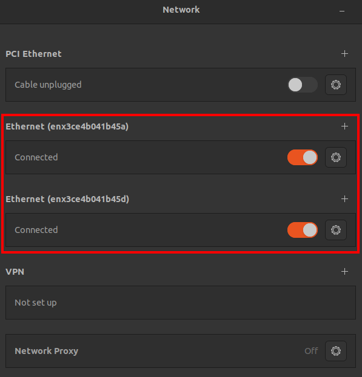

[Home](../../) | [Projects](../../projects) | [Notes](../) > <a href="./">Embedded Linux</a> > Enabling Internet on BBB - Ubuntu Host

# Enabling Internet on BBB - Ubuntu Host


## Enabling Internet on BBB when Host is Ubuntu

* Boot your BBB and login.

* `ifconfig` to check network interface configuration.

  * eth0 - Physical Ethernet port

  * usb0, usb1 - Ethernet over USB, come with static IP addresses

    * To see where these are configured, go to `/opt/scripts/boot/` and there you will find two shell scripts:

      * `autoconfigure_usb0.sh`
      * `autoconfigure_usb1.sh`

      These will run during the booting process of the board and configure static IP addresses for usb0, usb1 interfaces.

* Check the Network and see if you have the following Ethernet connection(s). The following should be detected automatically when you connect BBB to your Ubuntu host PC.





* Now, try to `ping` between the two and see if there's any problem. (Should be no problem!)

### BBB Settings

* From BBB, run `ping www.google.com`, and it will tell **Network is unreachable**. We need to do some setting so that BBB can share Internet connection with the Ubuntu host.

* From BBB, add following two lines (DNS servers) to `/etc/resolv.conf`. You may need `sudo` privilege to do this.

  ```plain
  /* /etc/resolv.conf */
  
  nameserver 8.8.8.8
  nameserver 8.8.4.4
  ```

* From BBB, run `sudo route add default gw 192.168.7.1 usb0` and `sudo route add default gw 192.168.7.1 usb1` to add the IP's of the default gateways (which are essentially the IP addresses of Ubuntu host interfaces) to the routing table.

### Ubuntu Host Settings

* From Ubuntu host, do the following settings to share the Internet between Wifi and Ethernet.

  1. Enabling IP forwarding

     ```plain
     echo 1 | sudo tee /proc/sys/net/ipv4/ip_forward
     ```

     > For anyone not completely familiar with Linux, please note that Kiran is a  root user in this video (Daniel has explained how to gain root access  using sudo su above, note the command prompt now ends in #). If you do  not have root privileges (your command prompt ends with a $ sign) you'll need to come at things a bit differently.
     >
     > ```plain
     > echo 1 | sudo tee /proc/sys/net/ipv4/ip_forward
     > ```
     >
     > Will set your IP forwarding flag. This command takes the output of echo and  pipes it ( | is the pipe symbol) to the tee command, which can be run  with elevated privileges and will therefore write to ip_forward. (The  tee command simply writes to stdout and one or more files.)
     >
     > sudo  can't be used directly with echo (i.e. `sudo echo 1 >  /proc/sys/net/ipv4/ip_forward` will not work), as elevated privileges are not applied to the indirect ( > is the indirect symbol).
     >
     > You'll also need to run 'sudo /sbin/iptables' to get the IP forwarding  commands to work. The iptables binary lives in the sbin folder, which  contains system/admin binaries which are not available to ordinary  users.

  2. IP table setting

     This is basically the process to share Wifi (Ubuntu host is connected to) with Ethernet (interface the target will be communicating with Ubuntu host over USB).

     ```plain
     sudo iptables --table nat --append POSTROUTING --out-interface <wifi_interface> -j MASQUERADE
     sudo iptables --append FORWARD --in-interface <ethernet_interface_to_share_with> -j ACCEPT
     ```

     > Run `ifconfig` to find interface names. In my case:
     >
     > * `<wifi_interface>` - wlp61s0
     > * `<ethernet_interface_to_share_with>` - enx3ce4b041b45a or enx3ce4b041b45d

* Now, BBB should be able to `ping www.google.com`.

  Also, try `sudo apt update` and see if get requests are successful!

  If all successful, congratulations! Your BBB is now connected to Internet!


## References

Nayak, K. (2022). *Embedded Linux Step by Step Using Beaglebone Black* [Video file]. Retrieved from https://www.udemy.com/course/embedded-linux-step-by-step-using-beaglebone/