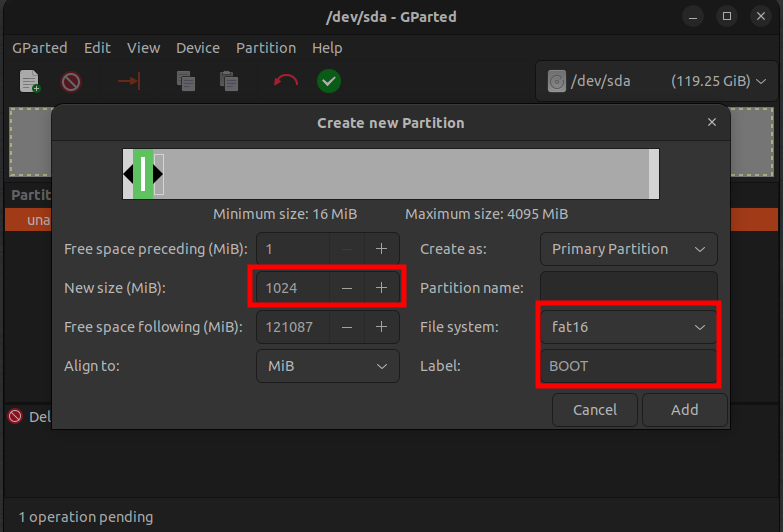

[Home](../../) | [Projects](../../projects) | [Notes](../) > <a href="./">Embedded Linux</a> > Exercise - Booting RBL & MLO on BBB

# Exercise - Booting RBL & MLO on BBB


## Micro-SD Card Setup

* Set up your micro-SD card's partitions as follows:


* I've used the partitioning application called "GParted".

  [!] Note: Select the correct device name that corresponds to your SD card. Selecting a wrong device may destroy your system.


* Delete the previously allocated file system and create two partitions as follows.





* Set the boot flag


* Copy MLO (`MLO-beablebone-2013.04`) into the boot partition just created. Change its name to `MLO`.

  If drag-and-drop does not work for permission reason, run the following commands:
  
  ```plain
  cp MLO-beablebone-2013.04 /media/klee/BOOT/MLO
  ```
  
  > For the RBL to detect the file, name must be `MLO`.


## Boot from SD Card

* Insert the micro-SD card to the BBB.

* Connect the BBB to PC using both the USB-UART cable, and the mini-USB cable.

* `sudo minicom`

  * To exit from minicom : `Ctrl + A` $\to$ `x` $\to$ `Enter`

* Boot from SD

  1. Put the board into power down mode by doing a long press on "Power button (S3)" (Press and hold until all LEDs turn off)
  2. Press and hold the "Boot button (S2)"
  3. Gently press and release the "Power button"
  4. Release the "Boot button"

  Then, you'll see the following message from the second stage boot loader.

  


* MLO/SPL is actually  a part of U-boot, but we've separated it because the whole U-boot image cannot be loaded into the internal SRAM. This is the reason why there is an error message "error reading image u-boot.img" at the end. (i.e., SPL couldn't find U-boot image.)
* If you've reached this point, you've just confirmed that the second stage boot loader successfully booted MLO.


## References

Nayak, K. (2022). *Embedded Linux Step by Step Using Beaglebone Black* [Video file]. Retrieved from https://www.udemy.com/course/embedded-linux-step-by-step-using-beaglebone/