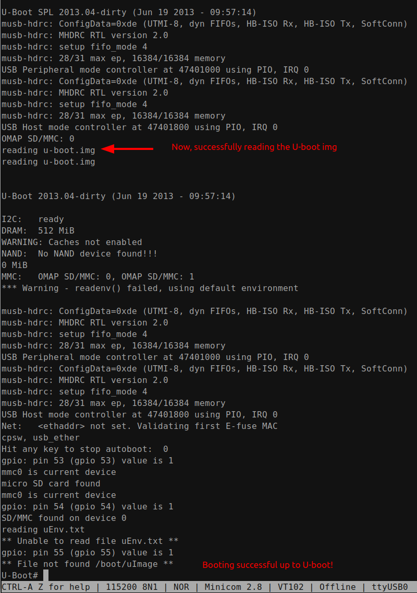

[Home](../../) | [Projects](../../projects) | [Notes](../) > <a href="./">Embedded Linux</a> > Exercise - Booting U-boot Image on BBB

# Exercise - Booting U-boot Image on BBB

## Booting U-boot Image on BBB

* Copy `u-boot-beaglebone-2013.04-r0.img` into the SD card. Rename the file to `u-boot.img`.

* Ends with the error message "File not found /boot/uImage" because the kernel image is not found.
* If you've reached this point, you've successfully booted up to U-boot.

## References

Nayak, K. (2022). *Embedded Linux Step by Step Using Beaglebone Black* [Video file]. Retrieved from https://www.udemy.com/course/embedded-linux-step-by-step-using-beaglebone/