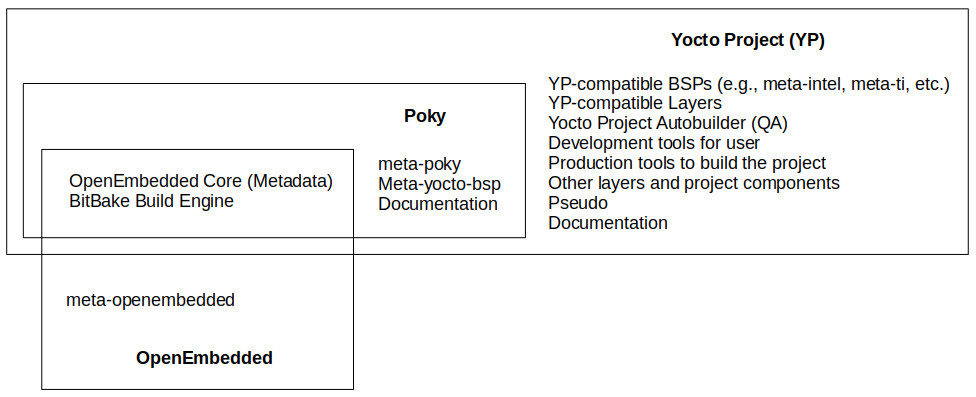

[Home](../../) | [Projects](../../projects) | [Notes](../) > <a href="./">Embedded Linux</a> > Introduction to Embedded Linux & Yocto Project

# Introduction to Embedded Linux & Yocto Project

## 4 Elements of Embedded Linux

* **Toolchain**
  * The compiler and other tools needed to create code for your target device.
  * Everything else depends on the toolchain.
* **Bootloader**
  * The program that initializes the board and loads the Linux kernel.
* **Kernel**
  * The heart of the system which manages system resources and interfaces with the underlying hardware.
* **Root** filesystem
  * Contains the libraries and programs that are run once the kernel has completed its initialization.
* Another element can be a collection of programs specific to your embedded application which makes the device do its job (e.g., weighing groceries, displaying movies, controlling a robot, etc.).

## Yocto Project

* The term "yocto" means the smallest SI metric system prefix. (y = 10^-24^)

* The Yocto Project is an open-source collaboration project that provides tools and templates for creating custom Linux-based operating systems for embedded devices, such as IoT devices and embedded systems.
* It allows developers to build, customize, and maintain their own Linux distributions tailored to the specific requirements of their hardware and software.
* Yocto Project streamlines the process of building and configuring a Linux distribution from source code, enabling developers to create efficient and optimized systems for embedded applications. It is widely used in the embedded industry due to its flexibility, reusability, and extensive community support.
* Yocto is also a project working group of the Linux Foundation.
* Collaborators:
  * Many hardware manufacturers
  * Open source operating systems vendors
  * Electronics companies, etc.

### Input & Output of Yocto Project

* Input
  * A set of data that describes what we want, i.e., our specification.
  * e.g., Kernel configuration, hardware names, packages/binaries to be installed, etc.
* Output
  * A Linux-based embedded product
  * e.g., Linux kernel image, root file system (RFS), bootloader, device tree, toolchain, etc.

## Poky

* Poky is a reference (or example) distribution of Yocto Project. (When creating your own Linux-based project, having an example project will be very helpful!)

* Yocto Project uses Poky to build images (kernel, system, and application software) for the target hardware.

* At a technical level, it is a combined repository of the following components:

  * Bitbake
  * OpenEmbedded Core
  * meta-yocto-bsp
  * Documentation

  Poky does not contain binary files. It is a working example of how to build your own custom Linux distribution from source.

### Poky vs. Yocto

* "Yocto" refers to the organization (like one would refer to "canonical", the company behind Ubuntu).
* "Poky" refers to the actual bits downloaded (analogous to "Ubuntu")

### Other Poky Repositories

* meta-poky, which is Poky-specific metadata
* Documentation, which contains the Yocto Project source files used to make the set of user manuals.

### Conclusion

* Poky includes:
  * Some OpenEmbedded components (oe-core)
  * Bitbake
  * Demo BSPs
  * Helper scripts to setup environment
  * Emulator QEMU to test the image

## Metadata

* In non-Yocto world, "metadata" means a set of data that describes and gives information about other data. (i.e., Data for data)

* **In Yocto world**, "metadata" refers to

  * The build instructions
  * The commands and data used to indicate what versions of software are used, where they are obtained from
  * Changes or additions to the software itself (patches) which are used to fix bugs or customize the software for use in a particular situation.

  Metadata is collection of:

  * Configuration files (`.conf`)
  * Recipes (`.bb` and `.bbappend`)
  * Classes (`.bbclass`)
  * Includes (`.inc`)

## OpenEmbedded Project (oe-core)

* [http://www.openembedded.org/wiki/Main_Page](http://www.openembedded.org/wiki/Main_Page)
* OpenEmbedded offers a best-in-class cross-compile environment.
* It allows developers to create a complete Linux distribution for embedded systems.

### OpenEmbedded vs. Yocto Project

* The Yocto Project and the OpenEmbedded Project share a core collection of metadata called "**openembedded-core** (i.e., oe-core)". However, the two organizations remain separate, each with its own focus.
  * The **OpenEmbedded** provides a comprehensive set of metadata for a wide variety of architectures, features, and applications.
    * It is NOT a reference distribution.
    * It is designed to be the foundation for others.
  * The **Yocto Project** focuses on providing powerful, easy-to-use, inter-operable, well-tested tools, metadata, and board support packages (BSPs) for a core set of architectures and specific boards.
* The Yocto Project and the OpenEmbedded have agreed to work together and share a common core set of metadata (i.e., recipies, classes and associated files), the **oe-core**.

## Bitbake

* Bitbake is a build tool commonly used in the Yocto Project for building custom Linux distributions for embedded devices. (Similar to "Make")

  It's a task executor that parses mixed Python and Shell Script code.

* Features:

  * Uses recipes to define tasks and dependencies for fetching, compiling, and packaging software components.

  * Supports cross-compilation for different architectures and target devices.

  * Integrates with the Yocto Project's OpenEmbedded build system.

  * Works in conjunction with the Yocto Project's other components to create comprehensive Linux distributions for embedded devices.

  * Highly extensible and customizable through configuration files and layers.

## meta-yocto-bsp

* A Board Support Package (BSP) is a collection of information that defines how to support a particular hardware device, set of devices, or hardware platform.

* The BSP includes information about the hardware features present on the device and kernel configuration information along with any additional hardware drivers required.

* The BSP also lists any additional software components required in addition to a generic Linux software stack for both essential and optimal platform features.

* The "meta-yocto-bsp" layer in Poky maintains several BSPs for such devices as the BeagleBone, EdgeRouter, and generic versions of both 32-bit and 64-bit IA machines.

* Machines supported:

  * Texas Instruments BeagleBone (beaglebone)
  * Freescale MPC8315E-RDB (mpc8315e-rdb)
  * Intel x86-based PCs and devices (genericx86 and genericx86-64)
  * Ubiquiti Networks EdgeRouter Lite (edgerouter)

  To develop on other hardware such as Raspberry-Pi, you'll need to complement Poky with hardware-specific Yocto layers.

## Yocto Project, Poky and OpenEmbedded

## Reference

Linux Trainer. (2020). *Embedded Linux using Yocto* [Video file]. Retrieved from https://www.udemy.com/course/embedded-linux-using-yocto/