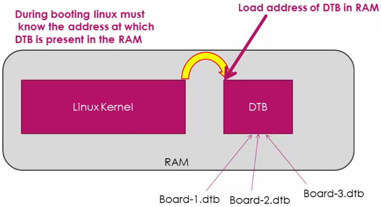

[Home](../../) | [Projects](../../projects) | [Notes](../) > <a href="./">Embedded Linux</a> > Linux Device Tree (Flattened Device Tree)

# Linux Device Tree (Flattened Device Tree)

## Why is Linux Device Tree Introduced?

* Let's say we have our own custom board. The on-board peripherals (a.k.a. **platform devices**) which connect to interfaces like SPI, I2C, SDIO, Ethernet, etc. have NO capability to announce their existence on the board by themselves to the OS like Linux. Because, these interfaces do not have that intelligence to support dynamic discoverability.

  

* However, USB device has the inbuilt intelligence to announce its presence to the OS using the USB interface. i.e., USB supports dynamic discoverability. Therefore USB is NOT a "platform device".
* Then, how can we make Linux kernel aware of these platform devices?

### Board File

* One possible solution is to write the information about the platform devices statically (i.e., hard coding) in the file called "**board file**".

  c.f., A "Platform data" is a data structure that describe a certain peripheral.

  The board file is part of the Linux kernel. So, you have to re-compile every time you modify it to add a new device entry.

  

  

  

  

  

  When a driver for a particular platform peripheral is loaded, the Linux calls the "probe" function of the driver if there is any match in its platform device database. In the "probe" function of the driver, you can do device initializations.

  

  

  

  Peripheral deriver name must match the platform device name. e.g., zigbee100.ko

  If the match found, the Linux kernel will call the corresponding probe function.

  Different boards will have different on-board peripherals, so each board should have its own board file. This means that each board must have a separate Linux kernel image. In this model, Linux kernel becomes board-dependent.

### Device Tree

* The Linux community wanted to cut off the dependencies of platform device enumeration from the Linux kernel, that is, hard coding of platform device specific details into the Linux kernel.
* A new model was introduced, which is called the **Flattened Device Tree**.

* **Device Tree Source File (DTS)**

  Instead of adding hard coded hardware details into the Linux kernel board file, every board vendors has to come up with a file called DTS (Device Tree Source File or Device Tree Structure).

  This file actually consists of all the details related to the board written using some predefined syntaxes. It consists data structures which describe all the required peripherals of the board.

  Every board has its own DTS file.

* DTS files are compiled using the Device Tree Compiler (DTC).

  DTS files $\to$ [DTC] $\to$ DTB (i.e., stream of bytes which encodes the details of the hardware)

* In this model, even if you edit the DTS file to add a new entry, you don't have to compile the kernel again. All you need to do is to compile the DTS to obtain the new DTB. (With the help of incremental build system, this is a much quicker process than compiling the whole Linux kernel.)
* When the Linux kernel boots, you need to tell the kernel where the DTB is located so that the kernel can load that DTB file and extract all the hardware details of the board.

## Location of DTS Files

* `linux/arch/arm/boot/dts/`

## References

Nayak, K. (2022). *Embedded Linux Step by Step Using Beaglebone Black* [Video file]. Retrieved from https://www.udemy.com/course/embedded-linux-step-by-step-using-beaglebone/