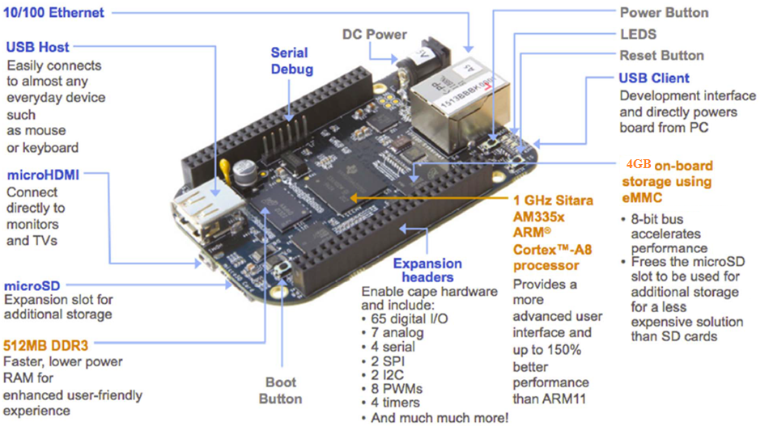

[Home](../../) | [Projects](../../projects) | [Notes](../) > <a href="./">Embedded Linux</a> > Prerequisites

# Prerequisites


## Board (BeagleBoneBlack - Rev C)

* BeagleBoneBlack Official Website - [https://beagleboard.org/black](https://beagleboard.org/black)

  Full source schematics, hardware layout files, a full Bill of Materials (BOM), and technical reference manuals are available here.

* BeagleBoneBlack Wiki - [https://elinux.org/Beagleboard:BeagleBoneBlack](https://elinux.org/Beagleboard:BeagleBoneBlack)

  11. Hardware Files $\to$ LATEST PRODUCTION FILES (C)

* System Reference Manual - [https://docs.beagleboard.org/latest/boards/beaglebone/black/](https://docs.beagleboard.org/latest/boards/beaglebone/black/)

* Notes

  * BBB Rev C has off-chip (off-SoC) on-board eMMC storage of 4GB. (No NAND Flash)

  * BBB Rev C is a Sinble-Board Computer (SBC)

  * To share host PC's internet on the board over USB (Internet over USB) the board must first support Ethernet MAC and PHY along with USB? 

    $\to$ False! Not required because, this functionality is implemented in software as a separate USB class.





## Necessary Parts

* **Serial Debug Cable**

  To access the serial(UART) pins of the board for debug purposes, a USB  to Serial TTL converter hardware is required because the Board doesn’t come with on-board serial converter chip. 

  Remember when you connect “USB to Serial Convertor” to any hardware  like BBB, the TX pin of this module should go to the RX pin of the  another board, in this case BBB. 


* **5VDC Power Supply**

  You can power the board by connecting BBB to your PC using mini USB  cable, but the current via the USB port is limited to 500mA by the power management device on the board. The board shuts off if USB current  exceeds this range. Also if you want to drive more peripherals, the  current will be in sufficient. A DC power supply solves this issue.    

  Recommended DC power adapter 5V @ 2A  (*DC Barrel Plug 5.5mm/2.1mm*)

  [!] Note: Remember that the operating current recommended to be 1A to 2A, exceeding this range may damage the board.

* **Micro SD Card**

  Micro SD card of 4GB or above is necessary to carry out the SD card related experiments like eMMC booting, SD booting, etc.


## What is SoC?

* **SoC** stands for System on Chip. As the name indicates, a single chip contains most of the essential computing /communication/storage engine of the computing world, like Flash memory, Graphics processing engine, the image processing engine, the USB communication engine, RS232, SPI, I2C engine and much more. The heart of the SOC is a processor.

  For example AM355x SOC is powered by **ARM cortex A8 processor.**    


## Serial Port Monitoring Software

Software used to monitor serial devices.

* Ubuntu - **Minicom** is very popular
* Windows - **Tera-Term**, **PuTTY**, **Hyper-Terminal**

### Using Minicom

* Connect USB to TTL serial converter cable to the host machine. To check connection,

  ```plain
  sudo dmesg
  ```

  ```plain
  ...
  [44893.552186] usb 1-1: New USB device strings: Mfr=1, Product=2, SerialNumber=3
  [44893.552193] usb 1-1: Product: FT232R USB UART
  [44893.552199] usb 1-1: Manufacturer: FTDI
  [44893.552203] usb 1-1: SerialNumber: A571VB0V
  [44893.556042] ftdi_sio 1-1:1.0: FTDI USB Serial Device converter detected
  [44893.556137] usb 1-1: Detected FT232RL
  [44893.557025] usb 1-1: FTDI USB Serial Device converter now attached to ttyUSB0
  ```

  > Connected cable's chipset - A571VB0V
  >
  > Connected to communication interface (port) - ttyUSB0

* To run minicom

  ```plain
  sudo minicom -s
  ```

* Go to `Serial port setup` to setup the configuration:

  1. Serial Device - `dev/ttyUSB0`

  2. Baudrate (Bps/Par/Bits) - `115200 8N1`

  3. Hardware Flow Control - `No` 

     BeagleBoneBlack does not use Hardware Flow Control such as CTS, RTS. As you can see in the schematics below, only `B_UART0_RX`, `B_UART0_TX` and `DGND` are used.

     

     

     

  4. Software Flow Control - `No`

  [!] Note: Press the corresponding character to go to an entry, use the same character to toggle the field value. Press `Enter` to save and exit.

* Hit `Save setup as dfl` so you set your current configuration default.

* Exit!

* Connect BBB to your PC via USB to TTL serial converter cable, and deliver power to the board.

* See if you are getting debug messages on the screen.


## References

Nayak, K. (2022). *Embedded Linux Step by Step Using Beaglebone Black* [Video file]. Retrieved from https://www.udemy.com/course/embedded-linux-step-by-step-using-beaglebone/