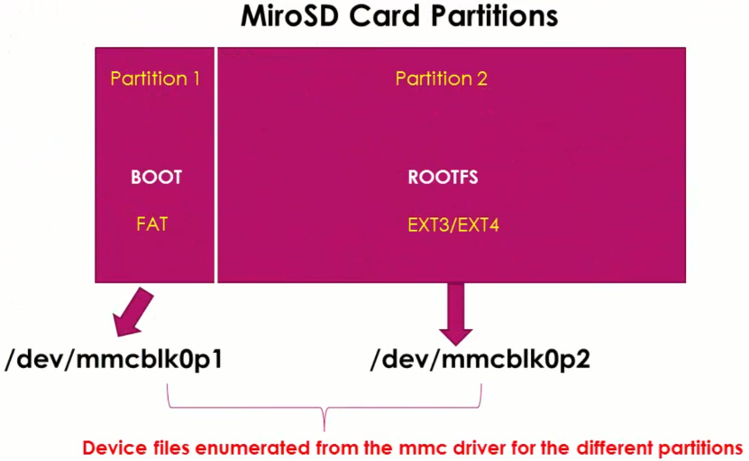

[Home](../../) | [Projects](../../projects) | [Notes](../) > <a href="./">Embedded Linux</a> > Writing uEnv.txt File from Scratch

# Writing uEnv.txt File from Scratch

[!] Note: Instead of booting from eMMC completed from the previous steps (Debian image; where there's only one partition, and `boot/` folder does not contain uImage), I've used microSD card (which contains Angstrom image) to boot and follow the lecture. 


## Introduction

* `boot` U-boot command will load the Linux kernel and execute it. `boot` simply runs the environment variable `bootcmd`. So, if you want to change the behavior of `boot`, you have to modify the commands stored in the environment variable `bootcmd`.

* U-boot always try to read the uEnv.txt from the boot source. If uEnv.txt is not found, it will use the default values of the enve variables.

  If you don't want U-boot to use default values, you need to enforce new values using uEnv.txt.

* U-boot's "load from memory device" commands:

  * `fatload` - Loads a binary file from FAT based file system into memory.
  * `load` - Loads a binary file from any file system.

  Examples:

  ```plain
  fatload usb 0:1 0x82000000 uImage
  fatload mmc 0:1 0x88000000 initramfs
  load mmc 0:1 0x88000000 uImage
  ```

  > * 1st arg - Interface (e.g., USB, MMC, etc.)
  >
  > * 2nd arg - Device#:Partition# (Device# can be checked by running something like `mmc list`.)
  >
  > * When the Linux image is properly flashed onto eMMC, eMMC partitions would look like:
  >
  >     
  >

* Our goal is to write our own uEnv.txt file from scratch and update the `bootcmd` so that when we run `boot` command from the U-boot prompt, it will refer to our custom uEnv.txt file while booting.

### Load uImage

* Let's load the Linux binary image "uImage" from the second partition of the SD card into the DDR memory.

  ```plain
  => load mmc 0:2 0x82000000 /boot/uImage
  4002080 bytes read in 300 ms (12.7 MiB/s)
  ```

  > `/boot/uImage` since uImage file is located inside the directory `boot/` in the 2nd partition of SD card.

* Now, let's boot the Linux kernel image using `bootm` command (boot application image from memory).

  This boot fails because the Linux Bootstrap Loader couldn't find the DTB. (This is why the Bootstrap Loader complains about the "Unrecognized machine ID ...". 

  ```plain
  => bootm 0x82000000
  ## Booting kernel from Legacy Image at 82000000 ...
     Image Name:   Angstrom/3.8.10/beaglebone
     Created:      2013-04-29  19:56:00 UTC
     Image Type:   ARM Linux Kernel Image (uncompressed)
     Data Size:    4002016 Bytes = 3.8 MiB
     Load Address: 80008000
     Entry Point:  80008000
     Verifying Checksum ... OK
     Loading Kernel Image ... OK
  
  Starting kernel ...
  
  Uncompressing Linux... done, booting the kernel.
  
  Error: unrecognized/unsupported machine ID (r1 = 0x00000e05).
  
  Available machine support:
  
  ID (hex)        NAME
  ffffffff        Generic OMAP4 (Flattened Device Tree)
  ffffffff        Generic AM33XX (Flattened Device Tree)
  ffffffff        Generic OMAP3-GP (Flattened Device Tree)
  ffffffff        Generic OMAP3 (Flattened Device Tree)
  0000060a        OMAP3 Beagle Board
  00000a9d        IGEP OMAP3 module
  00000928        IGEP v2 board
  00000ae7        OMAP4 Panda board
  
  Please check your kernel config and/or bootloader.
  ```

  > L13: The very last message from the U-boot. From this point on, the control is on the Linux Bootstrap Loader.

* To boot successfully, we need to first load DTB to somewhere in memory and let the Bootstrap Loader know where the correct DTB file is located.

### Load DTB

* Boot BBB to U-boot prompt and load uImage (kernel image) and DTB file into DDR memory by running the following commands:

  ```plain
  => load mmc 0:2 0x82000000 /boot/uImage
  4002080 bytes read in 296 ms (12.9 MiB/s)
  => load mmc 0:2 0x88000000 /boot/am335x-boneblack.dtb
  23334 bytes read in 18 ms (1.2 MiB/s)
  ```

* Now, run `bootm` by specifying both of those addresses:

  ```plain
  => bootm 0x82000000 - 0x88000000
  ## Booting kernel from Legacy Image at 82000000 ...
     Image Name:   Angstrom/3.8.10/beaglebone
     Created:      2013-04-29  19:56:00 UTC
     Image Type:   ARM Linux Kernel Image (uncompressed)
     Data Size:    4002016 Bytes = 3.8 MiB
     Load Address: 80008000
     Entry Point:  80008000
     Verifying Checksum ... OK
  ## Flattened Device Tree blob at 88000000
     Booting using the fdt blob at 0x88000000
     Loading Kernel Image ... OK
     Loading Device Tree to 8fff7000, end 8ffffb25 ... OK
  
  Starting kernel ...
  
  Uncompressing Linux... done, booting the kernel.
  ```

  Looks like there is no crash, but Linux is not sending any boot logs. So, we can't see the progress.

  This is because when the Linux kernel takes over the control, it has no idea which serial port of the board is used for sending the boot logs. The BBB uses UART0 as the serial debug terminal, which is enumerated as `/dev/ttyO0` by the serial driver. You need to tell the kernel **where to send this information to** by using the boot arguments.

  Along with this information, many other pieces of information need to be passed to the kernel using the boot arguments.

### Configure `bootargs`

* Next step is to send bootargs to the Linux kernel from U-boot.

  Use the U-boot standard environment variable `bootargs` to send the boot arguments to the Linux kernel. If not already defined, go ahead and define one.

  ```plain
  => printenv bootargs
  ## Error: "bootargs" not defined
  => setenv bootargs console=ttyO0,115200
  => printenv bootargs
  bootargs=console=ttyO0,115200
  ```

  > Tell the Linux kernel that our console is `ttyO0`.

* Run `bootm` by specifying both of those addresses:

  ```plain
  => bootm 0x82000000 - 0x88000000
  ```

  Now, the boot message will show up on our console. But, boot again will fail at some point because the Linux kernel has no idea where it should mount the file system.

  So, you have to send the **location and type of file system** using `bootargs`.

* Let's mount the file system which is present at the partition 2 of the microSD card.

  ```plain
  => setenv bootargs console=ttyO0,115200 root=/dev/mmcblk0p2 rw
  ```

  > `root=/dev/mmcblk0p2 rw` is added to the previously defined environmental variable `bootargs`.
  >
  > It is basically telling which root file system (RFS) to mount during the booting process and is giving read/write permission.
  >
  > 
  >
  > 

* Now, if you repeat the previous steps all over again, you will be able to boot the Linux kernel successfully.

  In summary:

  ```plain
  => setenv bootargs 
  => load mmc 0:2 0x82000000 /boot/uImage
  4002080 bytes read in 296 ms (12.9 MiB/s)
  => load mmc 0:2 0x88000000 /boot/am335x-boneblack.dtb
  23334 bytes read in 18 ms (1.2 MiB/s)
  => bootm 0x82000000 - 0x88000000
  ```

  ```plain
  ## Booting kernel from Legacy Image at 82000000 ...
     Image Name:   Angstrom/3.8.10/beaglebone
     Created:      2013-04-29  19:56:00 UTC
     Image Type:   ARM Linux Kernel Image (uncompressed)
     Data Size:    4002016 Bytes = 3.8 MiB
     Load Address: 80008000
     Entry Point:  80008000
     Verifying Checksum ... OK
  ## Flattened Device Tree blob at 88000000
     Booting using the fdt blob at 0x88000000
     Loading Kernel Image ... OK
     Loading Device Tree to 8fff7000, end 8ffffb25 ... OK
  
  Starting kernel ...
  
  Uncompressing Linux... done, booting the kernel.
  [    0.000000] Booting Linux on physical CPU 0x0
  
  ...
  ...
  ...
  
  .---O---.                                           
  |       |                  .-.           o o        
  |   |   |-----.-----.-----.| |   .----..-----.-----.
  |       |     | __  |  ---'| '--.|  .-'|     |     |
  |   |   |  |  |     |---  ||  --'|  |  |  '  | | | |
  '---'---'--'--'--.  |-----''----''--'  '-----'-'-'-'
                  -'  |
                  '---'
  
  The Angstrom Distribution beagleboard ttyO0
  
  Angstrom v2012.12 - Kernel 3.8.10
  
  beagleboard login: 
  ```

  > Booting the Linux kernel using the U-boot commands success!!!

### So, This is Why You Need uEnv.txt File!

* uEnv.txt file helps us to group all these step-by-step processes together in one file so that they can get carried out automatically during the boot process.


## Create a uEnv.txt File and Transfer it from Host to BBB

* Create a simple "uEnv.txt" file.

  ```plain
  mypcip=setenv serverip 193.168.1.2
  
  ```

  > * You first need to declare a custom environment variable and assign the command to it.
  > * "uEnv.txt" file must contain the very last EMPTY line.

* Transfer the "uEnv.txt" file from host to BBB borad using serial port transfer protocols like **xmodem** or **ymodem** which are supported by minicom.

  > U-boot also supports serial port transfer protocol commands:
  >
  > * `loadx` - Send/receive file using xmodem protocol
  > * `loady` - Send/receive file using ymodem protocol
  > * `loadz` - Send/receive file using zmodem protocol

  On minicom, 

  $\to$ Run `loady` command. 

  $\to$ `Ctrl+A` $\to$ `S` (this will show the serial port transfer protocols available) $\to$ Select `ymodem`.

  $\to$ Select the file to transfer (c.f., spacebar x 2 to enter folder)

* Transferring uEnv.txt file to the target does not mean that the environment variable is accessible from the target. You need to IMPORT the file!

  ```plain
  => env import -t 0x82000000 38
  => printenv mypcip 
  mypcip=setenv serverip 192.168.1.2
  => run mypcip 
  => printen serverip 
  serverip=192.168.1.2
  ```

  > L1: The address to pass must be taken from the result of the previous step.

  Now, the value `192.168.1.2` is successfully stored in `serverip`.


## Update uEnv.txt for Boot

* Updated uEnv.txt

  ```plain
  mypcip=setenv serverip 192.168.1.2
  ipaddr=192.168.27.1
  bootargs=console=ttyO0,115200 root=/dev/mmcblk0p2 rw
  bootcmd=echo"********** Booting from memory **********";load mmc 0:2 0x82000000 /boot/uImage;load mmc 0:2 0x88000000 /boot/am335x-boneblack.dtb;bootm 0x82000000 - 0x88000000
  
  ```

* Import

  ```plain
  => env import -t 0x82000000 284
  => printenv bootargs
  bootargs=console=ttyO0,115200 root=/dev/mmcblk0p2 rw
  ```

  > L2: To check if important has been successful.

* Now, finally, `boot`!

  ```plain
  => boot
  Unknown command 'echo********** Booting from memory **********' - try 'help'
  4002080 bytes read in 305 ms (12.5 MiB/s)
  23334 bytes read in 21 ms (1.1 MiB/s)
  ## Booting kernel from Legacy Image at 82000000 ...
     Image Name:   Angstrom/3.8.10/beaglebone
     Created:      2013-04-29  19:56:00 UTC
     Image Type:   ARM Linux Kernel Image (uncompressed)
     Data Size:    4002016 Bytes = 3.8 MiB
     Load Address: 80008000
     Entry Point:  80008000
     Verifying Checksum ... OK
  ## Flattened Device Tree blob at 88000000
     Booting using the fdt blob at 0x88000000
     Loading Kernel Image ... OK
     Loading Device Tree to 8fff7000, end 8ffffb25 ... OK
  
  Starting kernel ...
  
  Uncompressing Linux... done, booting the kernel.
  [    0.000000] Booting Linux on physical CPU 0x0
  [    0.000000] Initializing cgroup subsys cpu
  
  ...
  ...
  ...
  
  .---O---.                                           
  |       |                  .-.           o o        
  |   |   |-----.-----.-----.| |   .----..-----.-----.
  |       |     | __  |  ---'| '--.|  .-'|     |     |
  |   |   |  |  |     |---  ||  --'|  |  |  '  | | | |
  '---'---'--'--'--.  |-----''----''--'  '-----'-'-'-'
                  -'  |
                  '---'
  
  The Angstrom Distribution beagleboard ttyO0
  
  Angstrom v2012.12 - Kernel 3.8.10
  
  beagleboard login: 
  ```

  > L2: This message is what we put in the uEnv.txt file.


## Challenge

* What would you need to change in uEnv.txt to be able to boot from the eMMC instead of microSD card?

  $\to$ Arguments of `load mmc` command should be adjusted! (microSD card $\to$ MMC0, eMMC $\to$ MMC1) 

* Also, you must check where the Linux kernel image is located in what format. Arguments of `load mmc` must reflect this information correctly!


## References

Nayak, K. (2022). *Embedded Linux Step by Step Using Beaglebone Black* [Video file]. Retrieved from https://www.udemy.com/course/embedded-linux-step-by-step-using-beaglebone/