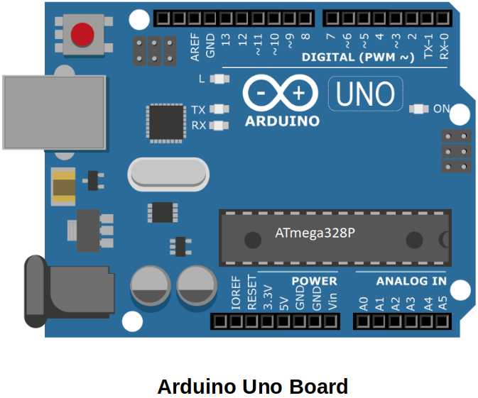
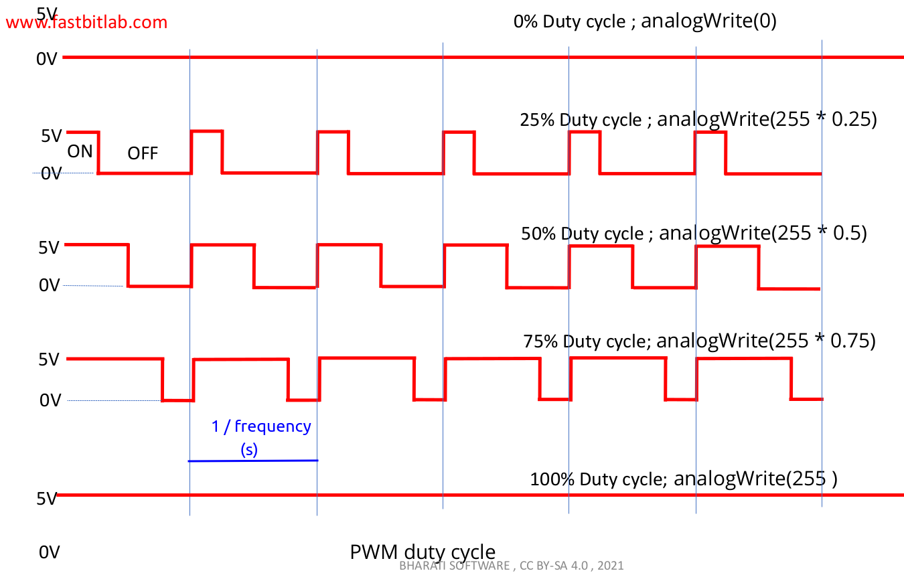
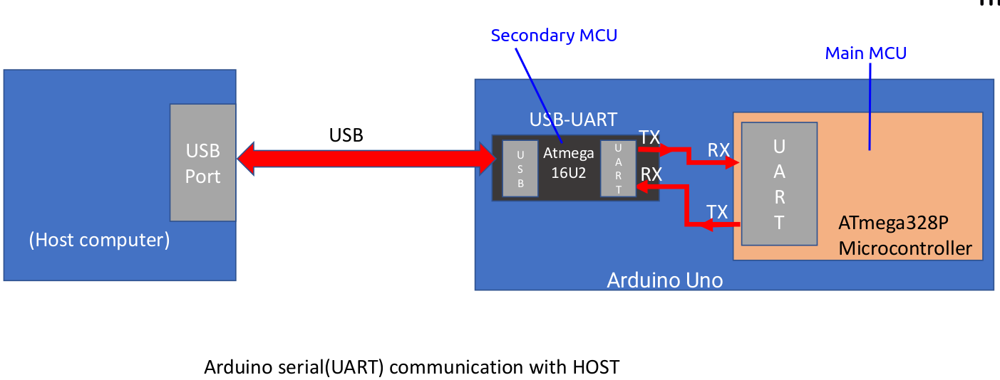

[Home](../../) | [Projects](../../projects) | [Notes](../) > <a href="./">Embedded Systems Design using UML State Machines</a> > Exercise 1: Changing Intensity of an LED

# Exercise 1: Changing Intensity of an LED


## Overview

### Requirements

1. Connect the LED to any one of the PWM pins on the Arduino Uno board.

2. Modify the duty cycle of the PWM wave using the Arduino API's `analogWrite()` function.

   * With the Arduino Uno board, the `analogWrite()` API is not related to internal analog peripherals. Instead, it controls the ON/OFF period through the pin using a timer to achieve the desired duty cycle.

   * Language Reference: [https://www.arduino.cc/reference/en/](https://www.arduino.cc/reference/en/)

3. Utilize the Arduino serial interface to transmit ON and OFF events from the host.

### Components

* Arduino Uno board
* 1, 5mm LED
* Jumper wires

### Hardware





* Arduino Uno board PWM pins
  * Pin 3, 5, 6, 9, 10, 11 are PWM pins
  * On these pins Arudino Uno can generate PWM signals
  * PWM signal frequency:
    * 490Hz on 3, 9, 10, 11
    * 980Hz on 5 and 6

### PWM Duty Cycle





### Arduino Serial (UART) Communication with Host





* Arduino Uno board's secondary MCU acts as a USB-to-Serial converter which has a firmware that converts USB signal to UART signal and vice versa.

  Thanks to this firmware, the Arduino Uno board can be enumerated as a Virtual COM Port on the host.

* When uploading the program from the host to the Arduino board, the program is transferred via the USB cable, converted into UART signals, and then sent to the main MCU. The bootloader, located in the main MCU, writes the received program into the Flash memory.


## Implementation - Mealy State Machine

### Mealy State Machine


### Implementation

```cpp
//==============================================================================
// File     : 01_LightControl_Mealy.ino
// Brief    : Light control application using the Mealy State Machine
// Author   : Kyungjae Lee
// Date     : Sep 27, 2023
//==============================================================================

// Macros
#define PIN_LED 			9
#define LIGHT_BRIGHT_OFF	0
#define LIGHT_BRIGHT_DIM	25
#define LIGHT_BRIGHT_MED	85
#define LIGHT_BRIGHT_FUL	255

// Enum for events
typedef enum {
	ON,
	OFF
} Event_Enum;

// Enum for light states
typedef enum {
	LIGHT_OFF,
	LIGHT_DIM,
	LIGHT_MED,
	LIGHT_FUL
} LightState_Enum;

// Function prototypes
void light_state_machine(uint8_t event);
void light_change_intensity(uint8_t pin, uint8_t intensity);

// Global variables
LightState_Enum light_state = LIGHT_OFF;

void setup() {
	// put your setup code here, to run once:

	// 'Serial.begin()' takes care of all the necessary initialization of UART communication
	Serial.begin(115200);
	Serial.println("Light control application");
	Serial.println("-------------------------");
	Serial.println("Send 'x' or 'o'");
}

void loop() {
	// put your main code here, to run repeatedly:

	uint8_t event;
	
	if (Serial.available() > 0)
	{
		event = Serial.read();
		if (event == 'o')
		{
			light_state_machine(ON);
		}
		else if (event == 'x')
		{
			light_state_machine(OFF);
		}
		else
		{
			// Do nothing
		}
	}
} // End of loop

// Implementation of the Mealy State Machine for light control
void light_state_machine(uint8_t event)
{
	switch (light_state)
	{
		case LIGHT_OFF: {
			switch (event)
			{
				case ON:
					light_change_intensity(PIN_LED, LIGHT_BRIGHT_DIM);
					light_state = LIGHT_DIM;
					break;
			}
			break;
		}
		case LIGHT_DIM: {
			switch (event)
			{
				case ON:
					light_change_intensity(PIN_LED, LIGHT_BRIGHT_MED);
					light_state = LIGHT_MED;
					break;
				case OFF:
					light_change_intensity(PIN_LED, LIGHT_BRIGHT_OFF);
					light_state = LIGHT_OFF;					
					break;
			}
			break;
		}
		case LIGHT_MED: {
			switch (event)
			{
				case ON:
					light_change_intensity(PIN_LED, LIGHT_BRIGHT_FUL);
					light_state = LIGHT_FUL;
					break;
				case OFF:
					light_change_intensity(PIN_LED, LIGHT_BRIGHT_OFF);
					light_state = LIGHT_OFF;					
					break;
			}
			break;
		}
		case LIGHT_FUL: {
			switch (event)
			{
				case ON:
					light_change_intensity(PIN_LED, LIGHT_BRIGHT_DIM);
					light_state = LIGHT_DIM;
					break;
				case OFF:
					light_change_intensity(PIN_LED, LIGHT_BRIGHT_OFF);
					light_state = LIGHT_OFF;					
					break;
			}
			break;
		}
	}
} // End of light_state_machine

// Changes the light intensity
void light_change_intensity(uint8_t pin, uint8_t intensity)
{
	analogWrite(pin, intensity);
} // End of light_change_intensity
```


## Implementation - Moore Machine

### Moore State Machine


### Implementation

```cpp
//==============================================================================
// File     : 02_LightControl_Moore.ino
// Brief    : Light control application using the Moore State Machine
// Author   : Kyungjae Lee
// Date     : Sep 27, 2023
//==============================================================================

// Macros
#define PIN_LED 			9
#define LIGHT_BRIGHT_OFF	0
#define LIGHT_BRIGHT_DIM	25
#define LIGHT_BRIGHT_MED	85
#define LIGHT_BRIGHT_FUL	255

// Enum for events
typedef enum {
	ON,
	OFF
} Event_Enum;

// Enum for light states
typedef enum {
	LIGHT_OFF,
	LIGHT_DIM,
	LIGHT_MED,
	LIGHT_FUL
} LightState_Enum;

// Function prototypes
void light_init(void);
void run_entry_action(LightState_Enum state);
void light_state_machine(uint8_t event);
void light_change_intensity(uint8_t pin, uint8_t intensity);

// Global variables
LightState_Enum curr_state;

void setup() {
	// put your setup code here, to run once:

	// 'Serial.begin()' takes care of all the necessary initialization of UART communication
	Serial.begin(115200);
	Serial.println("Light control application");
	Serial.println("-------------------------");
	Serial.println("Send 'x' or 'o'");

	light_init();
} // End of setup

void loop() {
	// put your main code here, to run repeatedly:

	uint8_t event;
	
	if (Serial.available() > 0)
	{
		event = Serial.read();
		if (event == 'o')
		{
			light_state_machine(ON);
		}
		else if (event == 'x')
		{
			light_state_machine(OFF);
		}
		else
		{
			// Do nothing
		}
	}
} // End of loop

// Initializes the light state
void light_init(void)
{
	curr_state = LIGHT_OFF;		// State
	run_entry_action(LIGHT_OFF);	// Action
}

// Implements the entry actions for each state
void run_entry_action(LightState_Enum state)
{
	switch (state)
	{
		case LIGHT_OFF:
			light_change_intensity(PIN_LED, LIGHT_BRIGHT_OFF);
			break;
		case LIGHT_DIM:
			light_change_intensity(PIN_LED, LIGHT_BRIGHT_DIM);
			break;
		case LIGHT_MED:
			light_change_intensity(PIN_LED, LIGHT_BRIGHT_MED);
			break;
		case LIGHT_FUL:
			light_change_intensity(PIN_LED, LIGHT_BRIGHT_FUL);
			break;
	}
} // End of run_entry_action

// Implementation of Moore State Machine
void light_state_machine(uint8_t event)
{
	LightState_Enum prev_state;

	prev_state = curr_state;

	switch (curr_state)
	{
		case LIGHT_OFF:
			switch (event)
			{
				case ON:
					curr_state = LIGHT_DIM;
					break;
			}
			break;
		case LIGHT_DIM:
			switch (event)
			{
				case ON:
					curr_state = LIGHT_MED;
					break;
				case OFF:
					curr_state = LIGHT_OFF;
					break;
			}
			break;
		case LIGHT_MED:
			switch (event)
			{
				case ON:
					curr_state = LIGHT_FUL;
					break;
				case OFF:
					curr_state = LIGHT_OFF;
					break;
			}
			break;
		case LIGHT_FUL:
			switch (event)
			{
				case ON:
					curr_state = LIGHT_DIM;
					break;
				case OFF:
					curr_state = LIGHT_OFF;
					break;
			}
			break;
	}

	// Check if there has been a state transition
	if (prev_state != curr_state)
	{
		// There has been a state transition, so run appropriate entry action 
		// of the new state.
		run_entry_action(curr_state);
	}
} // End of light_state_machine

// Changes the light intensity
void light_change_intensity(uint8_t pin, uint8_t intensity)
{
	analogWrite(pin, intensity);
} // End of light_change_intensity
```
