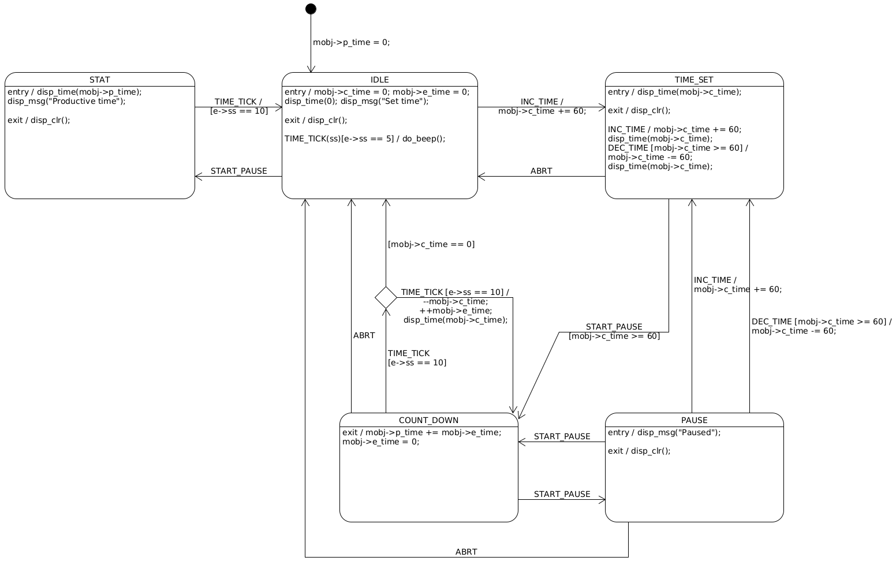

[Home](../../) | [Projects](../../projects) | [Notes](../) > <a href="./">Embedded Systems Design using UML State Machines</a> > Exercise 2: Productivity Timer (ProTimer)

# Exercise 2: Productivity Timer (ProTimer)


## Overview

The application that tracks your productive working time.

### Requirements

1. `+` button increments time (minute-level increment).
2. `-` button decrements time (minute-level decrement).
3. `Start/Pause` button starts or pauses the countdown, or shows STAT if pressed together.
4. When the countdown is paused, time can be modified.
5. Press the `+` and `-` button simultaneously to abort the running timer.
6. Application must beep 20 times when it returns to IDLE mode.
7. When the application is in IDLE mode, pressing the `Start/Pause` button should show the STAT for 1 sec and auto return to IDLE mode.

### Components

* Arduino Uno board
* 1, 5mm LED
* Jumper wires

### States

* IDLE
* TIME_SET
* PAUSE
* COUNTDOWN
* STAT

### Events

| User Activity                      | Event Generated (SIGNAL) | Parameters            | Note                                                         |
| ---------------------------------- | ------------------------ | --------------------- | ------------------------------------------------------------ |
| Press `+` button                   | INC_TIME                 | none                  | This event gets posted to the state machine whenever the user presses the `+` button. |
| Press `-` button                   | DEC_TIME                 | none                  | This event gets posted to the state machine whenever the user presses the `-` button. |
| Press `S/P` button                 | START_PAUSE              |                       | This event gets posted to the state machine whenever the user presses the `S/P` button. |
| Press `+` and  `-` button together | ABRT                     |                       | This event gets posted to the state machine whenever the user presses the `+` and `-` buttons together. |
|                                    | TIME_TICK                | ss <br />(sub second) | This event is system generated for every 100ms.<br />ss parameter value can vary between 1 to 10. |

### Extended State Variables

* The variables that appear on the state machine to be used for storing various data and making decisions.

  * curr_time : `uint32_t`

  * elapsed_time : `uint32_t`

  * pro_time : `uint32_t`

  ```c
  /* The main application structure */
  typedef struct protimer_tag
  {
      uint32_t curr_time;		// Stores the time user has set
      uint32_t elapsed_time;	// Number of seconds that has elapsed
      uint32_t pro_time;		// Productive time spent by the user
      ...
  } protimer_t;
  ```

* A structure that contains these types of variables is also called as "main application structure".

### Data Structures

* Define various signals of the application using `enum`

  ```cpp
  /* main.h */
  
  /* Signals of the application */
  typedef enum {
      INC_TIME,
      DEC_TIME,
      TIME_TICK,
      START_PAUSE,
      ABRT,
      /* Internal activity signals */
      ENTRY,
      EXIT
  } protimer_signal_t;
  ```

* Define various states of the application using `enum`

  ```cpp
  /* main.h */
  
  /* States of the application */
  typedef enum {
      IDLE,
      TIME_SET,
      COUNTDOWN,
      PAUSE,
      STAT
  } protimer_state_t;
  ```

* Define the main application structure

  ```cpp
  /* main.h */
  
  /* Main application structure */
  typedef struct {
      uint32_t curr_time;
      uint32_t elapsed_time;
      uint32_t pro_time;
      protimer_state_t active_state;
  } protimer_t
  ```

* Define structures to represent events

  ```cpp
  /* main.h */
  
  /* User generated events */
  typedef struct {
      uint8_t sig;
  } protimer_user_event_t;
  
  /* Tick events */
  typedef struct {
      uint8_t sig;
      uint8_t ss;		/* Sub-seconds */
  } protimer_tick_event_t;
  ```

  Or, you could improve this code by introducing the OOP concept. (Using structure embedding)

  ```cpp
  /* main.h */
  
  /* Generic (supter) event structure */
  typedef struct {
      uint8_t sig;
  } event_t;
  
  /* User generated events */
  typedef struct {
      event_t super;
  } protimer_user_event_t;
  
  /* Tick event */
  typedef struct {
      event_t super;
      uint8_t ss;     /* Sub-seconds */
  } protimer_tick_event_t;
  ```

  

## State Machine

### Flat State Machine





## Implementation
