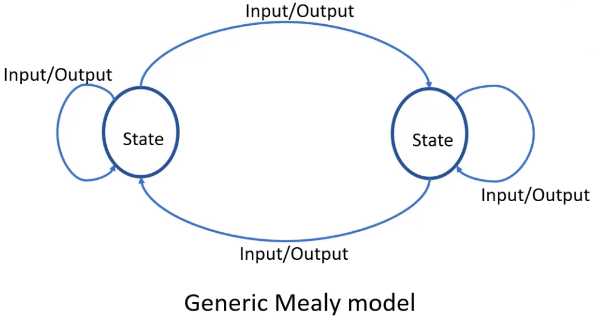
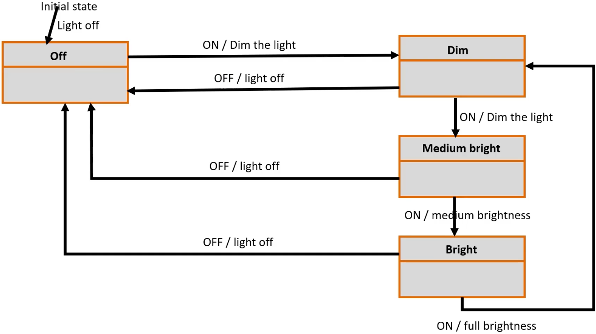
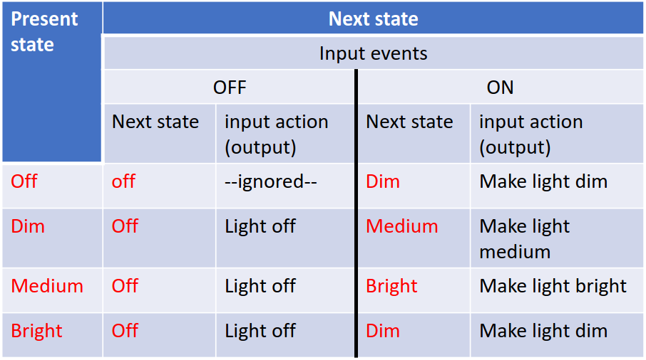
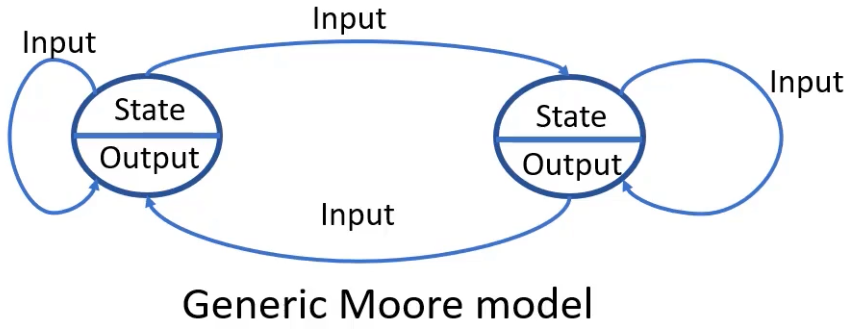
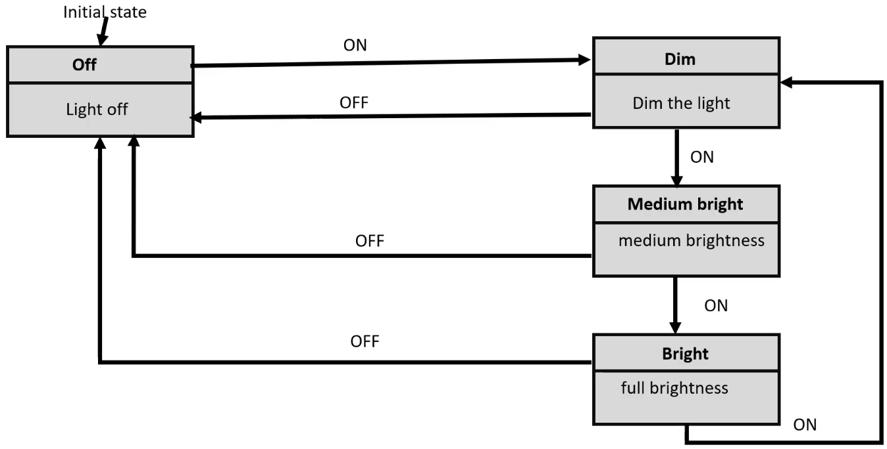
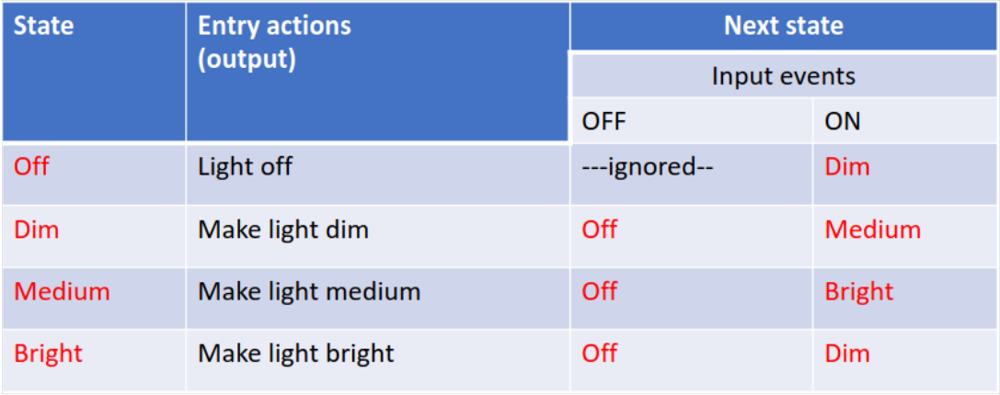
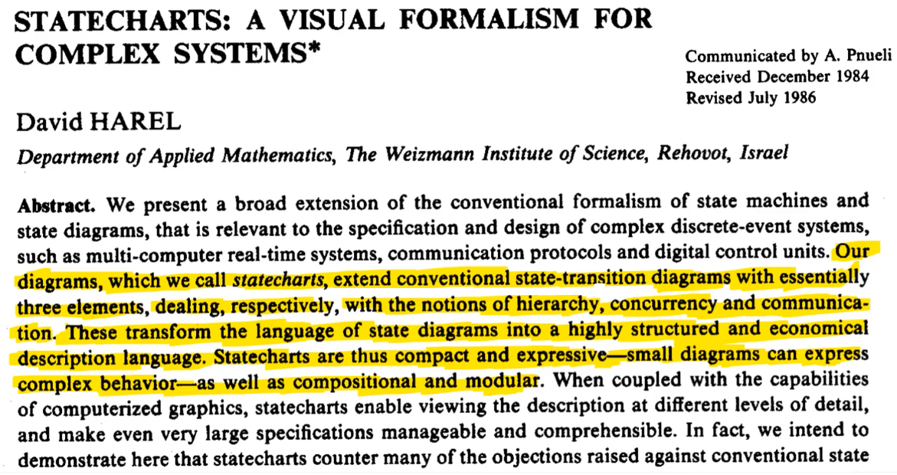
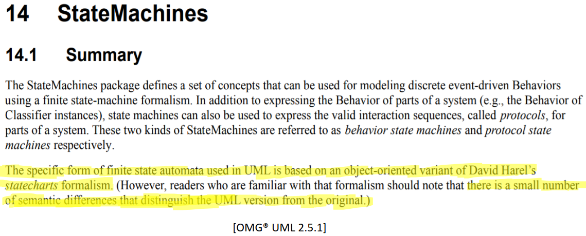

[Home](../../) | [Projects](../../projects) | [Notes](../) > <a href="./">Embedded Systems Design using UML State Machines</a> > Finite State Machine (FSM)

# Finite State Machine (FSM)

## Finite State Machine

* A state machine is a software model of computation that comprises a finite number of states. Hence, it is also called a Finite State Machine (FSM).
* Since states are finite, there is a finite number of transitions among the states. Transitions are triggered by the input events fed to the state machine (FSM is an event-driven system).
* A state machine also produces output. The output produced depends on the current state of the state machine and the input events fed to it.

## Benefits of Using State Machines (FSMs)

* Used to describe situations or scenarios within your application (modeling the life cycle of a reactive object through interconnections of states).
  * Here, object means an instance of a class.
* FSMs are helpful for modeling complex applications that involve extensive decision-making, generating various outputs (actions), and processing numerous events.
* State machines are visualized using state machine diagrams in the form of state charts, which facilitate communication between non-developers and developers.
  * FSMs can be a means to help effective communication between cross-functional teams.
* They make it easier to visualize and implement changes to the project's behavior.
* A complex application can be depicted as a collection of different states processing a fixed set of events and generating a fixed set of outputs.
* Loose coupling: An application can be divided into multiple behaviors or state machines, with each unit testable separately and potentially reusable in other applications.
* Simplifies debugging and enhances code maintenance.
* Offers scalability.
* Simplifies the overall application complexity by breaking it down into state-level complexity for analysis and implementation.

## Types of State Machines

* Mealy machines
* Moore machines
* Harel state charts
* UML state machines

## Mealy Machine

* In this machine, the output produced by the state machine depends on the input events fed to the state machine AND the current active state of the state machine.
* The output is NOT produced within the state. Instead, the output is produced along the transition from one state to another.
  * State transition: Changing the state from one to another
* Output is represented alongside each input, separated by a '/'.
* An "Output" is also referred to as an "Action."
* In the Mealy model, the "Output" is also called as an "Input action."

### Example: Light control system

* Mealy state machine

* State transition table

  State transition table helps implement the code.

  * When the state machine is in the "Off" state, and if
    * the input event "ON" is received, the state machine produces the output "Make light dim" and transitions to the "Dim" state.
    * the input event "OFF" is received, it is ignored.

  

## Moore Machine

* In this machine, the output is determined solely by the current active state of the state machine and is not influenced by any input events.
* There is NO output during state transitions.
* Output is represented within the state.
* "Output" is also commonly referred to as an "Action."
* In the Moore model, the "Output" is also known as an "Entry action."

### Example: Light control system

* Moore state machine

  In this case, all the "Actions (or Entry Actions or Outputs)" are assigned to each state.

* State transition table

## Harel State Chart

* Harel state charts features

  * Substates and superstates

  * Composite states

  * History states(shallow and deep)

  * Orthogonality

  * Communication between state machines

  * Conditional transitions (guards)

  * Entry and exit actions

  * Activities inside a state

  * Parameterized states

  * Overlapping states

  * Recursive statecharts

## UML State Machines

### UML Modeling Tool & Code Generator

* Rhapsody by IBM
* QM Model-based design tool by Quantum Leaps, LLC
* Visual State by IAR
* Yakindu state chart tools by Itemis AG

## Implementation of State Machine Handler

* Nested switch-case approach
* State table approach
* State handler approach
  * Most efficient, less redundant
  * Originally described in the book "Practical UML Statecharts in C/C++: Event-Driven Programming for Embedded Systems [SECOND EDITION] by Miro Samek"
