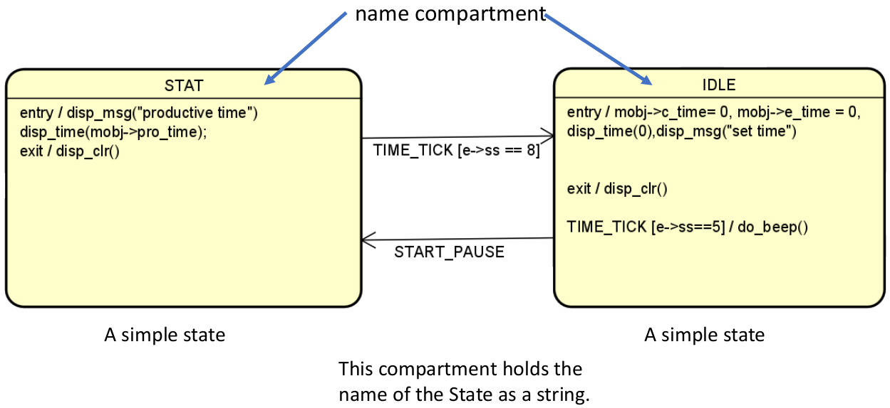
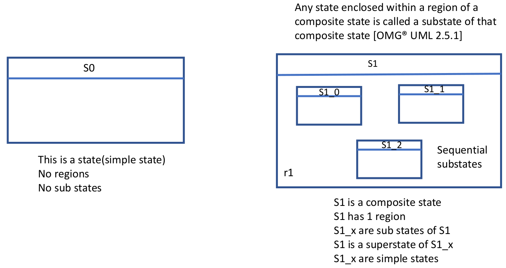
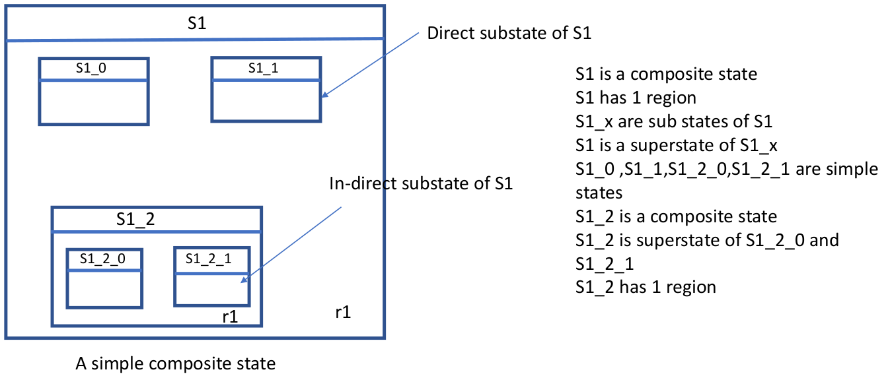
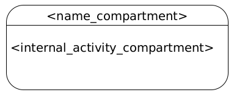
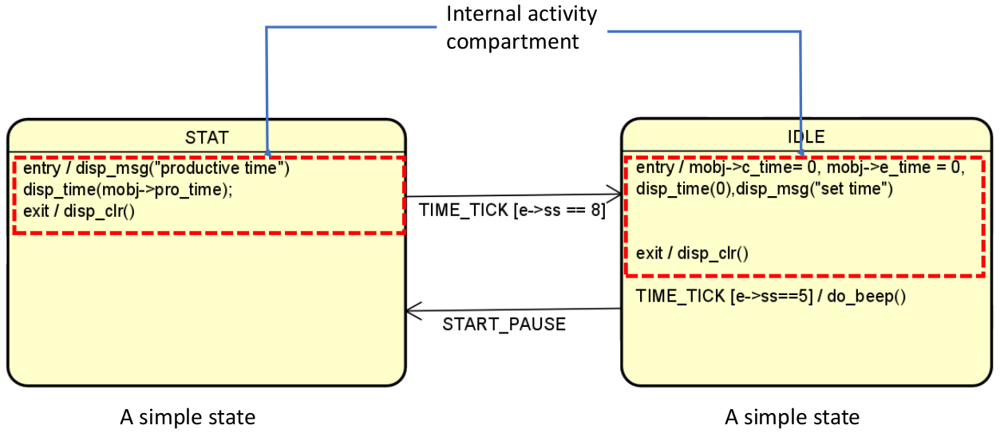
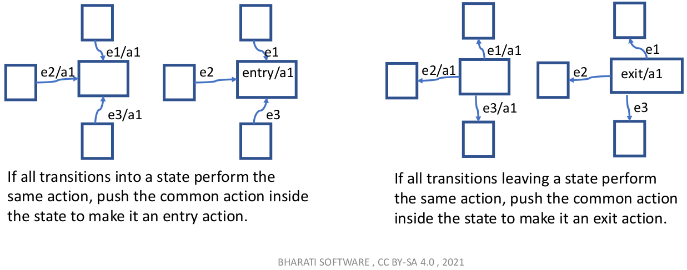

[Home](../../) | [Projects](../../projects) | [Notes](../) > <a href="./">Embedded Systems Design using UML State Machines</a> > State

# State


## What is a State?

* A state represents a distinct stage of an object's life cycle.
  * Here, an object refers to an instance of a class or a structure.
  * An object, in its life cycle, can pass through a number of stages in an application.
* A state model is a situation in the execution of a State Machine behavior during which some invariant condition holds. In most cases, this condition is not explicitly defined but is implied, usually through the name associated with the State. (OMG UML 2.5.1)


## How to Identify States?

* Map different scenarios through which an object life cycle passes into number of states.
* Example: Different scenarios of Protimer Application (see [Exercise 2: Productivity Timer (ProTimer)](./exercise-2-productivity-timer))

  The followings are the states that an object goes through during its life cycle in the Protimer application:

  * IDLE
  * TIME-SET
  * COUNTDOWN
  * PAUSE
  * STAT

* An application may contain several objects, and for each object there could be a corresponding state machine model.


## How to Create a State?

1. Draw a round-conrnered rectangle
2. Create a horizontal name compartment
3. Give a name that is unique within the state machine diagram


## Types of States in UML

### Simple State

* A state that doesn't have any substates, transitions, regions, submachines
* NO two states in the state machine diagram can be the same. (Each name must be UNIQUE within the diagram.)
* The following diagram shows a simple state with name compartments.





### Composite State

* A state which has substates, and contains at least one region
* Helps making your state machine diagram much simpler by reducing the clutter in the diagram
* Types of composite state:
  * Simple composite state - Has exactly one region
  * Orthogonal state
* By using composite states, you can express state hierarchies.
* It makes statecharts more comprehensible by reducing the number of transistions between states.
* Simple states vs composite states:
  * Substates form a region (e.g., S1 has one region identified as r1)
  * Understand the term "direct substate" and "indirect substate" in the following example.








### Submachine State

* A submachine state specifies the insertion of the specification of a submachine state machine.
* The state machine that contains the submachine state is called the containing state machine.


## Pseudo States

* Initial - Starting point for a region
* Choice - Diamond-shaped symbol with a single incoming transition and two or more outgoing transitions
* Join
* Deep history
* Shallow history

See [OMG$\circledR$ UML 2.5.1] for the complete list of pseudo states.


## Compartments of a State





* A simple state contains two compartments: 
  * Name compartment
  * Internal activities compartment

### Name Compartment

* Where the name of a state goes.

### Internal Activity Compartment





* The internal activities compartment defines a list of internal behaviors associated with a state.

* Each entry has the following format:

  ```plain
  <behavior-type-label>[/<bahavior-expression>]
  ```

* Example:

  `entry`, `exit`, `do` are internal activities **labels** or **keywords** defined in the UML. Do not use these keywords outside the internal activity compartment to represent events in the state machine diagram. These labels identify the circumstances under which the behaviors specified by the `<behavior-expression>` is executed.

  * `entry`

    Behavior identified by `<behavior-expression>` will be executed upon entry to the state. Use the `entry` keyword if the state has entry action. (When entering into a composite state, the entry actions are executed beginning from the outermost state to the innermost state)

  * `exit`

    Behavior identified by `<behavior-expression>` will be executed upon exit from the state. Use the `exit` keyword if a state has exit action. (When exiting from a composite state, the exit actions are executed beginning from the innermost state to the outermost state.)

  * `do`

    Behavior identified by `<behavior-expression>` will be executed as long as the object is in the state or until the computation specified by the expression is completed. This represents ongoing behavior. Use the `do` keyword only if a state has `do` action.
  
* Whether your state requires these internal activities or not depends on your project requirements and how you design your state machine. All these are optional. A state may or may not have the `entry` or `exit` actions.


## Notes

* The `do` activity behavior commences only after the state's `entry` behavior has completed.
* `entry`, `exit`, `do`, cannot be associated with any transitions.
* If all transitions into / out from a state perform the same action, consider specifying the action inside the state to make the diagram less cluttered.



