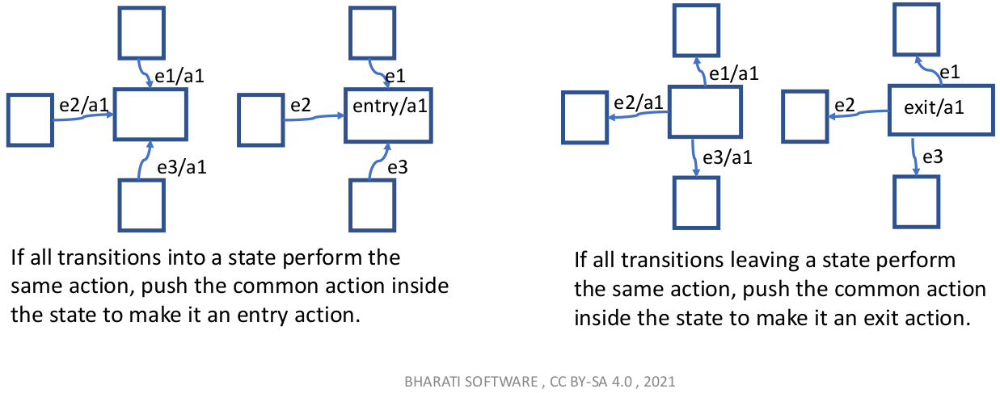

[Home](../../) | [Projects](../../projects) | [Notes](../) > <a href="./">Embedded Systems Design using UML State Machines</a> > Transitions

# Transitions


## Transitions

* State transition in programming is nothing but updating a variable that holds the state information.

* Types of transitions
  * External
  * Local
  * Internal
  
* Each item has the following syntax:

  ```plain
  {<trigger>}*['['<guard>']'][/<bahavior-expression>]
  ```

  In short,

  ```plain
  T[G]/action
  ```

  ```plain
  {<trigger>}[guard]/action
  ```

  ```plain
  event[guard]/action
  ```

* If the event occurrence matches the `trigger` and ` guard` of the internal transition evaluates to be TRUE, then behavior identified by `<behavior-expression>` will be executed without exiting or re-entering the state in which it is defined.

* Guard is optional!


* No exit means no state transition and no entry!


## Internal Transition

* Internal transition is a special case of a local transition, specifically a self-transition (i.e., with the same source and target states). In this case, the state is never exited (and, thus, not re-entered), which means that no exit or entry behaviors are executed when this transition is triggered. This kind of transition can only be defined if the source vertex is a state [OMG UML 2.5.1].

* Example

  Whenever the TIME_TICK happens, and if the variable value is 5, then do a beep!


## External Transition

* In an external transition, the source state is exited due to the occurrence of a trigger. The operational action associated with the transition is executed, followed by the execution of the exit action of the state.
* An external transition signifies a change in a state or an object's situation in the object's life cycle.
* When the state is changed, the object is now ready to process a new set of events and execute a new set of actions.
* Transitions are denoted by lines with arrowheads leading from a source state to a target state.
* Example


## Local Transition

* Local transition is the opposite of external transition, meaning that the transition does not exit its containing state (and, hence, the exit behavior of the containing state will not be executed). However, for local transitions, the target vertex must be different from its source vertex. 
* A local transition can only exist within a composite state.
* Example


## Notes

* The `do` activity behavior commences only after the state's `entry` behavior has completed.
* `entry`, `exit`, `do`, cannot be associated with any transitions.
* If all transitions into / out from a state perform the same action, consider specifying the action inside the state to make the diagram less cluttered.



