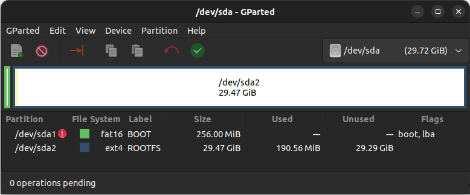
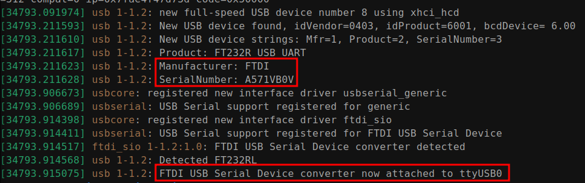
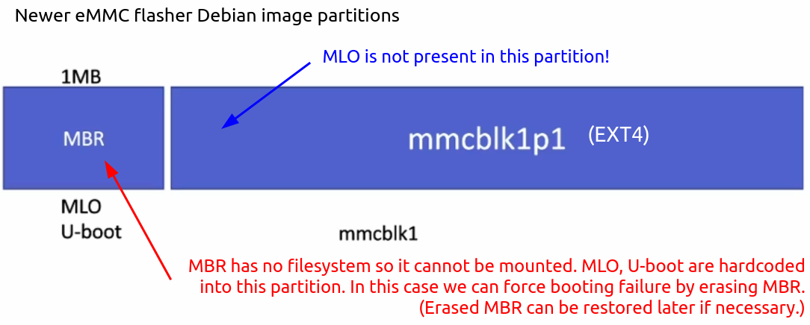

[Home](../../) | [Projects](../../projects) | [Notes](../) > <a href="./">Linux Device Drivers</a> > Booting from $\micro$SD Card

# Booting from $\micro$SD Card


## Introduction

### Boot Sequence of BeagleBone Black Board

* The boot sequence is determined by the `SYSBOOT[4:0]` bit field of the control register. This bit field value changes depending on whether the **boot button** is pressed on power-up or not.
* AM335x boot sequence
  * [Default] Boot button NOT pressed on power-up:
    1. MMC1 (eMMC)
    2. MMC0 ($\micro$SD)
    3. UART0
    4. USB0
  * Boot button pressed on power-up:
    1. SPI0
    2. MMC0 ($\micro$SD)
    3. USB0
    4. UART0

### Usage of Power Button, Reset Button and Boot Button

* Power button

  By pressing and holding this button for 10 to 20 seconds, you can power down the board. Once you power down the board, gently pressing this button one time will power up the board again. Instead of connecting and disconnecting the power source to your board, you can use this button to power down and power up.

* Reset button

  Pressing this button resets the board. Note that the boot sequence is not affected by the reset action.

* Boot button

  This button can be used to change the boot sequence during the power up of the board.


## $\micro$SD Card Preparation

1. 8+ GB $\micro$SD card can be used

2. Connect the $\micro$SD card to PC using card reader

   * Use `dmesg` or `lsblk` command to check if your system recognizes the device (e.g., sda)

3. Launch the GParted application

4. Create 2 partitions (FAT16 and EXT4)

   * Partition 1 - BOOT / FAT16 / Stores boot images (e.g., MLO, U-boot, kernel image) / 512MB
   * Partition 2 - ROOTFS / EXT4 / Stores Debian root filesystem / Rest of the $\micro$SD card

   [!] Note: Make sure to click "Apply" button (green check) after creating partitions.

5. Configure the flags of BOOT partition; `lba`, `boot`

   

   

   

   Once you close GParted app, you'll see the newly created partitions appear on your system.

6. Copy boot images on FAT16 partition (BOOT partition)

   ```plain
   sudo cp -a workspace/downloads/pre-built-images/SD-boot/* /media/klee/BOOT/
   ```

   > `am335x-boneblack.dtb` - Device tree binary of BBB
   >
   > `MLO` - Primary boot loader (Memory LOader)
   >
   > `u-boot` - U-boot bootloader image
   >
   > `uEnv.txt` - U-boot commands and environment settings
   >
   > `uImage` - Kernel image 

   ```plain
   sync
   ```

   > To flush left-over contents in the buffer to the media

7. Copy Debian root filesystem on EXT4 partition (ROOTFS partition)

   * Decompress the downloaded Debian image:

     ```plain
     unxz bone-debian-9.9-iot-armhf-2019-08-03-4gb.img.xz
     ```

   * Right-click the `.img` file $\to$ Open With Disk Image Mounter. This will mount the image to the filesystem.

     Check the mount status by running:

     ```plain
     lsblk
     ```

     

     

     

   * Copy the contents of mounted `rootfs/` into `/media/klee/ROOTFS`.

     ```plain
     sudo cp -a /media/klee/rootfs/* /media/klee/ROOTFS
     ```

     ```plain
     sync
     ```

     > To flush left-over contents in the buffer to the media

8. Unmount and remove the $\micro$SD card from PC

9. Power down the board, insert the $\micro$SD card into BBB $\micro$SD card slot

10. Boot from $\micro$SD card (MMC0 interface)


## Booting from $\micro$SD Card Interface (MMC0)

1. Make sure that BBB board is NOT powered up

2. Connect BBB board and host using serial debug cable

   * Check if connection has been successfully established by running `dmesg`.

     

     

     > This means that the host will serial communicate with the target board over the device file `ttyUSB0`.

   * Run minicom:

     ```plain
     (sudo) minicom
     ```

     > Run `minicom -s` to configure the environment such as selecting the serial device (e.g., `/dev/ttyUSB0`).
     >
     > `ctrl + a`, `x` to exit.

3. Insert the SD card to BBB board

4. Power up the board using mini USB cable

5. Press and hold the boot button (S2)

6. Press and hold the power button (S3) until the blue LED turns off and turns back on. (If the blue LED doesn't turn back on, gently press the power button.)

7. Release the S2 button after 2 to 5 seconds.

Check if the board is successfully booting from $\micro$SD card.

### Pro Tip!

* It would be great if we could force the board to boot from the $\micro$SD card (MMC0 interface) by default without having to manipulate any buttons.

  $\to$ This can be done by making eMMC (MMC1 interface) boot fail in the default boot sequence so that the board attempts to boot from the $\micro$SD card (MMC0 interface) 

* **When BBB is pre-installed with older Debian eMMC image** 

  As a root: `sudo -s`

  1. Create a temporary mount point:

     ```plain
     mkdir /media/tmp1
     ```

  2. Mount the partition 1 of the Debian image to the mount point created in the previous step:

     ```plain
     mount /dev/mmcblk1p1 /media/tmp1/
     ```

     > BOOT partition (partition 1)

  3. `cd` to the mount point and alter the name of `MLO` file to something else (e.g., `MLO.bak`):

     ```plain
     cd /media/tmp1/
     ```

     ```plain
     mv MLO MLO.bak
     ```

     > `MLO` can be restored easily by changing the name back.

     This will prevent the board from finding the `MLO` file during its boot process, and in turn cause boot from eMMC failure.

  4. Reboot and see if the board boot from $\micro$SD card successfully.

* **When BBB is pre-installed with newer Debian eMMC image** (You may not see `/dev/mmcblk1p2` partition and `MLO` file. You'll see `mmcblk1p1` only!) 

  

  

  

  As a root: `sudo -s`, we'll take a snapshot of `MBR` and zero out it to cause boot failure.

  1. Take a snapshot of `MBR`:

     ```plain
     dd if=/dev/mmcblk1 of=emmcboot.img bs=1M count=1
     ```

     > `if`/`of` - Input/output file
     >
     > `bs` - Block size

  2. Zero-out `MBR`:

     ```plain
     dd if=/dev/zero of=/dev/mmcblk1 bs=1M count=1
     ```

  3. Reboot and see if the board boot from $\micro$SD card successfully.

  [!] Note: To restore the `MBR`:

  ```plain
  dd if=emmcboot.img of=/dev/mmcblk1 bs=1M count=1
  ```
