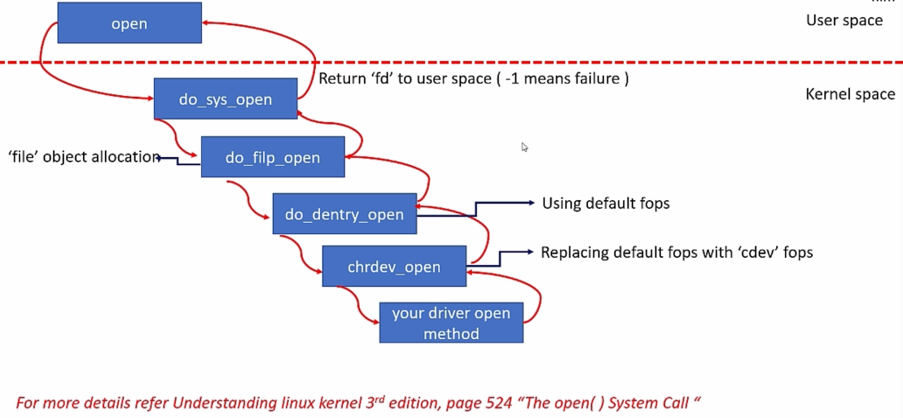
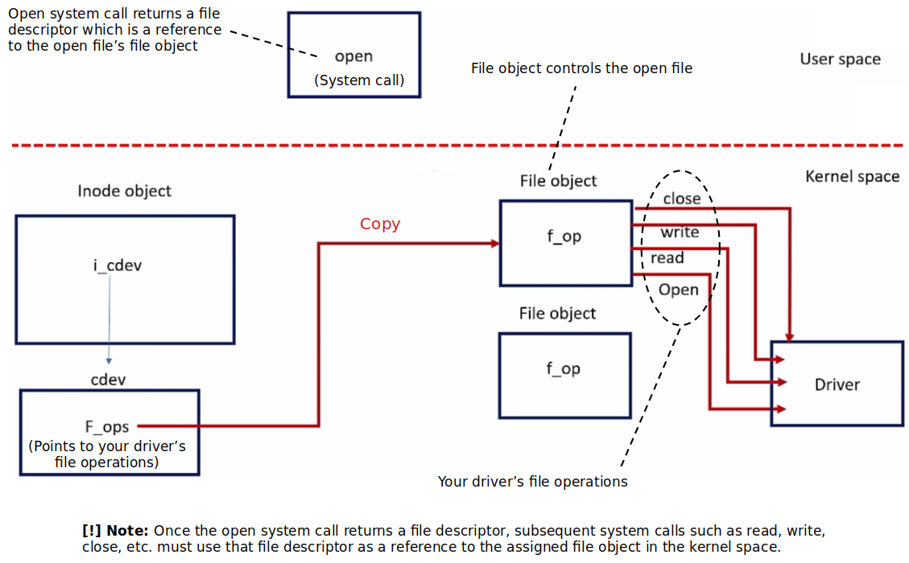

[Home](../../) | [Projects](../../projects) | [Notes](../) > <a href="./">Linux Device Drivers</a> > Character Driver

# Character Driver


## Character Driver (char driver)

* A Linux **character device** is a special type of device file that allows  sequential character-based input or output to be processed, such as  terminals or serial ports.
* A Linux **character driver** is a software component that enables  communication and control of character-oriented devices by providing an  interface for applications to read from and write to them character by  character.

* Character driver accesses data from the device sequentially (i.e., byte-by-byte like a stream of characters) not as a chunk.
* Sophisticated buffering strategies are usually not involved in char drivers, because when you write 1 byte, it directly goes to the device without any intermediate buffering, delayed write-back or dirty buffer management.
* Examples: Sensors, RTC, keyboard, serial port, parallel port, etc.


## Character Driver File Operations

* VFS `file_operations` structure (Collection of various function pointers to the possible file operation methods for a regular file or a device file)

  ```c
  /* include/linux/fs.h */
  
  struct file_operations {
      struct module *owner;
      loff_t (*llseek) (struct file *, loff_t, int);
      ssize_t (*read) (struct file *, char __user *, size_t, loff_t *);
      ssize_t (*write) (struct file *, const char __user *, size_t, loff_t *);
      ssize_t (*read_iter) (struct kiocb *, struct iov_iter *);
      ssize_t (*write_iter) (struct kiocb *, struct iov_iter *);
      int (*iterate) (struct file *, struct dir_context *);
      int (*iterate_shared) (struct file *, struct dir_context *);
      unsigned int (*poll) (struct file *, struct poll_table_struct *);
      long (*unlocked_ioctl) (struct file *, unsigned int, unsigned long);
      long (*compat_ioctl) (struct file *, unsigned int, unsigned long);
      int (*mmap) (struct file *, struct vm_area_struct *);
      int (*open) (struct inode *, struct file *);
      int (*flush) (struct file *, fl_owner_t id); 
      int (*release) (struct inode *, struct file *);
      int (*fsync) (struct file *, loff_t, loff_t, int datasync);
      int (*fasync) (int, struct file *, int);
      int (*lock) (struct file *, int, struct file_lock *);
      ssize_t (*sendpage) (struct file *, struct page *, int, size_t, loff_t *, int);
      unsigned long (*get_unmapped_area)(struct file *, unsigned long, unsigned long, unsigned long, unsigned long);
      int (*check_flags)(int);
      int (*setfl)(struct file *, unsigned long);
      int (*flock) (struct file *, int, struct file_lock *);
      ssize_t (*splice_write)(struct pipe_inode_info *, struct file *, loff_t *, size_t, unsigned int);
      ssize_t (*splice_read)(struct file *, loff_t *, struct pipe_inode_info *, size_t, unsigned int);
      int (*setlease)(struct file *, long, struct file_lock **, void **); 
      long (*fallocate)(struct file *file, int mode, loff_t offset,
                loff_t len);
      void (*show_fdinfo)(struct seq_file *m, struct file *f); 
  #ifndef CONFIG_MMU
      unsigned (*mmap_capabilities)(struct file *);
  #endif
      ssize_t (*copy_file_range)(struct file *, loff_t, struct file *,
              loff_t, size_t, unsigned int);
      int (*clone_file_range)(struct file *, loff_t, struct file *, loff_t,
              u64);
      ssize_t (*dedupe_file_range)(struct file *, u64, u64, struct file *,
              u64);
  } __randomize_layout;
  ```

  

## Creation of a Device File

1. Create device file using `udev` (`init_special_inode()` gets called)

   ```c
   /* fs/inode.c */
   
   void init_special_inode(struct inode *inode, umode_t mode, dev_t rdev)
   {
       inode->i_mode = mode;
       if (S_ISCHR(mode)) {
           inode->i_fop = &def_chr_fops;	/* dummy file operation; fs/char_dev.c */
           inode->i_rdev = rdev;	/* initialize i_rdev with newly created device's device # */
       } else if (S_ISBLK(mode)) {
           inode->i_fop = &def_blk_fops;
           inode->i_rdev = rdev;
       } else if (S_ISFIFO(mode))
           inode->i_fop = &pipefifo_fops;
       else if (S_ISSOCK(mode))
           ;   /* leave it no_open_fops */
       else 
           printk(KERN_DEBUG "init_special_inode: bogus i_mode (%o) for"
                     " inode %s:%lu\n", mode, inode->i_sb->s_id,
                     inode->i_ino);
   }
   ```

   > `rdev` - Device number
   >
   > `mode` - Device type (e.g., char device, block device, etc.)

2. `inode` object gets created in memory and `inode->i_rdev` field is initialized with the device number

3. `inode->i_fop` field is set to dummy default file operations (i.e., `def_chr_fops`)

   ```c
   /* fs/char_dev.c */
   
   /*
    * Dummy default file-operations: the only thing this does
    * is contain the open that then fills in the correct operations
    * depending on the special file...
    */
   const struct file_operations def_chr_fops = { 
       .open = chrdev_open,
       .llseek = noop_llseek,
   };
   ```


## When a User Process Executes `open()` System Call

1. User invokes `open()` system call on the device file
2. `file` object gets created (VFS opens a file by creating a new file object and linking it to the corresponding inode object.)
3. `inode`'s `i_fop` gets copied to file object's `f_op` (dummy default file operations of char device file `def_chr_fops`)
4. Open function of dummy default file operations gets called (`chrdev_open`)
5. `inode->i_cdev` field is initialized to `cdev` that you added during `cdev_add` (lookup happens using `inode->i_rdev` field)
6. `inode->cdev->fops` (this is a actual file operations of the driver) gets copied to `file->f_op`
7. `file->f_op->open` method gets called (actual `open` method of the driver)

### `open()` System Call Behind the Scenes








## `inode` Object & `file` Object

* **`inode` Object**

  * Unix makes a clear distinction between the contents of a file and the information about a file.

  * An `inode` is a VFS data structure (`struct inode`) that holds general information about a file.

  * Whereas VFS `file` data structure (`struct file`) tracks interaction on a file opened by the user process.

  * An `inode` contains all the information needed by the filesystem to handle a file.

  * Each file has its own `inode` object, which the filesystem uses to identify the file.

  * Each `inode` object is associated with an `inode` number, which uniquely identifies the file within the file system.

  * The `inode` object is created and stored in memory when a new file (regular or device) gets created.

* **`file` Object**

  * Whenever a file is opened, a file object is created in the kernel space. There will be one `file` object for every open regular/device file.

  * A `file` object stores information about the interaction between an open file and a process.

  * This information exists ONLY in kernel memory while the file is open.

  * The contents of a `file` object is NOT written back to disk unlike the case of an `inode`.
