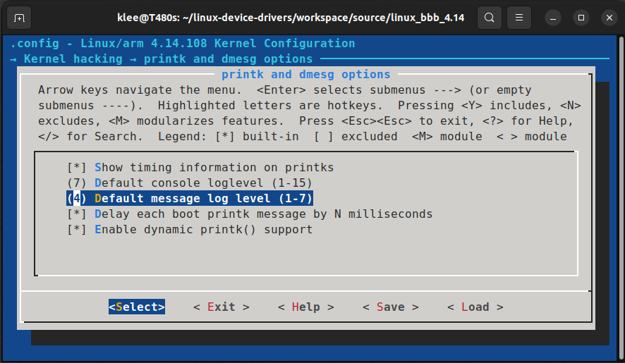

[Home](../../) | [Projects](../../projects) | [Notes](../) > <a href="./">Linux Device Drivers</a> > Debugging with `printk` & Kernel Log Levels

# Debugging with `printk` & Kernel Log Levels


## Debugging with `printk`

* `print` is one of the best debugging tools we have in user-level applications.

* When you work in kernel space, you will not have any access to the C standard library functions like `printf` or `scanf`.

* As their counterpart, the kernel has its own `printf`-like API called `printk`, where the letter `k` signifies "Kernel space printing".

* Examples;

  ```c
  printf("User space.\n");
  printk("Kernel space.\n");						/* Kernel space */
  printf("data1 = %d, data2 = %d\n, d1, d2");
  printk("data1 = %d, data2 = %d\n, d1, d2");		/* Kernel space */
  ```

* When using `printk`, the message will go into the kernel ring buffer (a.k.a. Kernel log) and we can print and control the kernel ring buffer using the command `dmesg`.

  To check the latest 5 kernel messages:

  ```plain
  dmesg | tail -5
  ```

  To check the first 20 kernel messages:

  ```plain
  dmesg | head -20
  ```

* `printk` format specifiers

  ```plain
  Variable Type		printk Format Specifier
  ==================	=======================
  int					%d or %x
  unsigned int		%u or %x
  long				%ld or %lx
  unsigned long		%lu or %lx
  long long			%lld or %llx
  unsigned long long	%llu or %llx
  size_t				%zu or %zx
  ssize_t				%zd or %zx
  s32					%d or %x
  u32					%u or %x
  s64					%lld or %llx
  u64					%llu or %llx
  ```

  > `printk` does not support floating-point formats (`%e`, `%f`, `%g`).

  [!] Reference: https://www.kernel.org/doc/Documentation/printk-formats.txt


## Kernel Log Levels

* Based on the kernel log level you can control the priority of the `printk` messages.

* There are 8 log levels

  * The lower the level number, the higher the priority
  * The default `printk` log level or priority is usually set to 4. (i.e., `KERN_WARNING`)

  ```c
  /* include/linux/kern_levels.h */
  
  #define KERN_SOH		"\001"			/* ASCII Start Of Header */
  #define KERN_SOH_ASCII	'\001'
  
  #define KERN_EMERG		KERN_SOH "0"	/* system is unstable */
  #define KERN_ALERT		KERN_SOH "1"	/* action must be taken immediately */
  #define KERN_CRIT		KERN_SOH "2"	/* critical conditions */
  #define KERN_ERR		KERN_SOH "3"	/* error conditions */
  #define KERN_WARNING	KERN_SOH "4"	/* warning conditions */
  #define KERN_NOTICE		KERN_SOH "5"	/* normal but significant condition */
  #define KERN_INFO		KERN_SOH "6"	/* informational */
  #define KERN_DEBUG		KERN_SOH "7"	/* debug-level messages */
  
  #define KERN_DEFAULT	""				/* the default kernel loglevel */
  ```

* The log level will be used by the kernel to understand the priority of the message. Based on the priority the kernel will decide whether the message should be presented to the user immediately by printing directly on to the console.

* All kernel messages will have their own log level.

* You may have to specify the log level while using `printk`. If not specified, the kernel will add the default log level set by the kernel config item `CONFIG_MESSAGE_LOGLEVEL_DEFAULT` whose value is 4.

  So, the following statement

  ```c
  prink("Kernel space\n");
  ```

  is equivalent to

  ```c
  prink(KERN_WARNING "Kernel space\n");
  //    ------------  --------------
  //      Log level      String arg
  ```

  > Notice that there's **NO comma (,)** between the log level and the string argument!

* Default message log level can be configured via the kernel menuconfig (`make ARCH=arm menuconfig`)

  

  


### Significance of the Kernel Log Level

* There is another log level we need to consider; the **current console log level**.

* The kernel message log level will be compared with the current console log level. If the kernel message log level is lower (i.e., higher priority) than the current console log level, the message will be directly printed on the current console.

* By default, the console log level will have the value of config item `CONFIG_CONSOLE_LOGLEVEL_DEFAULT` whose default value is set to 7. This value can be changed via the kernel menuconfig or running commands.

  To check the current console log level status, run

  ```plain
  cat /proc/sys/kernel/printk
  7       4       1       7
  ```

  > The results shows the *current*, *default*, *minimum* and *boot-time-default* log levels.

  `pr_info` (i.e., `KERN_INFO` level) used in the hello world LKM is of log level 6. This is why the message is getting printed when the LKM gets inserted into the kernel.  

* At run-time, you can change the current console log level (for example to 6) by running the following command:

  ```plain
  sudo -s
  echo 6 > /proc/sys/kernel/prink
  ```

  Now, if you check the current console log level:

  ```plain
  cat /proc/sys/kernel/printk
  6       4       1       7
  ```

  > The *current* console log level has changed from 7 to 6.

  Since the current console log level is now the same as `pr_info` (i.e., `KERN_INFO` level), the message will not get printed when the hello world LKM gets inserted into the kernel.

* `prink` wrappers (Defined in `include/linux/printk.h`)

  | Name         | Log Level | Alias Function                            |
  | ------------ | --------- | ----------------------------------------- |
  | KERN_EMERG   | "0"       | pr_emerg                                  |
  | KERN_ALERT   | "1"       | pr_alert                                  |
  | KERN_CRIT    | "2"       | pr_crit                                   |
  | KERN_ERR     | "3"       | pr_err                                    |
  | KERN_WARNING | "4"       | pr_warning                                |
  | KERN_NOTICE  | "5"       | pr_notice                                 |
  | KERN_INFO    | "6"       | pr_info                                   |
  | KERN_DEBUG   | "7"       | pr_debug (works only if DEBUG is defined) |
  | KERN_DEFAULT | ""        | -                                         |

  > `pr_err` - Useful for reporting errors
  >
  > `pr_info` - Useful for printing general information
  >
  > `pr_warning` - Useful for reporting warning
  >
  > `pr_alert`, `pr_crit` - Useful for reporting critical situations

  For example:

  ```c
  printk(KERN_INFO "Kernel version 4.14\n");
  ```

  Can be re-written as

  ```c
  pr_info("Kernel version 4.14\n");
  ```
