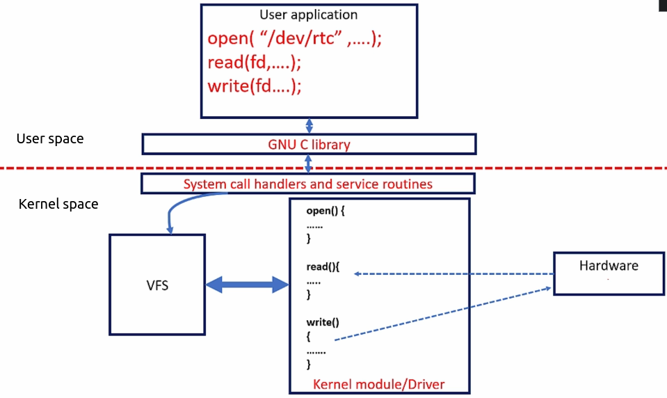

[Home](../../) | [Projects](../../projects) | [Notes](../) > <a href="./">Linux Device Drivers</a> > Exercise 1: Pseudo Character Driver (Single Device) - Requirements

# Exercise 1: Pseudo Character Driver (Single Device) - Requirements

## Requirements

* Write a character driver to deal with a pseudo character device
* The pseudo-device is a memory buffer of some size
* The driver you write must support reading, writing and seeking to this driver
* Test the driver functionality by running user-level command such as echo, dd, cat and by writing user level programs

## Connection Establishment between Device File Access and the Driver

1. Create device number
   * Request the kernel to dynamically allocate the device numbers(s)
2. Make a char device registration with the Virtual File System (VFS). (`CDEV_ADD`)
3. Create device files
4. Implement the driver's file operation methods for `open`, `close`, `read`, `write`, `llseek`, etc.

## Expected Outcome

* Do `make host` and see if you are getting `pcd.ko` from `pcd.c`.

* Insert the LKM (`sudo insmod pcd.ko`), run `dmesg` and see if the messages are getting printed.

* Check `/sys/class/` if you see `pcd_class/` which should be created by the **`class_create()`** kernel function.

  * `pcd_class/` directory should contain `pcd` (the same name as your LKM) directory
  * `pcd_class/pcd/` directory should contain `dev` file whose contents is the device number `<major:minor>`
  * `pcd_class/pcd/` directory should also contain `uevent` whose contents is major number, minor number and devname.

   `udev` creates the device file under `/dev` directory according to these details which are created and populated by the **`device_create()`** kernel function.

* Check `/dev/` if you see the device file `pcd`.

* Remove the LKM (`sudo rmmod pcd.ko`), run `dmesg` and see if the messages are getting printed.
