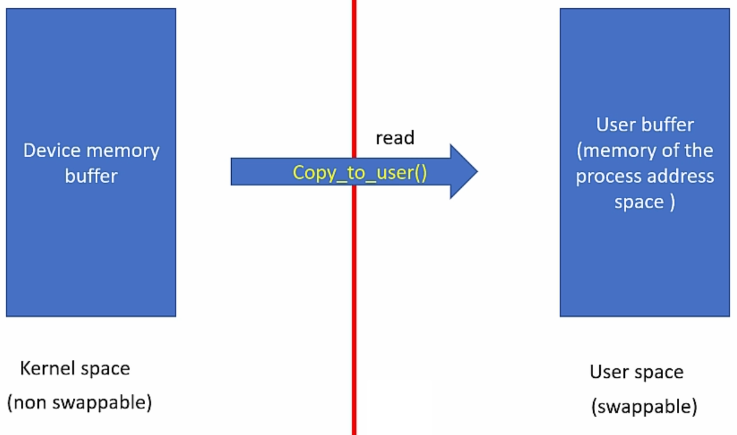
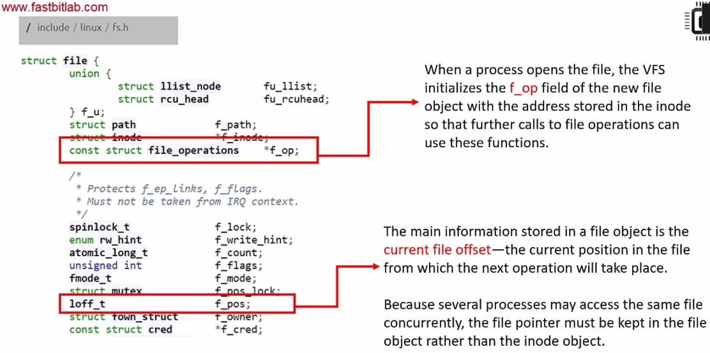
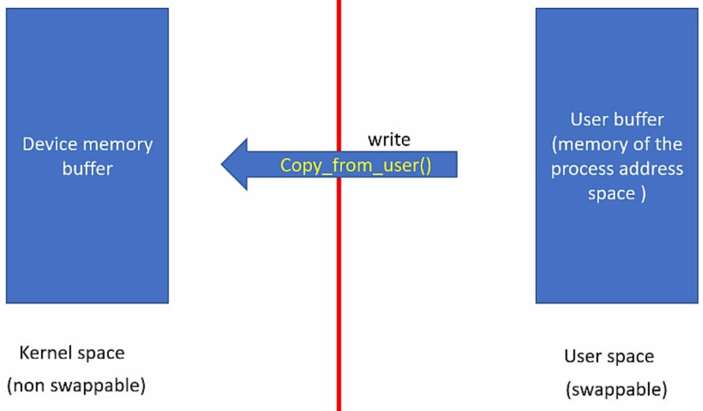

[Home](../../) | [Projects](../../projects) | [Notes](../) > <a href="./">Linux Device Drivers</a> > Exercise 1-2: Pseudo Character Driver (Single Device) - Implementation

# Exercise 1-2: Pseudo Character Driver (Single Device) - Implementation


## Pseduo Character Driver (PCD) File Operation Methods

### Open

* Initialize the device or make device respond to subsequent system calls such as `read()` and `write()`.

* Detect device initialization errors

* Check open permission (`O_RDONLY`, `O_WRONLY`, `O_RDWR`)

* Identify the opened device using the *minor number*

* Prepare device private data structure if required

* Update `f_pos` if required

* `open` method is optional. If not provided, `open` will always succeed and driver is not notified.

* Implementation:

  ```c
  /**
   * pcd_open()
   * Desc.    : Handles the open() system call from the user space
   * Param.   : @inode - pointer to inode object
   *            @filp - pointer to file object
   * Returns  : 0 on success, negative error code otherwise
   * Note     : N/A
   */
  int pcd_open(struct inode *inode, struct file *filp)
  {
      pr_info("open was successful\n");
      return 0;
  }
  ```

### Close (e.g., `close(fd)` system call from the user space)

* Does the reverse operations of open method. Simply put, release method should put the device in its default state, i.e., the state before the open method was called.

  e.g., If open method brings the device out of low power mode, then release method may send the device back to the low power mode.

* Free any data structures allocated by the open method.

* Returns 0 on success, negative error code otherwise (e.g., the device does not respond when you try to de-initialize the device).

* Implementation:

  ```c
  /**
   * pcd_release()
   * Desc.    : Handles the close() system call from the user space
   * Param.   : @inode - pointer to inode struct
   *            @filp - pointer to file struct
   * Returns  : 0 on success, negative error code otherwise
   * Note     : VFS releases the file object. Called when the last reference to an
   *            open file is closed (i.e., when the f_count field of the file object
   *            becomes 0.
   */
  int pcd_release(struct inode *inode, struct file *filp)
  {
      pr_info("close was successful\n");
      return 0;
  }
  ```

### Read (e.g., `read(fd, buff, 20)` system call from the user space)





* Read `count` bytes from a device starting at position `f_pos`.
* Update the `f_pos` by adding the number bytes successfully read.
* A return value less than `count` does not mean that an error has occurred.
* `f_op` and `f_pos`





* Data copying (kernel space $\to$ user space)

  ```c
  /**
   * copy_to_user()
   * Desc.	: Copies data from kernel space to user space (during read operation)
   * Param.	: @to - destination address in user space
   *			  @from - source address in kernel space
   *			  @n - number of bytes to copy
   * Returns 	: 0 on success, number of bytes that could not be copied otherwise
   * Notes	: It checks whether the user space pointer @to is valid or not. 
   *			  If the pointer is invalid, copy will not be performed. If an invalid address
   * 			  is encountered during the copy, only part of the data is copied. In either case,
   * 			  the return value is the amount of memory left to be copied.
   *			  If this function returns a non-zero value, you should assume that there was
   * 			  a problem during the data copy.
   */
  unsigned long copy_to_user(void __user *to, const void *from, unsigned long n);
  ```

  > If `copy_to_user()` returns a non-zero value, your read function should return an appropriate error code (-EFAULT).

* Implementation:

  1. Check the user requested `count` value against `DEV_MEM_SIZE` of the device.
     * If `f_pos` + `count` > `DEV_MEM_SIZE`, then adjust the `count` (`count` = `DEV_MEM_SIZE` - `f_pos`).
  2. Copy `count` number of bytes from device memory to user buffer.
  3. Update `f_pos`
  4. Return number of bytes successfully read or error code
  5. If `f_pos` is at EOF, then return 0.

  ```c
  /**
   * pcd_read()
   * Desc.    : Handles the read() system call from the user space
   * Param.   : @filp - pointer to file object
   *            @buff - pointer to user buffer
   *            @count - read count given by the user
   *            @f_pos - pointer to current file position from which the read has to begin
   * Returns  : The number of bytes read on success,
   *            0 if there is no bytes to read (EOF),
   *            appropriate error code (negative value) otherwise
   * Note     : Reads a device file @count byte(s) of data from @f_pos, returns the data back to
   *            @buff (user), and updates @f_pos.
   */
  ssize_t pcd_read(struct file *filp, char __user *buff, size_t count, loff_t *f_pos)
  {
      pr_info("Read requested for %zu bytes\n", count);
      pr_info("Current file position = %lld\n", *f_pos);
  
      /* Adjust the count */
      if ((*(f_pos) + count) > DEV_MEM_SIZE)
          count = DEV_MEM_SIZE - *f_pos;
  
      /* Copy to user buffer 
         Note: Global data access should be synchronized by using mutual exclusion to avoid
         race condition. */
      if (copy_to_user(buff, &device_buffer[*f_pos], count))
      {
          return -EFAULT;
      }
  
      /* Update the current file position f_pos */
      *f_pos += count;
  
      pr_info("%zu bytes successfully read\n", count);
      pr_info("Updated file position = %lld\n", *f_pos);
  
      /* Return the number of bytes successfully read */
      return count;
  }
  ```
  
  > `__user`
  >
  > * Optional macro that alerts the programmer that this is a user level pointer so cannot be trusted for direct dereferencing.
  > * A macro used with user level pointers which tells the developer not to trust or assume it as a valid pointer to avoid kernel faults.
  > * Never try to dereference user given pointers directly in kernel level programming. Instead, use dedicated kernel functions such as `copy_to_user` and `copy_from_user`.
  > * GCC doesn't care whether you use `__user` macro with user level pointer or not. This is checked by `sparse`, a semantic checker tool of Linux kernel to find possible coding faults.

### Write (e.g., `write(fd, buff, 20)`)





* Write `count` bytes into the device starting at position `f_pos`.

* Update the `f_pos` by adding the number of bytes successfully written

* Data copying (user space $\to$ kernel space)

  ```c
  /**
   * copy_from_user()
   * Desc.	: Copies data from user space to kernel space (during write operation)
   * Param.	: @to - destination address in user space
   *			  @from - source address in kernel space
   *			  @n - number of bytes to copy
   * Returns 	: 0 on success, number of bytes that could not be copied otherwise
   * Notes	: It checks whether the user space pointer @to is valid or not. 
   *			  If the pointer is invalid, copy will not be performed. If an invalid address
   * 			  is encountered during the copy, only part of the data is copied. In either case,
   * 			  the return value is the amount of memory left to be copied.
   *			  If this function returns a non-zero value, you should assume that there was
   * 			  a problem during the data copy.
   */
  unsigned long copy_from_user(void *to, const void __user *from, unsigned long n);
  ```

  > If `copy_from_user()` returns a non-zero value, your write function should return an appropriate error code (-EFAULT).

* Implementation:

  1. Check the user requested `count` value against `DEV_MEM_SIZE` of the device
     * If `f_pos` + `count` > `DEV_MEM_SIZE`, then adjust the `count` (`count` = `DEV_MEM_SIZE` - `f_pos`).
  2. Copy `count` number of bytes from user buffer to device memory
  3. Update `f_pos`
  4. Return the number of bytes successfully written or error code
  
  ```c
  /**
   * pcd_write()
   * Desc.    : Handles the write() system call from the user space
   * Param.   : @filp - pointer to file object
   *            @buff - pointer to user buffer
   *            @count - read count given by the user
   *            @f_pos - pointer to current file position from which the read has to begin
   * Returns  : The number of bytes written on success,
   *            appropriate error code (negative value) otherwise
   * Note     : Writes a device file @count byte(s) of data from @f_pos, returns the data back to
   *            @buff (user) and updates @f_pos.
   */
  ssize_t pcd_write(struct file *filp, const char __user *buff, size_t count, loff_t *f_pos)
  {
      pr_info("Write requested for %zu bytes\n", count);
      pr_info("Current file position = %lld\n", *f_pos);
  
      /* Adjust the count */
      if ((*(f_pos) + count) > DEV_MEM_SIZE)
          count = DEV_MEM_SIZE - *f_pos;
  
      if (!count)
      {
          pr_err("No more space left on the device\n");
          return -ENOMEM;
      }
  
      /* Copy from user buffer 
         Note: Global data access should be synchronized by using mutual exclusion to avoid
         race condition. */
      if (copy_from_user(&device_buffer[*f_pos], buff, count))
      {
          return -EFAULT;
      }
  
      /* Update the current file position f_pos */
      *f_pos += count;
  
      pr_info("%zu bytes successfully written\n", count);
      pr_info("Updated file position = %lld\n", *f_pos);
  
      /* Return the number of bytes successfully written */
      return count;
  }
  ```

### llseek (e.g., `llseek(fd, buff, 20)`)

* Used to alter the `f_pos`.

  * If `whence` = `SEEK_SET`, `filp->f_pos` = `off`

  * If `whence` = `SEEK_CUR`, `filp->f_pos` = `filp->f_pos + off`

  * If `whence` = `SEEK_END`, `filp->f_pos` = `DEV_MEM_SIZE + off`

* Implementation:

  ```c
  /**
   * pcd_lseek()
   * Desc.    : Handles the llseek() system call
   * Param.   : @filp - pointer to file object
   *            @offset - offset value
   *            @whence - origin
   *              - SEEK_SET: The file offset is set to @offset bytes
   *              - SEEK_CUR: The file offset is set to its current location plus @offset bytes
   *              - SEEK_END: The file offset is set to the size of the file plus @offset bytes
   * Returns  : Newly updated file position on sucess, error code other wise
   * Note     : Updates the file pointer by using @offset and @whence information.
   *            Allows the file offset to be set beyond the end of the file (but this does not
   *            change the size of the file).
   */
  loff_t pcd_lseek(struct file *filp, loff_t offset, int whence)
  {
      loff_t temp;
  
      pr_info("lseek requested\n");
      pr_info("Current file position = %lld\n", filp->f_pos);
  
      switch (whence)
      {   
          case SEEK_SET:
              if ((offset > DEV_MEM_SIZE) || (offset < 0)) 
                  return -EINVAL;
              filp->f_pos = offset;
              break;
          case SEEK_CUR:
              temp = filp->f_pos + offset;
              if ((temp > DEV_MEM_SIZE) || (temp < 0)) 
                  return -EINVAL;
              filp->f_pos = temp;
              break;
          case SEEK_END:
              temp = DEV_MEM_SIZE + offset;
              if ((temp > DEV_MEM_SIZE) || (temp < 0)) 
                  return -EINVAL;
              filp->f_pos = temp;
              break;
          default:
              return -EINVAL;
      }   
  
      pr_info("Updated file position = %lld\n", filp->f_pos);
      return filp->f_pos;
  }
  ```


## Pseudo Character Driver (Single Device) Implementation

```c
/**
 * Filename		: pcd.c
 * Description	: A pseudo character deriver
 * Author		: Kyungjae Lee
 * Created		: 05/19/2023
 * Updates		: 06/01/2023 - Complete file operation methods implementation
 *							 - Add error handling features
 */

#include <linux/module.h>
#include <linux/fs.h>
#include <linux/cdev.h>
#include <linux/device.h>	/* class_create(), device_create() */
#include <linux/kdev_t.h>	/* MAJOR(), MINOR() */
#include <linux/uaccess.h>

#define DEV_MEM_SIZE 512
#undef pr_fmt
#define pr_fmt(fmt) "%s :" fmt, __func__	/* For debugging purpose, prefix current function name in front of the string printed by pr_info()  */

/* Global variables */
char device_buffer[DEV_MEM_SIZE];	/* Pseudo character device's buffer */
dev_t device_number;				/* Stores the device number */
struct cdev pcd_cdev;				/* Cdev variable */

/**
 * Device driver specific file operation methods that handle system calls
 */

/**
 * pcd_lseek()
 * Desc.	: Handles the llseek() system call
 * Param.  	: @filp - pointer to file object
 *			  @offset - offset value
 *			  @whence - origin
 * 				- SEEK_SET: The file offset is set to @offset bytes
 *				- SEEK_CUR: The file offset is set to its current location plus @offset bytes
 * 				- SEEK_END: The file offset is set to the size of the file plus @offset bytes
 * Returns	: Newly updated file position on sucess, error code other wise
 * Note		: Updates the file pointer by using @offset and @whence information.
 *			  Allows the file offset to be set beyond the end of the file (but this does not
 *			  change the size of the file).
 */
loff_t pcd_lseek(struct file *filp, loff_t offset, int whence)
{
	loff_t temp;

	pr_info("lseek requested\n");
	pr_info("Current file position = %lld\n", filp->f_pos);

	switch (whence)
	{
		case SEEK_SET:
			if ((offset > DEV_MEM_SIZE) || (offset < 0))
				return -EINVAL;
			filp->f_pos = offset;
			break;
		case SEEK_CUR:
			temp = filp->f_pos + offset;
			if ((temp > DEV_MEM_SIZE) || (temp < 0))
				return -EINVAL;
			filp->f_pos = temp;
			break;
		case SEEK_END:
			temp = DEV_MEM_SIZE + offset;
			if ((temp > DEV_MEM_SIZE) || (temp < 0))
				return -EINVAL;
			filp->f_pos = temp;
			break;
		default:
			return -EINVAL;
	}

	pr_info("Updated file position = %lld\n", filp->f_pos);
	return filp->f_pos;
}

/**
 * pcd_read()
 * Desc.	: Handles the read() system call from the user space
 * Param.  	: @filp - pointer to file object
 *            @buff - pointer to user buffer
 *			  @count - read count given by the user
 *			  @f_pos - pointer to current file position from which the read has to begin
 * Returns	: The number of bytes read on success,
 *			  0 if there is no bytes to read (EOF),
 *			  appropriate error code (negative value) otherwise
 * Note		: Reads a device file @count byte(s) of data from @f_pos, returns the data back to
 *			  @buff (user), and updates @f_pos.
 */
ssize_t pcd_read(struct file *filp, char __user *buff, size_t count, loff_t *f_pos)
{
	pr_info("Read requested for %zu bytes\n", count);
	pr_info("Current file position = %lld\n", *f_pos);

	/* Adjust the count */
	if ((*(f_pos) + count) > DEV_MEM_SIZE)
		count = DEV_MEM_SIZE - *f_pos;

	/* Copy to user buffer 
	   Note: Global data access should be synchronized by using mutual exclusion to avoid
	   race condition. */
	if (copy_to_user(buff, &device_buffer[*f_pos], count))
	{
		return -EFAULT;
	}

	/* Update the current file position f_pos */
	*f_pos += count;

	pr_info("%zu bytes successfully read\n", count);
	pr_info("Updated file position = %lld\n", *f_pos);

	/* Return the number of bytes successfully read */
	return count;
}

/**
 * pcd_write()
 * Desc.	: Handles the write() system call from the user space
 * Param.  	: @filp - pointer to file object
 *            @buff - pointer to user buffer
 *			  @count - read count given by the user
 *			  @f_pos - pointer to current file position from which the read has to begin
 * Returns	: The number of bytes written on success,
 *			  appropriate error code (negative value) otherwise
 * Note		: Writes a device file @count byte(s) of data from @f_pos, returns the data back to
 *			  @buff (user) and updates @f_pos.
 */
ssize_t pcd_write(struct file *filp, const char __user *buff, size_t count, loff_t *f_pos)
{
	pr_info("Write requested for %zu bytes\n", count);
	pr_info("Current file position = %lld\n", *f_pos);

	/* Adjust the count */
	if ((*(f_pos) + count) > DEV_MEM_SIZE)
		count = DEV_MEM_SIZE - *f_pos;

	if (!count)
	{
		pr_err("No more space left on the device\n");
		return -ENOMEM;
	}

	/* Copy from user buffer 
	   Note: Global data access should be synchronized by using mutual exclusion to avoid
	   race condition. */
	if (copy_from_user(&device_buffer[*f_pos], buff, count))
	{
		return -EFAULT;
	}

	/* Update the current file position f_pos */
	*f_pos += count;

	pr_info("%zu bytes successfully written\n", count);
	pr_info("Updated file position = %lld\n", *f_pos);

	/* Return the number of bytes successfully written */
	return count;
}

/**
 * pcd_open()
 * Desc.	: Handles the open() system call from the user space
 * Param.	: @inode - pointer to inode object
 *			  @filp - pointer to file object
 * Returns	: 0 on success, negative error code otherwise
 * Note		: N/A
 */
int pcd_open(struct inode *inode, struct file *filp)
{
	pr_info("open was successful\n");

	return 0;
}

/**
 * pcd_release()
 * Desc.	: Handles the close() system call from the user space
 * Param.	: @inode - pointer to inode object
 *			  @filp - pointer to file object
 * Returns	: 0 on success, negative error code otherwise
 * Note		: VFS releases the file object. Called when the last reference to an
 *			  open file is closed (i.e., when the f_count field of the file object
 *			  becomes 0.
 */
int pcd_release(struct inode *inode, struct file *filp)
{
	pr_info("release was successful\n");

	return 0;
}

/* File operations of the driver */
struct file_operations pcd_fops = {	
	/* This struct member init method is supported from C99 on */
	.open = pcd_open,
	.write = pcd_write,
	.read = pcd_read,
	.llseek = pcd_lseek,
	.release = pcd_release,
	.owner = THIS_MODULE
};

struct class *class_pcd;
struct device *device_pcd;

/* Module initialization entry point */
static int __init pcd_driver_init(void)
{
	int ret;

	/* 1. Dynamically allocate a device number */
	ret = alloc_chrdev_region(&device_number, 0, 1, "pcd_devices");	/* fs/char_dev.c */
	/* Handle error */
	if (ret < 0)
	{
		pr_err("Device number allocation (alloc_chrdev_region) failed\n");
		goto err_alloc_chrdev_region;
	}

	pr_info("Device number <major>:<minor> = %d:%d\n",MAJOR(device_number), MINOR(device_number));
		/* Print the function name for debugging purpose */

	/* 2. Initialize the cdev structure with fops */
	cdev_init(&pcd_cdev, &pcd_fops);

	/* 3. Register a device (cdev structure) with VFS */
	pcd_cdev.owner = THIS_MODULE;
	ret = cdev_add(&pcd_cdev, device_number, 1);	/* Register one device */
	/* Handle error */
	if (ret < 0)
	{
		pr_err("Device registration (cdev_add) failed\n");
		goto err_cdev_add;
	}

	/* 4. Create device class under /sys/class/ */
	class_pcd = class_create(THIS_MODULE, "pcd_class");	/* Returns a pointer to class struct */
	if (IS_ERR(class_pcd))
	{
		pr_err("Class creation (class_create) failed\n");
		ret = PTR_ERR(class_pcd);
			/* PTR_ERR() converts pointer to error code (int)
			   ERR_PTR() converts error code (int) to pointer */
	 	goto err_class_create;
	}

	/* 5. Populate the sysfs with device information */
	device_pcd = device_create(class_pcd, NULL, device_number, NULL, "pcd");
		/* Second arg is NULL since there's no hierarchy at this point */
		/* "pdc" will appear under /dev/ */
	if (IS_ERR(device_pcd))
	{
		pr_err("Device creation (device_create) failed\n");
		ret = PTR_ERR(device_pcd);
		goto err_device_create;
	}

	pr_info("Module init was successful\n");

	return 0;

/* Handle when device_create() function fails */
err_device_create:
	class_destroy(class_pcd);

/* Handle when class_create() function fails */
err_class_create:
	cdev_del(&pcd_cdev);

/* Handle when cdev_add() function fails */
err_cdev_add:
	unregister_chrdev_region(device_number, 1);

/* Handle when alloc_chrdev_region() function fails */
err_alloc_chrdev_region:
	pr_info("Module insertion failed\n");
	return ret;	/* returns the error code */
}

/* Module cleanup entry point */
static void __exit pcd_driver_cleanup(void)
{
	device_destroy(class_pcd, device_number);
	class_destroy(class_pcd);
	cdev_del(&pcd_cdev);
	unregister_chrdev_region(device_number, 1);
	pr_info("module unloaded\n");
}

/* Registration */
module_init(pcd_driver_init);
module_exit(pcd_driver_cleanup);

/* Module description */
MODULE_LICENSE("GPL");  /* This module adheres to the GPL licensing */
MODULE_AUTHOR("Kyungjae Lee");
MODULE_DESCRIPTION("A pseudo character driver");
MODULE_INFO(board, "BeagleBone Black REV A5");
```
