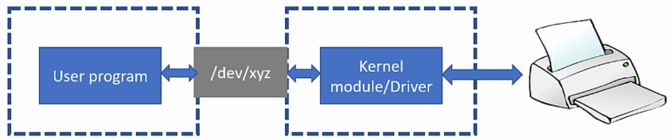
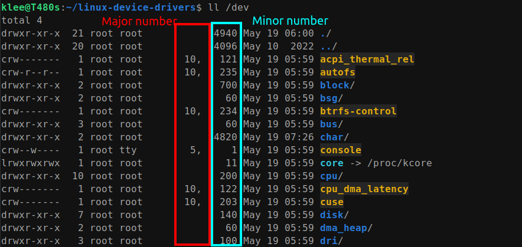

[Home](../../) | [Projects](../../projects) | [Notes](../) > <a href="./">Linux Device Drivers</a> > Introduction to Linux Device Driver

# Introduction to Linux Device Driver


## Linux Device Driver

### Overview

* Linux device drivers are software components that enable the Linux operating system to communicate with and control specific hardware devices. Device drivers also expose interfaces to the user applications so that those applications can interact with the hardware device.
* They act as a bridge between the hardware and the operating system, providing a standardized interface for applications and the kernel to interact with the device.
* Device drivers are typically written as kernel modules, which are loadable pieces of code that extend the functionality of the Linux kernel.
* They abstract away the low-level details of the hardware, allowing applications to access the device's functionality without needing to know the specific implementation details.
* Linux device drivers are essential for supporting a wide range of hardware devices, such as network adapters, sound cards, graphic cards, storage devices, and input devices.
* Writing a Linux device driver requires knowledge of the Linux kernel internals, device-specific protocols, and programming in C or another supported language.

### Types of Linux Device Drivers

* Character device drivers (Char device - RTC, keyboard, sensors, etc.)
* Block device drivers (Storage devices - SDMMC, EEPROM, Flash, hard disk)
* Network device drivers (Network devices - Ethernet, wifi, bluetooth)

### Device files

* Devices are handled as a file in a UNIX/Linux systems.

* A device file is a special file or a node which gets populated in `/dev` directory during the kernel boot-time or device/driver hot plug events.

* By using a device file, a user application can communicate with a driver.

* Device files are managed as part of VFS subsystem of the kernel.

* Device driver should trigger the creation of device file.

  

  

  

### Device Number (Major Number, Minor Number)

* The device number is a combination of **major** and **minor** numbers.

  * Major number - Identifies the device driver or device driver class that the device belongs to.
  * Minor number - Distinguishes individual devices (i.e., device instances) within a driver class or specifies different functionalities of the same device driver.

  Device driver will use the "minor number" to distinguish on which device file the read/write operations have been issued.

  

  

  

* In Linux kernel, `dev_t` (typedef of `u32`) type is used to represent the device number.

* Out of 32 bits, 12 bits are to store major number, and the remaining 20 bits are to store minor number.

* You can use the following macros to extract major and minor parts of `dev_t` type variable `device_number`:

  ```c
  int minor_no = MINOR(device_number);
  int major_no = MAJOR(device_number);
  ```

  > `MINOR()`, `MAJOR()` macros are defined in `include/linux/kdev_t.h`.

* Also, major and minor numbers can be turned into `device_number`:

  ```c
  MKDEV(int major, int minor);
  ```
