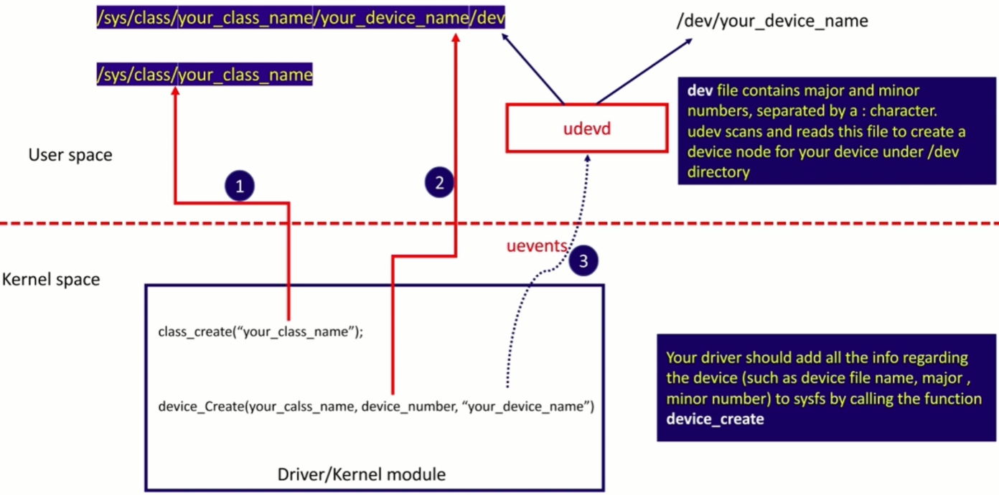

[Home](../../) | [Projects](../../projects) | [Notes](../) > <a href="./">Linux Device Drivers</a> > Kernel APIs Used in Device Drivers

# Kernel APIs Used in Device Drivers


## Kernel APIs Overview

* **Creation**

  ```c
  /* 1. Dynamically Register a Range of Char Device Numbers */
  alloc_chrdev_region();
  
  /* 2. Create and Register Char Device to VFS */
  cdev_init();
  cdev_add();
  
  /* 3. Create device files */
  class_create();
  class_destroy();
  ```

  > When a module is loaded, these creation services must be executed and the driver must be ready to accept system calls from the user space program. So, it would make sense for this part to be taken care of by the **module initialization function**.

* **Deletion**

  Deletion process is the reverse of that of the creations.

  ```c
  /* 1. Delete device files */
  class_destroy();
  device_destory();
  
  /* 2. Delete the registration */
  cdev_del();
  
  /* 3. Delete device number */
  unregister_chrdev_region();
  ```

  > Taken care of by the **module cleanup function**.

### Kernel Functions and Header Files

| Kernel functions and data structures                         | Kernel header file      |
| ------------------------------------------------------------ | ----------------------- |
| alloc_chrdev_region()<br />unregister_chardev_region()       | include/linux/fs.h      |
| cdev_init()<br />cdev_add()<br />cdev_del()                  | include/linux/cdev.h    |
| device_create()<br />class_create()<br />device_destroy()<br />class_destroy() | include/linux/device.h  |
| copy_to_user()<br />copty_from_user()                        | include/linux/uaccess.h |
| VFS structure definitions                                    | include/linux/fs.h      |


## Kernel APIs in Detail (Creation)

### 1. Dynamically Register a Range of Char Device Numbers

* `alloc_chrdev_region()`

  ```c
  /* fs/char_dev.c */
  
  /**
   * alloc_chrdev_region() - register a range of char device numbers
   * @dev: output parameter for first assigned number
   * @baseminor: first of the requested range of minor numbers
   * @count: the number of minor numbers required
   * @name: the name of the associated device or driver
   *
   * Allocates a range of char device numbers.  The major number will be chosen dynamically, 
   * and returned (along with the first minor number) in @dev. Returns zero or a negative error code.
   */
  int alloc_chrdev_region(dev_t *dev, unsigned baseminor, unsigned count, const char *name)
  {
      struct char_device_struct *cd;
      cd = __register_chrdev_region(0, baseminor, count, name);
      if (IS_ERR(cd))
          return PTR_ERR(cd);
      *dev = MKDEV(cd->major, cd->baseminor);
      return 0;
  }
  ```

  > `baseminor` is typically 0.
  >
  > `name` is NOT the device file name. It is a pointer to a string that represents the name or identifier of  the character device region being allocated. This name is typically used for identification or debugging purposes and is not directly related to the functionality of the device.

  Usage:

  ```c
  /* Device number creation */
  dev_t device_number;
  alloc_chardev_region(&device_number, 0, 7, "eeprom");
  ```

  > Again! `eeprom` here is not the name of a device file. It is just an identifier that indicates the range of device numbers.

  

  

  

### 2. Create and Register Char Device to VFS

* `cdev_init()` - Initialize a `cdev` structure

  ```c
  /* fs/char_dev.c */
  
  /**
   * cdev_init() - initialize a cdev structure
   * @cdev: the structure to initialize
   * @fops: the file_operations for this device
   *
   * Initializes @cdev, remembering @fops, making it ready to add to the
   * system with cdev_add().
   */
  void cdev_init(struct cdev *cdev, const struct file_operations *fops)
  {
      memset(cdev, 0, sizeof *cdev);
      INIT_LIST_HEAD(&cdev->list);
      kobject_init(&cdev->kobj, &ktype_cdev_default);
      cdev->ops = fops;
  }
  ```

  > `cdev` structure is defined in `include/linux/cdev.h`:
  >
  > ```c
  > struct cdev {
  >  struct kobject kobj;
  >  struct module *owner;
  >  const struct file_operations *ops;
  >  struct list_head list;
  >  dev_t dev;
  >  unsigned int count;
  > } __randomize_layout;
  > ```
  >
  > > `ownder` - A pointer to the module that owns this structure; it should usually be initialized to `THIS_MODULE`. This field is used to prevent the module from being unloaded while the structure is in use. (`THIS_MODULE` is essentially a pointer and is defined in `linux/export.h` as `#define THIS_MODULE (&__this_module)`.)
  > >
  > > `ops` - A pointer to `file_operations` structure of the driver.

  Usage:

  ```c
  /* Initialize file ops structure with driver's system call implementation methods */
  struct file_operations eeprom_fops;
  struct cdev eeprom_cdev;
  cedv_init(&eeprom_cdev, &eeprom_fops);
  ```

  > If you are dealing with 10 devices, then you may have to create 10 `cdev` structures.

* `cdev_add()` - Add a char device to the kernel VFS

  ```c
  /* fs/char_dev.c */
  
  /**
   * cdev_add() - add a char device to the system
   * @p: the cdev structure for the device
   * @dev: the first device number for which this device is responsible
   * @count: the number of consecutive minor numbers corresponding to this
   *         device
   *
   * cdev_add() adds the device represented by @p to the system, making it
   * live immediately.  A negative error code is returned on failure.
   */
  int cdev_add(struct cdev *p, dev_t dev, unsigned count)
  {
      int error;
  
      p->dev = dev;
      p->count = count;
  
      error = kobj_map(cdev_map, dev, count, NULL,
               exact_match, exact_lock, p);
      if (error)
          return error;
  
      kobject_get(p->kobj.parent);
  
      return 0;
  }
  ```

### 3. Create Device Files

* Dynamic device file creation in Linux

  * Behind the scenes
    * In Linux, you can create a device file dynamically (on demand), i.e., you don't need to manually create device files under `/dev` directory to access your hardware.

    * User-level program such as `udevd` can populate `/dev` directory with device files dynamically. (`udevd` is a user level daemon which runs in the background and scans for `uevents` generated by the kernel. By analyzing the `uevents`,  `udevd` populates `/dev` directory with device files.)

    * `udev` program listens to the `uevents` generated by hot plug events or kernel modules. When `udev` receives the `uevents`, it scans the subdirectories of `/sys/class` looking for the `dev` files to create device files.

    * For each such `dev` file, which represents a combination of major and minor number for a device, the `udev` program creates a corresponding device in `/dev` directory.

    * `udev`
      * Relies on device information exported to user space through `sysfs`.
      * `uevents` are generated when device driver uses kernel APIs to trigger the dynamic creation of device files or when a hot pluggable device such as a USB peripheral is plugged into the system.
    * All a device driver needs to do, for `udev` to work properly with it, is to ensure that any major and minor numbers assigned to a device controlled by the driver are exported to user space through `sysfs`.

    * The driver exports all the information regarding the device such as device file name, major, minor number to `sysfs` by calling the function `device_create`.

    * `udev` looks for a file called `dev` in the `/sys/class/` tree of `sysfs`, to determine what the major and minor number is assigned to a specific device.

* `class_create()`

  ```c
  /* drivers/base/class.c */
  
  /**
   * class_create - create a struct class structure
   * @owner: pointer to the module that is to "own" this struct class
   * @name: pointer to a string for the name of this class.
   * @key: the lock_class_key for this class; used by mutex lock debugging
   *
   * This is used to create a struct class pointer that can then be used
   * in calls to device_create().
   *
   * Returns &struct class pointer on success, or ERR_PTR() on error.
   *
   * Note, the pointer created here is to be destroyed when finished by
   * making a call to class_destroy().
   */
  struct class *__class_create(struct module *owner, const char *name, struct lock_class_key *key)
  {
      struct class *cls;
      int retval;
  
      cls = kzalloc(sizeof(*cls), GFP_KERNEL);
      if (!cls) {
          retval = -ENOMEM;
          goto error;
      }   
  
      cls->name = name;
      cls->owner = owner;
      cls->class_release = class_create_release;
  
      retval = __class_register(cls, key);
      if (retval)
          goto error;
  
      return cls;
  
  error:
      kfree(cls);
      return ERR_PTR(retval);
  }
  EXPORT_SYMBOL_GPL(__class_create);
  ```

  Usage:

  ```c
  struct class *eeprom_class;
  eeprom_class = class_create(THIS_MODULE, "eeprom_class");
  ```

* `device_create()`

  ```c
  /* drivers/base/core.c */
  
  /**
   * device_create - creates a device and registers it with sysfs
   * @class: pointer to the struct class that this device should be registered to
   * @parent: pointer to the parent struct device of this new device, if any
   * @devt: the dev_t for the char device to be added
   * @drvdata: the data to be added to the device for callbacks
   * @fmt: string for the device's name
   *
   * This function can be used by char device classes.  A struct device
   * will be created in sysfs, registered to the specified class.
   *
   * A "dev" file will be created, showing the dev_t for the device, if
   * the dev_t is not 0,0.
   * If a pointer to a parent struct device is passed in, the newly created
   * struct device will be a child of that device in sysfs.
   * The pointer to the struct device will be returned from the call.
   * Any further sysfs files that might be required can be created using this
   * pointer.
   *
   * Returns &struct device pointer on success, or ERR_PTR() on error.
   *
   * Note: the struct class passed to this function must have previously
   * been created with a call to class_create().
   */
  struct device *device_create(struct class *class, struct device *parent,
                   dev_t devt, void *drvdata, const char *fmt, ...) 
  {
      va_list vargs;
      struct device *dev;
  
      va_start(vargs, fmt);
      dev = device_create_vargs(class, parent, devt, drvdata, fmt, vargs);
      va_end(vargs);
      return dev; 
  }
  EXPORT_SYMBOL_GPL(device_create);
  ```

  

  

  


## Kernel APIs in Detail (Deletion)

### 1. Remove Device

* `device_destroy()`

  ```c
  /* drivers/base/core.c */
  
  /**
   * device_destroy - removes a device that was created with device_create()
   * @class: pointer to the struct class that this device was registered with
   * @devt: the dev_t of the device that was previously registered
   *
   * This call unregisters and cleans up a device that was created with a
   * call to device_create().
   */
  void device_destroy(struct class *class, dev_t devt)
  {
      struct device *dev;
  
      dev = class_find_device(class, NULL, &devt, __match_devt);
      if (dev) {
          put_device(dev);
          device_unregister(dev);
      }
  }
  EXPORT_SYMBOL_GPL(device_destroy);
  ```

* `class_destroy()`

  ```c
  /* drivers/base/class.c */
  
  /**
   * class_destroy - destroys a struct class structure
   * @cls: pointer to the struct class that is to be destroyed
   *
   * Note, the pointer to be destroyed must have been created with a call
   * to class_create().
   */
  void class_destroy(struct class *cls)
  {
      if ((cls == NULL) || (IS_ERR(cls)))
          return;
  
      class_unregister(cls);
  }
  ```

### 2. Remove `cdev` Registration from the Kernel VFS

* `cdev_del()`

  ```c
  /* fs/char_dev.c */
  
  /**
   * cdev_del() - remove a cdev from the system
   * @p: the cdev structure to be removed
   *
   * cdev_del() removes @p from the system, possibly freeing the structure
   * itself.
   *
   * NOTE: This guarantees that cdev device will no longer be able to be
   * opened, however any cdevs already open will remain and their fops will
   * still be callable even after cdev_del returns.
   */
  void cdev_del(struct cdev *p) 
  {
      cdev_unmap(p->dev, p->count);
      kobject_put(&p->kobj);
  }
  ```

### 3. Unregister Device Numbers

* `unregister_chrdev_region()`

  ```c
  /* fs/char_dev.c */
  
  /**
   * unregister_chrdev_region() - unregister a range of device numbers
   * @from: the first in the range of numbers to unregister
   * @count: the number of device numbers to unregister
   *
   * This function will unregister a range of @count device numbers,
   * starting with @from.  The caller should normally be the one who
   * allocated those numbers in the first place...
   */
  void unregister_chrdev_region(dev_t from, unsigned count)
  {
      dev_t to = from + count;
      dev_t n, next;
  
      for (n = from; n < to; n = next) {
          next = MKDEV(MAJOR(n)+1, 0);
          if (next > to)
              next = to;
          kfree(__unregister_chrdev_region(MAJOR(n), MINOR(n), next - n));
      }
  }
  ```
