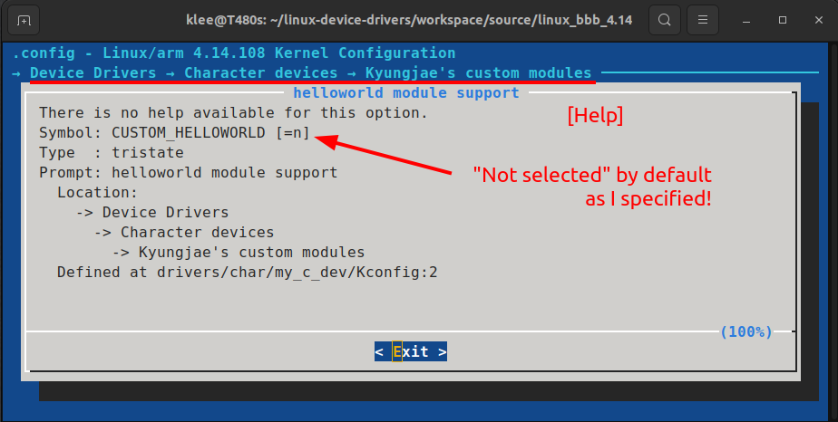

[Home](../../) | [Projects](../../projects) | [Notes](../) > <a href="./">Linux Device Drivers</a> > Linux Kernel Module Build - In-Tree Module

# Linux Kernel Module Build - In-Tree Module


## Building an In-tree Module

* Add the LKM inside the Linux kernel source tree and let the Linux build system build it.
* To list your kernel module selection in kernel menuconfig, create and use a `Kconfig` file.


## Steps to Add In-Tree Module to Kernel Menu Configuration

1. Create a directory in `linux_bbb_4.14/drivers/char/my_c_dev/`

2. Copy `main.c`

3. Create `Kconfig` file and add the following entries:

   ```plain
   menu "Kyungjae's custom modules"
   	config CUSTOM_HELLOWORLD
   		tristate "helloworld module support"
   		default n
   endmenu
   ```

   > `CUSTOM_HELLOWORLD` is an identifier by which the kernel identifies your custom module.
   >
   > User custom module can be selected or unselected. If selected, it can be either static module or dynamic module.
   >
   > Each kernel module has 3 states; `y`, `m`, `n`. You can specify it by using the `tristate` and `default ` keyword. 
   >
   > * `n` - Unselected by default
   > * `y` - Select by default

4. Add the local `Kconfig` entry to upper-level `Kconfig`:

   Go one level up (i.e., `linux_bbb_4.14/drivers/char/`), open `Kconfig` and add the following line at the end:

   ```plain
   source "drivers/char/my_c_dev/Kconfig"
   ```

5. Create a local Makefile in `linux_bbb_4.14/drivers/char/my_c_dev/`.

6. Add `obj-<config_item> += <module>.o` to the local Makefile

   > `config_item` - The custom module identifier (e.g., `CUSTOM_HELLOWORLD`)

   ```plain
   obj-$(CONFIG_CUSTOM_HELLOWORLD) += main.o
   ```

   > Since the state of this module will be selected via menu, we cannot specify it at the time of writing the Makefile.
   >
   > `$(CONFIG_CUSTOM_HELLOWORLD)` will be replaced by the selected state.

7. Add the local level Makefile to higher level Makefile:

   Go one level up (i.e., `linux_bbb_4.14/drivers/char/`), open the Makefile and add the following line at the end:

   ```makefile
   obj-y += my_c_dev/
   ```

   > This is how you direct the higher-level Makefile to run another Makefile.
   >
   > `-y` since you want `my_c_dev` directory always selected.

8. Run the Kernel Configuration:

   ```plain
   make ARCH=arm menuconfig
   ```

   Select `M` for `helloworld module support` and exit saving your new configuration!

   

   

   

   

   

9. Open the updated `linux_bbb_4.14/.config` file and search for `CONFIG_CUSTOM_HELLOWORLD`.

   If it is there, it means that your custom module is now part of the kernel source tree.

   

   

   

10. Build the kernel modules!

    In the Linux kernel source directory `linux_bbb_4.14/` run:

    ```plain
    make ARCH=arm CROSS_COMPILE=arm-linux-gnueabihf- modules -j4
    ```

    > You'll be able to see `main.ko` generated.

11. Check the module info and see if the built module is marked as "intree":

    Go to `linux_bbb_4.14/drivers/char/my_c_dev` and run:

    ```plain
    modinfo main.ko
    ```

    Then, you'll see the `intree:` field is marked `Y`.

[!] Reference: https://www.kernel.org/doc/Documentation/kbuild/kconfig-language.txt
