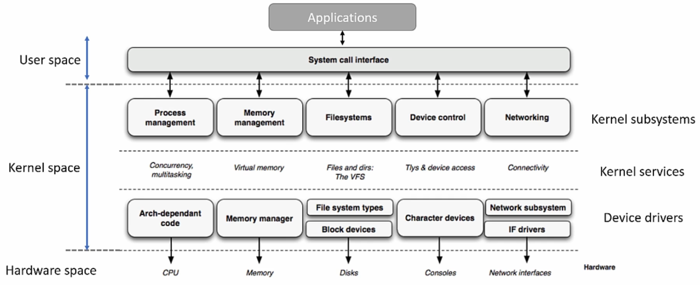
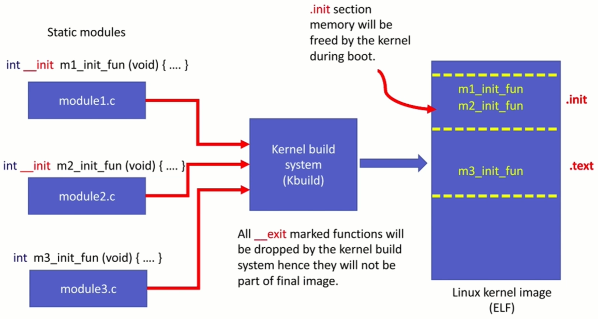

[Home](../../) | [Projects](../../projects) | [Notes](../) > <a href="./">Linux Device Drivers</a> > Linux Kernel Module (LKM)

# Linux Kernel Module (LKM)


## Linux Kernel Module

* Objectives:
  * Write a simple hello world kernel module
  * Compile the kernel module using `kbuild`
  * Transfer a kernel module to BBB board, load and unload

### Linux Kernel Module (LKM)

* Linux supports dynamic insertion and removal of code from the kernel while the system is up and running. The code we add and remove at run-time is called a **kernel module**. (In other words, a LKM is like a plug-in to the running Linux kernel.)
* Once the LKM is loaded into the LInux kernel, you can start using new features and functionalities exposed by the kernel module without even restarting the device.
* LKM dynamically extends the functionality of the kernel by introducing new features to the kernel such as security, device drivers, file system drivers, system calls etc. (modular approach)
* Support for LKM allows your embedded Linux systems to have only minimal base kernel image (less run-time storage) and optional device drivers and other features are supplied on demand via module insertion.
* Example: when a hot-pluggable new device (e.g., USB drive) is inserted, the device driver (i.e., LKM) gets loaded automatically to the kernel.

### Static & Dynamic LKMs

* When building the kernel, modules can be directly linked into the kernel (i.e., static), or built as independent modules that can be loaded/unloaded into/from the kernel at run-time (i.e., dynamic).

  * **Static (y)**

    When you build a Linux kernel, you can make your module statically linked to the kernel image (module becomes part of the final Linux kernel image). This method increases the size of the final Linux kernel image. Since the module is "built-int" into the Linux kernel image, you cannot "unload" the module. It occupies the memory permanently during run-time.

    Increases the size of the Linux kernel image.

  * **Dynamic (m)**

    When you build a Linux kernel, these modules are NOT built into the final kernel image, and rather they are compiled and linked separately to produce `.ko` files. You can dynamically load and unload these modules from the kernel using user space programs such as `insmod`, `modprobe`, and `rmmod`.


## User Space vs. Kernel Space

* User space (Restricted mode) - User-level programs
* Kernel space (Privileged mode) - Kernel-level code (e.g., Linux kernel, subsystems and LKMs)





 

## Linux Kernel Module (LKM) Structure

* Since LKMs are the code running in kernel space, there are certain rules to follow when writing one.
* Sections of an LKM:
  * Header
  * Code
  * Registration
  * Module description

### Header

* This section lists the header files to include.

  ```c
  /*****************************************************************************************
   * INCLUDE (Inclusion of the necessary header files)
   ****************************************************************************************/
  #include <linux/module.h>
  ```

  > Every kernel module must include the header file `linux/module.h`. It provides various macros for writing kernel modules.

* All the kernel header files can be found in the kernel source tree `LINUX_SRC/include/linux`.

* Kernel header vs. User-space header

  * Since kernel modules are to be executed in the kernel space, kernel headers must be used. Do NOT include any user-space library headers like C standard library header files (e.g., `stdio.h`).
  * No user-space library is linked to the kernel module.
  * Most of the relevant kernel headers can be found in `linux_source_bse/include/linux/`.

### Code

* This section implements what the kernel module should do.

* Code section contains 2 entry points:

  * **Module initialization function (or entry point)**

    * Prototype: `int fun_name(void);`

    * Must return a value: 

      * 0 on success

      * Non-zero on module initialization failure where the module will not get loaded in the kernel.

    * This is an entry point to your module.

      * In the case of static modules, this function will get called during the boot-time.

      * In the case of dynamic modules, this function will get called during the module insertion time.

    * There must be one module initialization entry point in every kernel module.

    * What it typically does:

      * Initialization of devices
      * Initialization data structures private to devices
      * Requesting memory dynamically for various kernel data structures and services
      * Request for allocation of major-minor numbers
      * Device file creation

    * The module initialization function is module-specific and should never be called from other modules of the kernel. It should not provide any services or functionalities which may be requested by other modules. Hence, it makes sense to make this function private using `static` though it is optional to do so.

  * **Module clean-up function (or entry point)**

    * Prototype: `int fun_name(void);`
    * This is an entry point when the module gets removed
    * Since a static module cannot be removed at run-time, clean-up function will get called only in the case of a dynamic module when it gets removed by using the user space command such as `rmmod`.
    * If you write a module and you are sure that it will always be statically linked to the kernel, then it is not necessary to implement this function.
    * Even if your static module has a clean-up function, the kernel build system will remove it during the build process if there is an `__exit` marker.
    * What it typically does:
      * In general, it is the reverse operation of the module initialization function; undoing init function.
      * Free the memory requested by the init function
      * De-init the device or leave the device in the "proper state"

* Example:

  ```c
  /*****************************************************************************************
   * CODE (Implementation of what the module does)
   ****************************************************************************************/
  
  /* Module initialization entry point */
  static int __init helloworld_init(void)
  {
      /* Kernel's printf */
      pr_info("Hello world!\n");
          /* 'pr_info()' is a wrapper function for 'printk()'. */
  
      return 0;
          /* Module load will be successful only when the module init entry
             point function returns 0. If it returns non-zero value for any reason,
             loading the module will be unsuccessful. */
  }
  
  /* Module clean-up entry point */
  static void __exit helloworld_exit(void)
  {
      pr_info("Good bye world!\n");
  }
  ```

* Function section attributes:

  * **`__init`**

    ```c
    #define __init			__section(.init.text)
    #define __initdata		__section(.init.data)
    #define __initconst		__section(.init.rodata)
    ```

    > `__section(.init.xxx)` - Compiler directives, which direct the compiler to keep data or code in the output section `.init`.

    * `__init` and `__exit` makes sense only for static modules (built-in modules)
    * `__init` is a macro which will be translated into a compiler directive, which instructs the compiler to put the code in `.init` section of the final ELF of the Linux kernel image.
    * `.init` section will be freed from memory by the kernel during boot-time once all the initialization functions get executed.
    * Since the built-in driver cannot be unloaded, its init function will not be called again until the next reboot. This means that it's not necessary to keep references to the init function after its execution. So, using the `__init` macro is a technique, when used with a function, to make the kernel free the code memory of that function after its execution.
    * Similarly, you can use `__initdata` with variables that will be dropped after the initialization. `__initdata` works similar to `__init` but it works for init "variables" rather than functions. 

  * **`__exit`**

    ```c
    #define __exit			__section(.exit.text)
    ```

    > `__section(.exit.xxx)` - Compiler directives, which direct the compiler to keep data or code in the output section `.exit`.

    * For the built-in modules, clean-up function is not required. So, when the `__exit` macro is used with a clean-up function, the kernel build system will exclude the function during the build process.





### Registration

* Module entry point registration example:

  ```c
  /*****************************************************************************************
   * REGISTRATION (Registration of entry points with kernel)
   ****************************************************************************************/
  module_init(helloworld_init);
  module_init(helloworld_exit);
  ```

  > These are the macros used to register the module's init and clean-up functions with the kernel.
  >
  > Here, `module_init`/`module_exit` are NOT functions, but are macros defined in `linux/module.h`.
  >
  > * `module_init()` macro will add its argument to the init entry point database of the kernel.
  > * `module_exit()` macro will add its argument to exit entry point database of the kernel.

### Module Description

* Module description example:

  ```c
  /*****************************************************************************************
   * MODULE DESCRIPTION (Descriptive information about the module)
   ****************************************************************************************/
  MODULE_LICENSE("GPL");  /* This module adheres to the GPL licensing */
  MODULE_AUTHOR("Kyungjae Lee");
  MODULE_DESCRIPTION("A simple kernel module to pring Hello World");
  MODULE_INFO(board, "BeagleBone Black REV A5");
  ```

  > `MODULE_LICENSE` is a macro used by the kernel module to announce its license type. If you load a module whose license parameter is a non-GPL(General Public License), then the kernel triggers warning of being tainted. This is the way of the kernel letting the users and developers know it's a non-free license based module.
  >
  > The developer community may ignore the but reports you submitted after loading the proprietary-licensed module.
  >
  > The declared module license is also used to decide whether a given module can have access to the small number of "GPL-only" symbols in the kernel.
  >
  > Go to `include/linux/module.h` to find out what are the allowed parameters which can be used with this macro to load the module without tainting the kernel.
  >
  > You can see the module information by running the following command on the `.ko` file:
  >
  > ```plain
  > arm-linux-gnueabihf-objdump -d -j .modinfo helloworld.ko
  > ```

