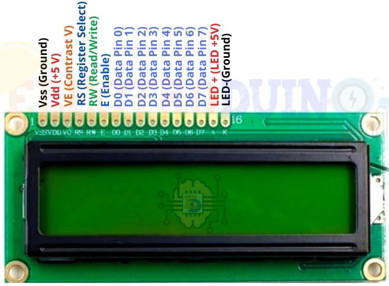
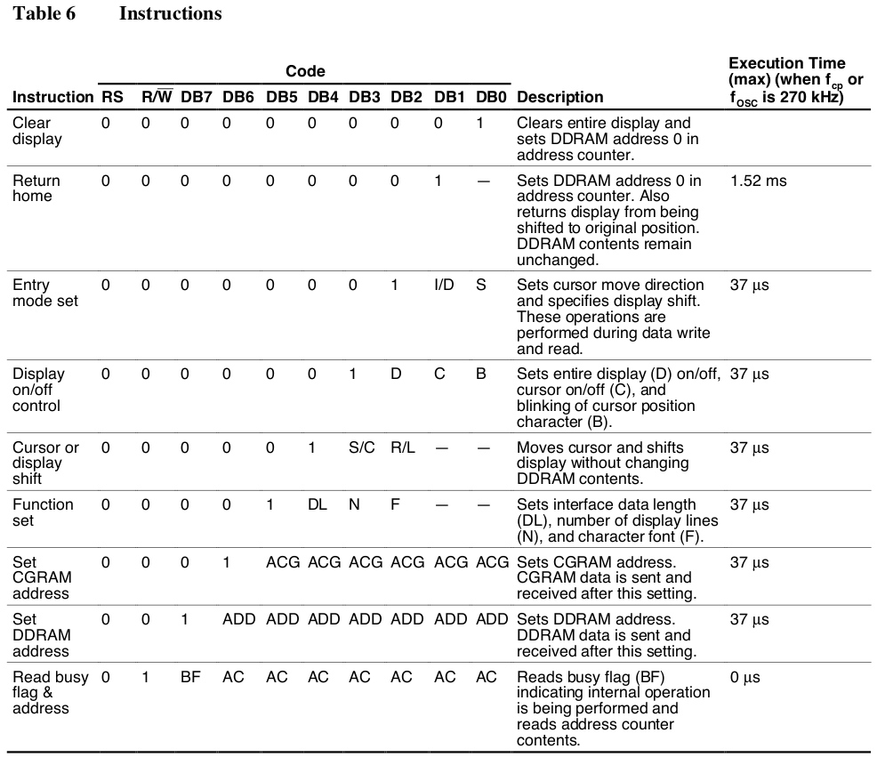
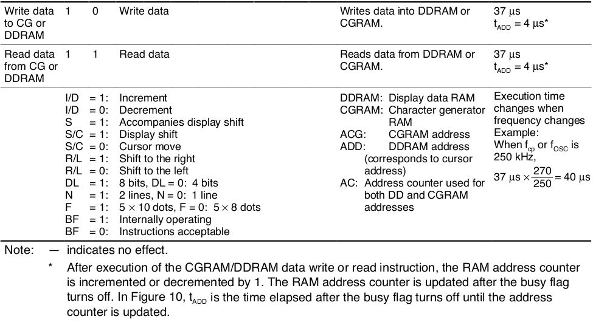

[Home](../../) | [Projects](../../projects) | [Notes](../) > <a href="./">MCU Peripheral Drivers</a> > 16x2 Character LCD (HD44780U)

# 16x2 Character LCD (HD44780U)

This notes contains only a small portion of 16x2 Character LCD specification. For more information, check the data sheet for the 16x2 Character LCD (HD44780U). 

## 16x2 Character LCD (HD44780U)

* Image reference: https://www.electroduino.com/16x2-lcd-display-module-how-its-works/

## LCD Instructions

* Send Instructions to initialize and control the operation of the LCD
* Instructions are 8-bit long (i.e., 1 byte)

* Various LCD Instructions:
  * Function set
  * Display on/off, cursor on/off and blink control
  * Entry mode set
  * LCD clear display
  * Cursor return home
  * Set coordinates
  * Display right/left shift
  * Cursor on/off, blink on/off
  * Address counter read/write

### Sending Instructions/Data

* An Instruction or data byte is of 8-bit (1 byte)
* You can send all 8 bits in one go over 8 data lines, or you can split into 2 data transmissions of 4 bits each.
* For 4-bit data transmission, you only need 4 data lines connected between LCD and MCU.
* For 4-bit data transmission, you must use data lines D4, D5, D6, D7 (DB0-DB3 will not be used)
* Instruction transmission sequence:
  1. Create the Instruction code
  2. Make the RS pin low
  3. Make the RW pin low
  4. First, send the higher nibble (4-bits) of the Instruction code to data lines
  5. Make LCD enable pin high to low (when LCD detects high to low transition on enable pin it reads the data from the data lines)
  6. Next send the lower nibble of the Instruction code to data lines
     * bit[0] (lsb) $\to$ D4
     * bit[1] $\to$ D5
     * bit[2] $\to$ D6
     * bit[3] (msb) $\to$ D7
  7. Make LCD enable pin high to low (when LCD detects high to low transition on EN pin it reads the data from data lines)
  8. Wait for the instruction execution time before sending the next Instruction or confirm the LCD is not busy by reading the busy flag status on D7 pin.

### Instructions

* Note: Be sure the HD44780U is not in the busy state (BF = 0) before sending an instruction from the MPU to the HD44780U. If an instruction is sent without checking the busy flag, the time between the first instruction and next instruction will take much longer than the instruction time itself. Refer to Table 6 for the list of each instruction execution time.

