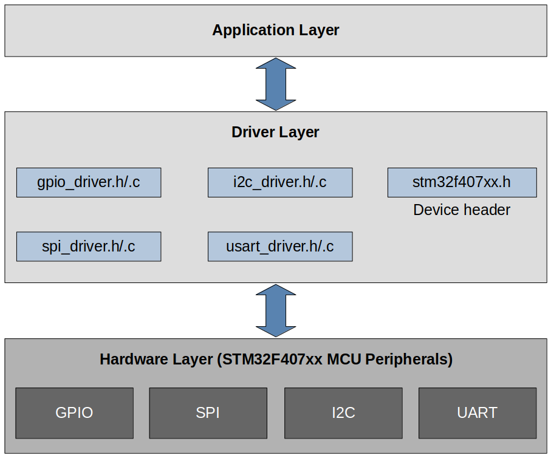

[Home](../../) | [Projects](../../projects) | [Notes](../) > <a href="./">MCU Peripheral Drivers</a> > Architecture & Development Plan

# Architecture & Development Plan

## Architecture

## Development Plan

1. Write a device header file (`stm32f407xx.h`)
2. Write a peripheral driver (`.c`/`.h`)
   * AHB1 - GPIOA ... GPIOI
   * APB1 - I2C1 ... I2C3, SPI2, SPI3, SPI4, USART2, USART3, UART4, UART5
   * APB2 - SPI1, USART1, USART6, EXTI, SYSCFG
3. Write sample applications to test the peripheral drivers
