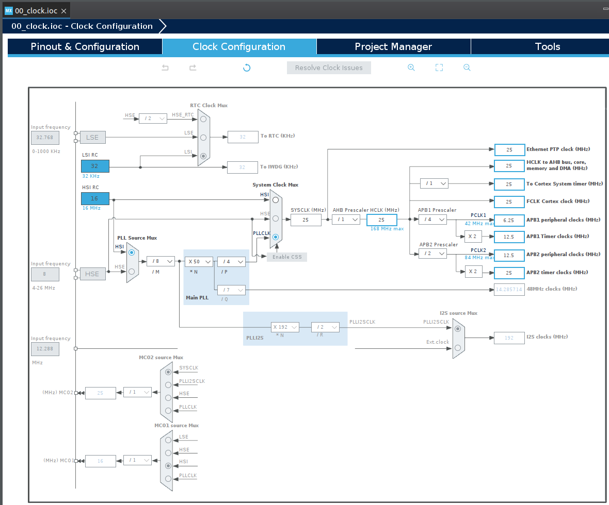

[Home](../../) | [Projects](../../projects) | [Notes](../) > <a href="./">MCU Peripheral Drivers</a> > Clocks

# Clocks

## Clocks

* Clock sources:

  * **Crystal oscillator** (External to the MCU) - HSE

    External component that has to be connected to the MCU in order to supply the clock. You can choose to not use crystal oscillator depending on the project design.

    8 MHz - This information must be obtained from the board reference manual since the crystal oscillator is external to the MCU.

  * **RC oscillator** (Internal to the MCU) - HSI

    Resistance-Capacitance oscillator 

    STM32F407xx MCU contains RC oscillator inside it. No connection to the outside clock source is necessary. 

  * **Phase Locked Loop (PLL)** (Internal to the MCU)

    Implemented inside the MCU. Generates higher-frequency clock by using the lower-frequency clock input.

### HSE (High-speed External)

* In general, there are 2 ways to configure HSE clock source:
  * External clock - Using other external clock source (e.g., from other circuitry or MCU)
  * Crystal/ceramic resonators - Using on-board crystal/ceramic resonators is supported
    * Discovery board comes with an on-board crystal resonator which can be used as an HSE clock source. (Find "X2 crystal" in the schematic!)
    * Nucleo board does not come with an on-board crystal resonator so using an external clock source is the only way to configure HSE. HSE is of 8 MHz pulled from ST-LINK circuitry.

### HSI (High-speed Internal)

* The HSI clock signal is generated from an internal 16 MHz RC oscillator and can be used directly as a system clock, or used as PLL input.
* On reset, MCU uses HSI as its default clock source.
* By default, HSE and PLL are disabled. To use these clock sources you need to enable them and select one via the System Clock Mux.

## Clock Configuration

* STM32CubeIDE Clock Configuration GUI:

  Be able to understand the clock hierarchy from the following diagram. For example, `APB1 peripheral clocks` are derived from the `PCLK1` which is derived from the `HCLK` adjusted by the `APB1 Prescalar`. And the `HCLK` is derived from the `SYSCLK` whose source is currently set to PLL. (Here, by default, PLL source is selected as HSI. By manipulating the multiplier and divider, etc. you can modify the SYSCLK frequency.)

  To configure all these, reference the "RCC clock control register (RCC_CR)" section of the MCU reference manual.

## Peripheral Clock Configuration

* In modern MCUs, before using any peripheral, you must enable its peripheral clock using peripheral clock registers.
* By default, peripheral clocks of almost all peripherals will be disabled to save power.
* A peripheral won't take or respond to your configuration values until you enable its peripheral clock.
* In STM32 microcontrollers, peripheral clocks are managed through RCC registers.
