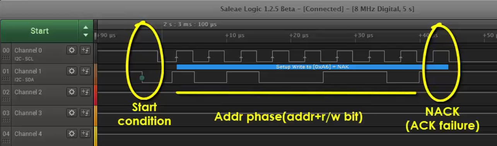

[Home](../../) | [Projects](../../projects) | [Notes](../) > <a href="./">MCU Peripheral Drivers</a> > Common Problems in I2C & Debugging Tips

# Common Problems in I2C & Debugging Tips

## Common Problems in I2C

* **Case 1: SDA and SCL lines are not held at HIGH voltage level after I2C pins initialization.**

  If this is the case, look no further and fix this first!

  * Cause: Not activating the pull-up resistors if you are using internal pull-up resistors of I/O lines.

    Action: Check the configuration register of each I/O line to see whether the pull-up resistors are actually activated or not. The best way is to dumpt the register contents and inspect them.

* **Case 2: ACK failure.**

  

  

  

  * Cause: Executing the address phase with a wrong slave address.

    Action: Verify the slave address that appears on the SDA line by using the Logic Analyzer.

  * Cause: Not enabling the ACK feature in the I2C control register.

    Action: Double-check the I2C control register and see if ACK enable field is configured correctly.

* **Case 3: Master not able to produce clock.**

  * Action: Check whether I2C peripheral clock is enabled and set to at least 2 MHz to produce standard mode I2C serial clock frequency.

  * Action: Check whether the GPIO pins that are used for SCL and SDA functionalities are configured properly (i.e., alternate functionality).
