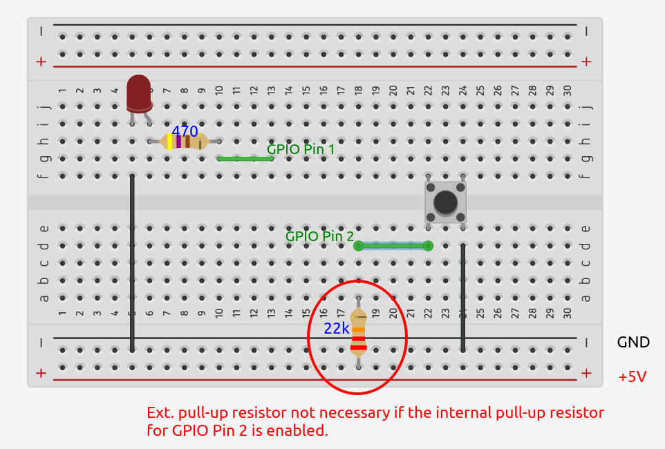

[Home](../../) | [Projects](../../projects) | [Notes](../) > <a href="./">MCU Peripheral Drivers</a> > GPIO Application 3: Toggling External LED with External Button (`gpio_03_ext_led_toggle_with_ext_button.c`)

# GPIO Application 3: Toggling External LED with External Button (`gpio_03_ext_led_toggle_with_ext_button.c`)


## Requirements

* Connect an external button to the GPIO pin PB12 of the board and an external LED to the GPIO pin PA08, write a program to toggle the external LED whenever the external button is pressed.
* Circuit design

  When the button is pressed, the pin will be pulled to GND. If the button is released, it will be pulled to HIGH. (Without the external pull-up resistor (22Kohm), the pin state when the button is not pressed will be floating!)

  Avoid the floating state by giving a proper state for the pin, either HIGH or LOW when the button is not pressed. In this case, LOW is when the button is pressed. So, make the pin HIGH when the button is not pressed through a pull-up resistor.

  > Another way is to enable the internal pull-up resistor (which is 40kohm) of the PB12 pin instead of using the external pull-up resistor.

  




* Not all GPIO pins are available for custom use. Make sure to check the documentation before selecting the GPIO pins to use for your project.


## Code

### `gpio_03_ext_led_toggle_with_ext_button.c`

Path: `Project/Src/`

```c
/*******************************************************************************
 * File		: gpio_03_ext_led_toggle_with_ext_button.c
 * Brief	: Program to toggle the external LED whenever the external LED is pressed
 * Author	: Kyungjae Lee
 * Date		: May 24, 2023
 ******************************************************************************/

#include "stm32f407xx.h"

#define HIGH			1
#define LOW 			0
#define BTN_PRESSED 	LOW

/**
 * delay()
 * Brief	: Spinlock delays the program execution
 * Param	: None
 * Retval	: None
 * Note		: N/A
 */
void delay(void)
{
	/* Appoximately ~200ms delay when the system clock freq is 16 MHz */
	for (uint32_t i = 0; i < 500000 / 2; i++);
} /* End of delay */


int main(int argc, char *argv[])
{
	GPIO_Handle_TypeDef GPIOLed, GPIOBtn;

	/* GPIOLed configuration */
	GPIOLed.pGPIOx = GPIOA;
	GPIOLed.GPIO_PinConfig.GPIO_PinNumber = GPIO_PIN_8;
	GPIOLed.GPIO_PinConfig.GPIO_PinMode = GPIO_PIN_MODE_OUT;
	GPIOLed.GPIO_PinConfig.GPIO_PinSpeed = GPIO_PIN_OUT_SPEED_HIGH;
	GPIOLed.GPIO_PinConfig.GPIO_PinOutType = GPIO_PIN_OUT_TYPE_PP;
	GPIOLed.GPIO_PinConfig.GPIO_PinPuPdControl = GPIO_PIN_NO_PUPD;
	GPIO_Init(&GPIOLed);

	/* GPIOBtn configuration */
	GPIOBtn.pGPIOx = GPIOB;
	GPIOBtn.GPIO_PinConfig.GPIO_PinNumber = GPIO_PIN_12;
	GPIOBtn.GPIO_PinConfig.GPIO_PinMode = GPIO_PIN_MODE_IN;
	GPIOBtn.GPIO_PinConfig.GPIO_PinSpeed = GPIO_PIN_OUT_SPEED_HIGH; /* Doesn't matter */
	//GPIOBtn.GPIO_PinConfig.GPIO_PinOutType = GPIO_PIN_OUT_TYPE_PP;	/* N/A */
	GPIOBtn.GPIO_PinConfig.GPIO_PinPuPdControl = GPIO_PIN_PU;
		/* External pull-down resistor is already present (see the schematic) */
	GPIO_Init(&GPIOBtn);

	while (1)
	{
		if (GPIO_ReadFromInputPin(GPIOBtn.pGPIOx, GPIOBtn.GPIO_PinConfig.GPIO_PinNumber) == BTN_PRESSED)
		{
			delay();	/* Introduce debouncing time */
			GPIO_ToggleOutputPin(GPIOLed.pGPIOx, GPIOLed.GPIO_PinConfig.GPIO_PinNumber);
		}
	}

	return 0;
} /* End of main */
```

