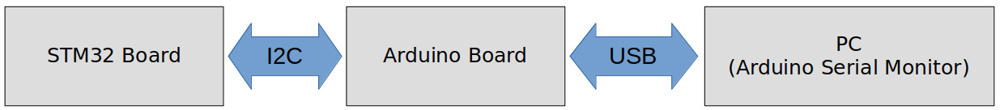
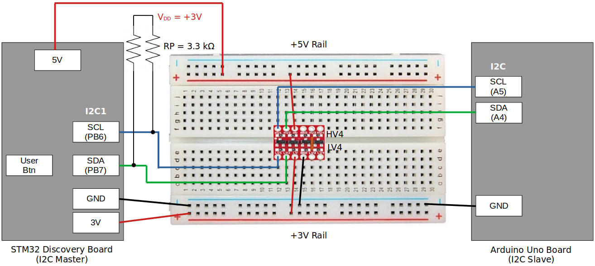

[Home](../../) | [Projects](../../projects) | [Notes](../) > <a href="./">MCU Peripheral Drivers</a> > I2C Application 1: Master Tx (Blocking) (`i2c_01_master_tx_blocking.c`)

# I2C Application 1: Master Tx (Blocking)(`i2c_01_master_tx_blocking.c`)


## Requirements

* I2C master (STM32 Discovery board) and I2C slave (Arduino board) communication.

* When the button on the STM32 board (master) is pressed, the master shall send data to the Arduino board (slave). The data received by the Arduino board shall be displayed on the serial monitor terminal of the Arduino IDE.

  1. Use I2C SCL = 100 kHz (i.e., standard mode)
  2. Use external pull-up resistors (3.3 kΩ) for SDA and SCL line

  [!] Note: If you don't have external pull-up resistors, you can also try activating the STM32 I2C pin's internal pull-up resistors.

### External Pull-Up Resistance Calculation


$$
R_p(max) = \frac{t_r(max)}{0.8473 \times C_b} = \frac{1000 \times 10^{-9}}{0.8473 \times 400 \times 10^{-12}} \approx 3k \ohm
$$

$$
t_r(max) \approx 0.8 \times R_p \times C_b
$$

* According to the I2C specification:
  * $t_r(max)$ = 1000 ns (in standard mode)
  * $C_b$ = 400 pF

### Parts Needed

1. Arduino board

2. STM32 board

3. Logic level converter

4. Breadboard and jumper wires

5. 2 pull-up resistors of resistance 3.3 kΩ or 4.7 kΩ (You can also use internal pull-up resistors of the pins in place of external resistors.)

   > Q: We calculated the Rp(max) to be 3 kΩ. If 3 is the max, then why would 3.3 or 4.7 kΩ resistors work? Wouldn't these be higher resistance  than the max? Is there a tolerable range? If so, how do I find this  range?
   >
   > A: Rp(max) refers to the maximum recommended value for the pull-up  resistor. If the calculated Rp(max) is 3kOhms, it means that the  manufacturer or standard recommends using a pull-up resistor with a  value equal to or lower than 3kOhms for reliable operation.
   >
   > However, using a resistor with a slightly higher value, such as 3.3kOhms or  4.7kOhms, is generally acceptable in practice. The bus capacitance and  other factors in the system design can influence the actual pull-up  resistor value that works reliably. As long as the chosen resistor value is close to the recommended range and the overall system performance is satisfactory, using 3.3kOhms or 4.7kOhms resistors should be fine.
   >
   > It's important to note that selecting a pull-up resistor with a  significantly higher value than Rp(max) may lead to slower rise times  and increased susceptibility to noise or signal integrity issues. On the other hand, choosing a resistor with a significantly lower value may  result in excessive current flow and power dissipation. Therefore, it's  generally best to stay within the recommended range while considering  the specific requirements and constraints of the system.

### STM32 Board and Arduino Board Communication Interfaces





### STM32 Board and Arduino Board Voltage Levels

* To work around the voltage level difference, a **logic level shifter** will be necessary.


## Setup

### 1. Find out the GPIO pins that can be used for IC2 communication

* For this application, I2C communication lines SCL, SDA will be used. Find out the GPIO pins over which I2C can communicate! Look up the "Alternate function mapping" table in the datasheet.
  * I2C1_SCL $\to$ PB6 (AF4)
  
  * I2C1_SDA $\to$ PB7 (AF4)
  
    > Although, in the documentation, it is said that PB9 can be used as I2C1_SDA, some interference has been detected while testing due to the hardware circuitry called "SWIM" so ended up using PB7 instead. 

### 2. Connect STM32 Discovery board with Arduino Uno board I2C pins

* Be careful not to directly supply 5 volts to the STM32 board pins when the board is not powered up as they may be damaged. When the **logic level shifter** is used, you don't need to worry about this issue.





* To analyze the communication with the logic analyzer, connect the channels as follows:

  * CH0 - SCL

  * CH1 - SDA

  * GND - Common GND of the bread board

### 3. Power Arduino board and download SPI slave sketch to Arduino

* Sketch name: `001I2CSlaveRxString.ino`
  * You don't need to write an application for Arduino board. It is already provided as a sketch.
  * As soon as you download this sketch to the Arduino board, it will operate as a slave.


## Code

### `i2c_01_master_tx_blocking.c`

Path: `Project/Src/`

```c
/*******************************************************************************
 * File		: i2c_01_master_tx_blocking.c
 * Brief	: Program to test I2C master's (blocking) Tx functionality
 * Author	: Kyungjae Lee
 * Date		: Jun 12, 2023
 ******************************************************************************/

/**
 * Pin selection for I2C communication
 *
 * I2C1_SCL  - PB6 (AF4)
 * I2C1_SDA  - PB7 (AF4)
 */

#include <string.h> 		/* strlen() */
#include "stm32f407xx.h"

#define MASTER_ADDR			0x61
#define SLAVE_ADDR			0x68		/* Check Arduino IDE serial monitor */
#define MY_ADDR				MASTER_ADDR /* STM32 Discovery board is master */

/* Global variables */
I2C_Handle_TypeDef I2C1Handle;

/**
 * delay()
 * Brief	: Spinlock delays the program execution
 * Param	: None
 * Retval	: None
 * Note		: N/A
 */
void delay(void)
{
	/* Appoximately ~200ms delay when the system clock freq is 16 MHz */
	for (uint32_t i = 0; i < 500000 / 2; i++);
} /* End of delay() */

/**
 * I2C1_PinsInit()
 * Brief	: Initializes and configures GPIO pins to be used as I2C1 pins
 * Param	: None
 * Retval	: None
 * Note		: N/A
 */
void I2C1_PinsInit(void)
{
	GPIO_Handle_TypeDef I2CPins;

	I2CPins.pGPIOx = GPIOB;
	I2CPins.GPIO_PinConfig.GPIO_PinMode = GPIO_PIN_MODE_ALTFCN;
	I2CPins.GPIO_PinConfig.GPIO_PinOutType = GPIO_PIN_OUT_TYPE_OD;
	I2CPins.GPIO_PinConfig.GPIO_PinPuPdControl = GPIO_PIN_PU;
	I2CPins.GPIO_PinConfig.GPIO_PinAltFcnMode = 4;
	I2CPins.GPIO_PinConfig.GPIO_PinSpeed = GPIO_PIN_OUT_SPEED_HIGH;

	/* SCL */
	I2CPins.GPIO_PinConfig.GPIO_PinNumber = GPIO_PIN_6;
	GPIO_Init(&I2CPins);

	/* SDA */
	I2CPins.GPIO_PinConfig.GPIO_PinNumber = GPIO_PIN_7;
	GPIO_Init(&I2CPins);
} /* End of I2C1_PinsInit */

/**
 * I2C1_Init()
 * Brief	: Creates an SPI2Handle initializes SPI2 peripheral parameters
 * Param	: None
 * Retval	: None
 * Note		: N/A
 */
void I2C1_Init(void)
{

	I2C1Handle.pI2Cx = I2C1;
	I2C1Handle.I2C_Config.I2C_ACKEnable = I2C_ACK_ENABLE;
	I2C1Handle.I2C_Config.I2C_DeviceAddress = MY_ADDR;
		/* Since STM32 board is master, I2C_DeviceAddress field does not have
		 * to be configured. However, you can assign some dummy value to it if
		 * you wanted to. When selecting the dummy address value, make sure to
		 * avoid using the reserved addresses defined in the I2C specification.
		 */
	I2C1Handle.I2C_Config.I2C_FMDutyCycle = I2C_FM_DUTY_2;
	I2C1Handle.I2C_Config.I2C_SCLSpeed = I2C_SCL_SPEED_SM;

	I2C_Init(&I2C1Handle);
} /* End of I2C1_Init */

/**
 * GPIO_ButtonInit()
 * Brief	: Initializes a GPIO pin for button
 * Param	: None
 * Retval	: None
 * Note		: N/A
 */
void GPIO_ButtonInit(void)
{
	GPIO_Handle_TypeDef GPIOBtn;

	/* Zero-out all the fields in the structures (Very important! GPIOLed and GPIOBtn
	 * are local variables whose members may be filled with garbage values before
	 * initialization. These garbage values may set (corrupt) the bit fields that
	 * you did not touch assuming that they will be 0 by default. Do NOT make this
	 * mistake!
	 */
	memset(&GPIOBtn, 0, sizeof(GPIOBtn));

	/* GPIOBtn configuration */
	GPIOBtn.pGPIOx = GPIOA;
	GPIOBtn.GPIO_PinConfig.GPIO_PinNumber = GPIO_PIN_0;
	GPIOBtn.GPIO_PinConfig.GPIO_PinMode = GPIO_PIN_MODE_IN;
	GPIOBtn.GPIO_PinConfig.GPIO_PinSpeed = GPIO_PIN_OUT_SPEED_HIGH; /* Doesn't matter */
	//GPIOBtn.GPIO_PinConfig.GPIO_PinOutType = GPIO_PIN_OUT_TYPE_PP;	/* N/A */
	GPIOBtn.GPIO_PinConfig.GPIO_PinPuPdControl = GPIO_PIN_NO_PUPD;
		/* External pull-down resistor is already present (see the schematic) */
	GPIO_Init(&GPIOBtn);
} /* End of GPIO_ButtonInit */


int main(int argc, char *argv[])
{
	/* Create data to send
	 * (The Arduino sketch is written using the Arduino Wire library. The wire
	 * library has limitation on how many bytes can be transferred or received
	 * in single I2C transaction and the limit is 32 bytes. So, don't
	 * send/receive more than 32 bytes in a single I2C transaction. You may want
	 * to split it into multiple I2C transactions in such cases.)
	 */
	uint8_t data[] = "I2C master Tx testing\n";

	/* Initialize GPIO pin for button */
	GPIO_ButtonInit();

	/* Initialize I2C pins */
	I2C1_PinsInit();

	/* Configure I2C peripheral */
	I2C1_Init();

	/* Enable I2C peripheral */
	I2C_PeriControl(I2C1, ENABLE);

	/* Wait for button press */
	while (1)
	{
		/* Wait until button is pressed */
		while (!GPIO_ReadFromInputPin(GPIOA, GPIO_PIN_0));

		/* Introduce debouncing time for button press */
		delay();

		/* Send data to slave
		 * Note: 'I2C_MasterTxBlocking()' API has been modified for handling
		 * 		 extended feature (i.e., repeated start) that are used
		 * 		 in the next level applications. Another parameter has been
		 * 		 added after @slaveAddr.
		 * TODO: Update the following API call to make this application work!
		 */
		//I2C_MasterTxBlocking(&I2C1Handle, data, strlen((char *)data), SLAVE_ADDR);
	}
} /* End of main */
```


## Arduino Sketch (`001I2CSlaveRxString.ino`)

```c
// Wire Slave Receiver
//Uno, Ethernet A4 (SDA), A5 (SCL)
#include <Wire.h>

#define MY_ADDR   0x68

int LED = 13;
char rx_buffer[32] ;
uint32_t cnt =0;
uint8_t message[50];
void setup() {

  Serial.begin(9600);
  // Define the LED pin as Output
  pinMode (LED, OUTPUT);
  
 // Start the I2C Bus as Slave on address 0X69
  Wire.begin(MY_ADDR); 
  
  // Attach a function to trigger when something is received.
  Wire.onReceive(receiveEvent);

  sprintf(message,"Slave is ready : Address 0x%x",MY_ADDR);
  Serial.println((char*)message );  
  Serial.println("Waiting for data from master");  
}

void loop(void)
{
  
}

void receiveEvent(int bytes) 
{
 while( Wire.available() )
 {
   rx_buffer[cnt++] = Wire.read();
 }
  rx_buffer[cnt] = '\0';
  cnt=0;
  Serial.print("Received:");  
  Serial.println((char*)rx_buffer);  
}
```

