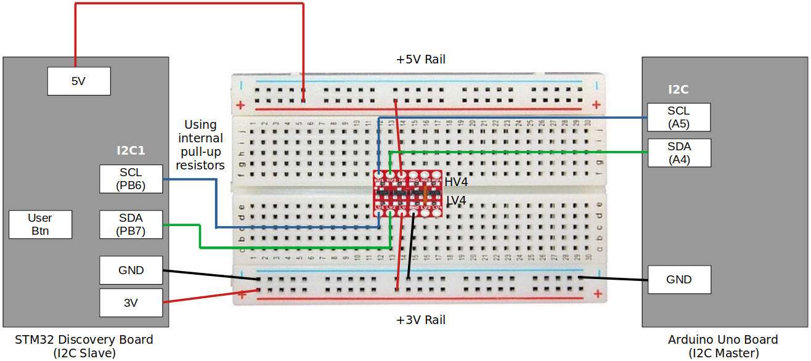

[Home](../../) | [Projects](../../projects) | [Notes](../) > <a href="./">MCU Peripheral Drivers</a> > I2C Application 4: Slave Tx (Interrupt) (`i2c_04_slave_tx_interrupt.c`)

# I2C Application 4: Slave Tx (Interrupt) (`i2c_04_slave_tx_interrupt.c`)


## Requirements

* I2C master (Arduino board) and I2C slave (STM32 Discovery board) communication.

* Master (Arduino) shall read and display data from slave (STM32) connected. First, master has to get the length information of the data to be received from the slave, and then read the data sent by the slave.

  1. Use I2C SCL = 100 kHz (i.e., standard mode)
  2. Use external pull-up resistors for SDA and SCL line (Internal pull-up resistors are also fine!)

  [!] Note: 3.3 kΩ or 4.7 kΩ external pull-up resistors are necessary in case your MCU pins do not support internal pull-up resistors.

### External Pull-Up Resistance Calculation


$$
R_p(max) = \frac{t_r(max)}{0.8473 \times C_b} = \frac{1000 \times 10^{-9}}{0.8473 \times 400 \times 10^{-12}} \approx 3k \ohm
$$

$$
t_r(max) \approx 0.8 \times R_p \times C_b
$$

* According to the I2C specification:
  * $t_r(max)$ = 1000 ns (in standard mode)
  * $C_b$ = 400 pF

### Parts Needed

1. Arduino board

2. STM32 board

3. Logic level converter

4. Breadboard and jumper wires

5. 2 pull-up resistors of resistance 3.3 kΩ or 4.7 kΩ (You can also use internal pull-up resistors of the pins in place of external resistors.)

   > Q: We calculated the Rp(max) to be 3 kΩ. If 3 is the max, then why would 3.3 or 4.7 kΩ resistors work? Wouldn't these be higher resistance  than the max? Is there a tolerable range? If so, how do I find this  range?
   >
   > A: Rp(max) refers to the maximum recommended value for the pull-up  resistor. If the calculated Rp(max) is 3kOhms, it means that the  manufacturer or standard recommends using a pull-up resistor with a  value equal to or lower than 3kOhms for reliable operation.
   >
   > However, using a resistor with a slightly higher value, such as 3.3kOhms or  4.7kOhms, is generally acceptable in practice. The bus capacitance and  other factors in the system design can influence the actual pull-up  resistor value that works reliably. As long as the chosen resistor value is close to the recommended range and the overall system performance is satisfactory, using 3.3kOhms or 4.7kOhms resistors should be fine.
   >
   > It's important to note that selecting a pull-up resistor with a  significantly higher value than Rp(max) may lead to slower rise times  and increased susceptibility to noise or signal integrity issues. On the other hand, choosing a resistor with a significantly lower value may  result in excessive current flow and power dissipation. Therefore, it's  generally best to stay within the recommended range while considering  the specific requirements and constraints of the system.

### STM32 Board and Arduino Board Communication Interfaces


### STM32 Board and Arduino Board Voltage Levels

* To work around the voltage level difference, a **logic level shifter** will be necessary.


### Procedure to Send Data to Master (Arduino) as Slave (STM32)

Master (Arduino) will control the I2C transaction. Slave (STM32) will simply react to master's commands.

1. Master sends command code (0x51) to fetch 1 byte of data length information from the slave.
2. Master sends command code (0x52) to read the complete data from the slave.

### Using `printf()` to Print Messages in STM32CubeIDE Console

* See <a href="./using-printf-with-serial-wire-viewer">Using `printf()` with Serial Wire Viewer (SWV)</a>


## Setup

### 1. Find out the GPIO pins that can be used for IC2 communication

* For this application, I2C communication lines SCL, SDA will be used. Find out the GPIO pins over which I2C can communicate! Look up the "Alternate function mapping" table in the datasheet.
  * I2C1_SCL $\to$ PB6 (AF4)
  * I2C1_SDA $\to$ PB7 (AF4)
  
    > Although, in the documentation, it is said that PB9 can be used as I2C1_SDA, some interference has been detected while testing due to the hardware circuitry called "SWIM" so ended up using PB7 instead. 

### 2. Connect STM32 Discovery board with Arduino Uno board I2C pins

* Be careful not to directly supply 5 volts to the STM32 board pins when the board is not powered up as they may be damaged. When the **logic level shifter** is used, you don't need to worry about this issue.





* To analyze the communication with the logic analyzer, connect the channels as follows:

  * CH0 - SCL

  * CH1 - SDA

  * GND - Common GND of the bread board

### 3. Power Arduino board and download SPI slave sketch to Arduino

* Sketch name: `003I2CMasterRxString.ino`
  * You don't need to write an application for Arduino board. It is already provided as a sketch.
  * As soon as you download this sketch to the Arduino board, it will operate as a master.


## Code

### `i2c_04_slave_tx_interrupt.c`

Path: `Project/Src/`

```c
/*******************************************************************************
 * File		: i2c_04_slave_tx_interrupt.c
 * Brief	: Program to test I2C slave's Tx (interrupt) functionality
 * Author	: Kyungjae Lee
 * Date		: Jun 18, 2023
 ******************************************************************************/

/**
 * Pin selection for I2C communication
 *
 * I2C1_SCL  - PB6 (AF4)
 * I2C1_SDA  - PB7 (AF4)
 */

#include <string.h> 		/* strlen() */
#include <stdio.h> 			/* printf() */
#include "stm32f407xx.h"

#define SLAVE_ADDR			0x69		/* STM32 Discovery board's address */
#define MY_ADDR				SLAVE_ADDR 	/* In this app, STM32 board is slave */

/* Global variables */
I2C_Handle_TypeDef I2C1Handle;
uint8_t txBuff[32] = "Msg from STM32 slave.";
	/* Arduino wire library limits the length of I2C data to be <= 32 bytes */

/**
 * delay()
 * Brief	: Spinlock delays the program execution
 * Param	: None
 * Retval	: None
 * Note		: N/A
 */
void delay(void)
{
	/* Appoximately ~200ms delay when the system clock freq is 16 MHz */
	for (uint32_t i = 0; i < 500000 / 2; i++);
} /* End of delay */

/**
 * I2C1_PinsInit()
 * Brief	: Initializes and configures GPIO pins to be used as I2C1 pins
 * Param	: None
 * Retval	: None
 * Note		: N/A
 */
void I2C1_PinsInit(void)
{
	GPIO_Handle_TypeDef I2CPins;

	I2CPins.pGPIOx = GPIOB;
	I2CPins.GPIO_PinConfig.GPIO_PinMode = GPIO_PIN_MODE_ALTFCN;
	I2CPins.GPIO_PinConfig.GPIO_PinOutType = GPIO_PIN_OUT_TYPE_OD;
	I2CPins.GPIO_PinConfig.GPIO_PinPuPdControl = GPIO_PIN_PU;
	I2CPins.GPIO_PinConfig.GPIO_PinAltFcnMode = 4;
	I2CPins.GPIO_PinConfig.GPIO_PinSpeed = GPIO_PIN_OUT_SPEED_HIGH;

	/* SCL */
	I2CPins.GPIO_PinConfig.GPIO_PinNumber = GPIO_PIN_6;
	GPIO_Init(&I2CPins);

	/* SDA */
	I2CPins.GPIO_PinConfig.GPIO_PinNumber = GPIO_PIN_7;
	GPIO_Init(&I2CPins);
} /* End of I2C1_PinsInit */

/**
 * I2C1_Init()
 * Brief	: Creates an SPI2Handle initializes SPI2 peripheral parameters
 * Param	: None
 * Retval	: None
 * Note		: N/A
 */
void I2C1_Init(void)
{

	I2C1Handle.pI2Cx = I2C1;
	I2C1Handle.I2C_Config.I2C_ACKEnable = I2C_ACK_ENABLE;
	I2C1Handle.I2C_Config.I2C_DeviceAddress = MY_ADDR;
		/* Since STM32 board is master, I2C_DeviceAddress field does not have
		 * to be configured. However, you can assign some dummy value to it if
		 * you wanted to. When selecting the dummy address value, make sure to
		 * avoid using the reserved addresses defined in the I2C specification.
		 */
	I2C1Handle.I2C_Config.I2C_FMDutyCycle = I2C_FM_DUTY_2;
	I2C1Handle.I2C_Config.I2C_SCLSpeed = I2C_SCL_SPEED_SM;

	I2C_Init(&I2C1Handle);
} /* End of I2C1_Init */


int main(int argc, char *argv[])
{
	printf("Application Running\n");

	/* Initialize I2C pins */
	I2C1_PinsInit();

	/* Configure I2C peripheral */
	I2C1_Init();

	/* I2C IRQ configurations */
	I2C_IRQInterruptConfig(IRQ_NO_I2C1_EV, ENABLE);
	I2C_IRQInterruptConfig(IRQ_NO_I2C1_ER, ENABLE);

	I2C_SlaveEnableDisableCallbackEvents(I2C1, ENABLE);

	/* Enable I2C peripheral (PE bit gets set here) */
	I2C_PeriControl(I2C1, ENABLE);

	/* Enable ACK
	 * ACK bit is set and cleared by SW, and cleared by HW when PE=0.
	 * Since PE bit has just been set in the 'I2C_PeriControl()' function,
	 * now you can set the ACK bit. */
	I2C_ManageACK(I2C1, ENABLE);

	while (1);
} /* End of main */

/**
 * I2C1_ER_IRQHandler()
 * Brief	: Handles I2C error IRQ
 * Param	: None
 * Retval	: None
 * Note		: This function calls 'I2C_ER_IRQHandling()' function which
 * 			  implements the actual error IRQ handling functionality.
 */
void I2C1_ER_IRQHandler(void)
{
	I2C_ER_IRQHandling(&I2C1Handle);
} /* End of I2C1_ER_IRQHandler */

/**
 * I2C1_EV_IRQHandler()
 * Brief	: Handles I2C event IRQ
 * Param	: None
 * Retval	: None
 * Note		: This function calls 'I2C_EV_IRQHandling()' function which
 * 			  implements the actual event IRQ handling functionality.
 */
void I2C1_EV_IRQHandler(void)
{
	I2C_EV_IRQHandling(&I2C1Handle);
} /* End of I2C1_EV_IRQHandler */

/**
 * I2C_ApplicationEventCallback()
 * Brief	: Notifies the application of the event occurred
 * Param	: @pSPIHandle - pointer to SPI handle structure
 * 			  @appEvent - SPI event occurred
 * Retval	: None
 * Note		: Contents of this function depends on the I2C transactions used
 * 			  in the application. (e.g., Master's write operation results in
 * 			  slave's read.)
 */
void I2C_ApplicationEventCallback(I2C_Handle_TypeDef *pI2CHandle, uint8_t appEvent)
{
	/* Static variables are not allocated in the stack. These variables will
	 * last throughout the duration of the program.
	 */
	static uint8_t cmdCode = 0;
	static uint8_t cnt = 0;

	if (appEvent == I2C_EV_TX)
	{
		/* Master wants to read data. Slave has to send data. */
		if (cmdCode == 0x51)
		{
			/* Send the length information to the master */
			I2C_SlaveTx(pI2CHandle->pI2Cx, strlen((char *)txBuff));
		}
		else if (cmdCode == 0x52)
		{
			/* Send the contents of Tx buffer to the master */
			I2C_SlaveTx(pI2CHandle->pI2Cx, txBuff[cnt++]);
		}
	}
	else if (appEvent == I2C_EV_RX)
	{
		/* Data waits to be read by the slave. Let the slave read it */
		cmdCode = I2C_SlaveRx(pI2CHandle->pI2Cx);
	}
	else if (appEvent == I2C_ERROR_AF)
	{
		/* This happens only during the slave Tx.
		 * Master has sent NACK, meaning that master has no more data to send.
		 */
		cmdCode = 0xFF;	/* Invalidate cmdCode */
		cnt = 0;		/* Reset cnt */
	}
	else if (appEvent == I2C_EV_STOP)
	{
		/* This happens only during slave Rx.
		 * Master has ended the I2C communication with the slave.
		 */
	}
} /* End of I2C_ApplicationEventCallback */
```


## Arduino Sketch (`003I2CMasterRxString.ino`)

```c
// Wire Master Transmitter and Receiver 
//Uno, Ethernet A4 (SDA), A5 (SCL)
#include <Wire.h>

// Include the required Wire library for I2C<br>#include <Wire.h>
int LED = 13;

uint8_t rcv_buf[32];

int data_len=0;
#define SLAVE_ADDR 0x69	/* Address of STM32 Discorvery board (slave) */

void setup() {
    Serial.begin(9600);
    
  // Define the LED pin as Output
  pinMode (LED, OUTPUT);
  
  // join i2c bus (address optional for master)
  Wire.begin(); 
}


void loop() {

  Serial.println("Arduino Master");
  Serial.println("Send character \"s\" to begin");
  Serial.println("-----------------------------");

   while(!Serial.available());
  char in_read=Serial.read();

  while(in_read != 's');

  Serial.println("Starting..");

  Wire.beginTransmission(SLAVE_ADDR);
  
  Wire.write(0X51); //Send this command to read the length
  Wire.endTransmission();


  Wire.requestFrom(SLAVE_ADDR,1); // Request the transmitted two bytes from the two registers

  if(Wire.available()) {  // 
    data_len = Wire.read(); // Reads the data 
  }
  Serial.print("Data Length:");
  Serial.println(String(data_len,DEC));

  Wire.beginTransmission(SLAVE_ADDR);
  
  Wire.write(0X52); //Send this command to ask data
  Wire.endTransmission();

  Wire.requestFrom(SLAVE_ADDR,data_len);

  uint32_t i=0;
  for( i =0; i <= data_len ; i++)
  {
    if(Wire.available()) {  // 
      rcv_buf[i] = Wire.read(); // Reads the data 
    }
  }
  rcv_buf[i] = '\0';

  Serial.print("Data:");
  Serial.println((char*)rcv_buf);
  Serial.println("*********************END*********************");
}
```


## Testing

The following snapshots are taken using the Logic Analyzer.


### Entire Communication


### Communication in Detail


### Cross-Checking using the Arduino IDE Serial Monitor Tool


