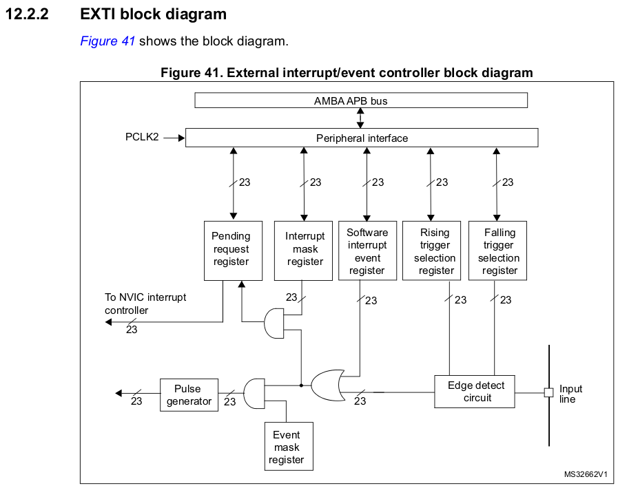
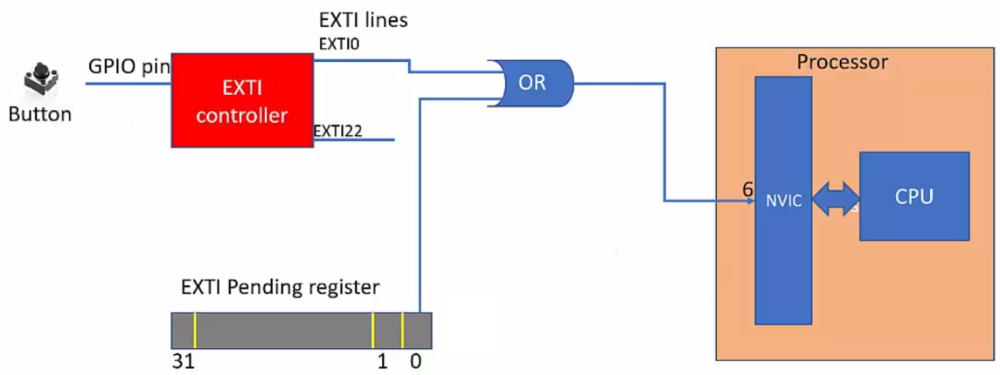

[Home](../../) | [Projects](../../projects) | [Notes](../) > <a href="./">MCU Peripheral Drivers</a> > Interrupts

# Interrupts

## MCU Interrupt Design

* Some peripherals (e.g., GPIO) deliver their interrupt to the NVIC over the EXTI line while others (e.g., SPI) deliver their interrupt directly to the NVIC. This is the MCU vendor specific design.

  See the "External interrupt/event controller (EXTI)" section of the MCU reference manual.

  

  

  

  > By default, interrupt requests through all 23 lines are masked. You need to unmask the line you want to enable using the Interrupt Mask Register (`EXTI_IMR`).
  >
  > The way the edge detect circuit detects interrupts can be configured by using the Rising Trigger Selection (`EXTI_RTSR`) Register and/or Falling Trigger Selection Register (`EXTI_FTSR`).

  

  

  

  > The pending register is necessary because in some cases, multiple EXTI lines have the same interrupt handler and having `EXTI_PR` helps figure out which EXTI line triggered the handler. (The pending bit is a status indicator that signals the occurrence of a  specific event or error. When the pending bit is set, it means that the  event or error has taken place and is waiting to be attended to by the  processor. Once the processor has addressed the event or error, the user can clear the pending bit. The user can only interact with the pending  bit and has no control over the pending state of the EXTI lines in any  other manner.)
  >
  > A pending bit (bits[22:0]) is set when the selected edge event arrives on the external interrupt line. A pending it is cleared by programming it to 1(?). $\to$ I know this is confusing but ST designed it this way. To check if this really works this way, use the debugger. 
  >
  > Even if the EXTI0 line is cleared, if the bit[0] of the EXTI Pending Register is not cleared, the processor will get an infinite interrupt request. Make sure to clear it once it is set.

* e.g., GPIO interrupts:

  * **0**th pins of all GPIO port deliver their interrupt to the NVIC over EXTI**0** line. Only one at any given time can be selected by the multiplexer and EXTI**0**[3:0] bits in the SYSCFG_EXTICR1 register decides it.
  * **1**th pins of all GPIO port deliver their interrupt to the NVIC over EXTI**1** line. Only one at any given time can be selected by the multiplexer and EXTI**1**[3:0] bits in the SYSCFG_EXTICR1 register decides it.
  * ...
  * **15**th pins of all GPIO port deliver their interrupt to the NVIC over EXTI**15** line. Only one at any given time can be selected by the multiplexer and EXTI**15**[3:0] bits in the SYSCFG_EXTICR4 register decides it.

  In the STM32F407-Discovery board, the user button is connected to the GPIO PA0 pin. That means, the interrupt triggered by the user button press will be delivered over the EXTI0 line and you need to implement the EXTI0 handler to service the interrupt.

* How to issue user button interrupt to the processor in STM32?

  1. The button is connected to a GPIO pin of the microcontroller.
  2. The GPIO pin should be configured to input mode.
  3. The link between a GPIO port and the corresponding EXTI line must be established using the SYSCFG_EXTICRx register.
  4. Configure the trigger detection (falling/rising/both) for relevant EXTI line. (This is done via EXTI controller regsters.)
  5. Implement the handler to service the interrupt.
