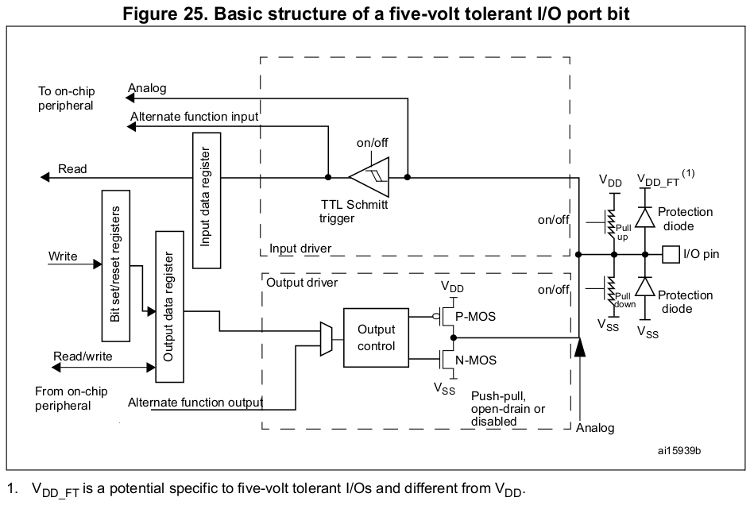
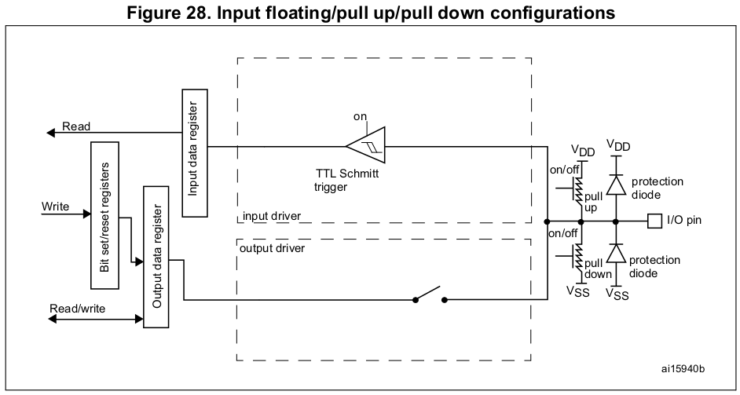
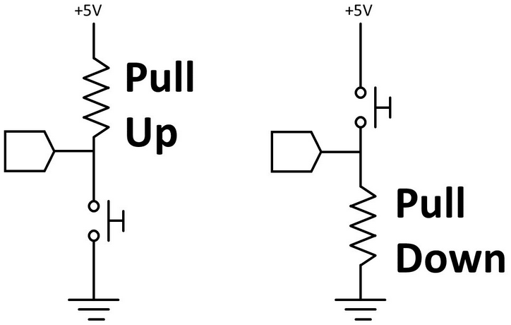
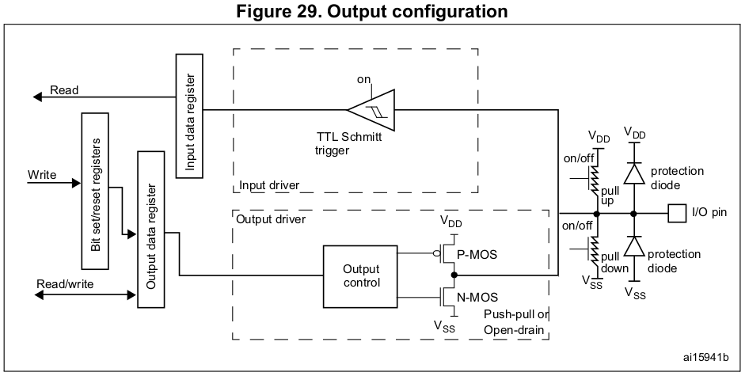
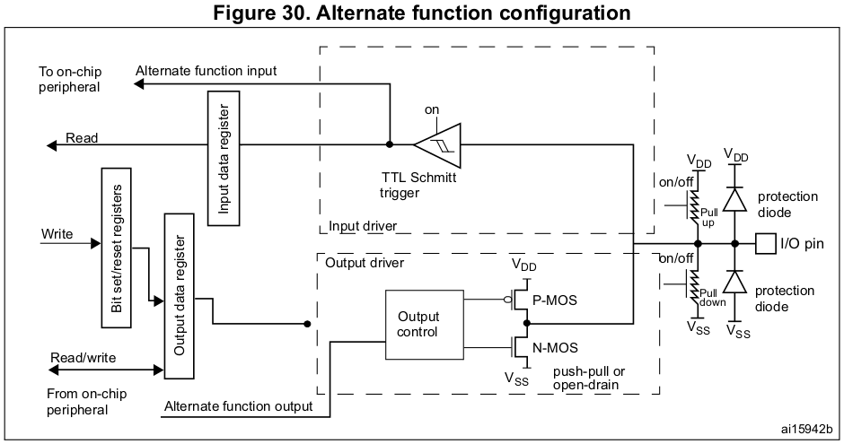
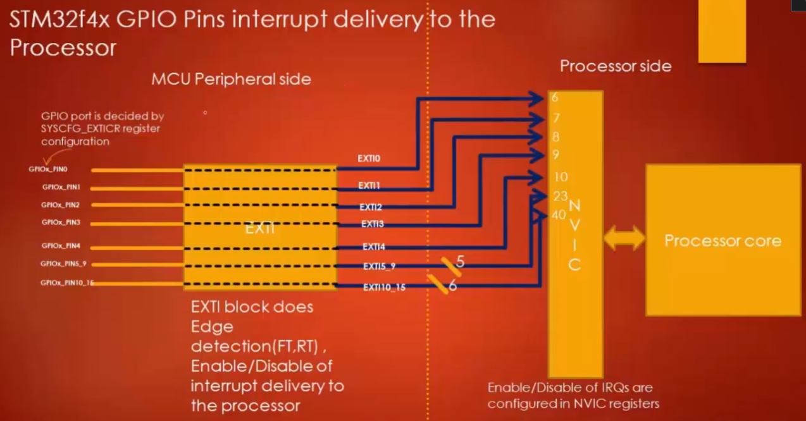

[Home](../../) | [Projects](../../projects) | [Notes](../) > <a href="./">MCU Peripheral Drivers</a> > Introduction to GPIO

# Introduction to GPIO

## General Purpose Input/Output (GPIO)

* A GPIO pin can be used for many purposes as shown below. This is why it is called as "General purpose". (Some pins of an MCU cannot be usd for all these purposes. So, those are called as "Pins" but not as "GPIOs".)
* A GPIO pin of MCU can be operate in:
  * Input mode
    * Interrupt - When an MCU pin is in input mode, it can be configured to issue an interrupt to the processor.
  * Output mode
  * Alternate function mode
  * Analog mode

### Input Mode

* When an I/O pin is programmed as input mode:

  * The output buffer is disabled.

  * The Schmitt trigger input is activated.

  * The pull-up and pull-down resistors are activated depending on the value in the `GPIOx_PUPDR` register.

  * The data present on the I/O pin are sampled into the input data register every AHB1 clock cycle.

  * A read access to the input data register provides the I/O state.

  

* High impedance (HI-Z) state (a.k.a. Floating state)

  * HI-Z state of an I/O pin is keeping the pin floating by **NOT connecting** it to the high or low voltage level.
  * After you power up the MCU, by default, all the GPIO pins will be in input mode with HIGH-Z state or floating state. (This is true with most of the MCUs.)
  * Keeping a pin in a floating state can cause leakage current which may lead to higher power consumption. This is because a floating pin is highly susceptible to the circuit voltage noise and may result in leakage current.

* **Pull-up/pull-down state**

  * Floating state of a pin can be avoided by introducing an internal pull-up or pull-down resistor.

    

    

    

  * There are configuration registers for every GPIO port which enable you to handle internal pull-up or pull-down resistors.

  * It is always safe to keep the unused GPIO pin in one of the states so that they are reluctant to voltage fluctuations which may lead to leakage of current.

### Output Mode

* When an I/O pin is programmed as output mode:
  * The input buffer is still on. Therefore you can read the state of an I/O pin through the Input Data Register. (Reading is possible.)

* **Open-drain configuration**

  * Basically the default configuration (i.e., push-pull) of an output mode pin without the top PMOS transistor. (Only the NMOS transistor is present.)

    * When the transistor is switched ON, the output will be pulled down to LOW (i.e., **GND**).
    * When the transistor is switched OFF, the drain will be open, and the output will be in **floating** state.

  * An open-drain output configuration can only pull-down the pin, but it cannot pull-up the pin. It provides only 2 states; GND and float.

  * The open drain output configuration of a GPIO is useless until you provide the pull-up capacity (e.g., internal/external pull-up resistor).

  * Open-drain with pull-up resistor

    * Open-drain with internal pull-up resistor
      * Case of the most of the modern MCUs
      * Activated/deactivated via GPIO control registers
    * Open-drain with external pull-up resistor
      * If your MCU does not support internal pull-up resistor, which is very unlikely for modern MCUs, you may have to add an external pull-up resistor by yourself.

  * How to drive an LED from an output mode open-drain configuration GPIO pin?

    Using internal pull-up resistor:

    1. Activate the internal pull-up resistor

    2. Connect the pin to the LED

    3. Write 1 to input $\to$ LED will be pulled to HIGH and it is now forward biased (LED ON)

       Write 0 to input $\to$ LED will be pulled down to GND and it is now reverse biased (LED OFF)

    Remember! Always activate and use the internal pull-up resistor of an I/O pin instead of connecting external resistors by hand unless you have a valid design issues with the internal one.

* **Push-pull configuration**

  * Default configuration of an output mode pin.

  * In the push-pull configuration you don't need any pull-up or pull-down resistor.

    * When the top transistor (PMOS) is ON, the output will be HIGH.
    * When the bottom transistor (NMOS) is ON, the output will be LOW.

  * How to drive an LED from an output mode push-pull configuration GPIO pin?

    It is not necessary to use the pull-up resistor in order to drive an LED using push-pull configuration.

    * Write 1 to input $\to$ The top transistor (PMOS) turns on $\to$ Pin pull to HIGH $\to$ LED forward biased (LED turns ON)
    * Write 0 to input $\to$ The bottom transistor (NMOS) turns on $\to$ Pin pull to GND $\to$ LED reverse biased (LED turns OFF)

### Alternate Function Mode

* When an I/O pin is programmed as alternate function mode:

  * The pin will be assigned for alternate functionalities. (For STM32F407 MCU, there are 16 possible alternate functionalities, `AF0`-`AF15`, that can be configured to the GPIO pins. Not every pin support all 16 functionalities and this information can be found in the data sheet of the MCU; "Alternate function mapping")

  * Example - List out all the 16 possible alternate functionalities supported by GPIO port A pin number 8 (i.e., GPIOA.8)

    | MODE (AFx) | Functionality   |
    | ---------- | --------------- |
    | AF0        | MCO1            |
    | AF1        | TIM1_CH1        |
    | AF2        | (Not supported) |
    | AF3        | (Not supported) |
    | AF4        | I2C3_SCL        |
    | AF5        | (Not supported) |
    | AF6        | (Not supported) |
    | AF7        | USART1_CK       |
    | AF8        | (Not supported) |
    | AF9        | (Not supported) |
    | AF10       | OTG_FS_SOF      |
    | AF11       | (Not supported) |
    | AF12       | (Not supported) |
    | AF13       | (Not supported) |
    | AF14       | (Not supported) |
    | AF15       | EVENTOUT        |

* Circuit analysis

  * Output part

    The Output Data Register has no control over the Output Control Block. The Output Control Block is now controlled by the Alternate Function Output. 

    The pin is controlled by assigned peripheral output functionality like `I2C_SDA`, `I2C_CLK`, `UART_TX`, etc.

  * Input part

    The pin is ready by assigned peripheral input functionality like `USART_RX`, `ADCIN`, `TIMER_CHx`, `CAN_RX`, etc.

### Summary

* By taking various modes and pull-up/pull-down resistors combinations, the following configurations can be obtained for a GPIO pin:
  * Input floating
  * Input pull-up
  * Input-pull-down
  * Analog
  * Output open-drain with pull-up or pull-down capability
  * Output push-pull with pull-up or pull-down capability
  * Alternate function push-pull with pull-up or pull-down capability
  * Alternate function open -drain with pull-up or pull-down capability

## GPIO Pin Interrupt Configuration

1. Pin must be in input mode (Because the pin is supposed to be receiving interrupt)

2. Configure the edge trigger (RT, FR, RFT)

3. Enable interrupt delivery from the peripheral to the processor (Peripheral side; using Interrupt Mask Register of EXTI)

4. Identify the IRQ number on which the processor accepts the interrupt from that pin

   * Check the MCU reference manual

5. Configure the IRQ priority for the identified IRQ number (Process side)

   * Interrupt Priority Registers (`NVIC_IPR0` - `NVIC_IPRO59`)

     Each 32-bit registers are composed of 4 8-bit sections each of which is responsible for each IRQ.

     [!] Tip: `IRQ Number / 4` gives IPR number, `IRQ Number % 4` gives the section index

6. Enable interrupt reception on that IRQ number (Processor side; register of NVIC)

   * Interrupt Set-enable Registers (`NVIC_ISER0` - `NVIC_ISER7`) - 0 has no effect, 1 enables the interrupt
   * Interrupt Clear-enable Registers (`NVIC_ICER0` - `NVIC_ICER7`) - 0 has no effect, 1 disables the interrupt

7. Implement IRQ handler

> `Pinx` of all GPIO ports will share `EXTIx`. Then how do you assign a specific port to an `EXTIx` line? $\to$ By using the `SYSCFG_EXTICR` register! 
>
> By default, `EXTI0` will be used by `GPIOA Pin0`. Configure `SYSCFG_EXTICR` to select which GPIO port to use the EXTI line.

## GPIO Interrupt Handling

* When an interrupt is received through a GPIO pin, EXTI controller will detected it (Falling-edge, rising-edge, or both) and the corresponding EXTIx line will be triggered. Then, the fixed vector address of the corresponding IRQ number will be accessed. In the memory space fixed vector address points to holds the address of an IRQ handler (or Interrupt Service Routine; ISR) that needs to be invoked. 

* The lower the IRQ number, the higher the priority.

  If another IRQ is triggered while the processor is executing an ISR, their IRQ numbers will be compared, and if the newely arrived register happened to be of higher priority, the currently running ISR will be preempted.

* Even if the IRQ is disabled (`ICERx` register), the incoming interrupt will still be pended in the pending register (`ISPRx`).

* Implement the ISR, and store its address to the vector address location corresponding to the IRQ number for which the ISR is written.

* In fact, ISRs are application specific and therefore should be written in the application layer. The ISRs implemented in the application layer should call the driver supported peripheral handling APIs to service that IRQ.

* ISRs are registered in the startup code as `.weak` functions which will be redirected to the `Default_Handler()` until they are defined by the programmer. All you need to do is to implement the ISR with the name found in the startup file. Then, upon invocation, the user-defined ISR will be called instead of the `Default_Handler()`.
