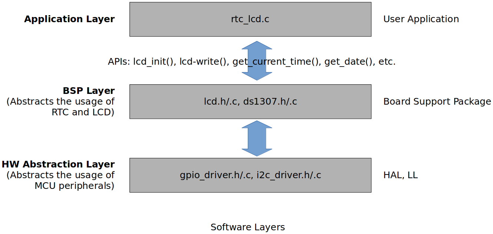
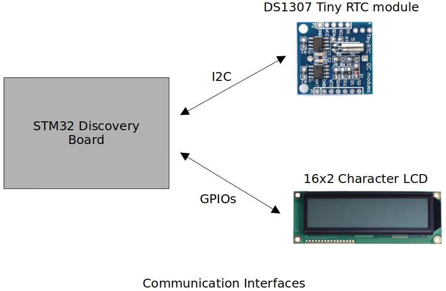
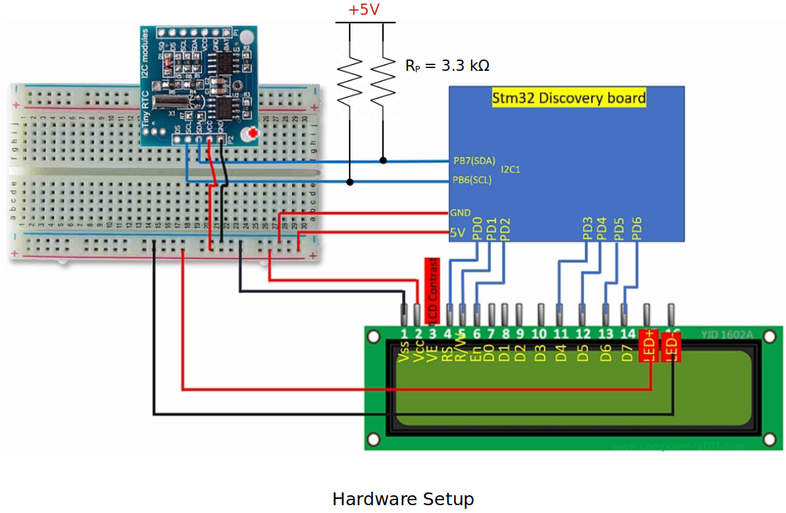
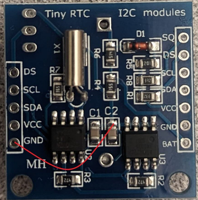
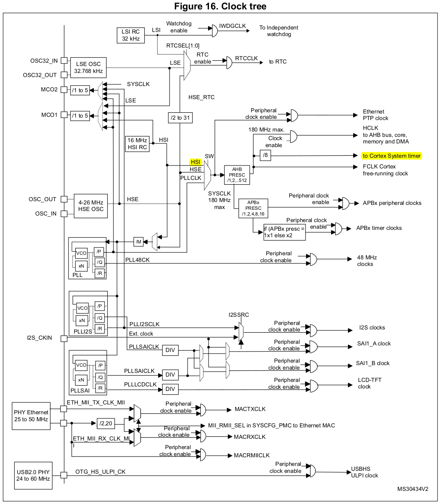

[Home](../../) | [Projects](../../projects) | [Notes](../) > <a href="./">MCU Peripheral Drivers</a> > Introduction to Real-Time Clock on LCD

# Introduction to Real-Time Clock on LCD

## Project Requirements

* Interfacing **DS1307 RTC Chip** and **16x2 Character LCD** to **STM32 Discovery Board**
* Read current time and date information from the DS1307 chip and display it on the LCD
* No Logic Level Shifter will be necessary since the voltage levels between the STM32 Discovery board and the RTC module are compatible. (Check the refernce manuals of the STM32F407xx MCUs and the DS1307 RTC chip.)

### Software Layers

* Hardware Abstraction Layer is MCU-Family dependent.

## Project Setup

### Communication Interfaces

### Hardware Setup

* Internal pull-up resistors can also be used instead of external pull-up resistors.

* The RTC module I purchased from Amazon had some design fault. Following product review helped me work around this issue.

  > 
  >
  > 
  >
  > Poor clone design but  works with a simple modifications. The GND pins on both headers are not  connected to anything. You will have to run a jumper wire from ground to the side of C2 shown in my picture or pin 1,2,3, or pin 4 of U3.  Technically, pins 1-3 of U3 should not even be connected to GND on the  PCB. They should be connected to -VBAT along with pin 4 of U2. If you  plan on daisy chaining these together remember to run another ground  jumper to the header on the other side since it's floating as well.  Anyways, the reason I gave these 3 stars is because they were $7 for 5  boards, keep time well, and seem to work of 3.3V or 5V.
  >
  > $-$ Collin Miller $-$

### Using `printf()` to Print Messages in STM32CubeIDE Console

* See <a href="./using-printf-with-serial-wire-viewer">Using `printf()` with Serial Wire Viewer (SWV)</a>

## Notes

### SysTick Timer

* SysTick Timer (23-bit down count timer) will be used to keep the time in this project. 

* SysTick Timer frequency is derived from HSI (16 MHz) and scaled by using the prescalar value. (We'll be using 1 for prescalar value which will lead to 16 MHz SysTick Timer frequency.)

  * Down-counting will happen every 1/16000000 seconds (i.e., 62.5 ns = 0.0625 $\micro$s)

  * We want 1 interrupt per second. How many down counts equate to 1 second?

    $\to$ 16 x 10^6^ down counts!

  * According to the reference manual, down-counting counts to 0 so the actual down-count value to load in the register should be **16 x 10^6^ - 1** (i.e., 15999999).

  

  
