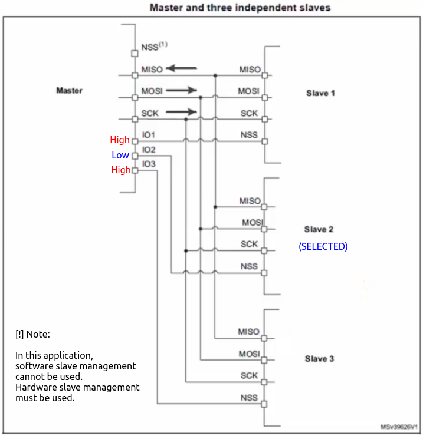
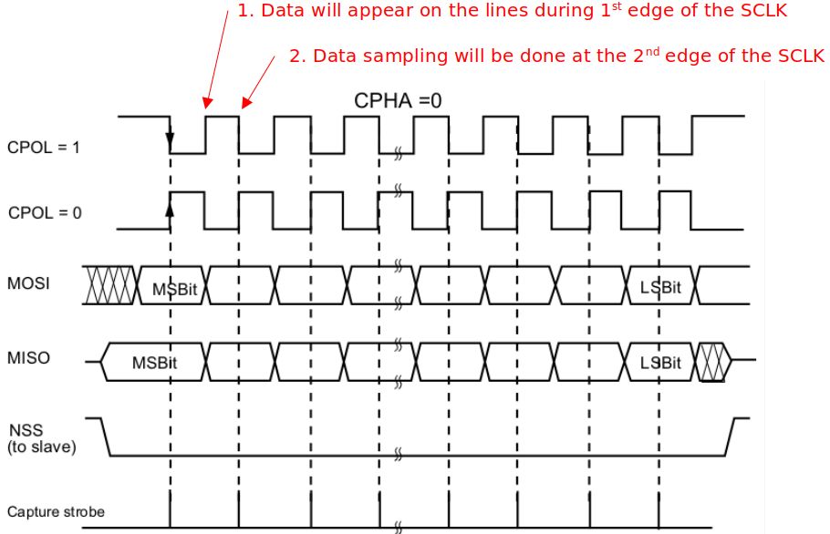
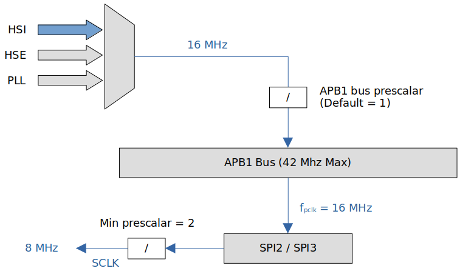
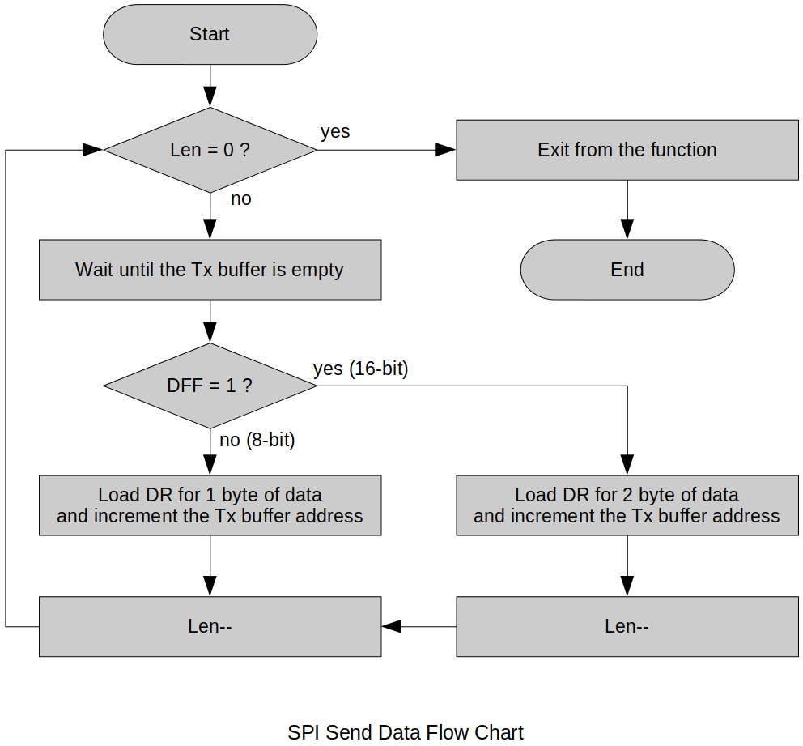
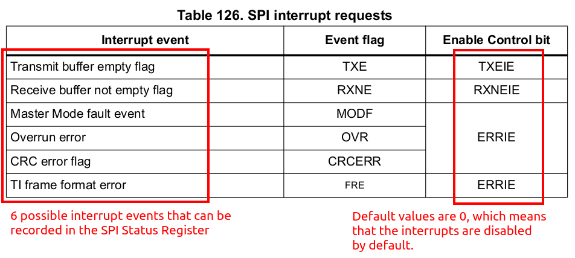

[Home](../../) | [Projects](../../projects) | [Notes](../) > <a href="./">MCU Peripheral Drivers</a> > Introduction to SPI

# Introduction to SPI

## Serial Peripheral Interface (SPI)

* Serial Peripheral Interface (SPI) is a synchronous serial communication protocol commonly used for  communication between microcontrollers, sensors, and other devices.
* The SPI bus allows the communication between one master device and one or more slave devices.
* Four I/O pins are dedicated to SPI communication:
  * **MOSI (Master Out Slave In)**
    * The **data line** used by the master to send data to the slave.
    * In general, this pin is used to transmit data in master mode and receive data in slave mode.
  * **MISO (Master In Slave Out)**
    * The **data line** used by the slave to send data to the master.
    * In general, this pin is used to transmit data in slave mode and receive data in master mode.
  * **SCLK (Serial Clock)**
    * The clock signal generated by the master to synchronize data transfer.
    * Slaves have no control over the serial clock.
    * Without this clock properly working, communication is not at all possible. So, the #1 debugging tip when SPI communication is not working is to check the clock is being produced or not.
  * **SS (Slave Select)**
    * The signal used by the master to select a specific slave device with which it wants to communicate. 
    * Each slave typically has its own SS line.
    * When there's only one slave, SS line is not necessary.
    * This is NOT a data line.
* For any two devices (i.e., master and slave) to be able to communicate using SPI protocol, both of the devices have to support SPI interfaces.

## SPI Communication Sequence

1. The master selects the slave device by asserting the Slave Select (SS) line.
   * Only after the SS line is pulled to GND, the other three lines (SCLK, MOSI, MISO) will be activated.
   * Without SS being pulled to GND, the slave's data communication lines (MOSI, MISO) will be in HI-Z (or high impedance) state.
2. The master generates a clock signal (SCK) to establish the timing. (Synchronization)
3. The master sends data on the MOSI line, while the slave reads it.
4. Simultaneously, the slave prepares its response and sends it on the MISO line.
5. The clock cycles, and data is exchanged bit by bit until the desired number of bits is transmitted.
6. Once the data transfer is complete, the master deasserts the Slave Select (SS) line, indicating the end of communication.

## Minimal SPI Bus

* Depending on the requirements of your application, the number of pins to use for the SPI communication can be customized.

* For example, if a master device is communicating with just one slave device, the SPI bus may consist of just two wires:

  * Clock signal line (SCLK)
  * Synchronous data transfer line (MOSI)

  Since there's only one slave, the slave's SS line can be fixed to GND internally or externally.

  Other signals can be added depending on the data exchange between SPI nodes and their slave select (SS) signal management.

## SPI Hardware: Behind the Scenes

* The following diagram shows when the slave is sending data to the master.

* Notice that when the Msb of the slave is transferred to the Lsb of the master, the Msb of the master shifted out of the shift register gets shifted into the Lsb of the slave's shift register. 

  This is inevitable due to the design and happens in master-to-slave data transfer as well. 

## Customizing SPI Bus: Bus Configuration

* The SPI allows the MCU to communicate using different configurations, depending on the device targeted and the application requirements.

### Full-Duplex Communication

* By default, the SPI is configured for full-duplex communication. 

* In full-duplex configuration, the shift registers of the master and slave are linked using two unidirectional lines between the MOSI and the MISO pins. (Can send and receive data simultaneously)
* During SPI communication, data is shifted synchronously on the SCK clock edges provided by the master.
* The master transmits the data to be sent to the slave via the MOSI line and receives data from the slave via the MISO line.

### Half-Duplex Communication

> Typical resistance of the resistor placed between MOSI and MISO line is 1Kohm.

* In this configuration, one single cross connection line is used to link the shift registers of the master and slave together. 
* During this communication, data is synchronously shifted between the shift registers on the SCK clock edge in the transfer direction selected reciprocally by both master and slave.
* Since it is half-duplex, sending and receiving cannot take place simultaneously. At any given time, the sender must be configured to transmitter mode and the receiver must be configured to receiver mode. This configuration can be done in software.
  * When the master is in transmitter mode, the slave must be in receiver mode, and vice versa.
* By using this configuration, unused pins can be used for other purposes.
  * MISO of master not necessary
  * SS of master not necessary since there's only one slave.
* Although most of the MCU support the half-duplex SPI communication, not all do. So, please double-check the MCU reference manual.

### Simplex Communication

* Applicable to single master, single slave application (Master in transmit-only mode / slave in receive-only mode)

* This configuration settings are the same as full-duplex.
* The application has to ignore the information captured on the unused input pin (MISO). This unused pin can be used as a standard GPIO.

## SPI Block Diagram

* Most of the MCUs have similar SPI block diagrams. The foundation is the "Shift register communication".

* In the case of STM32F407xx MCU, the width of the shift register is 16-bit.

* Rx/Tx buffers can be accessed from the address and data bus (APB bus).

  * Tx mechanism:

    When the Tx buffer is free, an interrupt (**Tx buffer empty**) will be triggered and the data application wants to send will be loaded into the Tx buffer. The data will be loaded into the shift register when it's free and then will be sent out through the corresponding communication line.

  * Rx mechanism:

    Whenever the data is received, it will be stored in the shift register. When a complete data unit (8-bit) is received, the shift register will load that data into the Rx buffer. Once done, an interrupt (**Rx buffer full**) will be triggered and the application will read the data from the Rx buffer.

* By using the SPI control registers (`SPIx_CR1`, `SPIx_CR2`) you can configure various aspects of the SPI communication.

## Slave Select (NSS) Pin Management

* When a device is in slave mode:

  * In slave mode, the NSS works as a standard "chip select" input and lets the slave communicate with the master.

* When a device is in master mode:

  * In master mode, NSS can be used either as output or input.

  * As an input it can prevent multi-master bus collision, and as an output it can drive a slave select signal of a single slave.

  * Example: Single master, single slave scenario

    NSS pin is not required, so set the master's NSS pin to output, the slave's NSS pin to input. (If you set the master's NSS pin to intput then it will be used in detecting multi-master collision when you use the MCU as multi-master circuit. $\to$ Beyond the scope of this project.)

## 2 Types of Slave Managements

* Hardware or software slave select management can be set using the `SSM` bit in the `SPIx_CR1` register.

### Hardware Slave Management

* In this case, you are using the actual hardware to select the slave.

* Hardware NSS management (`SSM = 0`)
  * The NSS pin is managed by the hardware.
  * The master's NSS pin must be in output mode.
  * The NSS line must be pulled to low to activate slave's communication with the master.
  
* For master, NSS output will be enabled when `SSOE = 1`. When `SSOE = 1`,

  If `SSM = 0` and `SPE = 1`, then `NSS` output = 0 (LOW)

  If `SSM = 0` and `SPE = 0`, then `NSS` output = 1 (HIGH)

### Software Slave Management

* Software NSS management (`SSM = 1`)
  * In this configuration, slave select information is driven internally by the `SSI` bit value in the control register `SPIx_CR1`. The external NSS pin is free for other application uses.
  * When `SSI = 0`, the NSS pin will be pulled to GND and the slave will be selected to communicate with the master without using the NSS line.
  * When `SSI = 1`, the NSS will be pulled to HIGH.

### Example

* In the following example of an application, software slave management cannot be used because the master needs to select the slave first.

  Also, since the NSS pin of the master is not used, it is a good idea to pull it to +V~dd~ to avoid any potential errors. (Another way to take care of it is to configure it as "unused". In general NSS pin is nothing but a GPIO pin configured to NSS pin by using alternate function mode.)

* Before initiating the data transfer, the slave must be selected by using the I/O pins of the master as shown below.

### Summary

* Scenario 1: Single master, single slave
  1. No need to use NSS pin of master and slave if software slave management is used.
  2. If you don't want to use software slave management, you can simply connect the NSS pin of the master to that of the slave's
* Scenario 2: Single master, multiple slaves
  1. Software slave management cannot be used here.
  2. You cannot use NSS pin of the master to connect to the NSS pin of the slaves.
  3. The master has to use some of its GPIO pins to control the different NSS pins of the slaves.

## SPI Communication Format

* SPI communication format is dependent on the following three factors:
  * SCLK PHASE (CPHA)
  * SCLK POLARITY (CPOL)
  * Data Frame Format (DFF)
    * Can be either 8-bit data format or 16-bit data format
* During SPI communication, Tx/Rx operations are performed simultaneously.
* The serial clock (SCK) synchronizes the shifting and sampling of the information on the data lines.
* The communication format depends on the clock phase (CPHA), clock polarity (CPOL) and data frame format (DFF). 
* To be able to communicate together, the master and slave devices must follow the same communication format.

### CLOCK POLARITY (CPOL)

* The CPOL bit controls the idle state value of the clock when no data is being transferred.

* If CPOL is reset (CPOL = 0), the SCLK pin has a low-level idle state. (Starts LOW, idles LOW)

  If CPOL is set (CPOL = 1), the SCLK pin has a high-level idle state. (Starts HIGH, idles HIGH)

* What to choose purely depends on the requirements of the application. e.g., If an application requires the clock pin to be HIGH during idle state, then CPOL has to be 1.

* By default, CPOL = 0

### CLOCK PHASE (CPHA)

* CPHA controls at which clock edge of the SCLK (1^st^ edge or 2^nd^ edge) the data should be sampled by the slave.
* The combination of CPOL (clock polarity) and CPHA (clock phase) bits selects the data capture clock edge.
* Which combination of CPHA and CPOL is to be chosen depends on the requirements of the application.
* By default, CPHA = 0

### Summary

* Different SPI Modes

  | Mode | CPOL | CPHA |
  | ---- | ---- | ---- |
  | 0    | 0    | 0    |
  | 1    | 0    | 1    |
  | 2    | 1    | 0    |
  | 3    | 1    | 1    |

* If **CPHA=0**, data will be sampled on the leading edge of the clock.

  * Slave samples data through MOSI
  * Master samples data through MISO

* If **CPHA=1**, data will be sampled on the trailing edge of the clock.

## SPI Serial Clock (SCLK)

* Always check what the maximum SCLK speed of the SPIx peripheral is that is supported by the MCU in use.
* First, you need to know the speed of the APBx bus on which the SPI peripheral is connected.
* Then, you can scale the SCLK according to your project's needs.
* The following diagram represents the STM32F407xx MCU's SPI2/SPI3 clock scaling.
  * If you use PLL and drive APB1 bus at its maximum rate 42 MHz, the SPI2 and SPI3 can produce SCLK of 21 MHz.
  * This means the SPI peripheral's maximum data transfer rate will be 21 million bits per second. This is very high-speed compared to that of I2C's.
  * The second prescalar value (whose min value is 2) can be configured in the control register 1 (CR1) bit fields BR[2:0].

* If we use the internal RC oscillator of 16 MHz as the system clock, SPI1/SPI2/SPI3 peripherals can produce the serial clock of maximum 8 MHz.

## SPI Tx/Rx Algorithms

* SPI Tx flow chart

* SPI Rx flow chart

## SPI Interrupts

* Remember! All interrupts that can be generated by SPI peripheral are disabled by default.

* During SPI communication, interrupts can be generated by the following events:
  * Tx buffer ready to be loaded (i.e., Tx buffer is empty; `TXE = 1`)
  * Data received in Rx buffer (i.e., Rx buffer is NOT empty: `RXNE = 1`)
  * Master mode fault 
    * This is a fault expected in a multi-master environment.
    * In a single-master environment, you should not allow this error from occurring. (Manage `NSS` pin properly!)
  * Overrun error
* Interrupts can be enabled/disabled separately.
* SPI interrupt requests

* SPI interrupting the processor

* SPI interrupt handling sequence

## Various Serial Communication Protocols

| Protocol | Type                | Max Distance (ft.)                      | Max Speed               | Typical Usage                                       |
| -------- | ------------------- | --------------------------------------- | ----------------------- | --------------------------------------------------- |
| USB 3.0  | Dual simplex serial | 9 (typical) (Up to 49 with 5 hubs) | 5G                      | Mass storage video                                  |
| USB 2.0  | Half duplex serial  | 16 (98 ft. with 5 hubs)                 | 1.5M, 12M, 480M         | Keyboard, mouse, drive, speakers, printer, camera   |
| Ethernet | Serial              | 1600                                    | 10G                     | Network, communications                             |
| I2C      | Synchronous serial  | 18                                      | 3.4M in high-speed mode | Microcontroller communications                      |
| RS-232   | Asynchronous serial | 50-100                                  | 20K                     | Modem, mouse, instrumentation                       |
| RS-485   | Asynchronous serial | 4000                                    | 10M                     | Data acquisition and control systems SPI            |
| SPI      | Synchronous serial  | 10                                      | fPCLK/2                 | Collect data from sensors, communicate with display |

> SPI - Achieving **high-speed** data transfer rate within **short distance** between the devices.
>
> I2C - Similar usage to SPI but supports lower-speed
>
> In general, SPI/I2C can be used for communications between on-board peripherals or devices. To cover greater distances and support better quality of service CAN, Ethernet, RS485, RS232 or combination of these can be used.
