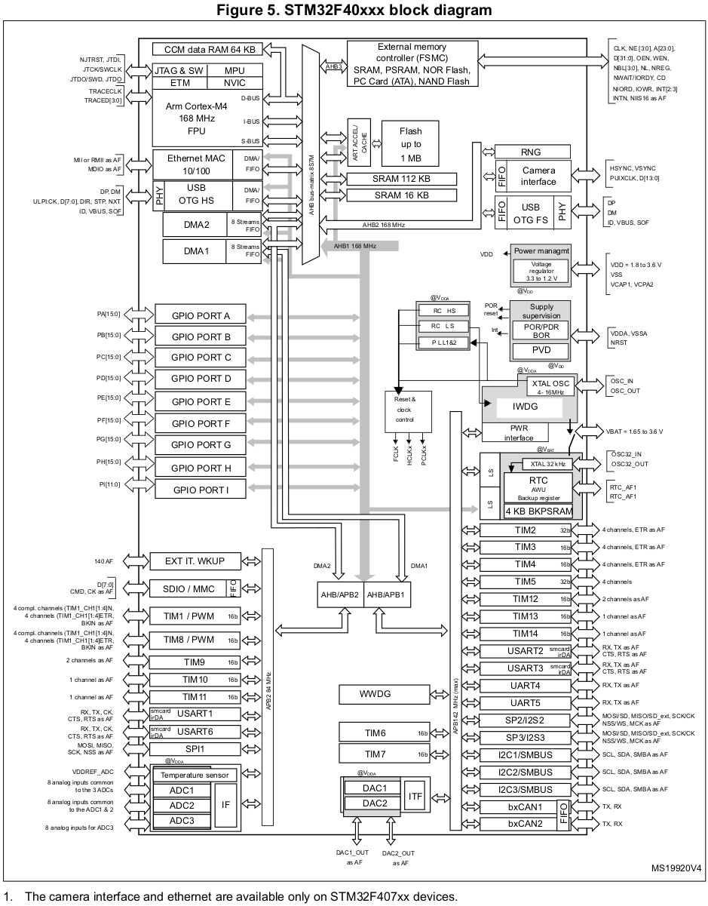

[Home](../../) | [Projects](../../projects) | [Notes](../) > <a href="./">MCU Peripheral Drivers</a> > MCU Block Diagram

# MCU Block Diagram

## STM32F40xxx Block Diagram

## Analyzing MCU Block Diagram

Reference: STM32F407xx MCU

1. **Is the system bus connected to Flash memory?**

   $\to$ No (Only I-Code and D-Code are. This may not be apparent on the block diagram in the 'Functional overview' section, but is clearly described in the zoomed in diagram with more details.)

2. **Can processor fetch instructions from SRAM over I-Code?**

   $\to$ No in general. But there is a way to make it possible.

3. **What's the maximum speed at which the system bus can operate?**

   $\to$ 168 MHz (See the processor portion of the block diagram)

4. **Are SRAMs connected to the system bus?**

   $\to$ Yes (Connected to the system bus via AHB bus-matrix)

5. **What's the maximum speed at which the APB1 can operate?**

   $\to$ 42 MHz (See the block diagram)

6. **Suppose I have a peripheral whose operating frequency or speed must be greater than 95 MHz, can I connect it via APB2 bus?**

   $\to$ No (APB2 bus only supports up to 84 MHz)

7. **Can processor fetch instructions and data simultaneously from SRAM?**

   $\to$ No (There's only one bus connection between the processor and SRAM; the system bus.)

8. **Can processor fetch instructions and data simultaneously from Flash?**

   $\to$ Yes (Since there are two separate buses; I-Code, D-Code)

9. **What's the maximum HCLK frequency?**

   $\to$ 168 MHz (Denoted by the maximum frequency of AHB1 bus interface)

10. **What's the maximum P1CLK frequency?**

    $\to$ 42 MHz (Denoted by the maximum frequency of APB1 bus interface)

11. **What's the maximum P2CLK frequency?**

    $\to$ 84 MHz (Denoted by the maximum frequency of APB2 bus interface)

12. **Do GPIOs and processor communicate over AHB1 bus?**

    $\to$ Yes

13. **Do USB OTG and processor communicate over AHB2 bus?** 

    $\to$ Yes

14. **Can OTG and GPIOs communicate with processor concurrently or simultaneously?**

    $\to$ No (Those communications are serialized by the AHB bus-matrix. The AMBA bus specification is a multi-master bus standard. As a  result, a bus arbiter is required to ensure that only one bus master has access to the bus at any particular time.)

15. **Can processor talk to Flash memory and SRAM simultaneously?**

    $\to$ Yes (There are separate bus interfaces for them; I-Code, D-Code buses for Flash memory, system bus for SRAM)

