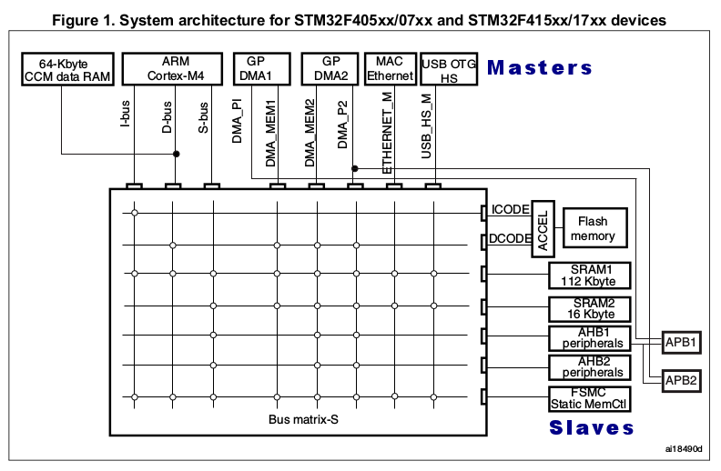

[Home](../../) | [Projects](../../projects) | [Notes](../) > <a href="./">MCU Peripheral Drivers</a> > MCU Bus Interfaces

# MCU Bus Interfaces


## MCU Bus Interfaces

* The Cortex-M4 processor contains 3 external Advanced High-performance Bus (AHB)-Lite bus interfaces: **I-Code**, D-Code, **S bus** interfaces.

  * If the instruction is present in between the memory locations 0x00000000 - 0x1FFFFFFF then the processor will fetch the instruction using I-Code interface.
  * If the instruction is present outside 0x00000000 - 0x1FFFFFFF range then the processor will fetch the instruction over the system bus.
  * If the data is present in between the memory locations 0x00000000 - 0x1FFFFFFF then the processor will fetch the data using D-Code interface.
  * If the data is present outside 0x00000000 - 0x1FFFFFFF range then the processor will fetch the data over the system bus.

  The base address of the Flash memory for STM32F407xx microcontroller is 0x08000000. Therefore, we know that the constant data will be fetched over the D-Code bus interface.

  Many MCU peripherals are located outside the range 0x00000000 - 0x1FFFFFFF and therefore uses system bus interface to communicate.

  [!] Note: Since these bus interfaces belongs to the processor, you need to reference the documentation of the processor (not microcontroller) to learn more about them.

* Data and Storage

  ```c
  #include <string.h>
  #include <stdint.h>
  
  /* String literal (constant data) - Will be stored in ROM (Flash memory) */
  const char *pMessage = "Hello world!";
  
  /* Constant data - Will be stored in ROM (Flash memory) */
  const int value = 100;
  
  /* Variable data - Will be stored in SRAM */
  char data[50];
  
  int main(int argc, char *argv[])
  {
      for (uint32_t i = 0; i < strlen(pMessage); i++)
      {
          /* Data copy from Flash to SRAM */
          data[i] = *(pMessage + i);
      }
      
      for (;;);
  }
  ```


## Bus Matrix

* The AMBA bus specification is a multi-master bus standard. As a  result, a bus arbiter is required to ensure that only one bus master has access to the bus at any particular time.
* The following diagram shows which master can communicate with which slaves via which bus.





## Analyzing MCU Block Diagram

Reference: STM32F407xx MCU

1. Is the system bus connected to Flash memory?

   $\to$ No (Only I-Code and D-Code are. This may not be apparent on the block diagram in the 'Functional overview' section, but is clearly described in the zoomed in diagram with more details.)

2. Can processor fetch instructions from SRAM over I-Code?

   $\to$ No in general. But there is a way to make it possible.

3. What's the maximum speed at which the system bus can operate?

   $\to$ 168 MHz (See the processor portion of the block diagram)

4. Are SRAMs connected to the system bus?

   $\to$ Yes (Connected to the system bus via AHB bus-matrix)

5. What's the maximum speed at which the APB1 can operate?

   $\to$ 42 MHz (See the block diagram)

6. Suppose I have a peripheral whose operating frequency or speed must be greater than 95 MHz, can I connect it via APB2 bus?

   $\to$ No (APB2 bus only supports up to 84 MHz)

7. Can processor fetch instructions and data simultaneously from SRAM?

   $\to$ No (There's only one bus connection between the processor and SRAM; the system bus.)

8. Can processor fetch instructions and data simultaneously from Flash?

   $\to$ Yes (Since there are two separate buses; I-Code, D-Code)

9. What's the maximum HCLK frequency?

   $\to$ 168 MHz (Denoted by the maximum frequency of AHB1 bus interface)

10. What's the maximum P1CLK frequency?

    $\to$ 42 MHz (Denoted by the maximum frequency of APB1 bus interface)

11. What's the maximum P2CLK frequency?

    $\to$ 84 MHz (Denoted by the maximum frequency of APB2 bus interface)

12. Do GPIOs and processor communicate over AHB1 bus?

    $\to$ Yes

13. Do USB OTG and processor communicate over AHB2 bus? 

    $\to$ Yes

14. Can OTG and GPIOs communicate with processor concurrently or simultaneously?

    $\to$ No (Those communications are serialized by the AHB bus-matrix. The AMBA bus specification is a multi-master bus standard. As a  result, a bus arbiter is required to ensure that only one bus master has access to the bus at any particular time.)

15. Can processor talk to Flash memory and SRAM simultaneously?

    $\to$ Yes (There are separate bus interfaces for them; I-Code, D-Code buses for Flash memory, system bus for SRAM)

