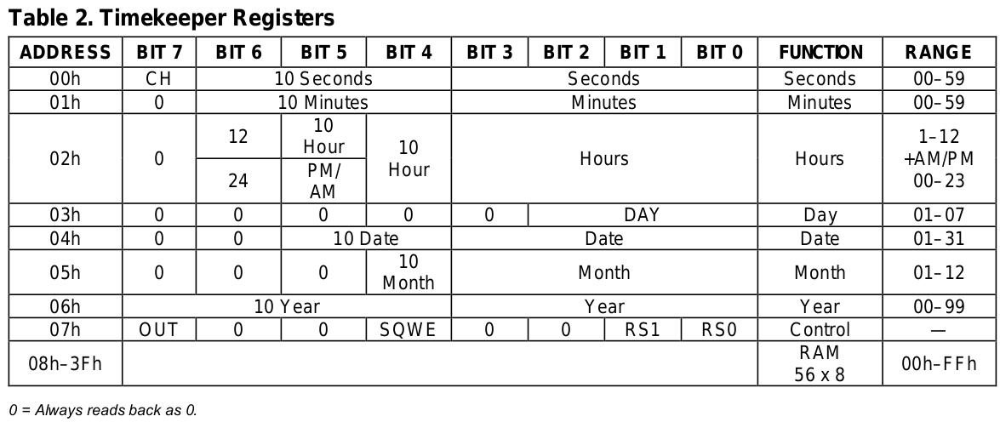

[Home](../../) | [Projects](../../projects) | [Notes](../) > <a href="./">MCU Peripheral Drivers</a> > DS1307 Real-Time Clock (RTC) (DS1307)

# DS1307 Real-Time Clock (RTC) (DS1307)

This notes contains only a small portion of DS1307 specification. For more information, check the reference manual for the DS1307 RTC Chip. 

## DS1307 Tiny RTC Module

### General Description

* The DS1307 serial real-time clock (RTC) is a low-power, full binary-coded decimal (BCD) clock/calendar
  plus 56 bytes of NV SRAM. Address and data are 2 transferred serially through an I C, bidirectional bus.
  The clock/calendar provides seconds, minutes, hours, day, date, month, and year information. The end of
  the month date is automatically adjusted for months with fewer than 31 days, including corrections for leap
  year. The clock operates in either the 24-hour or 12-hour format with AM/PM indicator. The DS1307 has a
  built-in power-sense circuit that detects power failures and automatically switches to the backup supply.
  Timekeeping operation continues while the part operates from the backup supply.

  > Binary-Coded Decimal (BCD): Do the binary encoding for 10's place and 1's place separately. 
  >
  > e.g., 30~(10)~ in BCD is 0011_0000~(2)~ 

### Typical Operating Circuit

### Timekeeper Registers

