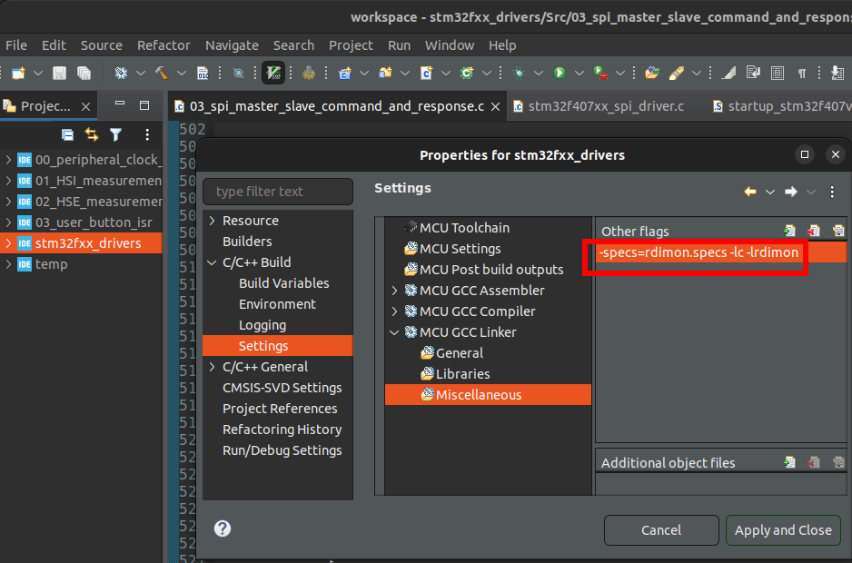
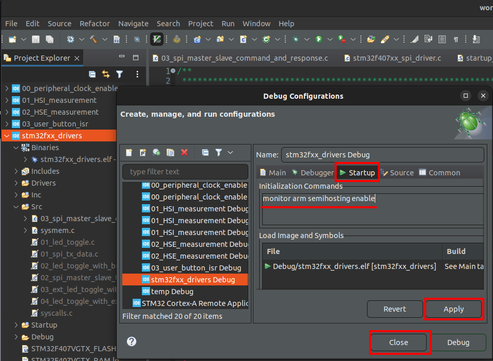
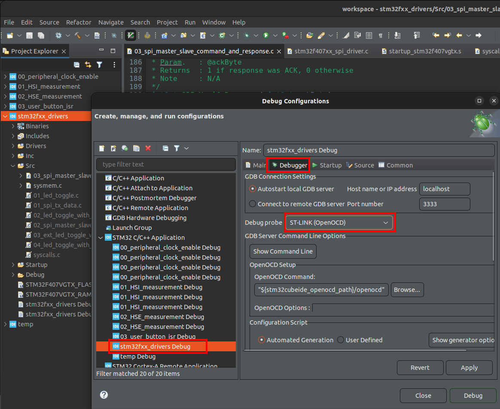
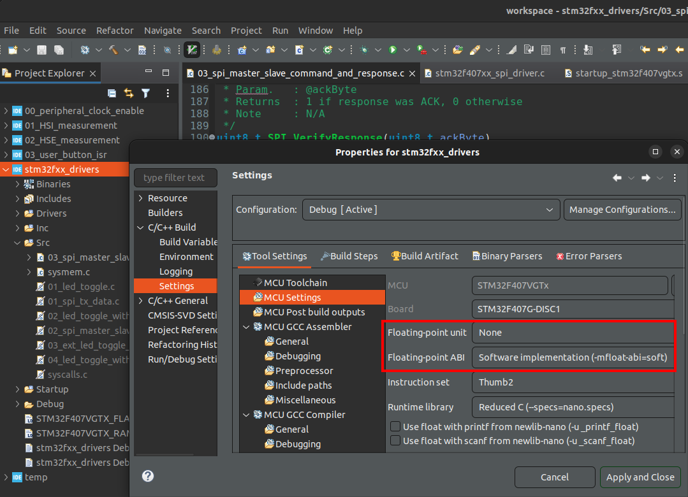

[Home](../../) | [Projects](../../projects) | [Notes](../) > <a href="./">MCU Peripheral Drivers</a> > Semihosting

# Semihosting


## Semihosting Setup for Using `printf()` to Print Messages in Eclipse Console

* When you don't have a logic analyzer to analyze the SPI communication, using `printf()` is a good way to peek at the communication contents. To be able to monitor the message printed out by `printf()`, Semihosting is required.

* Semihosting will work only when the Eclipse IDE and the board are in **debug mode**. (Keep the board in debugging mode!)

* Semihosting setup steps:

  1. Linker flags setup (Add the following linker flags)

     ```plain
     -specs=rdimon.specs -lc -lrdimon
     ```

     Then, build the project. (I excluded `syscalls.c` file from build to take care of a bunch of build errors. This file has to be excluded/removed in Step3 anyways!)

     

     

  2. Debug configuration setup

     ```plain
     monitor arm semihosting enable
     ```

     

     

     

     

     

  3. In the application code (e.g., `03_spi_master_slave_command_and_response.c`), add the following lines of code

     ```c
     extern void initialise_monitor_handles();	/* At the top of the application */
     initialise_monitor_handles();	/* In the beginning of the main() of the application */
     ```

     Then, exclude `syscalls.c` (when using the Semihosting libraries) and build the project. (An empty definition of `initialise_monitor_handles()` in `syscalls.c` file will cause a build error.)

     > My environment didn't work when trying to build the project with above mentioned settings. Further analysis needed!

* When you encounter an exception while working with `printf()` and OpenOCD, take into account the following notes:

  > `printf()` tries to execute `vfprintf()` and results in ARM exception. It looks like `vfprintf()` tried to execute the floating point instructions. The floating point engine on ARM Cortex-M4 processor will be off by default to handle those instructions thus resulting in exception. So, tell the compiler to use the software floating point implementation instead of the hardware floating point implementation.
  >
  > 
  >
  > 
