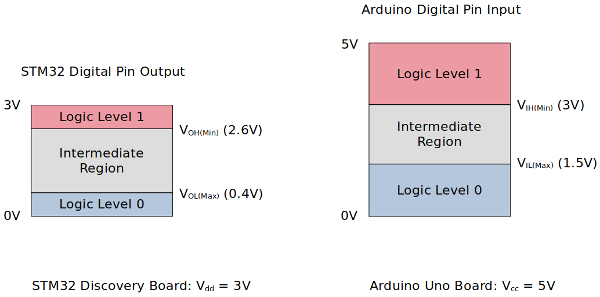
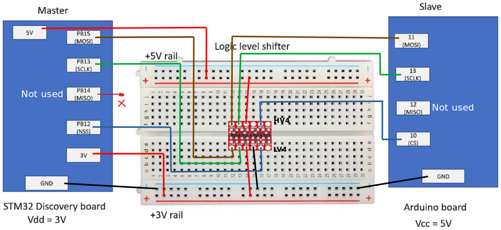
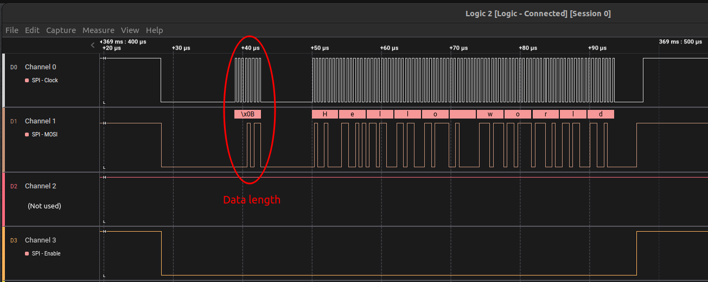
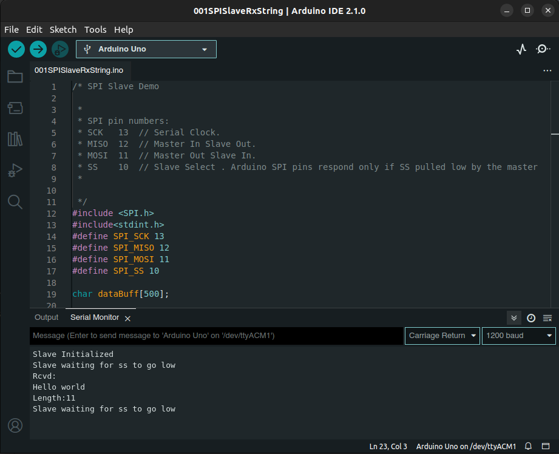

[Home](../../) | [Projects](../../projects) | [Notes](../) > <a href="./">MCU Peripheral Drivers</a> > SPI Application 2: Master Tx (Blocking) (`spi_02_master_tx_blocking.c`)

# SPI Application 2: Master Tx (Blocking) (`spi_02_master_tx_blocking.c`)


## Requirements

* SPI master(STM) and SPI slave(Arduino) communication
* When the button on the master is pressed, master shall send a string of data to the slave in connection. The data received by the slave shall be displayed on the slave's serial port.
* Requirements
  1. Use SPI full duplex mode
  2. ST board will be in SPI master mode, and Arduino board will be in SPI slave mode.
  3. Use DFF = 0
  4. Use hardware slave management (SSM = 0)
  5. SCLK speed = 500 KHz, f~clk~ = 16MHz
* In this application, master is not going to receive anything from the slave. So, configuring the MISO pin is not necessary.
* The slave does not know how many bytes of data master is going to send. So, the master must first send the number of bytes the slave should expect to receive.

### Parts Needed

1. Arduino board
2. STM32 board
3. Logic level converter
4. Breadboard and jumper wires

### STM32 Board and Arduino Board Communication Interfaces


### STM32 Board and Arduino Board Voltage Levels

* To work around the voltage level difference, a **logic level shifter** will be necessary.





## Setup

### 1. Find out the GPIO pins that can be used for SPI2 communication

* For this application, MOSI, SCK and NSS pins will be used. Find out the GPIO pins over which SPI2 can communicate! Look up the "Alternate function mapping" table in the datasheet.
  * **SPI2_MOSI $\to$ PB15 (AF5)**
  * **SPI2_SCK $\to$ PB13 (AF5)**
  * SPI2_MISO $\to$ PB14 (AF5)
  * **SPI2_NSS $\to$ PB12 (AF5)**

### 2. Connect STM32 Discovery board with Arduino Uno board SPI pins

* Be careful not to directly supply 5 volts to the STM32 board pins when the board is not powered up as they may be damaged. When the **logic level shifter** is used, you don't need to worry about this issue.





* To analyze the communication with the logic analyzer, connect the channels as follows:
  * CH0 - SCLK
  * CH1 - MOSI
  * CH2 - MISO
  * CH3 - NSS
  * GND - Common GND of the bread board

### 3. Power Arduino board and upload SPI slave sketch to Arduino

* Sketch name: `001SPISlaveRxString.ino`
  
  As soon as you download this sketch to the Arduino board, it will operate as a slave.


## Code

### `spi_02_master_tx_blocking.c`

Path: `Project/Src/`

```c
/*******************************************************************************
 * File		: spi_02_master_tx_blocking.c
 * Brief	: Program to test SPI master's Tx (blocking) functionality
 * 			  (with slave)
 * Author	: Kyungjae Lee
 * Date		: Jun 02, 2023
 ******************************************************************************/

/**
 * Pin selection for SPI communication
 *
 * SPI2_SCK  - PB13 (AF5)
 * SPI2_MOSI - PB15 (AF5)
 * SPI2_MISO - PB14 (AF5)
 * SPI2_NSS  - PB12 (AF5)
 */

#include <string.h> 		/* strlen() */
#include "stm32f407xx.h"

/**
 * delay()
 * Brief	: Spinlock delays the program execution
 * Param	: None
 * Retval	: None
 * Note		: N/A
 */
void delay(void)
{
	/* Appoximately ~200ms delay when the system clock freq is 16 MHz */
	for (uint32_t i = 0; i < 500000 / 2; i++);
} /* End of Delay */

/**
 * SPI2_PinsInit()
 * Brief	: Initializes and configures GPIO pins to be used as SPI2 pins
 * Param	: None
 * Retval	: None
 * Note		: N/A
 */
void SPI2_PinsInit(void)
{
	GPIO_Handle_TypeDef SPI2Pins;

	/* Zero-out all the fields in the structures (Very important! SPI2Pins
	 * is a local variables whose members may be filled with garbage values before
	 * initialization. These garbage values may set (corrupt) the bit fields that
	 * you did not touch assuming that they will be 0 by default. Do NOT make this
	 * mistake!
	 */
	memset(&SPI2Pins, 0, sizeof(SPI2Pins));

	SPI2Pins.pGPIOx = GPIOB;
	SPI2Pins.GPIO_PinConfig.GPIO_PinMode = GPIO_PIN_MODE_ALTFCN;
	SPI2Pins.GPIO_PinConfig.GPIO_PinAltFcnMode = 5;
	SPI2Pins.GPIO_PinConfig.GPIO_PinOutType = GPIO_PIN_OUT_TYPE_PP;
		/* I2C - Open-drain only!, SPI - Push-pull okay! */
	SPI2Pins.GPIO_PinConfig.GPIO_PinPuPdControl = GPIO_PIN_NO_PUPD;	/* Optional */
	SPI2Pins.GPIO_PinConfig.GPIO_PinSpeed = GPIO_PIN_OUT_SPEED_HIGH; /* Medium or slow ok as well */

	/* SCLK */
	SPI2Pins.GPIO_PinConfig.GPIO_PinNumber = GPIO_PIN_13;
	GPIO_Init(&SPI2Pins);

	/* MOSI */
	SPI2Pins.GPIO_PinConfig.GPIO_PinNumber = GPIO_PIN_15;
	GPIO_Init(&SPI2Pins);

	/* MISO (Not required for this application, save it for other use) */
	//SPI2Pins.GPIO_PinConfig.GPIO_PinNumber = GPIO_PIN_14;
	//GPIO_Init(&SPI2Pins);

	/* NSS */
	SPI2Pins.GPIO_PinConfig.GPIO_PinNumber = GPIO_PIN_12;
	GPIO_Init(&SPI2Pins);
} /* End of SPI2_PinsInit */

/**
 * SPI2_Init()
 * Brief	: Creates an SPI2Handle and initializes SPI2 peripheral parameters
 * Param	: None
 * Retval	: None
 * Note		: N/A
 */
void SPI2_Init(void)
{
	SPI_Handle_TypeDef SPI2Handle;

	/* Zero-out all the fields in the structures (Very important! SPI2Handle
	 * is a local variables whose members may be filled with garbage values before
	 * initialization. These garbage values may set (corrupt) the bit fields that
	 * you did not touch assuming that they will be 0 by default. Do NOT make this
	 * mistake!
	 */
	memset(&SPI2Handle, 0, sizeof(SPI2Handle));

	SPI2Handle.pSPIx = SPI2;
	SPI2Handle.SPI_Config.SPI_BusConfig = SPI_BUS_CONFIG_FULL_DUPLEX;
	SPI2Handle.SPI_Config.SPI_DeviceMode = SPI_DEVICE_MODE_MASTER;
    SPI2Handle.SPI_Config.SPI_SCLKSpeed = SPI_SCLK_SPEED_PRESCALAR_32;  /* Generates 500KHz SCLK */
		/* Min prescalar -> maximum clk speed */
	SPI2Handle.SPI_Config.SPI_DFF = SPI_DFF_8BITS;
	SPI2Handle.SPI_Config.SPI_CPOL = SPI_CPOL_LOW;
	SPI2Handle.SPI_Config.SPI_CPHA = SPI_CPHA_LOW;
	SPI2Handle.SPI_Config.SPI_SSM = SPI_SSM_DI; /* HW slave mgmt enabled (SSM = 0) for NSS pin */

	SPI_Init(&SPI2Handle);
} /* End of SPI2_Init */

/**
 * GPIO_ButtonInit()
 * Brief	: Initializes a GPIO pin for button
 * Param	: None
 * Retval	: None
 * Note		: N/A
 */
void GPIO_ButtonInit(void)
{
	GPIO_Handle_TypeDef GPIOBtn;

	/* Zero-out all the fields in the structures (Very important! GPIOBtn
	 * is a local variables whose members may be filled with garbage values before
	 * initialization. These garbage values may set (corrupt) the bit fields that
	 * you did not touch assuming that they will be 0 by default. Do NOT make this
	 * mistake!
	 */
	memset(&GPIOBtn, 0, sizeof(GPIOBtn));

	/* GPIOBtn configuration */
	GPIOBtn.pGPIOx = GPIOA;
	GPIOBtn.GPIO_PinConfig.GPIO_PinNumber = GPIO_PIN_0;
	GPIOBtn.GPIO_PinConfig.GPIO_PinMode = GPIO_PIN_MODE_IN;
	GPIOBtn.GPIO_PinConfig.GPIO_PinSpeed = GPIO_PIN_OUT_SPEED_HIGH; /* Doesn't matter */
	//GPIOBtn.GPIO_PinConfig.GPIO_PinOutType = GPIO_PIN_OUT_TYPE_PP;	/* N/A */
	GPIOBtn.GPIO_PinConfig.GPIO_PinPuPdControl = GPIO_PIN_NO_PUPD;
		/* External pull-down resistor is already present (see the schematic) */
	GPIO_Init(&GPIOBtn);
} /* End of GPIO_ButtonInit */


int main(int argc, char *argv[])
{
	char msg[] = "Hello world";

	/* Initialize and configure GPIO pin for user button */
	GPIO_ButtonInit();

	/* Initialize and configure GPIO pins to be used as SPI2 pins */
	SPI2_PinsInit();

	/* Initialize SPI2 peripheral parameters */
	SPI2_Init();
		/* At this point, all the required parameters are loaded into SPIx control registers.
		 * But, this does not mean that SPI2 peripheral is enabled.
		 *
		 * SPI configuration must be completed before it is enabled. When SPI is enabled, it
		 * will be busy communicating with other device(s) and will not allow modifying its
		 * control registers.
		 */

	/* Enable NSS output (Set SPI_CR2 bit[2] SSOE - Slave Select Output Enable) */
	SPI_SSOEConfig(SPI2, ENABLE);
		/* Setting SSOE bit to 1 enables the NSS output.
		 * The NSS pin is automatically managed by the hardware.
		 * i.e., When SPE = 1, NSS will be pulled to low, and when SPE = 0, NSS will be
		 * pulled to high.
		 */

	while (1)
	{
		/* Wait until button is pressed */
		while (!GPIO_ReadFromInputPin(GPIOA, GPIO_PIN_0));

		/* Introduce debouncing time for button press */
		delay();

		/* Enable SPI2 peripheral (Set SPI_CR1 bit[6] SPE - Peripheral enabled) */
		SPI_PeriControl(SPI2, ENABLE);

		/* Arduino sketch expects 1 byte of length information followed by data */
		/* Send length information to the slave first */
		uint8_t msgLen = strlen(msg);
		SPI_TxBlocking(SPI2, &msgLen, 1);
		/* Send data */
		SPI_TxBlocking(SPI2, (uint8_t *)msg, strlen(msg));

		/* Wait until SPI no longer busy */
		while (SPI2->SR & (0x1 << SPI_SR_BSY));
			/* SPI_SR bit[7] - BSY (Busy flag)
			 * 0: SPI (or I2S) not busy
			 * 1: SPI (or I2S) is busy in communication or Tx buffer is not empty
			 * This flag is set and cleared by hardware.
			 */

		/* Disable SPI2 peripheral (Terminate communication) */
		SPI_PeriControl(SPI2, DISABLE);
	}

	return 0;
} /* End of main */
```

> The master's clock frequency has been adjusted from 2 MHz (prescalar = 8) to 500 KHz (prescalar = 32) to be compatible with the baudrate (1200) of the slave.


## Arduino Sketch (`001SPISlaveRxString.ino`)

```c
/* SPI Slave Demo

 *
 * SPI pin numbers:
 * SCK   13  // Serial Clock.
 * MISO  12  // Master In Slave Out.
 * MOSI  11  // Master Out Slave In.
 * SS    10  // Slave Select . Arduino SPI pins respond only if SS pulled low by the master
 *
 
 */
#include <SPI.h>
#include<stdint.h>  
#define SPI_SCK 13
#define SPI_MISO 12
#define SPI_MOSI 11
#define SPI_SS 10

char dataBuff[500];

//Initialize SPI slave.
void SPI_SlaveInit(void) 
{ 
  // Initialize SPI pins.
  pinMode(SCK, INPUT);
  pinMode(MOSI, INPUT);
  pinMode(MISO, OUTPUT);
  pinMode(SS, INPUT);
  //make SPI as slave
  
  // Enable SPI as slave.
  SPCR = (1 << SPE);
}

//This function returns SPDR Contents 
uint8_t SPI_SlaveReceive(void)
{
  /* Wait for reception complete */
  while(!(SPSR & (1<<SPIF)));
  /* Return Data Register */
  return SPDR;
}


//sends one byte of data 
void SPI_SlaveTransmit(char data)
{
  /* Start transmission */
  SPDR = data;
  /* Wait for transmission complete */
  while(!(SPSR & (1<<SPIF)));
}
  

// The setup() function runs right after reset.
void setup() 
{
  // Initialize serial communication 
  Serial.begin(1200);
  // Initialize SPI Slave.
  SPI_SlaveInit();
  Serial.println("Slave Initialized");
}

// The loop function runs continuously after setup().
void loop() 
{
  uint32_t i;
  uint16_t dataLen = 0;
  Serial.println("Slave waiting for ss to go low");
  while(digitalRead(SS));

  i = 0;
  dataLen = SPI_SlaveReceive();
  for(i = 0 ; i < dataLen ; i++ )
  {
    dataBuff[i] =  SPI_SlaveReceive();
  }


  //  Serial.println(String(i,HEX));
  dataBuff[i] = '\0';
  
  Serial.println("Rcvd:");
  Serial.println(dataBuff);
  Serial.print("Length:");
  Serial.println(dataLen);
}
```

> Original baudrate (9600) has been changed to 1200 since the communication didn't work with the original baudrate. (In the STM32 application, the master's clock frequency has been adjusted from 2 MHz to 500 KHz accordingly.)


## Testing

The following snapshots are taken using the Logic Analyzer.


### Entire Communication



> Notice that as soon as `SPE` is set to 0, `NSS` is pulled to GND (LOW), and as soon as `SPE` is set to 1, `NSS` is pulled to HIGH automatically by the hardware.

* Although data was successfully sent out by the STM32 Discovery board (as shown in the snapshot above), the Arduino Uno R3 board didn't seem to receive the data. 

  SPI pins of the STM32 board was set to 2MHz, and Arduino board serial monitor baudrate was set to 9600.

  Test and debug this application again!


### Arduino IDE Serial Monitor


