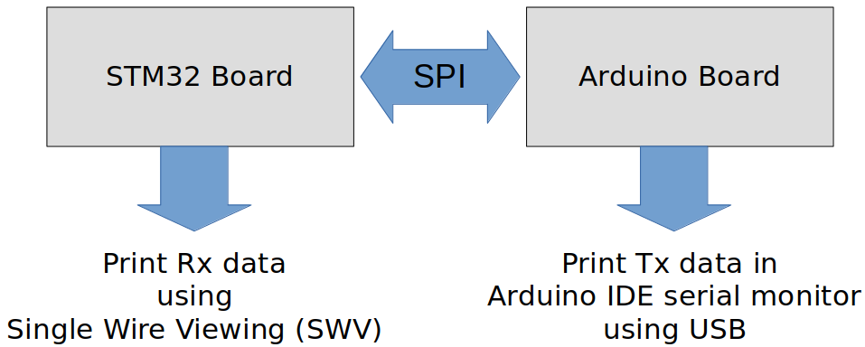
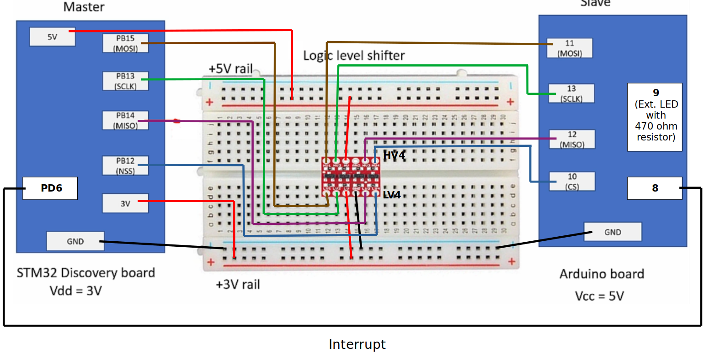
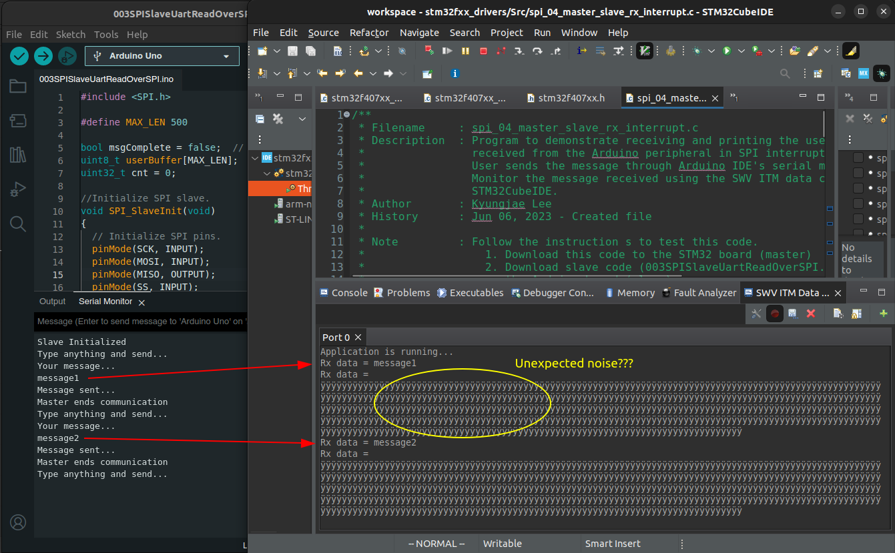

[Home](../../) | [Projects](../../projects) | [Notes](../) > <a href="./">MCU Peripheral Drivers</a> > SPI Application 4: Master Rx (Interrupt) (`spi_04_master_rx_interrupt`)

# SPI Application 4: Master-Slave Rx (Interrupt) (`spi_04_master_rx_interrupt`)


## Requirements

* STM32 Discovery board (master) receives the message from the Arduino board (slave) over SPI.
  1. User enters the message using Arduino serial monitor terminal
  2. Arduino board notifies the STM32 board about message availability
  3. STM32 board reads and prints the message
* Requirements
  1. Use SPI full duplex mode
  2. ST board will be in SPI master mode, and Arduino board will be in SPI slave mode.
  3. Use DFF = 0
  4. Use hardware slave management (SSM = 0)
  5. SCLK speed = 500 KHz, f~clk~ = 16MHz

### Parts Needed

1. Arduino board
2. STM32 board
3. Logic level converter
4. Breadboard and jumper wires

### STM32 Board and Arduino Board Communication Interfaces





### STM32 Board and Arduino Board Voltage Levels

* To work around the voltage level difference, a **logic level shifter** will be necessary.


## Setup

### 1. Find out the GPIO pins that can be used for SPI2 communication

* For this application, all four SPI communication lines (i.e., MOSI, MISO, SCK and NSS pins) will be used. Find out the GPIO pins over which SPI2 can communicate! Look up the "Alternate function mapping" table in the datasheet.
  * **SPI2_MOSI $\to$ PB15 (AF5)**
  * **SPI2_SCK $\to$ PB13 (AF5)**
  * **SPI2_MISO $\to$ PB14 (AF5)**
  * **SPI2_NSS $\to$ PB12 (AF5)**

### 2. Connect STM32 Discovery board with Arduino Uno board SPI pins

* Pin connection is basically the same as that of the **SPI Application 3**'s. Just an interrupt line is added between the pin `PD6` of the STM32 board and `8` of the Arduino board.
  * Arduino board pin `8` will transition from HIGH to LOW whenever a message (entered by user through Arduino serial monitor) is availablen and this will trigger an interrupt through STM32 board's pin `PD6` to notify the master of the message ready for read.
  * Master will then generate clock signal to read the data.
* Be careful not to directly supply 5 volts to the STM32 board pins when the board is not powered up as they may be damaged. When the **logic level shifter** is used, you don't need to worry about this issue.





* To analyze the communication with the logic analyzer, connect the channels as follows:
  * CH0 - SCLK
  * CH1 - MOSI
  * CH2 - MISO
  * CH3 - NSS
  * GND - Common GND of the bread board

### 3. Power Arduino board and upload SPI slave sketch to Arduino

* Sketch name: `003SPISlaveUartReadOverSPI.ino`
  
  As soon as you download this sketch to the Arduino board, it will operate as a slave.


## Code

### `spi_04_master_rx_interrupt.c`

Path: `Project/Src/`

```c
/*******************************************************************************
 * File		: spi_04_master_rx_interrupt.c
 * Brief	: Program to demonstrate receiving and printing the user message
 * 			  received from the Arduino peripheral in SPI interrupt mode.
 * 			  User sends the message through Arduino IDE's serial monitor tool.
 * 			  Monitor the message received using the SWV ITM data console of
 * 			  STM32CubeIDE.
 * Author	: Kyungjae Lee
 * Date		: Jun 06, 2023
 *
 * Note		: Follow the instruction s to test this code.
 * 				1. Download this code to the STM32 board (master)
 * 				2. Download slave code (003SPISlaveUartReadOverSPI.ino) to
 * 				   the Arduino board (slave)
 * 				3. Reset both boards
 * 				4. Enable SWV ITM data console to see the message
 * 				5. Open Arduino IDE serial monitor tool
 * 				6. Type anything and send the message (Make sure to set the
 * 				   line ending to 'carriage return'.)
 ******************************************************************************/

/**
 * Pin selection for SPI communication
 *
 * SPI2_NSS  - PB12 (AF5)
 * SPI2_SCK  - PB13 (AF5)
 * SPI2_MISO - PB14 (AF5)
 * SPI2_MOSI - PB15 (AF5)
 */

#include <stdio.h>			/* printf() */
#include <string.h> 		/* strlen() */
#include "stm32f407xx.h"

#define MAX_LEN	500

/* Global variables */
SPI_Handle_TypeDef SPI2Handle;
char rxBuf[MAX_LEN];
volatile uint8_t rxByte;
volatile uint8_t rxStop = 0;
	/* Declare it as 'volatile' since it gets modified in the
	 * 'SPI_ApplicationEventCallback()' function, which runs in the
	 * 'SPI2_IRQHander''s context
	 */
volatile uint8_t dataAvailable = 0;
	/* This flag will be set in the interrupt handler of the Arduino interrupt GPIO
	 * (Since it gets modified inside the ISR, declare it as 'volatile')
	 */

/**
 * delay()
 * Brief	: Spinlock delays the program execution
 * Param	: None
 * Retval	: None
 * Note		: N/A
 */
void delay(void)
{
	/* Appoximately ~200ms delay when the system clock freq is 16 MHz */
	for (uint32_t i = 0; i < 500000 / 2; i++);
} /* End of Delay */

/**
 * SPI2_PinsInit()
 * Brief	: Initializes and configures GPIO pins to be used as SPI2 pins
 * Param	: None
 * Retval	: None
 * Note		: N/A
 */
void SPI2_PinsInit(void)
{
	GPIO_Handle_TypeDef SPI2Pins;

	/* Zero-out all the fields in the structures (Very important! SPI2Pins
	 * is a local variables whose members may be filled with garbage values before
	 * initialization. These garbage values may set (corrupt) the bit fields that
	 * you did not touch assuming that they will be 0 by default. Do NOT make this
	 * mistake!
	 */
	memset(&SPI2Pins, 0, sizeof(SPI2Pins));

	SPI2Pins.pGPIOx = GPIOB;
	SPI2Pins.GPIO_PinConfig.GPIO_PinMode = GPIO_PIN_MODE_ALTFCN;
	SPI2Pins.GPIO_PinConfig.GPIO_PinAltFcnMode = 5;
	SPI2Pins.GPIO_PinConfig.GPIO_PinOutType = GPIO_PIN_OUT_TYPE_PP;
		/* I2C - Open-drain only!, SPI - Push-pull okay! */
	SPI2Pins.GPIO_PinConfig.GPIO_PinPuPdControl = GPIO_PIN_NO_PUPD;	/* Optional */
	SPI2Pins.GPIO_PinConfig.GPIO_PinSpeed = GPIO_PIN_OUT_SPEED_HIGH; /* Medium or slow ok as well */

	/* SCLK */
	SPI2Pins.GPIO_PinConfig.GPIO_PinNumber = GPIO_PIN_13;
	GPIO_Init(&SPI2Pins);

	/* MOSI */
	SPI2Pins.GPIO_PinConfig.GPIO_PinNumber = GPIO_PIN_15;
	GPIO_Init(&SPI2Pins);

	/* MISO */
	SPI2Pins.GPIO_PinConfig.GPIO_PinNumber = GPIO_PIN_14;
	GPIO_Init(&SPI2Pins);

	/* NSS */
	SPI2Pins.GPIO_PinConfig.GPIO_PinNumber = GPIO_PIN_12;
	GPIO_Init(&SPI2Pins);
} /* End of SPI2_PinsInit */

/**
 * SPI2_Init()
 * Brief	: Creates an SPI2Handle and initializes SPI2 peripheral parameters
 * Param	: None
 * Retval	: None
 * Note		: N/A
 */
void SPI2_Init(void)
{
	SPI2Handle.pSPIx = SPI2;
	SPI2Handle.SPI_Config.SPI_BusConfig = SPI_BUS_CONFIG_FULL_DUPLEX;
	SPI2Handle.SPI_Config.SPI_DeviceMode = SPI_DEVICE_MODE_MASTER;
    SPI2Handle.SPI_Config.SPI_SCLKSpeed = SPI_SCLK_SPEED_PRESCALAR_32;  /* Generates 500KHz SCLK */
		/* Min prescalar -> maximum clk speed */
	SPI2Handle.SPI_Config.SPI_DFF = SPI_DFF_8BITS;
	SPI2Handle.SPI_Config.SPI_CPOL = SPI_CPOL_LOW;
	SPI2Handle.SPI_Config.SPI_CPHA = SPI_CPHA_LOW;
	SPI2Handle.SPI_Config.SPI_SSM = SPI_SSM_DI; /* HW slave mgmt enabled (SSM = 0) for NSS pin */

	SPI_Init(&SPI2Handle);
} /* End of SPI2_Init */

/**
 * SPI2_IntPinInit()
 * Brief	: Configures the GPIO pin (PD6) over which SPI peripheral issues
 * 			  'data available' interrupt
 * Param	: None
 * Retval	: None
 * Note		: N/A
 */
void SPI2_IntPinInit(void)
{
	GPIO_Handle_TypeDef SPIIntPin;
	memset(&SPIIntPin, 0, sizeof(SPIIntPin));

	/* GPIO pin (for interrupt) configuration */
	SPIIntPin.pGPIOx = GPIOD;
	SPIIntPin.GPIO_PinConfig.GPIO_PinNumber = GPIO_PIN_6;
	SPIIntPin.GPIO_PinConfig.GPIO_PinMode = GPIO_PIN_MODE_IT_FT;
	SPIIntPin.GPIO_PinConfig.GPIO_PinSpeed = GPIO_PIN_OUT_SPEED_LOW;
	SPIIntPin.GPIO_PinConfig.GPIO_PinPuPdControl = GPIO_PIN_PU;

	GPIO_Init(&SPIIntPin);

	GPIO_IRQPriorityConfig(IRQ_NO_EXTI9_5, NVIC_IRQ_PRI15);
	GPIO_IRQInterruptConfig(IRQ_NO_EXTI9_5, ENABLE);
} /* End of SPI2_IntPinInit */


int main(int argc, char *argv[])
{
	uint8_t dummyWrite = 0xFF;

	printf("Application is running...\n");

	/* Initialize and configure GPIO pin for SPI Rx interrupt */
	SPI2_IntPinInit();

	/* Initialize and configure GPIO pins to be used as SPI2 pins */
	SPI2_PinsInit();

	/* Initialize SPI2 peripheral parameters */
	SPI2_Init();
		/* At this point, all the required parameters are loaded into SPIx control registers.
		 * But, this does not mean that SPI2 peripheral is enabled.
		 *
		 * SPI configuration must be completed before it is enabled. When SPI is enabled, it
		 * will be busy communicating with other device(s) and will not allow modifying its
		 * control registers.
		 */

	/* Enable NSS output (Set SPI_CR2 bit[2] SSOE - Slave Select Output Enable) */
	SPI_SSOEConfig(SPI2, ENABLE);
		/* Setting SSOE bit to 1 enables the NSS output.
		 * The NSS pin is automatically managed by the hardware.
		 * i.e., When SPE = 1, NSS will be pulled to low, and when SPE = 0, NSS will be
		 * pulled to high.
		 */

	/* Enable interrupt for SPI2 peripheral */
	SPI_IRQInterruptConfig(IRQ_NO_SPI2, ENABLE);

	while (1)
	{
		rxStop = 0;

		/* Wait until 'data available' interrupt is triggered by the transmitter (slave) */
		while (!dataAvailable);

		/* Until the master completes reading in the data available, it disables further
		 * Rx interrupt from the slave device.
		 */
		GPIO_IRQInterruptConfig(IRQ_NO_EXTI9_5, DISABLE);

		/* Enable SPI2 peripheral */
		SPI_PeriControl(SPI2, ENABLE);

		while (!rxStop)
		{
			/* Read the data from the SPI2 peripheral byte-by-byte in interrupt mode */
			while (SPI_TxInterrupt(&SPI2Handle, &dummyWrite, 1) == SPI_BUSY_IN_TX);
			while (SPI_RxInterrupt(&SPI2Handle, &rxByte, 1) == SPI_BUSY_IN_RX);

			/* Note: Master does not have the length information. This process will
			 *       go on and on until the 'dataAvailable' flag is set back to 0.
			 */
		}

		/* Wait until SPI no longer busy */
		while (SPI2->SR & (0x1 << SPI_SR_BSY));
			/* SPI_SR bit[7] - BSY (Busy flag)
			 * 0: SPI (or I2S) not busy
			 * 1: SPI (or I2S) is busy in communication or Tx buffer is not empty
			 * This flag is set and cleared by hardware.
			 */

		/* Disable SPI2 peripheral (Terminate communication) */
		SPI_PeriControl(SPI2, DISABLE);

		/* Print the received message to the SWV ITM data console */
		printf("Rx data = %s\n", rxBuf);

		/* Reset the 'dataAvailable' flag */
		dataAvailable = 0;

		/* Enable back the interrupt for Rx notification from the slave */
		GPIO_IRQInterruptConfig(IRQ_NO_EXTI9_5, ENABLE);
	}

	return 0;
} /* End of main */

/**
 * SPI2_IRQHandler()
 * Brief	: Handles SPI2 interrupt (by calling 'SPI_IRQHandling()')
 * Param	: None
 * Retval	: None
 * Note		: N/A
 */
void SPI2_IRQHandler(void)
{
	SPI_IRQHandling(&SPI2Handle);
} /* End of SPI2_IRQHandler */

/**
 * EXTI9_5_IRQHandler()
 * Brief	: Handles EXTI IRQ 5 to 9 (by calling 'GPIO_IRQHandling()')
 * Param	: None
 * Retval	: None
 * Note		: N/A
 */
void EXTI9_5_IRQHandler(void)
{
	GPIO_IRQHandling(GPIO_PIN_6);
	dataAvailable = 1;
} /* End of EXTI9_5_IRQHandler */

/**
 * SPI_ApplicationEventCallback()
 * Brief	: Notifies the application of the event occurred
 * Param	: @pSPIHandle - pointer to SPI handle structure
 * 			  @appEvent - SPI event occurred
 * Retval	: None
 * Note		: N/A
 */
void SPI_ApplicationEventCallback(SPI_Handle_TypeDef *pSPIHandle, uint8_t appEvent)
{
	static uint32_t i = 0;

	/* Upon the Rx complete event, copy the data into Rx buffer.
	 * '\0' indicates end of message (rxStop = 1)
	 */
	if (appEvent == SPI_EVENT_RX_CMPLT)
	{
		rxBuf[i++] = rxByte;

		if (rxByte == '\0' || (i == MAX_LEN))
		{
			rxStop = 1;
			rxBuf[i - 1] = '\0';	/* Mark the end of the message with '\0' */
			i = 0;
		}
	}
} /* End of SPI_ApplicationEventCallback */
```

> The master's clock frequency has been adjusted from 2 MHz (prescalar = 8) to 500 KHz (prescalar = 32) to be compatible with the baudrate (1200) of the slave.
>
> FYI using 500 KHz for the master and 9600 bps for slave also worked.


## Arduino Sketch (`003SPISlaveUartReadOverSPI.ino`)

```c
#include <SPI.h>

#define MAX_LEN 500

bool msgComplete = false;  // whether the string is complete
uint8_t userBuffer[MAX_LEN];
uint32_t cnt = 0;

//Initialize SPI slave.
void SPI_SlaveInit(void) 
{ 
  // Initialize SPI pins.
  pinMode(SCK, INPUT);
  pinMode(MOSI, INPUT);
  pinMode(MISO, OUTPUT);
  pinMode(SS, INPUT);
  // Enable SPI as slave.
  SPCR = (1 << SPE);
}

//This function returns SPDR Contents 
uint8_t SPI_SlaveReceive(void)
{
  /* Wait for reception complete */
  while(!(SPSR & (1<<SPIF)));
  /* Return Data Register */
  return SPDR;
}


//sends one byte of data 
void SPI_SlaveTransmit(uint8_t data)
{
  /* Start transmission */
  SPDR = data;
  
  /* Wait for transmission complete */
  while(!(SPSR & (1<<SPIF)));
}
 
void setup() 
{
  // Initialize serial for troubleshooting.
  Serial.begin(1200);
  
  // Initialize SPI Slave.
  SPI_SlaveInit();

  pinMode(8, INPUT_PULLUP);
  //digitalWrite(8,LOW);

  Serial.println("Slave Initialized");
}

void notify_controller(void)
{
  pinMode(8,OUTPUT);
  digitalWrite(8,HIGH);
  delayMicroseconds(50);
  digitalWrite(8,LOW);
}


void loop() {
  
  Serial.println("Type anything and send...");

  while(!msgComplete){
    if (Serial.available()) {
      //Read a byte of incoming serial data.
      char readByte = (char)Serial.read();
      //Accumalate in to the buffer
      userBuffer[cnt++] = readByte;
      if(readByte == '\r' || ( cnt == MAX_LEN)){
        msgComplete = true;
        userBuffer[cnt -1 ] = '\0'; //replace '\r' by '\0'
      }
    }
  }
  
  Serial.println("Your message...");
  Serial.println((char*)userBuffer);

  
   notify_controller();

  /*Transmit the user buffer over SPI */
  for(uint32_t i = 0 ; i < cnt ; i++)
  {
    SPI_SlaveTransmit(userBuffer[i]);
  }
  cnt = 0;
  msgComplete = false;
  Serial.println("Message sent...");

  while(!digitalRead(SS));
  Serial.println("Master ends communication");
 
}
```

> Original baudrate (9600) has been changed to 1200 since the communication didn't work with the original baudrate. (In the STM32 application, the master's clock frequency has been adjusted from 2 MHz to 500 KHz accordingly.)
>
> FYI using 500 KHz for the master and 9600 bps for slave also worked.


## Testing

Debugging required! Master and slave are able to communicate with each other but some noise kicks in as shown in the snapshot below.



