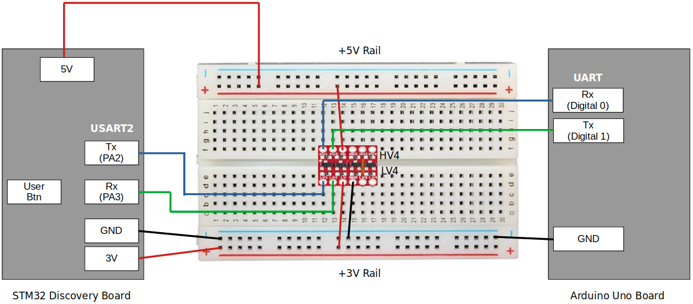
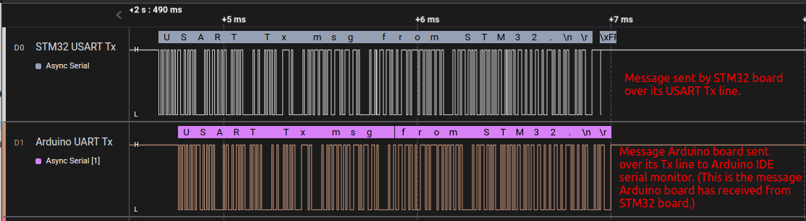
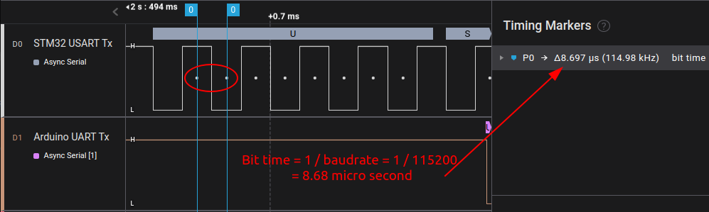
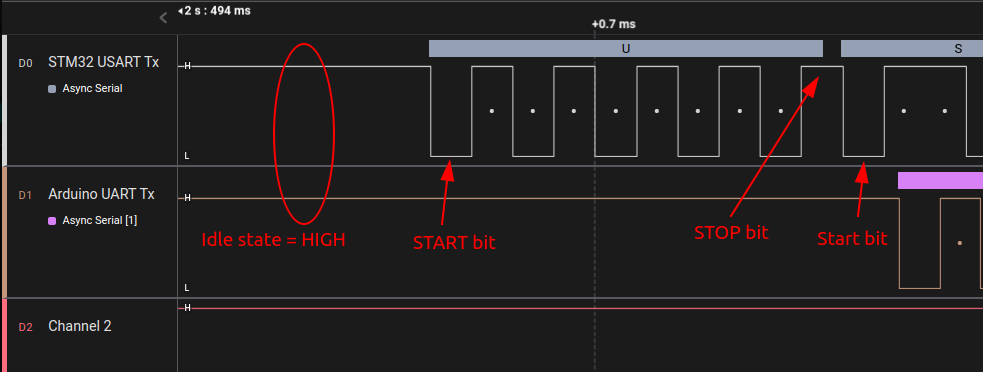
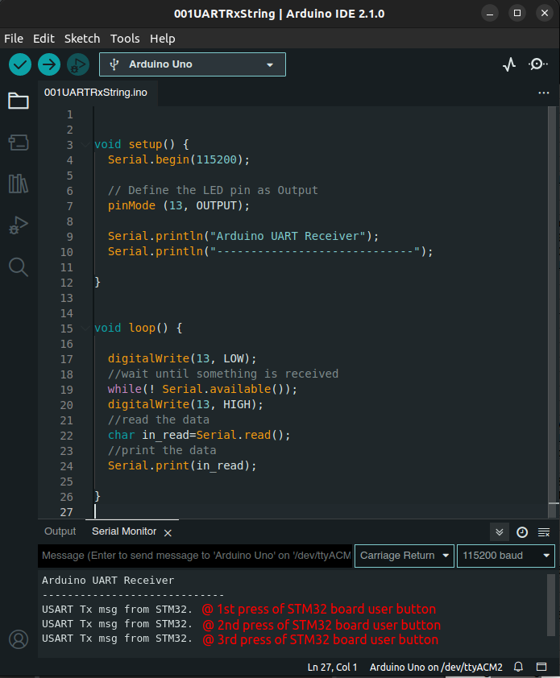

[Home](../../) | [Projects](../../projects) | [Notes](../) > <a href="./">MCU Peripheral Drivers</a> > USART Application 1:  Tx (Blocking) (`usart_01_tx_blocking.c`)

# USART Application 1:  Tx (Blocking) (`usart_01_tx_blocking.c`)


## Requirements

* USART communication between STM32 Discovery board and Arduino Uno board.

* Write a program to send some message over USART from STM32 board to Arduino board. The Arduino board will display the message sent from the STM32 board on the Arduino IDE serial monitor 

  1. Baudrate - 115200 bps
  1. Frame format - 1 stop bit, 8-bit user data, no parity


### Parts Needed

1. Arduino board
2. STM32 board
3. Logic level converter
4. Breadboard and jumper wires

### STM32 Board and Arduino Board Communication Interfaces


### STM32 Board and Arduino Board Voltage Levels

* To work around the voltage level difference, a **logic level shifter** will be necessary.


### Using `printf()` to Print Messages in STM32CubeIDE Console

* See <a href="./using-printf-with-serial-wire-viewer">Using `printf()` with Serial Wire Viewer (SWV)</a>


## Setup

### 1. Find out the GPIO pins that can be used for USART communication

* For this application, USART communication lines Tx, Rx will be used. Find out the GPIO pins over which USART can communicate! Look up the "Alternate function mapping" table in the datasheet.
  * USART2_TX $\to$ PA2 (AF7)
  
  * USART2_RX $\to$ PA3 (AF7)
  

### 2. Connect STM32 Discovery board with Arduino Uno board I2C pins

* Be careful not to directly supply 5 volts to the STM32 board pins when the board is not powered up as they may be damaged. When the **logic level shifter** is used, you don't need to worry about this issue.





* To analyze the communication with the logic analyzer, connect the channels as follows:

  * CH0 - STM32 USART Tx

  * CH1 - STM32 USART Rx

  * GND - Common GND of the bread board

### 3. Power Arduino board and upload SPI slave sketch to Arduino

* Sketch name: `001UARTRxString.ino`
  * You don't need to write an application for Arduino board. It is already provided as a sketch.
  * As soon as you upload this sketch to the Arduino board, it will operate as a UART counterpart.
* If you face an issue while uploading the sketch to the Arduino board, simply remove the Rx line, upload the sketch again and connect back the Rx line.


## Code

### `usart_01_tx_blocking.c`

Path: `Project/Src/`

```c
/*******************************************************************************
 * File		: usart_01_tx_blocking.c
 * Brief	: Program to test USART Tx (blocking-based) functionality
 * Author	: Kyungjae Lee
 * Date		: Jun 20, 2023
 ******************************************************************************/

/**
 * Pin selection for USART communication
 *
 * USART_TX  - PA2 (AF7)
 * USART_RX  - PA3 (AF7)
 */

#include <string.h> 		/* strlen() */
#include <stdio.h> 			/* printf() */
#include "stm32f407xx.h"

/* Global variables */
char msg[1024] = "USART Tx msg from STM32.\n\r";
USART_Handle_TypeDef USART2Handle;

/**
 * delay()
 * Brief	: Spinlock delays the program execution
 * Param	: None
 * Retval	: None
 * Note		: N/A
 */
void delay(void)
{
	/* Appoximately ~200ms delay when the system clock freq is 16 MHz */
	for (uint32_t i = 0; i < 500000 / 2; i++);
} /* End of delay */

/**
 * USART2_PinsInit()
 * Brief	: Initializes and configures GPIO pins to be used as USART2 pins
 * Param	: None
 * Retval	: None
 * Note		: N/A
 */
void USART2_PinsInit(void)
{
	GPIO_Handle_TypeDef USART2Pins;

	/* Zero-out all the fields in the structures (Very important! USASRT2Pins
	 * is a local variables whose members may be filled with garbage values before
	 * initialization. These garbage values may set (corrupt) the bit fields that
	 * you did not touch assuming that they will be 0 by default. Do NOT make this
	 * mistake!
	 */
	memset(&USART2Pins, 0, sizeof(USART2Pins));

	USART2Pins.pGPIOx = GPIOA;
	USART2Pins.GPIO_PinConfig.GPIO_PinMode = GPIO_PIN_MODE_ALTFCN;
	USART2Pins.GPIO_PinConfig.GPIO_PinOutType = GPIO_PIN_OUT_TYPE_PP;
	USART2Pins.GPIO_PinConfig.GPIO_PinPuPdControl = GPIO_PIN_PU;
	USART2Pins.GPIO_PinConfig.GPIO_PinAltFcnMode = 7;
	USART2Pins.GPIO_PinConfig.GPIO_PinSpeed = GPIO_PIN_OUT_SPEED_HIGH;

	/* Tx */
	USART2Pins.GPIO_PinConfig.GPIO_PinNumber = GPIO_PIN_2;
	GPIO_Init(&USART2Pins);

	/* Rx */
	USART2Pins.GPIO_PinConfig.GPIO_PinNumber = GPIO_PIN_3;
	GPIO_Init(&USART2Pins);
} /* End of USART2_PinsInit */

/**
 * USART2_Init()
 * Brief	: Initializes USART2 handle
 * Param	: None
 * Retval	: None
 * Note		: N/A
 */
void USART2_Init(void)
{
	USART2Handle.pUSARTx = USART2;
	USART2Handle.USART_Config.USART_Baud = USART_STD_BAUD_115200;
	USART2Handle.USART_Config.USART_HWFlowControl = USART_HW_FLOW_CTRL_NONE;
	USART2Handle.USART_Config.USART_Mode = USART_MODE_TX;
	USART2Handle.USART_Config.USART_NumOfStopBits = USART_STOPBITS_1;
	USART2Handle.USART_Config.USART_WordLength = USART_WORDLEN_8BITS;
	USART2Handle.USART_Config.USART_ParityControl = USART_PARITY_DISABLE;

	USART_Init(&USART2Handle);
} /* End of USART2_Init */

/**
 * GPIO_ButtonInit()
 * Brief	: Initializes a GPIO pin for button
 * Param	: None
 * Retval	: None
 * Note		: N/A
 */
void GPIO_ButtonInit(void)
{
	GPIO_Handle_TypeDef GPIOBtn;

	/* Zero-out all the fields in the structures (Very important! GPIOBtn
	 * is a local variables whose members may be filled with garbage values before
	 * initialization. These garbage values may set (corrupt) the bit fields that
	 * you did not touch assuming that they will be 0 by default. Do NOT make this
	 * mistake!
	 */
	memset(&GPIOBtn, 0, sizeof(GPIOBtn));

	/* GPIOBtn configuration */
	GPIOBtn.pGPIOx = GPIOA;
	GPIOBtn.GPIO_PinConfig.GPIO_PinNumber = GPIO_PIN_0;
	GPIOBtn.GPIO_PinConfig.GPIO_PinMode = GPIO_PIN_MODE_IN;
	GPIOBtn.GPIO_PinConfig.GPIO_PinSpeed = GPIO_PIN_OUT_SPEED_HIGH; /* Doesn't matter */
	//GPIOBtn.GPIO_PinConfig.GPIO_PinOutType = GPIO_PIN_OUT_TYPE_PP;	/* N/A */
	GPIOBtn.GPIO_PinConfig.GPIO_PinPuPdControl = GPIO_PIN_NO_PUPD;
		/* External pull-down resistor is already present (see the schematic) */
	GPIO_Init(&GPIOBtn);
} /* End of GPIO_ButtonInit */


int main(int argc, char *argv[])
{
	printf("Application Running\n");

	/* Initialize GPIO pin for button */
	GPIO_ButtonInit();

	/* Initialize USART2 pins */
	USART2_PinsInit();

	/* Initialize USART2 peripheral */
	USART2_Init();

	/* Enable USART2 peripheral */
	USART_PeriControl(USART2, ENABLE);

	while (1)
	{
		/* Wait until button is pressed */
		while (!GPIO_ReadFromInputPin(GPIOA, GPIO_PIN_0));

		/* Introduce debouncing time for button press */
		delay();

		/* Perform data transmission */
		USART_TxBlocking(&USART2Handle, (uint8_t *)msg, strlen(msg));
	}

	return 0;
} /* End of main */
```


## Arduino Sketch (`001UARTRxString.ino`)

```c
void setup() {
  Serial.begin(115200);
  
  // Define the LED pin as Output
  pinMode (13, OUTPUT);
  
  Serial.println("Arduino UART Receiver");
  Serial.println("-----------------------------"); 
}

void loop() {

  digitalWrite(13, LOW); 
  //wait until something is received
  while(! Serial.available());
  digitalWrite(13, HIGH); 
  //read the data
  char in_read=Serial.read();
  //print the data
  Serial.print(in_read);
}
```


## Testing

The following snapshots are taken using the Logic Analyzer.


### Entire Communication




### Bit Time




### START / STOP Bits




### Arduino IDE Serial Monitor


