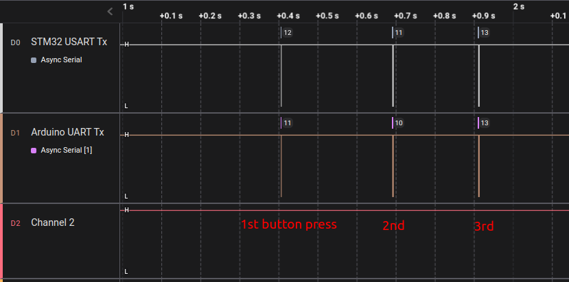
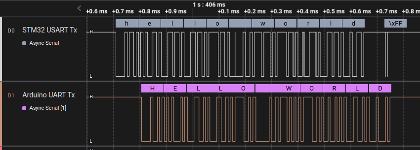
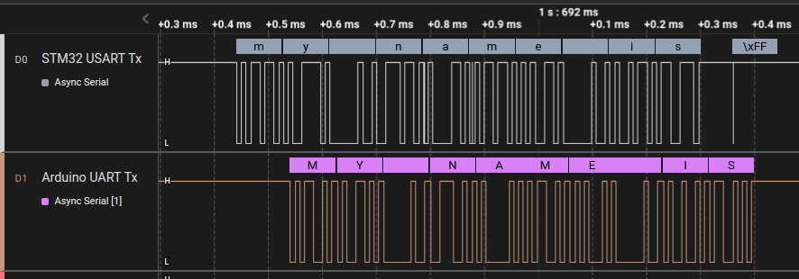
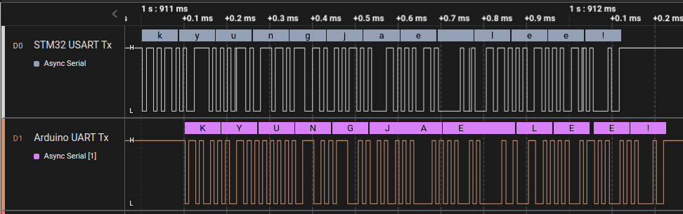
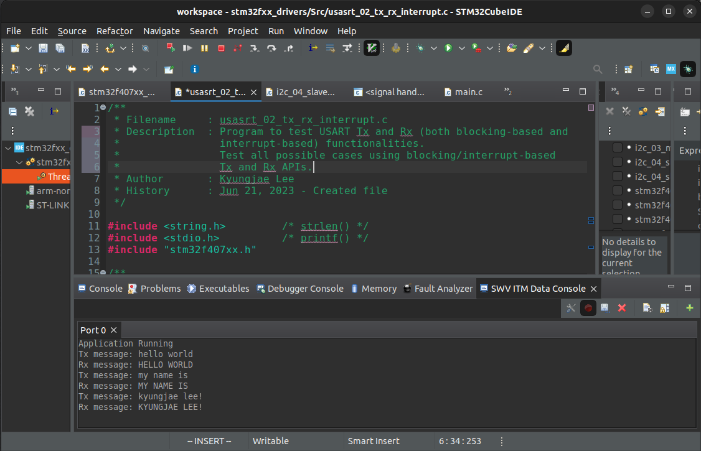

[Home](../../) | [Projects](../../projects) | [Notes](../) > <a href="./">MCU Peripheral Drivers</a> > USART Application 2:  Tx Rx (Interrupt) (`usart_02_tx_rx_interrupt.c`)

# USART Application 2:  Tx Rx (Interrupt) (`usart_02_tx_rx_interrupt.c`)


## Requirements

* USART communication between STM32 Discovery board and Arduino Uno board.

* Write a program for STM32 board which transmits different messages to the Arduino board over UART communication.

  For every message the STM32 board sends, the Arduino code will change the case of alphabets (lower case to upper case and vice versa) and sends the message back to the STM32 board.

  The STM32 board shall capture the response from the Arduino board and display it on the STM32CubeIDE data console.

* Write a program to send some message over USART from STM32 board to Arduino board. The Arduino board will display the message sent from the STM32 board on the Arduino IDE serial monitor 
  1. Baudrate - 115200 bps
  1. Frame format - 1 stop bit, 8-bit user data, no parity


### Parts Needed

1. Arduino board
2. STM32 board
3. Logic level converter
4. Breadboard and jumper wires

### STM32 Board and Arduino Board Communication Interfaces


### STM32 Board and Arduino Board Voltage Levels

* To work around the voltage level difference, a **logic level shifter** will be necessary.


### Using `printf()` to Print Messages in STM32CubeIDE Console

* See <a href="./using-printf-with-serial-wire-viewer">Using `printf()` with Serial Wire Viewer (SWV)</a>


## Setup

### 1. Find out the GPIO pins that can be used for USART communication

* For this application, USART communication lines Tx, Rx will be used. Find out the GPIO pins over which USART can communicate! Look up the "Alternate function mapping" table in the datasheet.
  * USART2_TX $\to$ PA2 (AF7)
  
  * USART2_RX $\to$ PA3 (AF7)
  

### 2. Connect STM32 Discovery board with Arduino Uno board I2C pins

* Be careful not to directly supply 5 volts to the STM32 board pins when the board is not powered up as they may be damaged. When the **logic level shifter** is used, you don't need to worry about this issue.


* To analyze the communication with the logic analyzer, connect the channels as follows:

  * CH0 - STM32 USART Tx

  * CH1 - STM32 USART Rx

  * GND - Common GND of the bread board

### 3. Power Arduino board and upload SPI slave sketch to Arduino

* Sketch name: `002UARTTxString.ino`
  * You don't need to write an application for Arduino board. It is already provided as a sketch.
  * As soon as you upload this sketch to the Arduino board, it will operate as a UART counterpart.
* If you face an issue while uploading the sketch to the Arduino board, simply remove the Rx line, upload the sketch again and connect back the Rx line.


## Code

### `usart_02_tx_rx_interrupt.c`

Path: `Project/Src/`

```c
/*******************************************************************************
 * File		: usasrt_02_tx_rx_interrupt.c
 * Brief	: Program to test USART Tx and Rx (both blocking-based and
 * 			  interrupt-based) functionalities.
 * 			  Test all possible cases using blocking/interrupt-based Tx and Rx
 * 			  APIs.
 * Author	: Kyungjae Lee
 * Date		: Jun 21, 2023
 ******************************************************************************/

/**
 * Pin selection for USART communication
 *
 * USART_TX  - PA2 (AF7)
 * USART_RX  - PA3 (AF7)
 */

#include <string.h> 		/* strlen() */
#include <stdio.h> 			/* printf() */
#include "stm32f407xx.h"

/* Global variables */

/* Messages to transmit to Arduino board */
char* msg[3] = {"hello world", "my name is", "kyungjae lee!"};
/* Buffer to stored the messages to be received by the Arduino board */
char rxBuff[1024];
/* USART2 handle structure */
USART_Handle_TypeDef USART2Handle;
/* Flag that indicates completion of reception */
uint8_t rxCmplt = RESET;

/**
 * delay()
 * Brief	: Spinlock delays the program execution
 * Param	: None
 * Retval	: None
 * Note		: N/A
 */
void delay(void)
{
	/* Appoximately ~200ms delay when the system clock freq is 16 MHz */
	for (uint32_t i = 0; i < 500000 / 2; i++);
} /* End of delay */

/**
 * USART2_PinsInit()
 * Brief	: Initializes and configures GPIO pins to be used as USART2 pins
 * Param	: None
 * Retval	: None
 * Note		: N/A
 */
void USART2_PinsInit(void)
{
	GPIO_Handle_TypeDef USART2Pins;

	/* Zero-out all the fields in the structures (Very important! USASRT2Pins
	 * is a local variables whose members may be filled with garbage values before
	 * initialization. These garbage values may set (corrupt) the bit fields that
	 * you did not touch assuming that they will be 0 by default. Do NOT make this
	 * mistake!
	 */
	memset(&USART2Pins, 0, sizeof(USART2Pins));

	USART2Pins.pGPIOx = GPIOA;
	USART2Pins.GPIO_PinConfig.GPIO_PinMode = GPIO_PIN_MODE_ALTFCN;
	USART2Pins.GPIO_PinConfig.GPIO_PinOutType = GPIO_PIN_OUT_TYPE_PP;
	USART2Pins.GPIO_PinConfig.GPIO_PinPuPdControl = GPIO_PIN_PU;
	USART2Pins.GPIO_PinConfig.GPIO_PinAltFcnMode = 7;
	USART2Pins.GPIO_PinConfig.GPIO_PinSpeed = GPIO_PIN_OUT_SPEED_HIGH;

	/* Tx */
	USART2Pins.GPIO_PinConfig.GPIO_PinNumber = GPIO_PIN_2;
	GPIO_Init(&USART2Pins);

	/* Rx */
	USART2Pins.GPIO_PinConfig.GPIO_PinNumber = GPIO_PIN_3;
	GPIO_Init(&USART2Pins);
} /* End of USART2_PinsInit */

/**
 * USART2_Init()
 * Brief	: Initializes USART2 handle
 * Param	: None
 * Retval	: None
 * Note		: N/A
 */
void USART2_Init(void)
{
	USART2Handle.pUSARTx = USART2;
	USART2Handle.USART_Config.USART_Baud = USART_STD_BAUD_115200;
	USART2Handle.USART_Config.USART_HWFlowControl = USART_HW_FLOW_CTRL_NONE;
	USART2Handle.USART_Config.USART_Mode = USART_MODE_TXRX;
	USART2Handle.USART_Config.USART_NumOfStopBits = USART_STOPBITS_1;
	USART2Handle.USART_Config.USART_WordLength = USART_WORDLEN_8BITS;
	USART2Handle.USART_Config.USART_ParityControl = USART_PARITY_DISABLE;

	USART_Init(&USART2Handle);
} /* End of USART2_Init */

/**
 * GPIO_ButtonInit()
 * Brief	: Initializes a GPIO pin for button
 * Param	: None
 * Retval	: None
 * Note		: N/A
 */
void GPIO_ButtonInit(void)
{
	GPIO_Handle_TypeDef GPIOBtn;

	/* Zero-out all the fields in the structures (Very important! GPIOBtn
	 * is a local variables whose members may be filled with garbage values before
	 * initialization. These garbage values may set (corrupt) the bit fields that
	 * you did not touch assuming that they will be 0 by default. Do NOT make this
	 * mistake!
	 */
	memset(&GPIOBtn, 0, sizeof(GPIOBtn));

	/* GPIOBtn configuration */
	GPIOBtn.pGPIOx = GPIOA;
	GPIOBtn.GPIO_PinConfig.GPIO_PinNumber = GPIO_PIN_0;
	GPIOBtn.GPIO_PinConfig.GPIO_PinMode = GPIO_PIN_MODE_IN;
	GPIOBtn.GPIO_PinConfig.GPIO_PinSpeed = GPIO_PIN_OUT_SPEED_HIGH; /* Doesn't matter */
	//GPIOBtn.GPIO_PinConfig.GPIO_PinOutType = GPIO_PIN_OUT_TYPE_PP;	/* N/A */
	GPIOBtn.GPIO_PinConfig.GPIO_PinPuPdControl = GPIO_PIN_NO_PUPD;
		/* External pull-down resistor is already present (see the schematic) */
	GPIO_Init(&GPIOBtn);
} /* End of GPIO_ButtonInit */


int main(int argc, char *argv[])
{
	printf("Application Running\n");

	uint32_t cnt = 0;

	/* Initialize GPIO pin for button */
	GPIO_ButtonInit();

	/* Initialize USART2 pins */
	USART2_PinsInit();

	/* Initialize USART2 peripheral */
	USART2_Init();

	/* Enable USART2 interrupts */
	USART_IRQInterruptConfig(IRQ_NO_USART2, ENABLE);

	/* Enable USART2 peripheral */
	USART_PeriControl(USART2, ENABLE);

	while (1)
	{
		/* Wait until button is pressed */
		while (!GPIO_ReadFromInputPin(GPIOA, GPIO_PIN_0));

		/* Introduce debouncing time for button press */
		delay();

		/* Next message index; make sure that cnt value doesn't cross 2 */
		cnt %= 3;

		/* Enable Rx interrupt */
		while (USART_RxInterrupt(&USART2Handle, (uint8_t *)rxBuff, strlen(msg[cnt])) != USART_READY);

		/* Send the message indexed by cnt using interrupt based transmission */
		USART_TxInterrupt(&USART2Handle, (uint8_t *)msg[cnt], strlen(msg[cnt]));

		printf("Tx message: %s\n", msg[cnt]);

		/* Wait until all the bytes are received from the Arduino board.
		 * When all the bytes are received rxCmplt will be SET in application
		 * callback.
		 */
		while (rxCmplt != SET);

		/* Add terminating null character. Otherwise %s fails when printing. */
		rxBuff[strlen(msg[cnt])] = '\0';

		/* Print the received message from Arduino */
		printf("Rx message: %s\n", rxBuff);

		/* Invalidate the rxCmplt flag */
		rxCmplt = RESET;

		/* Move on to the next message indexed in msg[] */
		cnt++;
	}

	return 0;
} /* End of main */

/**
 * USART2_IRQHandler()
 * Brief	: Handles USART IRQ
 * Param	: None
 * Retval	: None
 * Note		: This function calls 'USART_IRQHandling()' function which
 * 			  implements the actual event IRQ handling functionality.
 */
void USART2_IRQHandler(void)
{
	USART_IRQHandling(&USART2Handle);
} /* End of USART2_IRQHandler */

/**
 * USART_ApplicationEventCallback()
 * Brief	: Notifies the application of the event occurred
 * Param	: @pUSARTHandle - pointer to USART handle structure
 * 			  @appEvent - USART event occurred
 * Retval	: None
 * Note		: Contents of this function depends on the USART transactions used
 * 			  in the application.
 */
void USART_ApplicationEventCallback(USART_Handle_TypeDef *pUSARTHandle, uint8_t appEvent)
{
	if (appEvent == USART_EV_RX_CMPLT)
	{
		rxCmplt = SET;
	}
	else if (appEvent == USART_EV_TX_CMPLT)
	{
		;
	}
} /* End of USART_ApplicationEventCallback */
```


## Arduino Sketch (`002UARTTxString.ino`)

```c
void setup() {
  Serial.begin(115200);
  
  // Define the LED pin as Output
  pinMode (13, OUTPUT);
  
 // Serial.println("Arduino Case Converter program running");
 // Serial.println("-------------------------------------");
}

char changeCase(char ch)
{
  if (ch >= 'A' && ch <= 'Z')
  ch = ch + 32;
    else if (ch >= 'a' && ch <= 'z')
  ch = ch - 32;  

  return ch;
}
void loop() {

  digitalWrite(13, LOW); 
  //wait until something is received
  while(! Serial.available());
  digitalWrite(13, HIGH); 
  //read the data
  char in_read=Serial.read();
  //print the data
  Serial.print(changeCase(in_read));
}
```


## Testing

The following snapshots are taken using the Logic Analyzer.


### Entire Communication




### Communication in Detail








### STM32CubeIDE Data Console


