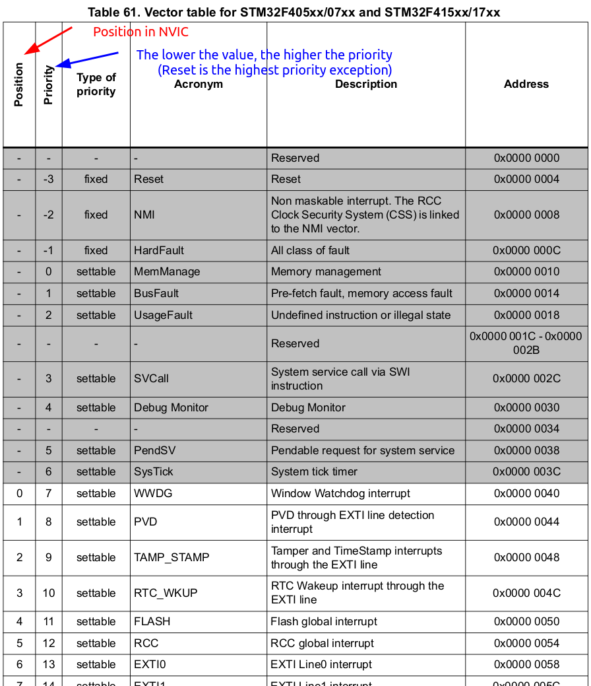

[Home](../../) | [Projects](../../projects) | [Notes](../) > <a href="./">MCU Peripheral Drivers</a> > Vector Table

# Vector Table

## Vector Table for STM32F407xx MCU

* Table of vectors (Here, vectors mean "pointers" or "addresses")

  $=$ Table of pointers (or addresses) of exception handlers

* Exceptions include:

  * 15 system exceptions (internal to the processor)

  * 240 interrupts (external to the processor)
    * Out of 240 rooms provided for interrupts by default, STM32F407xx MCU supports only 82. 

* Vector table is implemented in the startup code of your project. (A startup file can be written either in C or assembly.)

* Total space consumed by the vector table:

  1 (initial stack pointer) + 97 (exceptions) = 98 words = 392 bytes

