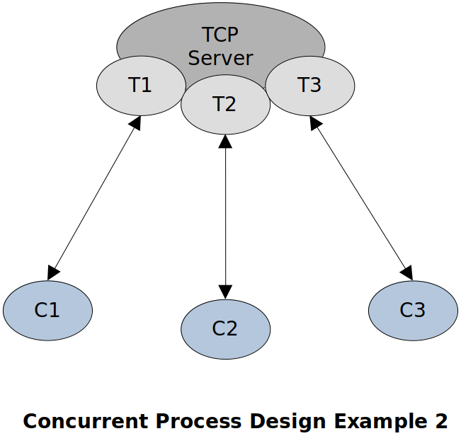

[Home](../../) | [Projects](../../projects) | [Notes](../) > <a href="./">Multi-Threading (POSIX Threads)</a> > Concurrency vs. Parallelism

# Concurrency vs. Parallelism

## Understanding Concurrency

### Meaning

Doing two or more different tasks:

* One task at a time
* Switching between tasks in the following manner:
  * Preempting the current task
  * Picking up the next task, partially doing it, then preempting it
  * Picking up the next task, partially doing it, then preempting it
  * ...
  * Picking up the first task from the point where it was left off, partially doing it, then preempting it
  * ...

### Analogy

Consider three well-diggers assigned a task to dig their respective 100ft-deep well, they have only one well drilling tool which they have to share. 

* Only one person can dig at a time
* Current person takes a rest, passes the tool to the 2^nd^ person, 2^nd^ person resumes
* 2^nd^ person takes a rest, passes the tool to the 3^rd^ person, 3^rd^ person resumes
* Repeat this process until the task is complete

In this analogy, the work of all the well-diggers is **in progression**. It is slow because they need to share the resource and **take turns**. Here, the drilling tool represents the hardware resources.

## Understanding Parallelism

### Meaning

Doing two or more different tasks:

* In parallel

### Analogy

Consider three well-diggers assigned a task to dig their respective 100ft-deep well, each one of them has their own well drilling tool.

* All three can dig in parallel (No need for taking turns)

In this analogy, work of all the well-diggers is **in progression**. It is fast because they don't need to take turns and perform the task **in parallel**. Here, the drilling tool represents the hardware resources.

## Understanding Singularism

### Meaning

Doing two or more different tasks:

* One task at a time
* Preemption not allowed until the task is complete

### Analogy

Consider three well-diggers assigned a task to dig their respective 100ft-deep well, each one of them has their own well drilling tool.

* Only one is allowed to dig at a time
* Once started, the task cannot be preempted until it is complete
* Next person starts the task when the previous one completes the task

In this analogy, work of all the well-diggers is **NOT in progression**. The number of drilling tools provided does not affect the result.

## Concurrency vs. Parallelism vs. Singularism

Time taken (performance) to complete a given task: 

* Parallelism $<<$ Singularism $<$ Concurrency (due to context switching overhead)

Concurrency don't give speed, but it gives progression.

Parallelism gives speed as well as progression, but it demands hardware resources.

Today's computer systems, in general, support both the concurrency and parallelism.

## Analogy to Multi-threading

|                    | Well Digging Analogy       | Threading Environment          |
| ------------------ | -------------------------- | ------------------------------ |
| Workers            | Well diggers               | Threads                        |
| Resources          | Digging tool               | CPU, memory, etc.              |
| Transition         | One well digger to another | Context switching              |
| Work to accomplish | 100 ft well                | Work to be done by each thread |

## Multi-threading Environment

Concurrent execution of threads:

* e.g., Execution of threads one by one with preemption on a CPU 
* All threads are in progression

Parallel execution of threads:

* e.g., Execution of threads in parallel on multiple CPUs 
* All threads are in progression

Singular execution of threads:

* e.g., Execution of threads one after another without preemption on a CPU 
* Not all threads are in progression. Only one thread is in progression at a time.

## Why Do We Need Concurrency?

Why is concurrency still used in many modern computer systems when it is relatively poor in performance?

Let's consider a scenario where there are hundreds of threads running on your system at a time:

* User threads (any applications that are running on the user-space)
* System threads (any services that are running as a part of the operating system; e.g., scheduler, memory manager, device drivers, etc.)

and only the finite number of CPUs are available. Then, all live threads have to share the CPUs:

* Parallelism on available CPUs
* Concurrency on each CPU
* Parallelism and Concurrency co-exist in modern computer systems. (Gives the best performance for multi-threading)
  * Threads belong to the same group runs concurrently.
  * Threads belong to different groups run in parallel.

Having either parallelism along or concurrency alone will incur poor performance. Think why!

## Concurrent Process Design

We need concurrency because:

* We have only finite number of CPUs in a system $\to$ CPUs need to be shared among threads.
* We need to ensure the progression of multiple threads.

### Concurrent Process Design - Case 1

When a process needs to wait for an I/O operation while continuing to execute the complete the task, multi-threading is necessary.

* e.g., A process waiting for network packets in one thread, while sending packets periodically in another thread, while waiting for a user input in yet another thread. (Basic requirements of typical network applications)

### Concurrent Process Design - Case 2

When the given work could be splitted into smaller independent chunks which then can be processed by worker threads.

* e.g., A multi-threaded TCP server serving 100 TCP connected clients at the same time. (Typical TCP server delegates the task to worker threads to entertain the clients' requests.)

## Why are Threads Called Light-Weight Process?

Threads are called a **light-weighted** process because:

* When a thread is created, it uses almost all (except for the stack memory) the pre-existing resources of the main thread, hence OS don't have to work hard to create (or delete) an isolated execution environment for a new thread.
* When the main thread gets created, the followings are made available for the threads to share:
  * **Page tables** are already setup
  * **Shared libraries** are already loaded
  * **Sockets** are already opened
* When a thread dies, the OS don't have to cleanup every resource used by the thread as those resources could still be in use by other threads of the same process.
  * e.g., Heap memory, sockets, opened files, IPCs, etc.
* **Thread switching** (context switching between threads that belong to the same process) happens much faster than **process switching** (context switching between threads that belong to the different process) 

## Overlapping vs. Non-Overlapping Work

If the threads in a process access the same shared data (e.g., global variable) then the work done by those threads are called **overlapping work**.

* e.g., W1 is sorting the array A in an ascending order whereas W2 is sorting the array A in a descending order. Since the array A is a shared data on which the threads T1 and T2 are operating, W1 and W2 are overlapping works.

Threads within a process may or may not need the synchronization depending on whether the work they are doing is overlapping or not. So, don't just blindly go for synchronization without analyzing the work the threads are supposed to do.

## Summary

When multiple threads (same or different processes) share the **same CPU** with **overlapping work**, we get **concurrency**.

When multiple threads (same or different processes) share the s**ame CPU** with **non-overlapping work**, we get **concurrency**.

When multiple threads (same or different processes) run on **different CPUs** with **non-overlapping work**, we get **parallelism**.

## References

Sagar, A. (2022). *Part A - Multithreading & Thread Synchronization - Pthreads* [Video file]. Retrieved from  https://www.udemy.com/course/multithreading_parta/
