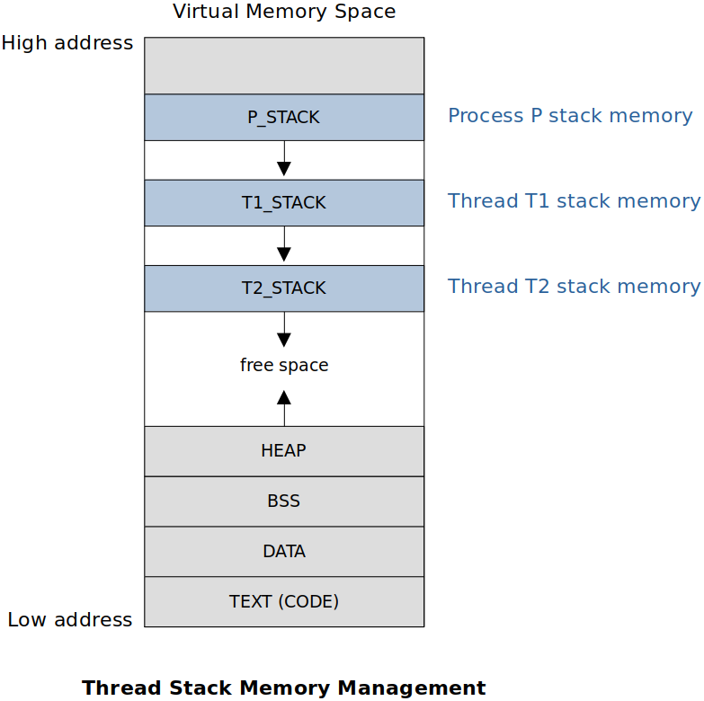

[Home](../../) | [Projects](../../projects) | [Notes](../) > <a href="./">Multi-Threading (POSIX Threads)</a> > Introduction to Threads

# Introduction to Threads


## What are Threads?


* A thread is **a basic unit of execution flow** (i.e., an independent set of instructions which execute).
* A process has at least one thread (i.e., main thread)
  * The main function of the program runs as a main thread.
* A thread runs in the context of a process.
* A thread can create other threads, other threads can create more threads and so on.
* The point where a new thread is created is called **fork point**.
* A thread which creates a new thread is called **parent thread**, whereas a thread which is created is called **child thread**.


## Argument Passing

Make sure that you always pass the persistent memory as an argument to the thread (e.g., static variable or dynamically allocated variables on the heap). Do not pass the caller's local variables or stack memory whose lifetime is bound to the caller's lifetime because they will go away when the caller terminates. 


## Race Condition on Thread Creation

**Race condition** on thread creation refers to an indeterministic situation where which thread's instruction is going to be executed first immediately after the fork point.


> 99.9% of the time time 'Instruction 1' will be executed first due to the scheduling overhead, but it is a good practice as a programmer not to assume which instruction is going to be executed first when writing a multi-threaded program.


## Thread Termination

Three ways in which threads can be terminated:

* Return of the thread function
* `pthread_exit(0);`
* Thread cancellation (when a thread is canceled or killed by another thread)
  * Any thread can cancel any other threads by sending the cancellation request
  * One thread can cancel multiple threads by sending the cancellation request

If main thread terminates its threads will be automatically terminated by default, but not vice-versa. To prevent this from happening, use `pthread_exit();` API in the main thread. This is mostly used in cases where the main thread is only required to spawn threads and leave the threads to do their job. 

Termination of the spawned threads will not affect any other threads including the main thread.


## Example - Hello World

Following program will create one thread, which is called the **main thread**, and that main thread will execute the function `main`.

```c
/*
 * File Name    : hello_world.c
 * Description  : C program to demonstrate the use of POSIX threads
 * Author       : Modified by Kyungjae Lee (Original: Abhishek Sagar)
 * Date Created : 12/25/2022
 */

 /*  
  * Compile using:
  * gcc -g -c hello_world.c -o hello_world.o
  * gcc -g hello_world.o -o hello_world -lpthread
  * Or simply using:
  * gcc -g hello_world.c -o hello_world -lpthread
  *
  * Run using:
  * ./hello_world
  */

#include <stdio.h>
#include <stdlib.h>
#include <pthread.h>    /* POSIX threads */
#include <unistd.h>     /* pause(), sleep() */

/* A thread callback function must have the following prototype:
 * 		void* (*thread_fn)(void *)  	*/
static void* thread_fn_callback(void *arg)
{
    char *input = (char*)arg;
    int a = 0;
    
    while (a < 10) 
    {   
        printf("input string = %s\n", input);
        sleep(1);
        if (a == 5)
            pthread_exit(0);	/* one way of terminating the thread */
        a++;
    }   

    return input;
}

void thread1_create()
{
    /* opaque data structure (as a programmer don't need to know its internal structure) */
    pthread_t pthread1; /* a.k.a. thread handle */
    
    /* Take some argument to be passed to the thread function.
     * Make sure that you always pass the persistent memory as an argument to the thread.
     * (e.g., static variable or dynamically allocated variables on the heap)
     * Do not pass caller's local variables or stack memory because these variables will
     * go away when the caller terminates. */
    static char *thread_input1 = "I am thread no 1";

    /* pthread_create() - Inbuilt API provided by POSIX thread library
     * Returns 0 on success, error code otherwise
     * 1st arg: address of the thread handle
     * 2nd arg: NULL
     * 3rd arg: thread function that the new thread will execute
     * 4th arg: memory address that contains the data to be bassed to the thread
     * All pthread functions return negative error code on failure and do not set global
     * 'errno' variable. */
    int rc = pthread_create(&pthread1, NULL, thread_fn_callback, (void*)thread_input1);

    if (rc != 0)
    {
        printf("Error: Thread could not be created. (errno = %d\n)", rc);
        exit(0);
    }
}

int main(int argc, char *argv[])
{
    thread1_create();

    /* 'pthread_exit()' API is used to prevent the spawned threads from being terminated
     * when the main thread terminates */
    pthread_exit(0);

    return 0;
}
```


## Resource Sharing Among Threads


Operating system allocates resources to threads - Memory, CPU, access to hardware, etc.

All threads are siblings. There is no parent-child (having extra privileges) relationship between threads of the same process; no hierarchy. 

Every thread has its own life-cycle (birth, life and death) independent from other threads in the system. (Exception: If main thread terminates its threads will be automatically terminated by default, but not vice-versa.)

Multiple threads of the same process share the same **virtual address space** of that process except that they have their own **stack memory**. Resources (that does not use the stack memory) allocated by one thread is visible to the rest of the threads. (e.g., Heap memory, sockets, file descriptors, global variables, etc.)

Stack memory is private to each thread.


## Thread Stack Memory Management





All spawned threads share the process' virtual memory space. (No separate virtual memory space for spawned threads.) But, each stack memory segment is private to the corresponding thread.


## Thread Scheduling

Kernel (OS) does not schedule processes, but it schedules threads. Thread is a schedulable entity, not a process. Thread, a basic unit of execution flow, is to be allocated (by the OS) to the CPU for execution. 

However, this rule is violated in certain error conditions:

* If a thread segmentation-faults, the entire process (including all threads spawned by the process) is terminated.
* A signal is delivered (by the OS) to the process level, not to the thread level. 
  * e.g., When the SIGSEGV signal is delivered to a process by the OS, the process is terminated with the segmentation-fault.

The race condition on thread creation is due to the fact that which thread the kernel chooses to allocate CPU; the parent thread or the spawned child thread.

Kernel schedules threads on multiple CPUs as per the scheduling policy (e.g., FCFS, SJF).


## References

Sagar, A. (2022). *Part A - Multithreading & Thread Synchronization - Pthreads* [Video file]. Retrieved from  https://www.udemy.com/course/multithreading_parta/
