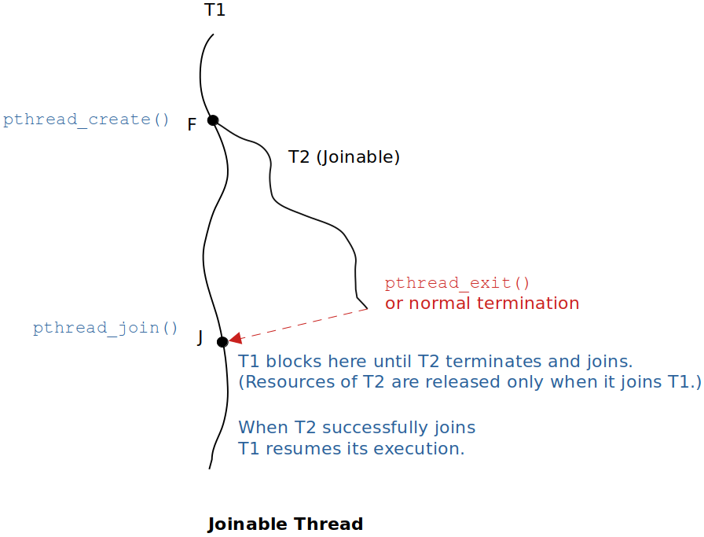
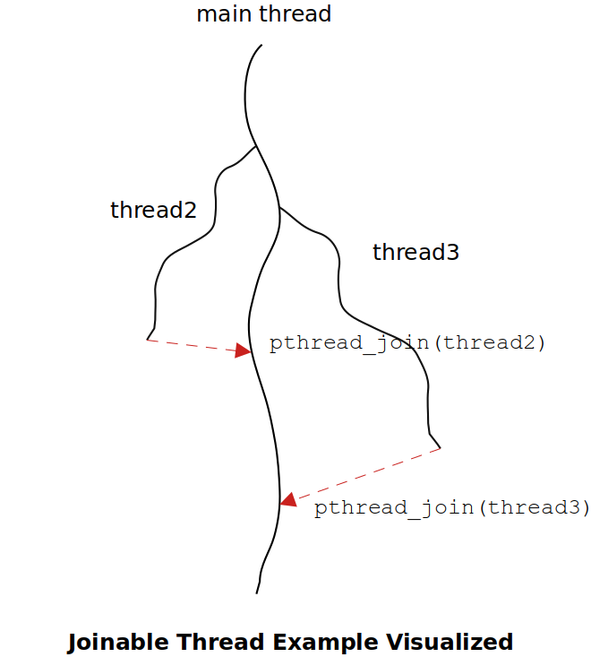
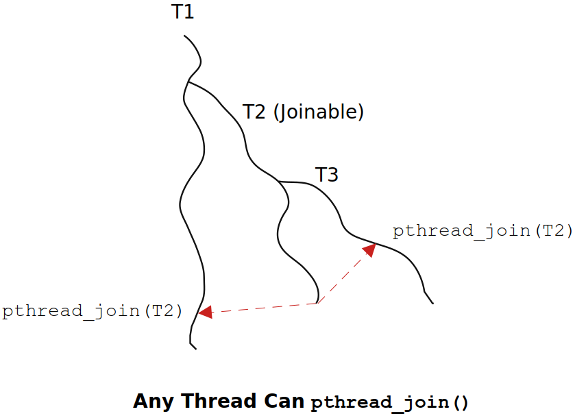

[Home](../../) | [Projects](../../projects) | [Notes](../) > <a href="./">Multi-Threading (POSIX Threads)</a> > Joinable & Detached Threads

# Joinable & Detached Threads


By using `pthread_create()` API, we can specify the thread to be created in one of the following two modes:

* Joinable thread
* Detached thread


## Joinable Threads





Resources of the joinable thread are not released until it joins the parent thread. Therefore, it would be a wrong design if a thread is created in a joinable mode and it never has a chance to join some other thread that is blocked at the joint point.

A joinable thread can be converted into detached thread while it is running, or vice versa.

If no mode is specified upon the thread creation, the thread will run on joinable mode by default.

A Joinable thread may return the result to the parent (joinee) thread at the time of joint.

### Example

Try and change the second argument of `thread_create()` for thread 2 and 3 and monitor the result. You should be able to predict the result correctly.

```c
/*
 * File Name    : joinable_example.c
 * Description  : C program to demonstrate the use of joinable threads
 * Author       : Modified by Kyungjae Lee (Original: Abhishek Sagar)
 * Date Created : 12/27/2022
 */

 /*  
  * Compile using:
  * gcc -g -c joinable_example.c -o joinable_example.o
  * gcc -g joinable_example.o -o joinable_example -lpthread
  * Or simply using:
  * gcc -g joinable_example.c -o joinable_example -lpthread
  *
  * Run using:
  * ./joinable_example
  */

#include <stdio.h>
#include <stdlib.h>
#include <pthread.h>    /* POSIX threads */
#include <unistd.h>     /* pause(), sleep() */
#include <errno.h>		/* errno */

/* returns the square of arg */
void* thread_fn_callback(void *arg)
{
    int th_id = *(int*)arg;
    free(arg);
    int rc = 0;

    /* loop to simulate the thread taking some time to complete its task */
    while (rc != th_id)
    {
        printf("Thread %d doing some work\n", th_id);
        sleep(1);
        rc++;
    }

    int *result = calloc(1, sizeof(int));   /* must use the heap to return a value */
    *result = th_id * th_id;

    return (void*)result;
}

void thread_create(pthread_t *pthread_handle, int th_id)
{
	pthread_attr_t attr;	/* pthread_attr_t is an opaque structure */

    int *_th_id = calloc(1, sizeof(int));
    *_th_id = th_id;

    /* sets the 1st arg to the 2nd arg value (POSIX standard API) */
    pthread_attr_setdetachstate(&attr, PTHREAD_CREATE_JOINABLE);
    pthread_attr_init(&attr);

    /* fork point */
    pthread_create(pthread_handle, &attr, thread_fn_callback, (void*)_th_id);
}

pthread_t pthread2;
pthread_t pthread3;

int main(int argc, char *argv[])
{
    void *thread_result2;           /* points to the result thread2 produces */
    void *thread_result3;           /* points to the result thread3 produces */

    thread_create(&pthread2, 2);	/* user-defined function (not POXIS standard) */
    thread_create(&pthread3, 10);	/* user-defined function (not POXIS standard) */

    printf("main() blocked on pthread_join() API for thread2\n");

    /* blocking point - waits on thread2's termination
     * (by the time thread2 joins, its return value will be available in the heap memory
     * pointed to by 'thread_result2') */
    pthread_join(pthread2, &thread_result2); 

    if (thread_result2)
    {
        printf("Return value of thread2 = %d\n", *(int*)thread_result2);
        free(thread_result2);
        thread_result2 = NULL;
    }

    printf("main() blocked on pthread_join() API for thread3\n");

    /* blocking point - waits on thread3's termination
     * (by the time thread3 joins, its return value will be available in the heap memory
     * pointed to by 'thread_result3') */
    pthread_join(pthread3, &thread_result3); 

    if (thread_result3)
    {
        printf("Return value of thread3 = %d\n", *(int*)thread_result3);
        free(thread_result3);
        thread_result3 = NULL;
    }

    return 0;
}
```

```plain
main() blocked on pthread_join() API for pthread2
Thread 10 doing some work
Thread 2 doing some work
Thread 2 doing some work
Thread 10 doing some work
Thread 10 doing some work
Return value of thread2 = 4
main() blocked on pthread_join() API for thread3
Thread 10 doing some work
Thread 10 doing some work
Thread 10 doing some work
Thread 10 doing some work
Thread 10 doing some work
Thread 10 doing some work
Thread 10 doing some work
Return value of thread3 = 100
```





### Whom to Join?

A child joinable thread upon termination joins all the threads which are blocked on `pthread_join()` on former's thread handle (`pthread_t`).

Any thread as well as the parent thread can invoke `pthread_join()` to wait on any other joinable thread's termination. (Any thread can wait for the termination of any other joinable thread in the process). 

Just note that `pthread_join()` cannot wait on detached thread's termination.





## Detached Threads


Resources of the detached thread are released as soon as the thread terminates.

A detached thread can be converted into a joinable while it is running, or vice versa.

A detached thread does not return any result to its parent thread. It does its job and then terminate without notifying any other threads.


## When to Create Joinable / Detached Threads?

Create thread T as joinable when:

* T is supposed to return some result to other threads
  * e.g., Map reduce
* Some other threads in the process are interested in being notified of T's termination

Create thread T as detached when:

* No return result from T is expected
* Nobody bothers about its termination
* T runs an infinite loop
  * e.g., Waiting for user input
  * e.g., Waiting for network packets
  * e.g., TCP server's worker thread interacting with TCP clients. (Detached threads can be used in this case depending on what the application wants to achieve.)


## References

Sagar, A. (2022). *Part A - Multithreading & Thread Synchronization - Pthreads* [Video file]. Retrieved from  https://www.udemy.com/course/multithreading_parta/
