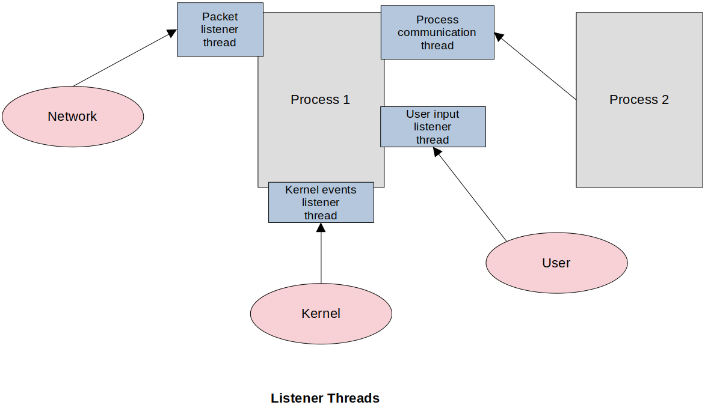

[Home](../../) | [Projects](../../projects) | [Notes](../) > <a href="./">Multi-Threading (POSIX Threads)</a> > Listener Threads

# Listener Threads


## Listener Threads - Responsibility Delegation

* It is a common scenario that an application needs to constantly listen to external events. Those external events can arrive at any time, and the application needs to be able to process them upon their arrival.

* Applications can use threads to delegate its responsibilities to listen to external events. This way the process can continue carrying out the important task while the listener threads are waiting for the external events in the blocking state.

  Threads themselves can take care of the external events or they can pass those events to the process so the process can handle them. It depends on the requirements of the application.





* In this notes, we will implement an application that deploys listener threads to handle multiple network UDP sockets, and user inputs only. Once you learn more about the kernel programming and interprocess communication, you can apply the same concept to implement the threads handling kernel events or events from other processes.


## Listener Threads Demonstration

* network_utils.h

  ```c
  /*
   * File Name    : network_utils.h
   * Description  : Interface for Network Utils
   * Author       : Modified by Kyungjae Lee 
   *               (Original: Abhishek Sagar - Juniper Networks)
   * Date Created : 01/07/2023
   */
  
  #ifndef __NETWORK_UTILS__
  #define __NETWORK_UTILS__
  
  #include <stdint.h>
  #include <stdbool.h>
  #include <arpa/inet.h>
  #include <stdlib.h>
  #include <stdio.h>
  #include <pthread.h>
  #include <memory.h>
  #include <netdb.h>
  #include <errno.h>
  #include <sys/socket.h>
  #include <netinet/in.h>
  #include <unistd.h>
  #include <assert.h>
  
  #define MAX_PACKET_BUFFER_SIZE 1024
  
  typedef void (*recv_fn_cb)(char *,		/* msg recvd */
  						   uint32_t,	/* recvd msg size */
  						   char *,		/* Sender's IP address */
  						   uint32_t);	/* Sender's Port number */
  
  pthread_t* udp_server_create_and_start(char *ip_addr, uint32_t udp_port_no,	recv_fn_cb recv_fn);
  int send_udp_msg(char *dest_ip_addr, uint32_t udp_port_no, char *msg, uint32_t msg_size);
  
  /* General Nw utilities */
  
  char* network_covert_ip_n_to_p(uint32_t ip_addr, char *output_buffer);
  uint32_t network_covert_ip_p_to_n(char *ip_addr);
  
  #endif /* __NETWORK_UTILS__  */
  ```


* network_utils.c

  ```c
  /*
   * File Name    : network_utils.c
   * Description  : Implementation of Network Utils 
   *				  (This file contains routines to work with network sockets program.)
   * Author       : Modified by Kyungjae Lee 
   *               (Original: Abhishek Sagar - Juniper Networks)
   * Date Created : 01/07/2023
   */
  
  #include "network_utils.h"
  
  /* 
   * definition of 'thread argument package' data structure
   * - this data structure contains all the information that needs to be passed to the thread function 
   */
  typedef struct thread_arg_pkg_
  {
  	char ip_addr[16];
  	uint32_t port_no;
  	recv_fn_cb recv_fn;
  } thread_arg_pkg_t;
  
  /* 
   * UDP Server code
   */
  
  static void* _udp_server_create_and_start(void *arg)
  {
  	thread_arg_pkg_t *thread_arg_pkg = (thread_arg_pkg_t *)arg; /* typecast back to its original type */
  
  	char ip_addr[16];
  	strncpy(ip_addr, thread_arg_pkg->ip_addr, 16);
  	uint32_t port_no = thread_arg_pkg->port_no;
  	recv_fn_cb recv_fn = thread_arg_pkg->recv_fn;
  	
  	free(thread_arg_pkg);
  	thread_arg_pkg = NULL;
  	
      /* create a UDP socket */
  	int udp_sock_fd = socket(AF_INET, SOCK_DGRAM, IPPROTO_UDP );
  
  	if (udp_sock_fd == -1)
      {
  		printf("Socket Creation Failed\n");
  		return 0;
  	}
  
  	struct sockaddr_in server_addr;
  	server_addr.sin_family = AF_INET;
  	server_addr.sin_port = port_no;
  	server_addr.sin_addr.s_addr = INADDR_ANY;
  
  	if (bind(udp_sock_fd, (struct sockaddr *)&server_addr, sizeof(struct sockaddr)) == -1) 
      {
  		printf("Error : UDP socket bind failed\n");
  		return 0;
  	}
  
      /* memory space to store the packet received */
  	char *recv_buffer = calloc(1, MAX_PACKET_BUFFER_SIZE);
  
      struct sockaddr_in client_addr;
      int bytes_recvd = 0,
         	addr_len = sizeof(client_addr);
  
  	while(1)
      {
  		memset(recv_buffer, 0, MAX_PACKET_BUFFER_SIZE);
  
  		/* block here to recv data, recvfrom is blocking system call by default */
  		bytes_recvd = recvfrom(udp_sock_fd, recv_buffer, MAX_PACKET_BUFFER_SIZE, 0, 
  				(struct sockaddr *)&client_addr, &addr_len);
  
          /* recv_fn will be executed only when the packet has been received (recv_fn is an application
             specific function) */
  		recv_fn(recv_buffer, bytes_recvd, 
                  network_covert_ip_n_to_p((uint32_t)htonl(client_addr.sin_addr.s_addr), 0),
  				client_addr.sin_port);	
  	}
      
      return 0;
  }
  
  /* 
   * API that creates a listening thread
   * - When the listener thread receives a packet from the network, this API will invoke the function
   *   passed as a function pointer (the last argument) to pass that packet to the application. The
   *   application will process the packets on its end.
   */
  pthread_t* udp_server_create_and_start(char *ip_addr, uint32_t udp_port_no, recv_fn_cb recv_fn)
  {
      pthread_attr_t attr;
      pthread_t *recv_pkt_thread;
  	thread_arg_pkg_t *thread_arg_pkg;
  
      pthread_attr_init(&attr);
      pthread_attr_setdetachstate(&attr, PTHREAD_CREATE_DETACHED); /* detached thread */
  
      /* 'thread argument package' data structure */
  	thread_arg_pkg = calloc(1, sizeof(thread_arg_pkg_t));
  
  	/*  pack all data in a single object which needs to be passed as argument to thread fn */
  	strncpy(thread_arg_pkg->ip_addr, ip_addr, 16);
  	thread_arg_pkg->port_no = udp_port_no;
  	thread_arg_pkg->recv_fn = recv_fn;
  
  	recv_pkt_thread = calloc(1, sizeof(pthread_t));
  
      pthread_create(recv_pkt_thread, &attr, _udp_server_create_and_start, (void *)thread_arg_pkg);
  
  	return recv_pkt_thread; /* ptr to the thread; i.e., thread handle */
  }
  
  int send_udp_msg(char *dest_ip_addr, uint32_t dest_port_no, char *msg, uint32_t msg_size) 
  { 
  	struct sockaddr_in dest;
  
      dest.sin_family = AF_INET;
      dest.sin_port = dest_port_no;
      struct hostent *host = (struct hostent *)gethostbyname(dest_ip_addr);
      dest.sin_addr = *((struct in_addr *)host->h_addr);
      int addr_len = sizeof(struct sockaddr);
  	int sock_fd;
  
  	sock_fd = socket(AF_INET, SOCK_DGRAM, IPPROTO_UDP);
  
  	if (sock_fd < 0)
      {
  		printf("socket creation failed, errno = %d\n", errno);
  		return -1;
  	}
  
      int rc = sendto(sock_fd, msg, msg_size, 0, (struct sockaddr *)&dest, sizeof(struct sockaddr));
      close(sock_fd);
  	return rc;
  }
  
  char* network_covert_ip_n_to_p(uint32_t ip_addr, char *output_buffer)
  {
      char *out = NULL;
      static char str_ip[16];
      out = !output_buffer ? str_ip : output_buffer;
      memset(out, 0, 16);
      ip_addr = htonl(ip_addr);
      inet_ntop(AF_INET, &ip_addr, out, 16);
      out[15] = '\0';
      return out;
  }
  
  uint32_t network_covert_ip_p_to_n(char *ip_addr)
  {
      uint32_t binary_prefix = 0;
      inet_pton(AF_INET, ip_addr, &binary_prefix);
      binary_prefix = htonl(binary_prefix);
      return binary_prefix;
  }
  ```

  > UDP server structure overview:
  >
  > 1. Create a thread using `pthread_create()` API.
  > 2. Create a socket using `socket()` system call.
  > 3. Bind the socket using `bind()` system call.
  > 4. Create a buffer to store the received packet.
  > 5. Invoke `recvfrom()` system call to block for the packet reception.
  > 6. Once the packet arrives, notify the application using the application specific callback function `recv_fn()`.

* listenter_threads_main.c

  ```c
  /*
   * File Name    : listenter_threads_main.c
   * Description  :  
   * Author       : Modified by Kyungjae Lee 
   *               (Original: Abhishek Sagar - Juniper Networks)
   * Date Created : 01/07/2023
   */
  
  #include <stdio.h>
  #include <stdint.h>
  #include "network_utils.h"
  
  /* packet processing function simplified for demonstration purpose */
  void pkt_recv_fn(char *pkt, uint32_t pkt_size, char *sender_ip, uint32_t port_no)
  {
      printf("%s() : pkt recvd = %s, pkt size = %u\n", __FUNCTION__, pkt, pkt_size);
  }
  
  /* pointers to listener threads */
  pthread_t *listener1 = NULL;
  pthread_t *listener2 = NULL;
  
  int main(int argc, char **argv)
  {
      /* create the 1st listener thread */
  	printf("Listening on UDP port no 3000\n");
  	listener1 = udp_server_create_and_start("127.0.0.1", 3000, pkt_recv_fn);
  	
      /* create the 2nd listener thread */
  	printf("Listening on UDP port no 3001\n");
  	listener2 = udp_server_create_and_start("127.0.0.1", 3001, pkt_recv_fn);
  
  	pthread_exit(0); /* this API allows other threads to continue their execution even though the main
  						thread terminates */
      
  	return 0;
  }
  ```

* udp_sender.c

  ```c
  /*
   * File Name    : udp_sender.c
   * Description  : 
   * Author       : Modified by Kyungjae Lee 
   *               (Original: Abhishek Sagar - Juniper Networks)
   * Date Created : 01/07/2023
   */
  
  #include "network_utils.h"
  
  int main(int argc, char **argv) {
  
  	printf("Dest = [%s,%d] \n", argv[1], atoi(argv[2]));
  	send_udp_msg(argv[1], atoi(argv[2]), argv[3], strlen( argv[3] ));
      
  	return 0;
  }
  ```

* Shell script to compile this project:

  ```shell
  # compile.sh
  
  rm *.o 
  rm *exe
  gcc -g -c network_utils.c -o network_utils.o
  gcc -g -c listener_threads_main.c -o listener_threads_main.o
  gcc -g -c udp_sender.c -o udp_sender.o
  gcc -g listener_threads_main.o network_utils.o -o listener_threads_main.exe -lpthread
  gcc -g udp_sender.o network_utils.o -o udp_sender.exe -lpthread
  ```

  Terminating `.exe` does not necessarily mean that the file is Windows executable. `.exe` was put on purpose to make it easier to delete the existing executables when re-running this shell script.

* Execution result:

  Shell 1

  ```plain
  $ ./listener_threads_main.exe 
  Listening on UDP port no 3000
  Listening on UDP port no 3001
  pkt_recv_fn() : pkt recvd = hello_msg, pkt size = 9
  pkt_recv_fn() : pkt recvd = bye_msg, pkt size = 7
  ```

   Shell 2

  ```plain
  $ ./udp_sender.exe 127.0.0.1 3000 hello_msg
  Dest = [127.0.0.1,3000] 
  $ ./udp_sender.exe 127.0.0.1 3000 bye_msg
  Dest = [127.0.0.1,3000] 
  ```


## Challenge

* Notice that the thread in the program above is not designed for cancellation. Use the thread cancellation technique you learned in the previous section to make those threads in the program cancellable.

  ```c
  /* write your code here */
  ```

  


## References

Sagar, A. (2022). *Part A - Multithreading & Thread Synchronization - Pthreads* [Video file]. Retrieved from  https://www.udemy.com/course/multithreading_parta/

