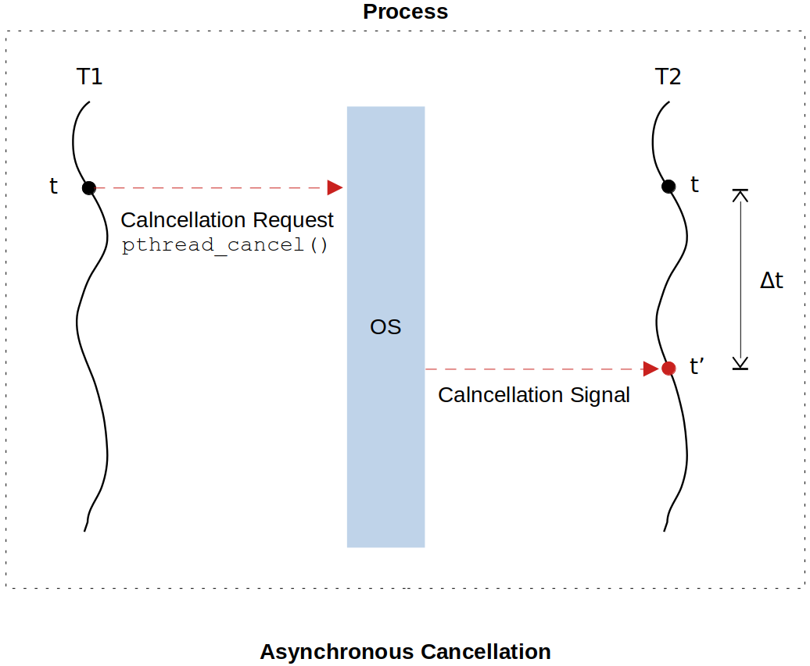

[Home](../../) | [Projects](../../projects) | [Notes](../) > <a href="./">Multi-Threading (POSIX Threads)</a> > Thread Cancellation - Asynchronous Cancellation

# Thread Cancellation - Asynchronous Cancellation


## Asynchronous Cancellation





* The cancellation request (CR) sent by the thread T1 is **queued** by the OS before directly canceling the target thread T2. This is because the OS may be busy carrying out other tasks such as context switching between processes when it receives the cancellation request from a thread. Therefore, the OS may or may NOT terminate the target thread T2 instantaneously. (This is where the name "asynchronous" comes from.) 
* At $t' = t + \Delta t$, the OS delivers the cancellation signal to T2, which results in instant T2 termination. During $\Delta t$ the cancellation request has been pending.


## Problems with Asynchronous Cancellation

* With the asynchronous cancellation, a thread can be canceled at any arbitrary point in its execution flow, and this can lead to the following problems:
  * Resource leak
  * Invariants
  * Deadlocks

### Resource Leak

* Abrupt cancellation of a thread may lead to the problem of **resource leak**.

  Examples:

  * Terminating without closing the open file descriptor/sockets
  * Terminating without freeing the allocated memory.

  A thread must be given one last chance to clean up the resources before it is terminated. 

* **Solution:**

  This can be handled by the **thread cleanup handlers**. (See the *Solution to Resource Leak Problem* section below.)

### Invariants

* Abrupt cancellation of a thread may lead to the problem of **invarnats** which may in turn lead to the data structure corruption, memory leak, wrong computation, etc. (Invariants means a data structure in inconsistent state.)

  Examples:

  * Canceling the thread while inserting/removing an element to/from a doubly-linked list.
  * Canceling the thread while  inserting/removing a node to/from a balanced tree (e.g., red-black/AVL trees).
  * Canceling the thread which is in the process of executing system calls (e.g., `malloc()`). Incomplete termination of a system cal may lead to the kernel corruption or variants in the kernel space.

  A thread must not get canceled while it is updating the data structures or processing the system calls. In other words, a thread must cancel in a controlled manner at a certain point in its execution flow, where it safety is guaranteed. 

* **Solution:**

  This can be handled in deferred cancellation by the **cancellation points**. (See [Thread Cancellation - Deferred Cancellation](./thread-cancellation-deferred-cancellation))

### Deadlocks

* What would happen if a thread is forced to terminate when it has locked a mutex and never had a chance to release it? The mutex will be left in locked state forever by the no-longer existing thread and no other threads in the process will be able to obtain the permission to enter the critical section that has been permanently locked.

  When a thread is canceled, it must not have any mutex held in the locked state.


## Solution to Resource Leak Problem

* POSIX standards provide the concept of  **Thread Cleanup Handlers**. Thread cleanup handlers are functions that are invoked just before the thread gets canceled.

  ```c
  void (*cleanup_handler)(void*);	/* function ptr to the cleanup handler function */
  ```

  Only after the thread cleanup handler function returns, the thread can be canceled immediately.

* Thread cleanup handlers are specified in the form of a stack; stack of functions. Upon cancellation, the  cleanup handlers will be invoked from top of the stack to the bottom of the stack (i.e., in LIFO manner).

  ```c
  /* thread function */
  thread_fn()
  {
      /* register the cleanup handlers by pushing them into the stack */
      pthread_cleanup_push(f1, arg);	/* arg is an argument to the passed function f1 */
      pthread_cleanup_push(f2, arg);
      ...
      /* pop the cleanup handlers out of the stack if thread_fn does not cancel and execute to completion
         sucessfully */
      pthread_cleanup_pop(1); /* arg (non-0: pop cleanup function and invoke it, 0: just pop) */
      pthread_cleanup_pop(1);
  }
  ```

  `pthread_cleanup_push();` API is replaced by a `{` and some intermediate code at the compile-time.

  `pthread_cleanup_pop();` API is replaced by some intermediate code followed by a `}`.

  Which means that these APIs are not functions but macros. Therefore, after compilation, the code will look like:

  ```c
  /* thread function */
  thread_fn()
  {
      {
          /* code inserted by the compiler - 1 */
      {
          /* code inserted by the compiler - 2 */
          ...
          ...
          /* code inserted by the compiler - 2' */
      }	
          /* code inserted by the compiler - 1' */
      }
  }
  ```

  Note that failing to match `pthread_cleanup_push()` and `pthread_cleanup_pop()` will result in unbalanced parentheses which will eventually lead to compilation failure!

* Cleanup functions are also invoked when a thread is terminated using `pthread_exit()`.

  Cleanup functions are NOT invoked when a thread is terminated using `return` statement.


## Asynchronous Cancellation Demonstration

* The following is a program to demonstrate asynchronous cancellation of threads with resource leak handling. 

  ```c
  /*
   * File Name    : asynchronous_cancellation.c
   * Description  : C program to demonstrate asynchronous cancellation with resource leak handling
   * Author       : Modified by Kyungjae Lee 
   *               (Original: Abhishek Sagar - Juniper Networks)
   * Date Created : 01/05/2023
   */
  
  #include <stdio.h>
  #include <stdlib.h>
  #include <unistd.h>
  #include <errno.h>
  #include <pthread.h>
  
  #define N_SLAVES 5
  
  pthread_t slaves[N_SLAVES]; /* array of thread handles */
  
  /* thread cleanup handler to prevent resource (memory) leak */
  void memory_cleanup_handler(void *arg)
  {
      printf("%s invoked...\n", __FUNCTION__);
      free(arg);
  }
  
  /* thread cleanup handler to prevent resource (file) leak */
  void file_cleanup_handler(void *arg)
  {
      printf("%s invoked...\n", __FUNCTION__);
      close((FILE*)arg);    
  }
  
  /* thread function */
  void* write_into_file(void *arg)
  {
      char file_name[64];
      char string_to_write[64];
      int len;
      int count = 0;
  
      /* set the thread eligible for cancellation */
      pthread_setcancelstate(PTHREAD_CANCEL_ENABLE /* PTHREAD_CANCEL_DISABLE */, 0);
      /* set cancellation mode to ASYNCHRONOUS */
      pthread_setcanceltype(PTHREAD_CANCEL_ASYNCHRONOUS, 0);
          /* Notice that this two APIs do not take the thread handle as an argument. This
           * implies that the thread that invokes these APIs can only affect itself. In
           * other words, no thread can set the 'cancelstate' or the 'canceltype' of another
           * thread. */
  
      int *thread_id = (int*)arg;  
      
      /* register the cleanup handler for the dynamically allocated variable 'arg' */
      pthread_cleanup_push(memory_cleanup_handler, arg);
  
      sprintf(file_name, "thread_%d.txt", *thread_id);
  
      FILE *fptr = fopen(file_name, "w");
      
      if(!fptr)
      {   
          printf("Error : Could not open log file %s, errno = %d\n", file_name, errno);
          pthread_exit(0); /* Make sure to terminate the program using this API so the cleanup handlers
          				    can be invoked at the termination. Terminating using 'return' statement
          				    will not invoke the cleanup handlers */
          /* return 0; */
      }
      
      /* register the cleanup handler for the opened file pointed to by 'fptr' */
      pthread_cleanup_push(file_cleanup_handler, fptr);
      
      int a = 0;
      
      while(a < 20)
      {   
          len = sprintf(string_to_write, "%d : I am thread %d\n", count++, *thread_id);
          fwrite(string_to_write, sizeof(char), len, fptr);
          fflush(fptr);
          sleep(1);
          a++;
      }
      
      /* pop the cleanup handlers out of stack */
      pthread_cleanup_pop(1); /* arg (non-0: pop cleanup function and invoke it, 0: just pop) */
      pthread_cleanup_pop(1);
      
      return 0;
  }
  
  int main(int argc, char **argv)
  {
      int i;
      int *thread_id = 0;
  
      for (i = 0; i < N_SLAVES; i++){
          thread_id = calloc(1, sizeof(*thread_id));
          *thread_id = i;
          pthread_create(&slaves[i], 0, write_into_file, thread_id);
      }
  
      /* main menu */
      int choice;
      int thread_num;
  
      while(1) {
  
          printf("1. Cancel the thread\n");
          scanf("%d", &choice);
          printf("Enter slave thread id [0-%d] :", N_SLAVES -1);
          scanf("%d", &thread_num);
          if(thread_num < 0 || thread_num >= N_SLAVES) {
              printf("Invalid Thread id\n");
              exit(0);
          }
  
          printf("\n");
  
          switch(choice) {
              case 1:
                  pthread_cancel(slaves[thread_num]);
                  break;
              default:
                  continue;
          }
      }
      return 0;
  }
  ```
  
  By running `tail -f thread_0.txt` in a separate window, you'll be able to see the thread 0 writing to `thread_0.txt` file every second in real-time.

  ```plain
  $ tail -f thread_0.txt
  0 : I am thread 0
  1 : I am thread 0
  2 : I am thread 0
  3 : I am thread 0
  4 : I am thread 0
  ...
  ```


## References

Sagar, A. (2022). *Part A - Multithreading & Thread Synchronization - Pthreads* [Video file]. Retrieved from  https://www.udemy.com/course/multithreading_parta/

