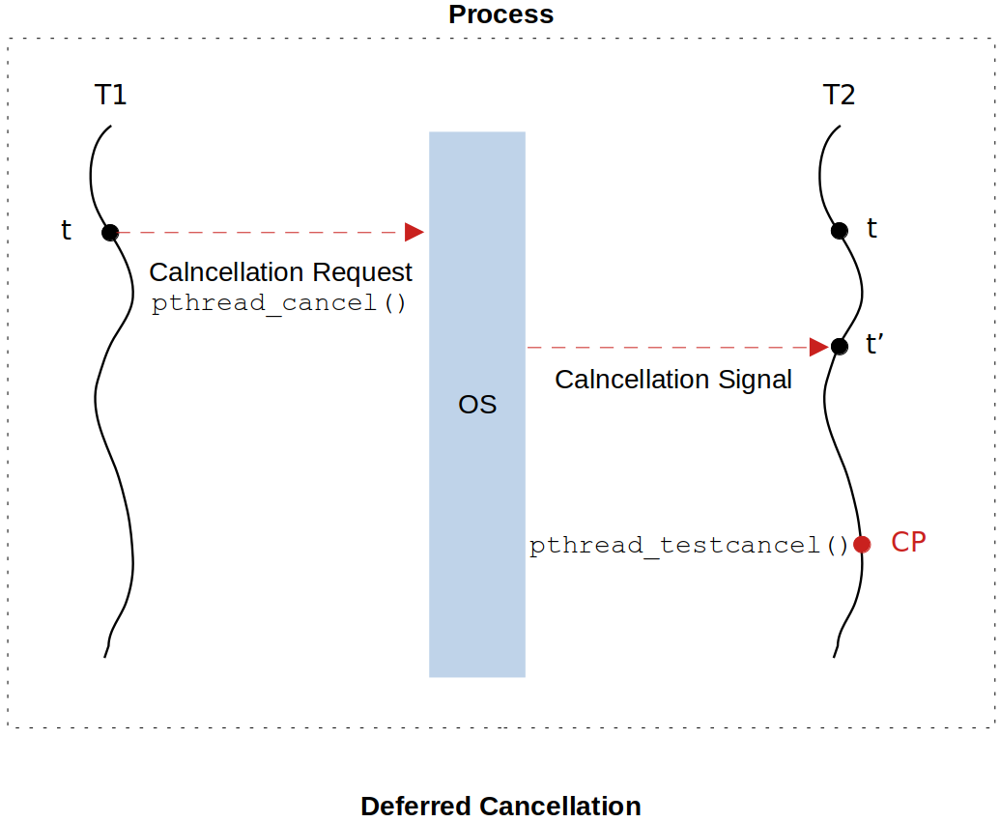

[Home](../../) | [Projects](../../projects) | [Notes](../) > <a href="./">Multi-Threading (POSIX Threads)</a> > Thread Cancellation - Deferred Cancellation

# Thread Cancellation - Deferred Cancellation


## Deferred Cancellation





* Deferred cancellation allows the programmer to control as to which points in the execution flow of the thread, the thread is allowed to be canceled (terminated).

* It is contrary to asynchronous cancellation where thread could be canceled at any point in its execution flow.

* Deferred cancellation is used to handle the problem of invariants caused by an abrupt termination of a thread while it is carrying out:

  * An operation to modify a data structure

  * A function call or a system call 

    If a thread gets canceled while it is in the middle of processing a system call whose execution takes place in the kernel space, then the kernel might get corrupted. 

  Asynchronous cancellation could not handle invariants issues!

* Cancel signal can be delivered by the kernel to the target thread at any time, but it is processed only at the designated cancellation points of the target thread.

* It is the programmer's responsibility to assign a cancellation point wisely so that when the thread terminates at its cancellation point no variants, resource leaks and deadlocks occur. 

  The API `pthread_testcancel()` is used to do that. It tests if cancel signal is pending, and if yes, it invokes the cleanup handlers and then cancels (terminates) the thread.


## Deferred Cancellation Demonstration

* The only update made to the `asynchrnous_cancellation.c` file to turn it into a perfectly cancellation safe `deferred_cancellation.c` file is the line 82; adding the cancellation point using `pthread_testcancel()`.

  ```c
  /*
   * File Name    : deferred_cancellation.c
   * Description  : C program to demonstrate pthread deferred cancellation
   * Author       : Modified by Kyungjae Lee 
   *               (Original: Abhishek Sagar - Juniper Networks)
   * Date Created : 01/07/2023
   */
  
  #include <stdio.h>
  #include <stdlib.h>
  #include <unistd.h>
  #include <errno.h>
  #include <pthread.h>
  
  #define N_SLAVES 5
  
  pthread_t slaves[N_SLAVES]; /* array of thread handles */
  
  /* thread cleanup handler to prevent resource (memory) leak */
  void memory_cleanup_handler(void *arg)
  {
      printf("%s invoked...\n", __FUNCTION__);
      free(arg);
  }
  
  /* thread cleanup handler to prevent resource (file) leak */
  void file_cleanup_handler(void *arg)
  {
      printf("%s invoked...\n", __FUNCTION__);
      close((FILE*)arg);    
  }
  
  /* thread function */
  void* write_into_file(void *arg)
  {
      char file_name[64];
      char string_to_write[64];
      int len;
      int count = 0;
  
      /* set the thread eligible for cancellation */
      pthread_setcancelstate(PTHREAD_CANCEL_ENABLE /* PTHREAD_CANCEL_DISABLE */, 0);
      /* set cancellation mode to ASYNCHRONOUS */
      pthread_setcanceltype(PTHREAD_CANCEL_DEFERRED, 0);
          /* Notice that this two APIs do not take the thread handle as an argument. This
           * implies that the thread that invokes these APIs can only affect itself. In
           * other words, no thread can set the 'cancelstate' or the 'canceltype' of another
           * thread. */
  
      int *thread_id = (int*)arg;  
      
      /* register the cleanup handler for the dynamically allocated variable 'arg' */
      pthread_cleanup_push(memory_cleanup_handler, arg);
  
      sprintf(file_name, "thread_%d.txt", *thread_id);
  
      FILE *fptr = fopen(file_name, "w");
      
      if(!fptr)
      {   
          printf("Error : Could not open log file %s, errno = %d\n", file_name, errno);
          pthread_exit(0); /* Make sure to terminate the program using this API so the cleanup handlers
          				    can be invoked at the termination. Terminating using 'return' statement
          				    will not invoke the cleanup handlers */
          /* return 0; */
      }
      
      /* register the cleanup handler for the opened file pointed to by 'fptr' */
      pthread_cleanup_push(file_cleanup_handler, fptr);
      
      int a = 0;
      
      while(a < 20)
      {   
          len = sprintf(string_to_write, "%d : I am thread %d\n", count++, *thread_id);
          fwrite(string_to_write, sizeof(char), len, fptr);
          fflush(fptr);
          sleep(1);
          a++;
  
  		/* cancellation point (deferred cancellation) */
  		pthread_testcancel();
      }
      
      /* pop the cleanup handlers out of stack */
      pthread_cleanup_pop(1); /* arg (non-0: pop cleanup function and invoke it, 0: just pop) */
      pthread_cleanup_pop(1);
      
      return 0;
  }
  
  int main(int argc, char **argv)
  {
      int i;
      int *thread_id = 0;
  
      for (i = 0; i < N_SLAVES; i++){
          thread_id = calloc(1, sizeof(*thread_id));
          *thread_id = i;
          pthread_create(&slaves[i], 0, write_into_file, thread_id);
      }
  
      /* main menu */
      int choice;
      int thread_num;
  
      while(1) {
  
          printf("1. Cancel the thread\n");
          scanf("%d", &choice);
          printf("Enter slave thread id [0-%d] :", N_SLAVES -1);
          scanf("%d", &thread_num);
          if(thread_num < 0 || thread_num >= N_SLAVES) {
              printf("Invalid Thread id\n");
              exit(0);
          }
  
          printf("\n");
  
          switch(choice) {
              case 1:
                  pthread_cancel(slaves[thread_num]);
                  break;
              default:
                  continue;
          }
      }
      return 0;
  }
  ```


## References

Sagar, A. (2022). *Part A - Multithreading & Thread Synchronization - Pthreads* [Video file]. Retrieved from  https://www.udemy.com/course/multithreading_parta/

